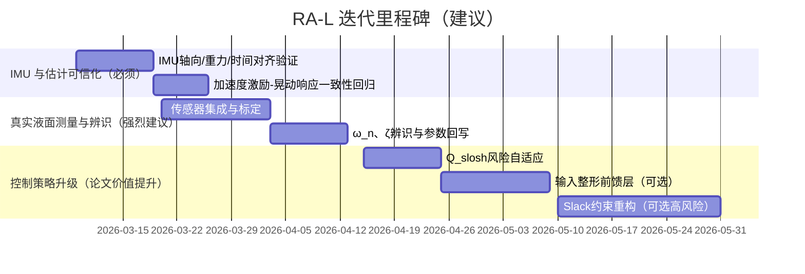

# 面向 RA-L 的 Scout 差速机器人液体晃动抑制系统下一步改进方向与代码修改方案

## 摘要与关键结论

你当前的代码体系已经完成了“从模型到闭环可用”的关键跨越：`scout_local_planner` 已经把晃动状态注入 MPC 增广状态、把晃动软代价写进 QP、上线了预测峰值监测、实现了第一版盒约束（无 slack）、并在参考速度侧实现了 slosh-aware speed governor；同时还修复了终点捕获与状态同步问题，并建立了离线 rosbag 指标提取链路。以上“阶段 0–5”在你仓库的工程结论里被判定为“已完成”，阶段 7（IMU 接口）正在进行、阶段 6（带 slack 的结构性约束重构）暂缓。fileciteturn68file1L1-L1

基于你文档里“阶段 4 标准化单任务实物结果”，目前最核心的信息不是“Q 还要不要继续加大”，而是：**预测侧指标（pred_rms / pred_max）随着 governor 与 Q 的引入明显下降，但模型估计的 `/slosh/height`（height_rms / height_max）没有同步稳定下降**。这并不矛盾，因为你团队也明确写了：现阶段没有真实液面高度传感器，`/slosh/height` 属于模型估计量而不是实测量，因此阶段 4 的验收口径被限定为“模型估计版 anti-slosh 速度治理”。fileciteturn68file1L1-L1

因此，面向 **RA-L**（在线控制 + 实物验证的顶级机器人期刊）下一步的研究与代码重点应当从“继续调 Q”转向“**把估计输入（IMU）与可验证的真实液面数据链路补齐**”，并在此基础上做“可复现实验 + 可解释对比 + 与文献差异化定位”。与文献对比上，你当前路线偏向在线 MPC/QP 抑制与速度治理，而已有工作中常见的是离线时间最优/轨迹优化与前馈抑制（如工业机器人 anti-sloshing 轨迹优化）。citeturn0search0turn1search0

## 当前工程实现现状与可直接写进论文的方法框架

你仓库给出的“阶段总览”已经非常接近一篇 RA-L 工程型论文所需的系统结构：实验口径（episode 管理 + 统一入口）、控制结构（MPC + 软代价 + 约束护栏 + speed governor）、观测链路（预测峰值/约束激活/求解时间）、离线评估工具（按 TRACKING 段统计并可导出 CSV）。fileciteturn68file1L1-L1

从代码组织角度，你的研究系统可以在论文中抽象为“三层闭环”：

**模型层（slosh_models）**  
你采用的是圆柱容器液体晃动的等效 2D Mass–Spring–Damper（MSD）主模态模型，并以容器平面加速度作为激励输入；该建模思路与 Di Leva 等人在 ECCOMAS 2021 的估计模型一致，且 2022 年在 *Multibody System Dynamics* 的扩展论文里进一步系统化（包含 2D 激励与实验验证）。citeturn0search0turn0search2

**预测优化层（scout_local_planner / QP-MPC）**  
你的 MPC 使用 entity["organization","OSQP","open-source qp solver"] 求解标准凸 QP 形式（目标函数含 1/2 系数、约束为 l ≤ A x ≤ u），因此任何“成本项/约束项的系数与矩阵写法”都必须严格与该形式对齐。citeturn0search7turn0search5  
在工程上，你将晃动抑制分成两条路径：  
- QP 内：用 ETA_X、ETA_Y 的二次型作为软代价（对应“惩罚液面高度平方”的二次近似）。fileciteturn62file0L1-L1  
- QP 外：使用预测峰值与当前估计峰值构造 risk，再通过 speed governor 调整 v_des（减少激励源）。fileciteturn60file0L1-L1

**执行与实验层（launch/scripts/metrics）**  
你已经把“实验模式的隐藏 EMA”在 `slosh_experiment.launch` 中默认关掉，并把 rosbag 录制话题补齐到 episode/goal/clock 等可复现所需信息上。fileciteturn70file0L1-L1 fileciteturn71file0L1-L1

image_group{"layout":"carousel","aspect_ratio":"16:9","query":["mass spring damper equivalent model liquid sloshing cylindrical container diagram","sloshing height estimation model cylindrical container 2D excitation figure","linear mass spring damper slosh model robotics"],"num_per_query":1}

## 从阶段四标准化实物结果看现阶段瓶颈与含义

你文档中给出的“同起点同终点、单 goal 单 episode”的标准化实物对比（3 次均值，统计 TRACKING 段）如下：  

- Q=0：tracking_time 10.78 s；height_rms 0.003427 m；pred_rms 0.024816 m；governor_ratio 0；v_des_eff_mean 0.800  
- Q=5：tracking_time 12.90 s；height_rms 0.003555 m；pred_rms 0.017846 m；governor_ratio 0.908；v_des_eff_mean 0.515  
- Q=10：tracking_time 15.67 s；height_rms 0.003210 m；pred_rms 0.018312 m；governor_ratio 0.901；v_des_eff_mean 0.482  

并且三组都达到 `solve_fail_count=0`、到达率 3/3。fileciteturn68file1L1-L1

这些数据支持三个“非常可用于论文讨论”的判断：

**预测侧确实被“速度治理 + Q_slosh”压下去了，但代价是任务时间变长。**  
从 v_des_eff_mean 与 governor_ratio 看，Q=5/10 时 governor 大部分周期介入，把参考速度显著拉低；pred_rms 从 0.0248 降到约 0.018（~25–30% 相对降幅），这符合“减少激励 → 预测峰值下降”的因果预期。fileciteturn68file1L1-L1

**`/slosh/height` 没有同步下降并不意外，甚至是“你必须在 RA-L 里正面解决的关键缺口”。**  
你文档已经明确：目前没有真实液面高度传感器，`/slosh/height` 是模型估计量。换言之，你现在能证明的是“控制器让模型预测更保守/更小”，但还没能证明“真实液面峰值更小”。这会成为审稿人最可能质疑的一点。fileciteturn68file1L1-L1

**当前更像是在做“模型一致性的 risk-based speed governance”，而不是“真实 slosh suppress”。**  
这并不是坏事：很多高质量机器人论文都会把“可观测性/可验证性”列为贡献之一。你现在的阶段 4 结论已经足够支撑一个“系统搭建 + 可复现实验协议 + 预测侧收益”的工程段落；但若目标是 RA-L，你需要把贡献升级为“**可测量地降低真实晃动/溢出风险**”，至少要有一种可信 ground-truth 或近似测量链路。

这也解释了你目前的优先级选择：先把 IMU 接入验证（阶段 7），再考虑更重的结构改动（阶段 6 slack）。fileciteturn68file1L1-L1

## 面向 RA-L 的改进方向与代码修改方案

下面给出“从现在到 RA-L”的改进路线：我把它拆成 **必须做**（决定论文能否站住）、**强烈建议做**（显著提升论文质量）和 **可选增强**（提升上限但工程代价大）。

### 必须做的改动

**完善阶段七：用 IMU 替换/校正 `ay=v·ω` 与 `alpha_z` 差分，建立“输入可信链路”。**  
ECCOMAS 模型把激励视为容器平面加速度；而你当前最不稳定的部分正是加速度估计（差速四轮 + 滑移 + 里程计差分噪声）。论文审稿会认为：如果激励输入不可信，所有 slosh 结论都不稳。citeturn0search2  
你已经在 `slosh_experiment.launch` 暴露了 `slosh_use_imu_lateral_accel / slosh_use_imu_yaw_rate / slosh_use_imu_alpha_z` 等开关与 IMU 话题参数，这是正确的“最小可行接口”。fileciteturn70file0L1-L1  
下一步代码层建议把 IMU 路线从“接口预留”升级为“工程可信”：

- 在 `LocalPlannerROS` 内新增一个 **IMU 预处理函数**，至少包含：
  - 轴向一致性检查（imu frame → base_link），必要时用 TF 做向量旋转；
  - 重力补偿（如果 IMU 提供的是 raw accel）；
  - bias/offset 在线估计（静止段估计均值，或简单一阶漂移模型）；
  - 与 odom 的时间对齐（用 message stamp，而不是 control_rate 假设）。
- 给 `/slosh/ay_est`、`/slosh/alpha_est` 增加 source tag（IMU/ODOM），让离线分析能确定数据来源，不再只能“猜”。  

这些改动主要集中在：  
`src/scout_apps/control/scout_local_planner/src/local_planner_ros.cpp`。fileciteturn60file0L1-L1

**引入真实液面测量或可替代的 ground-truth（哪怕是低频/低精度）。**  
如果目标是 RA-L，你至少需要一种“能让审稿人信服控制效果”的真实指标。你完全可以先从轻量方案开始：

- 方案 A（推荐、工程友好）：环形 ToF/距离传感器阵列重建液面，这条路线在移动机器人液体晃动测量上已有近期工作，且给出了采样率与集成方式（例如 14 个 ToF、约 17.8 Hz 重建与可视化）。citeturn2search8  
- 方案 B（更简单）：顶视相机 + 标尺/特征，离线提取液面轮廓峰值（不必实时）。  
- 方案 C（近似）：将小 IMU 固定在容器上、估计液面倾角/晃动频率（需要建模映射，但能提供“真实响应频率/阻尼”的识别依据）。  

代码改动建议（最小闭环）：  
- 新增话题 `/slosh/height_meas`（或 surface profile），并在 `SloshIntegration` 旁路加入一个简单观测器（即使是 1D 的增益校正也行）。  
- rosbag 录制脚本补录该话题。fileciteturn71file0L1-L1

### 强烈建议做的改动

**做一次参数辨识：让 ω_n、ζ 与实物一致（这是“模型估计 → 可用预测”的关键）。**  
ECCOMAS 2021/2022 的思想是“用简化模型做可计算估计”，但它同样强调实验验证；你要把它移植到四轮差速平台，必须通过实验辨识把主模态频率与阻尼调到合理范围，否则 Q_slosh 与 governor 都会因为模型偏差而出现“预测下降但真实不变”的现象。citeturn0search0turn0search2  
实现建议：

- 设计 2–3 种标准激励（直线加减速、定半径圆周、S 弯），记录 IMU 横向加速度与真实液面测量（或容器 IMU 角度）。  
- 用二阶系统拟合实测响应，估计 ω_n 与 ζ（可以先只拟合主模态）。  
- 把辨识结果写回 `slosh/damping_ratio`、必要时修正 `liquid_height`（填充高度误差会直接影响 ω_n）。  

工程支撑脚本你已经准备了：离线指标提取脚本 `extract_slosh_metrics.py` 支持按 TRACKING 段与按 episode 导出 CSV，非常适合作为“论文可复现实验 pipeline”。fileciteturn68file0L1-L1

**让“Q_slosh 的作用”从固定常数变成“风险自适应权重”。**  
你现在的结果清晰地体现了 tradeoff：预测 slosh 降了，但 tracking_time 上升。一个很适合写成论文创新点的方向是：  
- 让 `Q_slosh` 不再是常数，而是 `Q_slosh(eta_ratio)` 的函数（风险低时不惩罚，风险高时迅速增大），从而在不显著增加任务时间的情况下压制峰值。  

这不需要把 QP 变成非线性：你只是在每周期重算一个标量权重，QP 仍然是凸的二次规划。其理论与实现都与 OSQP 的标准形式兼容。citeturn0search7

### 可选增强方向

image_group{"layout":"carousel","aspect_ratio":"16:9","query":["input shaping ZVD impulse sequence diagram","command shaping zero vibration derivative shaper illustration","residual vibration input shaping convolution diagram"],"num_per_query":1}

**把输入整形（input shaping / trajectory filtering）作为“参考输入前馈层”，与 MPC 互补。**  
输入整形源于柔性系统/残余振动抑制：通过把指令与一组脉冲序列卷积，实现对特定 ω_n、ζ 的残余振动抵消；经典工作可追溯到 entity["people","N. C. Singer","input shaping author"] 与 entity["people","W. P. Seering","input shaping author"] 在 1990 年的 preshaping 方法，并发展出 ZV/ZVD 等鲁棒整形器。citeturn2search1turn1search10  
在液体搬运领域，近年的工作也大量使用“前馈滤波/轨迹滤波”来抑制 slosh（例如用指数滤波器对轨迹做整形，实现 sloshing-free rest-to-rest）。citeturn2search6  
如果你把这层加入你的框架，可以形成非常清晰的“二自由度结构”叙事：  
- 前馈层：整形 `v_ref / a_ref / ω_ref`，减少对主模态的激励；  
- 反馈层：MPC/QP 在存在扰动与建图定位误差时仍保证路径跟踪与安全约束。

**推进阶段六（slack 版软硬兼容约束），但应在 IMU+测量链路稳定后再做。**  
你文档里暂缓 slack 的判断是务实的：引入 slack 往往意味着决策变量维度与约束构造的结构重排，工程风险高。fileciteturn68file1L1-L1  
但从“论文上限”角度，slack 约束会让你的方法更接近“有约束保障的安全 MPC”（即便是保守代理约束也可以）。建议把它作为 **RA-L 版本的补强章节**，前提是阶段 7（IMU）与真实液面测量已让模型预测可信。

下面给出一个你可以直接贴到项目管理里的里程碑（示意日期按你当前时间线生成）：

## 实验协议与数据分析流程

要把工作推进到 RA-L 级别，你需要的不只是“跑通 + 有效果”，而是**可复现、可统计、可对比**。你已经具备了良好基础（episode_id、统一 launch、统一 rosbag 录制、离线指标脚本）。fileciteturn68file1L1-L1 fileciteturn71file0L1-L1

我建议把实验设计升级为“三层对比”：

**对比轴一：控制策略消融（ablation）**  
- Baseline：Q=0，governor off  
- Soft-cost only：Q>0，governor off  
- Governor only：Q=0，governor on  
- Full：Q>0，governor on  
（你目前阶段 4 的表格本质上是 “Full，但 Q 变化” 的子集。）fileciteturn68file1L1-L1

**对比轴二：观测输入来源**  
- Odom-only（当前默认）  
- IMU-enabled（阶段 7 的目标）fileciteturn70file0L1-L1  
论文里最关键的一张图应当是：`/slosh/ay_est` 的时序对比（IMU vs v·ω），并展示它如何改变估计/预测。

**对比轴三：任务集合（至少 3 类）**  
- 直线加减速（激励轴向）  
- 定半径转弯（激励横向 + 抛物面项）  
- S 弯（频率成分更丰富，最容易激发主模态）

为了让统计更可信，建议每个配置每个任务做 ≥10 次（至少 5 次也要给出置信区间或箱线图），并固定起点终点与地图版本；你已经用“单 goal 单 episode”把噪声源之一压掉了，这非常好。fileciteturn68file1L1-L1

**指标表建议（当前 vs 论文版需要补齐）**

| 指标类别 | 你已有（来自脚本/话题） | RA-L 建议新增 |
|---|---|---|
| 跟踪与效率 | tracking_time、v_des_eff_mean、cmd_vx_rms、cmd_wz_rms | 平均速度/路径长度归一化时间、能耗近似（∫|a·v|dt 或电流） |
| 求解稳定性 | solve_ms_mean、solve_fail_count | infeasible recovery 次数、QP 迭代数（若可取） |
| slosh（预测/估计） | height_rms、height_max、pred_rms、pred_max | **真实液面高度/倾角 RMS、峰值、溢出事件率（必须有其一）** |
| 一致性诊断 | governor_ratio、constraint_active_count | 预测 vs 实测相关系数、误差分布（模型可信度） |

OSQP 的标准形式与求解器信息记录（例如 solve time）在论文方法部分应当明确写出，以避免读者误解你的 Hessian 缩放。citeturn0search7turn0search5

## 论文创新点定位与图表清单

下面把“你改完代码能写出什么创新点”直接对齐到 RA-L 写法（强调：创新点不一定是全新理论，**系统级方法 + 实物验证 + 复现实验协议**本身也可以是强贡献，但必须有真实可测的效果）。

**可写成贡献点的主线（建议作为 RA-L 叙事骨架）**

1) **面向差速/四轮滑移平台的在线 slosh-aware MPC 框架**：把圆柱容器 2D 激励的简化 slosh 估计模型嵌入实时 QP-MPC，并给出可复现 ROS 工程实现与完整观测链路。该类模型在工业机器人搬运中已用于评估/优化，但你把它落地到移动机器人在线局部规划与闭环执行，是不同的应用场景与工程难点。citeturn0search0turn0search2turn1search0

2) **峰值风险驱动的 speed governor（参考侧治理）与 QP 软代价的协同**：相比纯“QP 被动抑制”，你在参考速度端主动减少激励，形成“预测—风险—调速”的闭环，且在标准化单任务实物实验中展示了预测峰值与求解稳定性的变化趋势。fileciteturn68file1L1-L1

3) **（升级后）IMU 与真实液面测量驱动的模型可信化与参数辨识**：这是你冲击 RA-L 的关键升级。ECCOMAS/Multibody Syst Dyn 系列强调模型验证，你在移动机器人上补齐“激励—响应”测量链路后，就能把“预测下降”变成“实测下降”，并给出模型误差与鲁棒性分析。citeturn0search2turn2search8

4) **（可选）输入整形/轨迹滤波前馈层 + MPC 反馈层的二自由度 anti-slosh 架构**：与经典 input shaping（ZV/ZVD）及液体搬运轨迹滤波思路对齐，但落到移动机器人局部规划器上，形成可解释的“频率域抑振 + 约束跟踪”组合。citeturn2search1turn2search6turn2search4

**建议在论文中必须出现的图（按“审稿人最关心”排序）**

- 图 1：系统框图（Global planner → Local MPC → slosh estimator → risk monitor → governor → cmd_vel），标出 IMU/液面传感器可选输入。  
- 图 2：一条代表性轨迹的时序：`ay_est`、`omega`、`slosh_height_pred_max`、（新增）`slosh_height_meas`。  
- 图 3：箱线图/误差棒：不同消融配置下的实测 slosh 峰值与任务时间 tradeoff（Q 作为横轴或颜色）。  
- 图 4：模型预测 vs 实测散点图（相关系数、误差分布），证明模型“足够可信”，并解释何时失效（例如高滑移急刹车）。  
- 图 5（可选）：输入整形后的 acceleration profile 与未整形对比（展示主模态残余振动抑制）。citeturn2search1turn1search10

最后补一条非常重要的定位建议：你现在这条路线与“机械减振装置”类方法不同（例如早期有在轮式机器人上用双摆式主动减振结构来抑制圆柱容器 slosh 的工作），你的优势是**纯软件、可移植、可开源复现**；这在 RA-L 的工程型论文中是很大的加分点，但前提是你必须拿出可信的真实评价指标。citeturn2search16