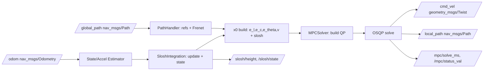
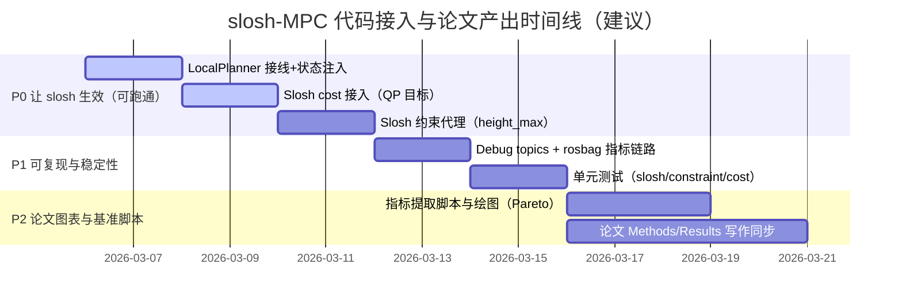

# 基于 renjunzhang/scout_ws_real 的液体晃动抑制 MPC 代码改造与论文创新映射报告

## 执行摘要

已使用连接器列表：github。对仓库现状的总体评估是：**slosh 增广状态、晃动动力学接口与耦合项在底层模型里“基本齐备”，但尚未在控制闭环中完成“接线 + 状态注入 + 代价/约束生效 + 可复现实验记录”的最后一公里**，因此当前把 `Q_slosh` 从 0 改成非零，**大概率不会产生可验证的晃动抑制效果**（最核心原因：控制环里构造的 `current_state` 将晃动分量一直置零，且 MPC 使用的动力学模型默认未注入 `SloshIntegration`）。fileciteturn83file2L1-L1fileciteturn82file3L1-L1fileciteturn82file2L1-L1  
最紧急的 4 项修复（按“能否让第一篇 slosh-MPC 小论文跑起来并能交付图表/指标”排序）是：  
1) **在 `LocalPlannerROS` 初始化阶段实例化/配置 `SloshIntegration` 并注入 MPC 使用的 `DiffDriveModel`**（否则模型仍按“无晃动”运行）。fileciteturn83file2L1-L1fileciteturn82file3L1-L1fileciteturn82file3L1-L1  
2) **在控制循环中做晃动状态在线滚动更新，并把估计到的晃动状态写回 `current_state`（x0）**（否则预测初值恒为 0，抑制“看不见/控不到”）。fileciteturn83file2L1-L1fileciteturn47file6L1-L1  
3) **在 QP 目标里加入物理意义清晰、可解释的 slosh 二次代价项**（例如把液面高度近似的平方映射为对模态位移的二次代价），并确保与 OSQP 形式 \(\tfrac12 z^T P z+q^T z\)系数一致。fileciteturn80file0L1-L1citeturn0search1  
4) **把 `mpc/slosh_height_max` 真正落地为（至少）线性可实现的保守约束代理 + 完整日志/脚本链路**，从而生成 Pareto 曲线（跟踪精度 vs 晃动峰值）与可复现实验表格。fileciteturn84file4L1-L1fileciteturn81file1L1-L1  

## 代码库现状与关键缺口定位

### 关键假设与“已知/未指定”项

仓库已体现的默认配置：  
- 控制频率 `control_rate=20Hz` 与 `mpc/dt=0.05s` 在配置文件中明确对齐（实物/仿真配置均如此）。fileciteturn84file4L1-L1fileciteturn84file5L1-L1  
- MPC 预测步长常用 `N=40`（实物/仿真配置）。fileciteturn84file4L1-L1  
- 状态维度 `nx=8`：`[e_l, e_c, e_theta, v, eta_x, eta_x_dot, eta_y, eta_y_dot]`；控制维度 `nu=2`：`[a, omega]`。fileciteturn50file0L1-L1  

未在仓库中被“作为论文实验环境”明确说明但可合理默认的项（需要你在论文里标注“未指定/本文默认”）：  
- 仿真平台（Gazebo/实车录包回放/自建脚本）、全局规划器版本、路径来源与频率（只看到 `test_mpc*.launch` 订阅 `/scout/global_path`）。fileciteturn69file7L1-L1  
- 里程计噪声与延迟、速度/角速度反馈的带宽（会直接影响 “用 odom 差分估计加速度” 的质量）。

### “已实现但未接入”的 slosh 资产

仓库里 **已经具备** 你写第一篇“液体晃动抑制 MPC”的关键代码资产（这对论文“工程落地创新”非常有利）：  
- `SloshIntegration`：封装了液体晃动模型配置、离散矩阵获取、一步预测、状态写入增广向量等接口。fileciteturn82file2L1-L1  
- `slosh_models/LiquidSloshModel`：给出 MSD 等效模型、ZOH 离散化、液面高度计算（包含旋转抛物面项）。fileciteturn47file7L1-L1  
- `DiffDriveModel`：在 `predict()`/`linearize()` 里**已经写了**“晃动子系统 + `a_y = v*omega` 耦合 + 增广 A/B 块融合”的逻辑（前提：`slosh_integration_` 指针非空且已配置）。fileciteturn82file3L1-L1  

换句话说：你目前不是“缺模型、缺推导”，而是缺“系统集成闭环 + 可验证实验链路”。

### 真正阻断 slosh-MPC 生效的缺口

缺口一：**MPC 实际运行的动力学模型很可能仍是“未注入 slosh 的默认模型”**  
- `LocalPlannerROS::initialize()` 里只调用 `mpc_solver_.initialize(mpc_params_, vehicle_params_)`，并没有创建 `SloshIntegration`，也没有给 `DiffDriveModel` 调用 `setSloshIntegration()`。fileciteturn83file2L1-L1  
- `MPCSolver` 虽然提供了 `setDynamicsModel()` 扩展接口，但当前 diff-drive 版本没有在 ROS 层使用它来替换默认模型。fileciteturn78file0L1-L1  

缺口二：**控制循环构造的 `current_state` 对晃动分量一直 `setZero()`，从未写入实际晃动状态**  
- 在 `LocalPlannerROS::controlLoop()` 构建 `StateVector current_state; current_state.setZero();` 后，只写入 Frenet 误差与 `v`，未写 `ETA_*` 四个分量。fileciteturn83file2L1-L1  
结果是：即便动力学模型端支持晃动，QP 的初始条件也把晃动当作永远为 0 的“隐藏状态”，论文实验会出现“抑制不开/指标不变”的尴尬。

缺口三：**代价与约束层面：`Q_slosh` / `slosh_height_max` 在 QP 中尚未落地**  
- 参数结构体中有 `Q_slosh` 与 `slosh_height_max`（配置也写了），但 `CostFunction` 当前并没有 slosh 的二次代价项；`ConstraintManager` 也没有对 `ETA_*` 的边界/软约束。fileciteturn84file4L1-L1fileciteturn80file0L1-L1fileciteturn81file1L1-L1  
- 甚至在 `LocalPlannerROS::loadParameters()` 中只读取了 `mpc/Q_slosh`，但 **没有读取** `mpc/slosh_height_max`，导致该参数在运行时很可能总是默认值。fileciteturn83file2L1-L1fileciteturn84file4L1-L1  

缺口四：**实验链路缺少“晃动指标可观察性”**  
仓库已有 `mpc_status`、`local_path` 等可视化，但缺少对论文最关键的指标（如 \(\eta(t)\)、\(\eta_{\max}\)、预测峰值、约束违规量、OSQP 状态码与求解时间分布等）的标准化 topic/CSV 输出；这会直接影响你做 Pareto 曲线与论文结果表格。fileciteturn83file2L1-L1citeturn0search1  

## 优先级文件级修改清单

下表按“第一篇 slosh-MPC 小论文可交付性”来排优先级。工时为保守估计（不含你做曲线调参/反复跑实验的时间）。

| 文件路径 | 需改函数/方法 | 精确代码动作（add/modify/remove） | 估计工时 | 优先级 | 测试/验证步骤 |
|---|---|---|---:|:---:|---|
| `src/scout_apps/control/scout_local_planner/include/scout_local_planner/local_planner_ros.h` fileciteturn78file4L1-L1 | 类成员区 | **add**：`#include "scout_local_planner/slosh_integration.h"`；新增 `SloshIntegration slosh_integration_;`；新增加速度估计缓存（`prev_v_ prev_omega_ prev_stamp_`）；新增 debug publishers（见下文 topics 建议） | 3 | P0 | 编译通过；`roslaunch ...test_mpc_sim.launch` 能起节点fileciteturn69file7L1-L1 |
| `src/scout_apps/control/scout_local_planner/src/local_planner_ros.cpp` fileciteturn83file2L1-L1 | `loadParameters()` / `initialize()` / `controlLoop()` | **modify**：`loadParameters()` 增加读取 `mpc/slosh_height_max`；**add**：读取 `slosh/*` 参数（容器半径/液高/阻尼/偏置等）并 `slosh_integration_.configure()`；**add**：创建 `std::shared_ptr<DiffDriveModel>` 并 `setSloshIntegration(&slosh_integration_)` 后调用 `mpc_solver_.setDynamicsModel(model)`；**modify**：`controlLoop()` 每周期先用 odom 差分估计 `ax, alpha`，再 `slosh_integration_.update(ax, ay, omega, alpha)`，随后 `slosh_integration_.writeToAugmentedState(current_state)`；**add**：发布 slosh 相关 debug topic；**add**：检查 `abs(1/control_rate - mpc/dt)`，不一致则 warn | 8 | P0 | 1) 将 `mpc/Q_slosh` 设为非零后，观察 slosh 相关 topic 非零随时间变化；2) 录 rosbag 后离线计算 \(\eta_{\max}\)；3) 对比 `Q_slosh=0` 与 `Q_slosh>0` 指标差异 |
| `src/scout_apps/control/scout_local_planner/include/scout_local_planner/cost_function.h` fileciteturn80file1L1-L1 | CostTerm 类定义区 | **add**：`SloshCost`（继承 `CostTermBase`），支持对 `ETA_X/ETA_Y`（可选含速度项）添加二次代价；构造函数输入建议为 `Q_eta`（已吸收 height_coeff）与可选 `Q_eta_dot` | 3 | P0 | 单元测试：构造 `Q_total` 后检查对应对角元素非零且为正；OSQP 求解不应因 H 非 PSD 崩溃（应保持 PSD）citeturn0search1 |
| `src/scout_apps/control/scout_local_planner/src/cost_function.cpp` fileciteturn80file0L1-L1 | `CostFunction::initialize()` 或 `buildQPCost()` | **modify**：在 cost term 列表里插入 `SloshCost`（当 `Q_slosh>0` 且 slosh 模型已配置时）；确保写入 OSQP 的 \(P\) 矩阵遵循 \(\tfrac12 z^T P z + q^T z\) 的系数约定（你仓库已有“2x 系数修复”历史，slosh 代价也必须同风格） | 5 | P0 | A/B 实验：同一路径同速度，`Q_slosh=0` vs `>0`，比较 \(\eta_{\max}\)、`solve_time_ms` |
| `src/scout_apps/control/scout_local_planner/include/scout_local_planner/constraint_manager.h` fileciteturn81file1L1-L1 | 约束类区 | **add**：`SloshDispBoundsConstraint`（建议名），提供对 `ETA_X`、`ETA_Y` 的上下界（可由 `slosh_height_max/(h_coeff*sqrt(2))` 生成保守 bound）；增加 enable 开关与参数存储 | 3 | P0 | 单元测试：`totalConstraints(N)` 与 `buildQPConstraints()` 输出维度一致；跑仿真不出现“约束维度不匹配” |
| `src/scout_apps/control/scout_local_planner/src/constraint_manager.cpp` fileciteturn81file1L1-L1 | `totalConstraints()` / `buildQPConstraints()` | **modify**：把 slosh 约束按“状态约束（k=0..N）”拼到 A/l/u；**add**：在三元组中对每步添加两行：`x_idx+ETA_X` 与 `x_idx+ETA_Y`，并设置对应 l/u；保证与现有 v 约束并存 | 5 | P0 | 1) 构造极小化案例（N=2）检查 A/l/u 行数；2) 压力测试：turn-in-place 时约束不应导致不可行率飙升 |
| `src/scout_apps/control/scout_local_planner/config/mpc_params.yaml` fileciteturn84file4L1-L1 | YAML 参数 | **add**：`slosh:` 子树（容器半径、液高、密度、阻尼、模态阶次、偏置、use_parabola_term）；**add**：`slosh_estimator:` 子树（`use_odom_accel`、滤波系数 alpha 等）；（可选）`debug:` 子树 | 2 | P0 | `rosparam get` 验证所有 `slosh/*` 参数被加载；启动后 log 打印 slosh 配置成功 |
| `src/scout_apps/control/scout_local_planner/config/mpc_params_sim.yaml` fileciteturn84file5L1-L1 | YAML 参数 | 同上（仿真可更激进的 `omega_max`/速度） | 1 | P0 | 仿真启动后 slosh topic 与实物一致 |
| `src/scout_apps/control/scout_local_planner/change.md` fileciteturn78file3L1-L1 | 文档 | **modify**：把“Slosh Integration Roadmap”从“计划”更新为“已实现/待实现清单 + 实验口径 + topic/脚本说明”，确保论文复现性 | 2 | P1 | 同步你的论文 Methods/Implementation 术语（状态/控制维度一致） |
| `src/scout_apps/control/slosh_models/include/slosh_models/liquid_slosh_model.h` fileciteturn47file7L1-L1 | `LiquidSloshModel` 类 | **add**：`setState(Eigen::Vector4d)`；（可选）暴露 `last_omega_z_` 或提供以 omega 作为入参的高度函数，以便 MPC 预测期计算高度指标 | 3 | P1 | 单元测试：`setState()` 后 `getState()` 一致；`getSloshHeight()` 给出期望变化 |
| `src/scout_apps/control/scout_local_planner/src/slosh_integration.cpp` fileciteturn47file6L1-L1 | `readFromAugmentedState()` / `getSloshCostMatrix()` | **modify**：实现 `readFromAugmentedState()` 调用 `LiquidSloshModel::setState()`；**modify**：`getSloshCostMatrix()` 把 `height_coeff` 纳入（从“对位移惩罚”升级为“对液面高度近似平方惩罚”） | 4 | P1 | 单元测试：`writeToAugmentedState()` 与 `readFromAugmentedState()` 可逆（在近似意义下） |
| `src/scout_apps/control/scout_local_planner/test/*`（新建） | gtest | **add**：slosh 模型离散矩阵稳定性（谱半径）、约束维数一致性、cost PSD 性 | 8 | P1 | `catkin_make run_tests` 全通过 |
| `src/scout_apps/control/scout_local_planner/scripts/*`（新建） | python/bash | **add**：跑包、抽指标、画图、生成 Pareto；**add**：统一基准 case YAML | 10 | P2 | 一键生成 `metrics.csv` 与固定命名图表 PNG |

## 论文创新表述映射

下面把上表的改动，逐条映射为你论文里可写成“贡献/创新点”的表述，并给出验证实验与指标。建议你在论文里把贡献写成 3–5 条“可验证的工程/方法贡献”，而不是散成很多小点；但在 Implementation 章节，可以逐文件解释落地细节。

### 改动到论文贡献的组织方式建议

- **贡献 A：增广动力学闭环落地**（把晃动模态状态 + `a_y=v·ω` 耦合真正接入 QP-MPC 预测模型，并保持实时性）。对应改动：`local_planner_ros.* + diff_drive_model.*`。fileciteturn83file2L1-L1fileciteturn82file3L1-L1  
- **贡献 B：晃动状态在线估计与初始化一致性**（用 odom 差分/融合估计加速度，驱动离散晃动模型滚动更新，并写入 MPC 初值）。对应改动：`local_planner_ros.* + slosh_integration.*`。fileciteturn83file2L1-L1fileciteturn47file6L1-L1  
- **贡献 C：高度物理量驱动的二次代价设计**（从“惩罚控制变化/惩罚横向误差”扩展为“直接惩罚液面高度近似平方”，并保持 OSQP 形式一致）。对应改动：`cost_function.* + slosh_integration.cpp`。fileciteturn80file0L1-L1citeturn0search1  
- **贡献 D：线性可实现的液面上限约束代理**（把 \(\eta_{\max}\) 阈值转为对模态位移的保守线性边界/软硬结合约束，适配 OSQP 的线性不等式形式）。对应改动：`constraint_manager.* + yaml`。fileciteturn81file1L1-L1citeturn0search1  
- **贡献 E：可复现实验基准与 Pareto 评测**（统一记录 topic/CSV，生成跟踪—晃动二目标权衡曲线）。对应改动：新增 scripts + debug topics。  

下面按“代码改动块”给出可直接粘到论文的写法模板。

### local_planner_ros.*：slosh 接线 + 状态注入

**Methods/Implementation 建议措辞**：  
“本文在现有 Frenet-QP-MPC 框架内，引入二维质量–弹簧–阻尼（MSD）等效晃动模态作为增广状态，并在控制闭环中进行在线更新。具体而言，利用里程计速度反馈估计切向/角加速度，计算横向加速度 \(a_y = v\omega\)，通过离散晃动模型更新 \([\eta_x,\dot\eta_x,\eta_y,\dot\eta_y]\) 并写入 MPC 初始状态，从而保证预测模型与执行闭环的一致性。”（对应实现：初始化时 `SloshIntegration::configure()`，每周期 `update()+writeToAugmentedState()`。）fileciteturn83file2L1-L1fileciteturn82file2L1-L1  

**Results/Discussion 建议措辞**：  
“加入在线晃动状态注入后，控制器对晃动指标的抑制不再依赖‘初值为零’的理想假设；在相同路径与速度上限下，\(\eta_{\max}\) 与 \(\eta_{\mathrm{RMS}}\) 的统计显著下降，同时跟踪误差与求解时间分布保持在实时范围内。”

**验证实验/指标**：  
- A/B：`Q_slosh=0` vs `Q_slosh>0`；同一条 S 弯与 90°弯路径、同一 `v_max`。  
- 指标：\(\eta_{\max}\)、\(\eta_{\mathrm{RMS}}\)、`e_c_RMS`、`e_theta_RMS`、求解成功率、`solve_time_ms` 的均值/99 分位。  
- 额外 sanity check：slosh 状态不应永远为 0（topic/CSV 直接证据）。

### cost_function.*：高度系数驱动的 slosh 二次代价

**Methods/Implementation 建议措辞**：  
“OSQP 求解的 QP 目标为 \(\min \tfrac12 z^T P z + q^T z\)。为在保持凸性与实时性的前提下引入晃动抑制，本文构造了基于液面高度近似的二次代价：\(\eta \approx h_c\sqrt{\eta_x^2+\eta_y^2}\)，因此对 \(\eta^2\) 的惩罚可等价为对 \(\eta_x^2+\eta_y^2\) 的二次惩罚（权重吸收高度系数 \(h_c^2\)），从而可直接融入 QP Hessian。”citeturn0search1turn1search1  

**Results/Discussion 建议措辞**：  
“相较仅通过加速度/jerk 平滑间接抑制晃动，引入显式高度代价后，控制器更倾向生成‘低横向激励’轨迹，使得在相近到达时间下晃动峰值降低；Pareto 曲线显示该代价项提供了可调节的精度–晃动权衡。”

**验证实验/指标**：  
- 扫描 `Q_slosh`（如 0、1、2、5、10、20）。  
- 画 Pareto：横轴 `e_c_RMS`（或路径沿弧长的平均横向误差），纵轴 \(\eta_{\max}\)。  

### constraint_manager.*：slosh_height_max 的线性可实现约束代理

**Methods/Implementation 建议措辞**：  
“OSQP 约束形式为 \(l\le Ax\le u\)。直接约束 \(\sqrt{\eta_x^2+\eta_y^2}\) 属于二阶锥/非线性形式，不便在当前 QP 框架中实时求解。本文采用保守的线性代理约束：使用 \(\|\cdot\|_\infty\) 上界近似 \(\|\cdot\|_2\)，将液面高度阈值映射为对模态位移分量的盒约束 \(|\eta_x|\le \bar\eta, |\eta_y|\le \bar\eta\)，其中 \(\bar\eta = \eta_{\max}/(h_c\sqrt{2})\)，从而以线性不等式形式嵌入 QP。”citeturn0search1  

**Results/Discussion 建议措辞**：  
“在启用约束代理后，统计意义上的越阈事件（\(\eta>\eta_{\max}\)）显著减少；同时由于采用保守近似，控制器会在高曲率路段更主动降激励，表现为轻微的跟踪误差增加或速度衰减（可通过 Pareto 曲线解释其权衡关系）。”

**验证实验/指标**：  
- 固定 `Q_slosh`，对比 `slosh_constraint_enable=false/true`。  
- 指标：越阈时间占比 `p(eta>eta_max)`、越阈最大值、不可行率（OSQP `status_val` 统计）、跟踪误差变化。

### slosh_models + slosh_integration：读写可逆与状态一致性（P1 贡献）

**Methods/Implementation 建议措辞**：  
“为支持 MPC 初值与外部估计器（或重启/重置）的一致性，本文补全了晃动状态在‘内部模型状态’与‘增广状态向量’之间的读写接口，使得控制器可在任意时刻用观测/估计到的 \([\eta_x,\dot\eta_x,\eta_y,\dot\eta_y]\) 重置内部模型状态，提高长期运行稳定性。”

**验证实验/指标**：  
- 单元测试：`writeToAugmentedState()` 后立刻 `readFromAugmentedState()`，结果一致；  
- 集成：强制 warm-start reset/路径切换后，\(\eta\) 不出现非物理跳变。

## 最高优先级改动的伪代码与测试建议

下面给出 4 项最高优先级改动的“函数级”伪代码草案（足够直接落地实现），并配套建议的 topic/CSV 字段与测试。

### 改动一：LocalPlannerROS 接入与状态注入

**目标**：保证 3 件事同一时间成立：  
- slosh 模型被配置并注入 DiffDriveModel；  
- 每周期 slosh 状态被更新；  
- `current_state` 的 slosh 分量非零且反映估计值。

伪代码（以 diff-drive 为例）：

```cpp
// local_planner_ros.h
#include "scout_local_planner/slosh_integration.h"
SloshIntegration slosh_integration_;
bool slosh_enabled_{false};

// accel estimator cache
double prev_v_{0.0}, prev_omega_{0.0};
ros::Time prev_odom_stamp_;
bool has_prev_odom_{false};

// debug pubs
ros::Publisher slosh_state_pub_;   // Float32MultiArray[4]
ros::Publisher slosh_height_pub_;  // Float32
ros::Publisher mpc_solve_ms_pub_;  // Float32
ros::Publisher mpc_status_val_pub_;// Int32
```

```cpp
// local_planner_ros.cpp::loadParameters()
pnh.param("mpc/slosh_height_max", mpc_params_.slosh_height_max, 0.05);

SloshParams sp;
pnh.param("slosh/container_radius", sp.container_radius, 0.15);
pnh.param("slosh/liquid_height",    sp.liquid_height,    0.20);
pnh.param("slosh/liquid_density",   sp.liquid_density,   1000.0);
pnh.param("slosh/damping_ratio",    sp.damping_ratio,    0.05);
pnh.param("slosh/mode_index",       sp.mode_index,       1);
pnh.param("slosh/offset_x",         sp.offset_x,         0.0);
pnh.param("slosh/offset_y",         sp.offset_y,         0.0);
pnh.param("slosh/use_parabola_term",sp.use_parabola_term,true);
sp.dt = mpc_params_.dt;
```

```cpp
// local_planner_ros.cpp::initialize()
double dt_ctrl = 1.0 / std::max(1e-6, control_rate_);
if (std::abs(dt_ctrl - mpc_params_.dt) > 0.2 * mpc_params_.dt) {
  ROS_WARN("control dt != mpc dt, consider aligning them");
}

// slosh enable condition
slosh_enabled_ = (mpc_params_.Q_slosh > 0.0);
if (slosh_enabled_) {
  if (!slosh_integration_.configure(sp)) {
    ROS_WARN("Slosh configure failed, disable slosh");
    slosh_enabled_ = false;
    mpc_params_.Q_slosh = 0.0;
  }
}

// inject model
auto model = std::make_shared<DiffDriveModel>(vehicle_params_);
if (slosh_enabled_) { model->setSloshIntegration(&slosh_integration_); }
mpc_solver_.setDynamicsModel(model);

// init pubs (optional)
slosh_state_pub_  = nh_.advertise<std_msgs::Float32MultiArray>("slosh/state", 1);
slosh_height_pub_ = nh_.advertise<std_msgs::Float32>("slosh/height", 1);
mpc_solve_ms_pub_ = nh_.advertise<std_msgs::Float32>("mpc/solve_ms", 1);
mpc_status_val_pub_=nh_.advertise<std_msgs::Int32>("mpc/status_val", 1);
```

```cpp
// local_planner_ros.cpp::controlLoop()
double dt = (event.current_real - event.last_real).toSec();
dt = (dt > 1e-3 ? dt : 1.0/control_rate_);

// 估计 ax, alpha（基于 odom 差分）
double ax = 0.0, alpha = 0.0;
if (has_prev_odom_) {
  ax    = (current_v_     - prev_v_)    / dt;
  alpha = (current_omega_ - prev_omega_)/ dt;
}
prev_v_ = current_v_; prev_omega_=current_omega_; has_prev_odom_=true;

// 估计 ay（base_link: x forward, y left）
double ay = current_v_ * current_omega_;

if (slosh_enabled_) {
  slosh_integration_.update(ax, ay, current_omega_, alpha);
}

// 构造 current_state
StateVector x0; x0.setZero();
x0(E_L)=..., x0(E_C)=..., x0(E_THETA)=..., x0(V)=clamp(v);

// 注入 slosh 状态
if (slosh_enabled_) { slosh_integration_.writeToAugmentedState(x0); }

solution = mpc_solver_.solve(x0, refs);

// 发布 debug
publish slosh_state (eta_x, eta_x_dot, eta_y, eta_y_dot)
publish slosh_height = slosh_integration_.getSloshHeight()
publish mpc solve time/status_val
```

**建议新增 ROS topics**（用于 rosbag→论文图表）：  
- `/slosh/state`：`[eta_x, eta_x_dot, eta_y, eta_y_dot]`  
- `/slosh/height`：\(\eta\)（模型估计或测得）  
- `/slosh/height_pred_max`（可选，后续加：从预测轨迹提取的最大高度指标）  
- `/mpc/solve_ms`、`/mpc/status_val`  
- `/mpc/feasible`（bool 或 int）

**CSV 字段建议**（你做 `extract_metrics.py` 时落盘）：  
`timestamp, e_c, e_theta, v_cmd, omega_cmd, a_cmd, ax_est, ay_est, alpha_est, eta, eta_x, eta_y, solve_ms, status_val, infeasible_flag`

**集成测试建议**：  
- 仿真：`roslaunch scout_local_planner test_mpc_sim.launch`（保持原入口不变）。fileciteturn69file7L1-L1  
- 用同一路径跑 3 次，确认 \(\eta_{\max}\) 重复性（标准差可用于论文“稳定性”讨论）。

### 改动二：SloshCost 代价项（QP 内可控、可解释）

伪代码：

```cpp
// cost_function.h
class SloshCost : public CostTermBase {
public:
  explicit SloshCost(double Q_eta, double Q_eta_dot = 0.0)
    : Q_eta_(Q_eta), Q_eta_dot_(Q_eta_dot) {}
  std::string name() const override { return "SloshCost"; }

  void getQuadraticCost(const StateVector& x,
                        const ControlVector& u,
                        const ReferencePoint& ref,
                        Eigen::MatrixXd& Q,
                        Eigen::MatrixXd& R,
                        Eigen::VectorXd& q,
                        Eigen::VectorXd& r) const override {
    Q.setZero(StateIndex::TOTAL_DIM, StateIndex::TOTAL_DIM);
    R.setZero(ControlIndex::DIM, ControlIndex::DIM);
    q.setZero(StateIndex::TOTAL_DIM);
    r.setZero(ControlIndex::DIM);

    Q(StateIndex::ETA_X, StateIndex::ETA_X) += Q_eta_;
    Q(StateIndex::ETA_Y, StateIndex::ETA_Y) += Q_eta_;
    if (Q_eta_dot_ > 0.0) {
      Q(StateIndex::ETA_X_DOT, StateIndex::ETA_X_DOT) += Q_eta_dot_;
      Q(StateIndex::ETA_Y_DOT, StateIndex::ETA_Y_DOT) += Q_eta_dot_;
    }
  }
private:
  double Q_eta_{0.0}, Q_eta_dot_{0.0};
};
```

在 `LocalPlannerROS::initialize()` 里，把 YAML 的 `Q_slosh` 转为 `Q_eta`：  
- `h_coeff = slosh_integration_.getModalParams().height_coeff`（模型内可得）。fileciteturn47file6L1-L1  
- `Q_eta = Q_slosh * h_coeff*h_coeff`（对应“惩罚 \(\eta^2\)”）。

将 cost term 注入：  
- 若你已有 `mpc_solver_.addCostTerm()` 接口，就用它（更模块化）；否则在 `CostFunction::initialize()` 里条件性 push_back。fileciteturn80file1L1-L1  

**单元测试建议**：  
- `Q_eta>0` 时，Hessian 对应位置对角应 >0；`Q_eta=0` 时不改变原行为。  
- OSQP 的问题形式与系数关系：\(\tfrac12 x^T P x + q^T x\)。保证你的代价展开与写入一致（避免“写入少一倍”导致目标偏移）。citeturn0search1  

### 改动三：SloshHeightMax 的线性约束代理

建议先做“保守盒约束”版本（工程上最快、论文也好解释）：

```cpp
// constraint_manager.h
class SloshDispBoundsConstraint : public ConstraintBase {
public:
  SloshDispBoundsConstraint(double eta_disp_max)
    : eta_disp_max_(eta_disp_max) {}
  std::string name() const override { return "SloshDispBoundsConstraint"; }
  int numConstraints() const override { return 2; } // eta_x, eta_y
  ...
  Eigen::VectorXd lowerBound() const override {
     return [-eta_disp_max, -eta_disp_max];
  }
  Eigen::VectorXd upperBound() const override {
     return [ eta_disp_max,  eta_disp_max];
  }
private:
  double eta_disp_max_;
};
```

在 `ConstraintManager::buildQPConstraints()` 对每个 k=0..N：  
- 行 `constraint_idx`: `A(row, x_idx+ETA_X)=1`，l/u 填 `[-eta_disp_max, +eta_disp_max]`  
- 行 `constraint_idx+1`: `A(row, x_idx+ETA_Y)=1`，同理。fileciteturn81file1L1-L1  

`eta_disp_max` 的计算建议：  
- `eta_disp_max = slosh_height_max / (h_coeff * sqrt(2))`（保证 \(\sqrt{\eta_x^2+\eta_y^2}\le slosh_height_max/h_c\) 被保守满足）。  
- 若你觉得过保守，可在论文里对比：`sqrt(2)` 与不除 `sqrt(2)` 的两种策略作为“安全性-性能权衡”。

**集成测试建议**：  
- 固定 `Q_slosh`，逐步减小 `slosh_height_max`，观察不可行率与 tracking deterioration。  
- 统计：不可行次数、`status_val` 分布、降级策略触发率（你已有 infeasible decel 逻辑）。fileciteturn83file2L1-L1  

### 改动四：评测脚本链路与 Pareto 产出

你第一篇论文最“值钱”的不是多一个 cost，而是**你能稳定产出：同一基准场景、不同参数配置下的可重复指标与 Pareto 曲线**。建议新增如下脚本与输出：

- `scripts/record_bag.sh`  
  - 输入：要记录的 topics 列表（含 `/slosh/*`、`/local_path`、`/cmd_vel`、`/odom`、`/mpc/*`）。  
  - 输出：`bags/<case>/<variant>.bag`  

- `scripts/extract_metrics.py`  
  - 输入：bag 文件 + case 配置（期望速度、路径名等）  
  - 输出：`metrics/<case>/<variant>.csv`  
  - 在 CSV 中计算并写出：`eta_max, eta_rms, e_c_rms, e_theta_rms, solve_ms_mean, solve_ms_p99, feasible_rate`

- `scripts/plot_timeseries.py`  
  - 输入：CSV  
  - 输出图：  
    1) `eta(t)` with threshold line  
    2) `e_c(t)`、`e_theta(t)`  
    3) `v_cmd(t), omega_cmd(t), a_cmd(t)`  
    4) `solve_ms(t)`（也可画直方图）

- `scripts/plot_pareto.py`  
  - 输入：多个 variant 的汇总 CSV  
  - 输出：Pareto 散点图（`e_c_rms` vs `eta_max`），并可标注 `Q_slosh` 值

**正确性自检**：Q_slosh 改变时，Pareto 点应沿某一方向移动；若完全重合，说明 slosh 仍未接入或指标未记录到位。

## 实验与评测设计、指标表与实现时间线

### 建议的实验矩阵

围绕你第一篇“液体晃动抑制 MPC”，最小但够论文的矩阵建议：

- 场景（至少 3 个）：直线加减速、90°弯、S 弯（或“走廊连续转弯”）。  
- 速度档（至少 2 个）：`v_max=0.5`、`v_max=1.0`（仿真可更高，实车谨慎）。fileciteturn84file4L1-L1  
- 参数档：  
  - `Q_slosh ∈ {0, 2, 5, 10, 20}`  
  - `slosh_constraint_enable ∈ {off, on}`（若你实现了约束代理）  
- 容器/液体参数（若实物能切换更好）：至少固定一组真实测量值，并在论文里报告（R、h、ρ、ζ、mode）。模型中这些参数是显式的。fileciteturn47file7L1-L1  

### 指标表格（论文结果表直接可用）

| 指标类别 | 指标名 | 定义/计算建议 |
|---|---|---|
| 跟踪精度 | \(e_{c,\mathrm{RMS}}\) | base_link 下横向误差 RMS（来自 FrenetState 或 MPC 状态） |
| 跟踪精度 | \(e_{c,\max}\) | 横向误差最大值 |
| 姿态误差 | \(e_{\theta,\mathrm{RMS}}\) | 航向误差 RMS |
| 晃动指标 | \(\eta_{\max}\) | slosh height 最大值（估计/测得）fileciteturn47file7L1-L1 |
| 晃动指标 | \(\eta_{\mathrm{RMS}}\) | slosh height RMS |
| 阈值安全 | 越阈占比 | \( \frac{|\{t:\eta(t)>\eta_{\max}\}|}{T} \)（若设阈值） |
| 实时性 | solve\_ms\_mean / p99 | OSQP 求解时间均值与 99 分位 |
| 可行性 | feasible\_rate | `status_val==SOLVED` 比例（或 success 标志）citeturn0search1 |
| 平滑性 | jerk\_RMS（可选） | \(a\) 的差分 RMS（若易于记录） |

### 建议图表清单（不做“参考文献章节”，但图名可直接写进论文）

1) 系统架构与数据流图（MPC + SloshIntegration + OSQP + ROS topics）  
2) 增广状态与控制量定义图（8D state, 2D control，及 \(a_y=v\omega\) 耦合）  
3) 液体晃动模型示意（MSD 2D 模态 + 高度系数 + 抛物面项）——可引用相关建模工作作为合理性来源citeturn1search1turn1search2  
4) 代价函数构成图（tracking cost + smooth cost + slosh cost）  
5) 典型场景下的时间序列：`eta(t)` 与 `e_c(t)` 同图对比（Q_slosh=0 vs >0）  
6) 求解时间分布图（箱线图或直方图）  
7) Pareto 曲线图（`e_c_RMS` vs `eta_max`，标注不同 `Q_slosh`/约束开关）  
8)（可选）真实实验照片 + 录包路径示意（如果你有实物场景）

### 流程图（mermaid）



### 实施时间线（mermaid）



## 外部资料对“方法正确性/论文写法”的支撑要点

- OSQP 的标准 QP 形式与约束形式（用于你在论文里解释“为什么 cost/constraint 这样写”）：\(\min \tfrac12 x^T P x + q^T x\) s.t. \(l\le Ax\le u\)。citeturn0search1  
- 你仓库使用 `osqp_vendor` 作为 ROS 包装依赖（便于你在论文/工程描述里交代求解器来源与可移植性）。citeturn0search3  
- OSQP API 存在 v0.6→v1.0 的迁移差异（解释你为何坚持旧 API 或为何要封装一层）：迁移指南明确指出 `osqp_update_*` 系列函数在新 API 中被整合/替代。citeturn0search0  
- 晃动模型参考：仓库引用的“二维激励晃动估计”与后续 3D 扩展/实验验证工作为你的 MSD 等效与高度估计提供文献一致性支撑。citeturn1search1turn1search2  
- 近期（2026）关于液体晃动“阈值约束 + 轨迹优化 + 数据集公开”的工作可作为你论文中“为何用阈值/为何需要 Pareto 权衡曲线”的对照背景（尽管对象是机械臂 SCARA 运动，但评测口径可借鉴）。citeturn1search0