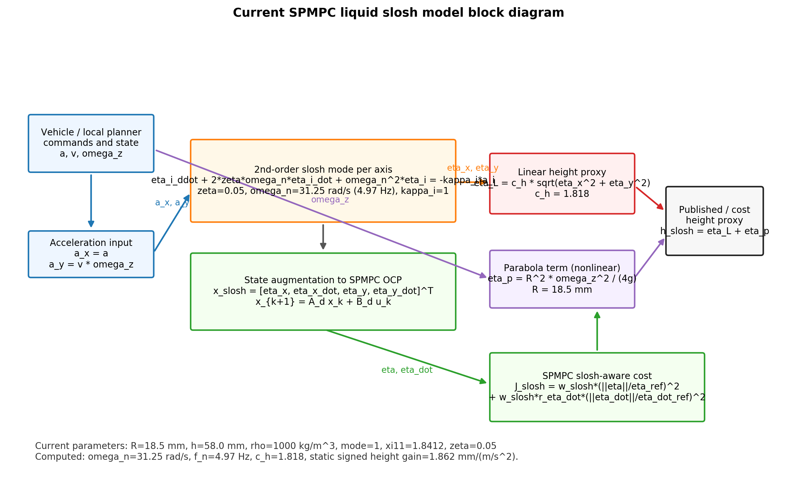
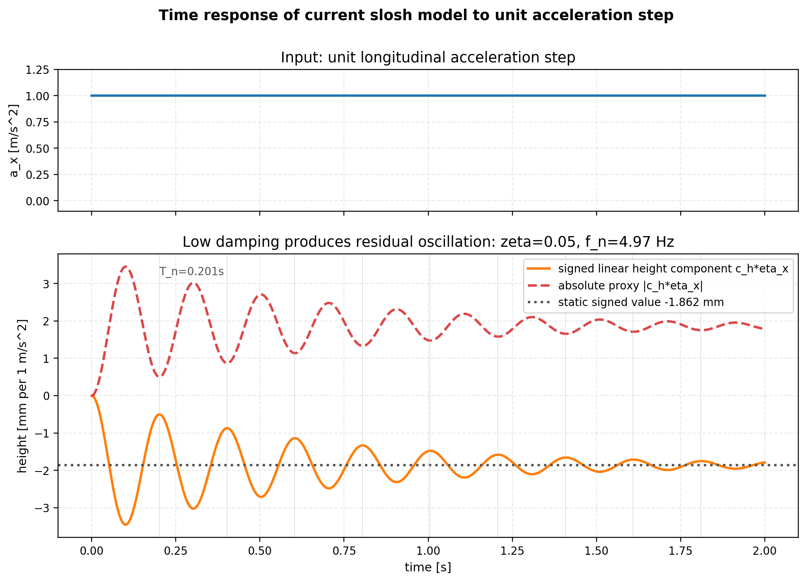
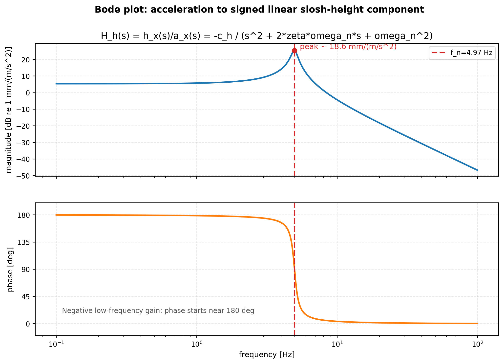
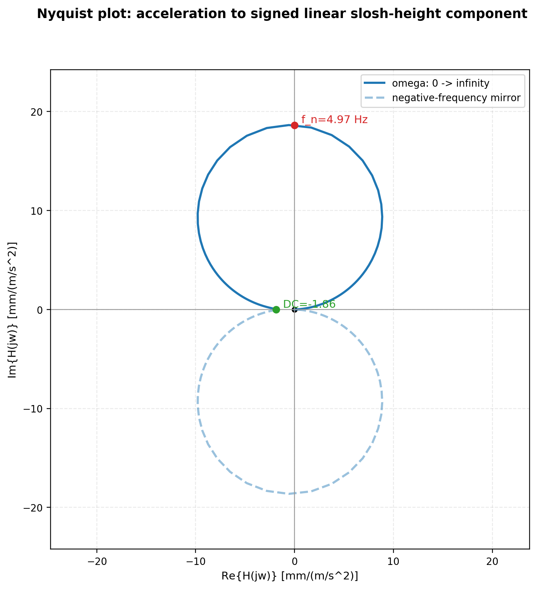
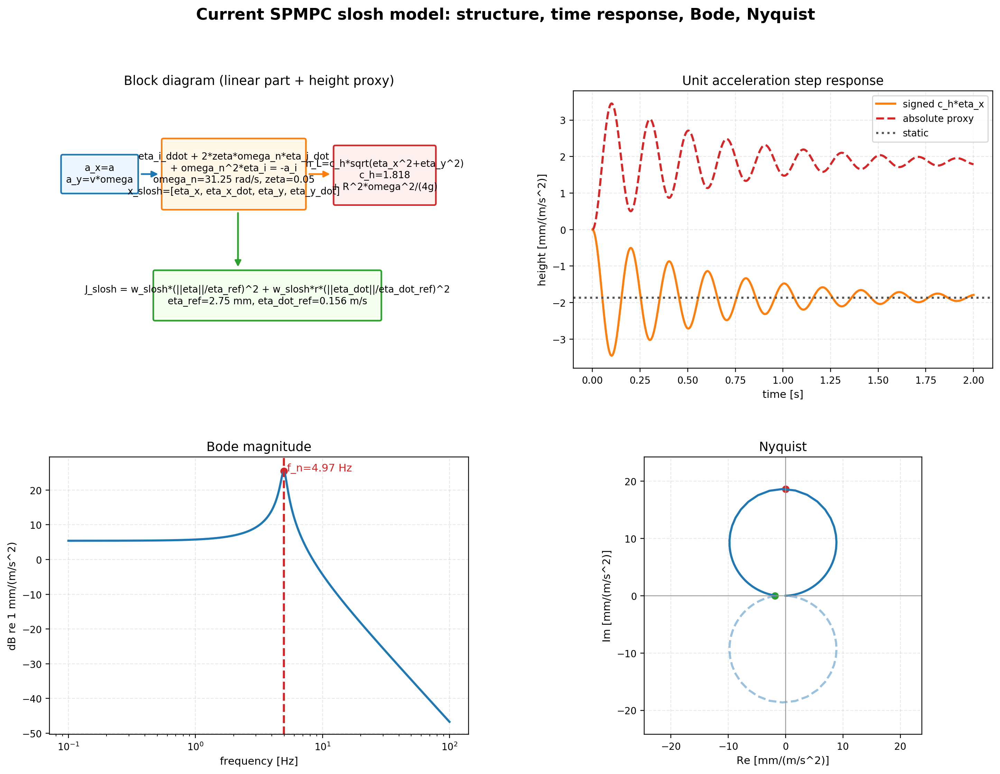

# 20260616 SPMPC 液体模型结构与频响图

> 图源目录：`docs/实物实验注意事项/PPT/figures/20260616_slosh_model/`

## 1. 当前模型参数

参数来源：

- `src/scout_apps/control/spmpc_local_planner/config/containers/tube_default.yaml`
- `src/scout_apps/control/slosh_models/src/liquid_slosh_model.cpp`
- `src/scout_apps/control/spmpc_local_planner/scripts/acados/spmpc_acados_model.py`

| 参数 | 当前值 | 说明 |
|---|---:|---|
| `R` | 0.0185 m | 容器内半径，约 18.5 mm |
| `h` | 0.058 m | 静液高度，约 58 mm |
| `rho` | 1000 kg/m³ | 水密度 |
| `mode_index` | 1 | 第一阶主模态 |
| `xi_11` | 1.8412 | `J'_1` 第一根 |
| `zeta` | 0.05 | 阻尼比 |
| `omega_n` | 31.246 rad/s | 理论主模态固有频率 |
| `f_n` | 4.973 Hz | `omega_n / 2π` |
| `T_n` | 0.201 s | 主模态周期 |
| `2*zeta*omega_n` | 3.125 1/s | 连续模型阻尼项 |
| `omega_n^2` | 976.315 1/s² | 连续模型刚度项 |
| `c_h` | 1.818 | 模态位移到线性液面高度系数 |
| 静态 signed height gain | 1.862 mm/(m/s²) | 单轴线性高度分量对单位加速度的静态增益 |
| `slosh_height_ref` | 0.005 m | cost 归一化高度参考 |
| `eta_ref` | 0.002750 m | `slosh_height_ref / c_h` |
| `eta_dot_ref` | 0.156230 m/s | `omega_n * slosh_height_ref` |

## 2. 当前模型公式

每个轴向的线性二阶模型：

```text
eta_ddot_i + 2*zeta*omega_n*eta_dot_i + omega_n^2*eta_i = -kappa_i * a_i
kappa_x = kappa_y = 1
```

SPMPC 中使用的输入口径：

```text
a_x = a
a_y = v * omega_z
```

线性高度 proxy：

```text
eta_L = c_h * sqrt(eta_x^2 + eta_y^2)
```

发布/监控高度还包含非线性旋转抛物面项：

```text
h_slosh = eta_L + R^2 * omega_z^2 / (4g)
```

Bode 图和 Nyquist 图使用的是单轴 signed linear transfer function：

```text
H_h(s) = h_i(s) / a_i(s)
       = -c_h / (s^2 + 2*zeta*omega_n*s + omega_n^2)
```

注意：`R^2 * omega_z^2 / (4g)` 是非线性静态项，不属于该线性传递函数，因此没有放进 Bode/Nyquist。

## 3. 方框图 / Block Diagram



对应矢量版：

```text
figures/20260616_slosh_model/01_block_diagram_current_slosh_model.svg
```

## 4. 时域响应曲线

单位纵向加速度阶跃 `a_x=1 m/s²` 下，单轴 signed height component `c_h * eta_x` 的响应如下。



讲法：

```text
当前 zeta=0.05，阻尼较低，因此单位加速度阶跃会激发约 4.97 Hz 的残振。
这正是 smooth-only 不足以完全表达液面风险的原因：液面状态有相位和历史记忆。
```

## 5. 伯德图 / Bode Plot



讲法：

```text
主共振峰在 f_n≈4.97 Hz 附近。
Bode 图显示该液体模型对接近固有频率的加速度激励非常敏感。
SPMPC 的 slosh-aware cost 本质上是在 horizon 内避免激发 eta/eta_dot 的高响应状态。
```

## 6. 奈奎斯特图 / Nyquist Plot



讲法：

```text
这是加速度到 signed linear height component 的二阶模态频响，不是闭环控制器的 Nyquist 稳定性图。
低频 DC 增益为负，表示容器正向加速度会使液面相对模态位移方向反向；图中单位是 mm/(m/s²)。
```

## 7. 四图总览



对应矢量版：

```text
figures/20260616_slosh_model/00_combined_current_slosh_model_overview.svg
```

## 8. PPT 使用口径

可以写：

```text
当前液体模型是一阶主模态的二阶欠阻尼系统，固有频率约 4.97 Hz、阻尼比 0.05。
加速度输入经过二阶模态后形成有记忆的 eta/eta_dot 状态，SPMPC 将其增广进 continuous MPCC，并在 horizon 内直接惩罚预测的 slosh state / height proxy。
```

不要写：

```text
Bode/Nyquist 已经证明实物液面真实降低。
```

更稳的说法是：

```text
Bode/Nyquist 解释模型机制；仿真消融验证 proxy 趋势；实物 RGB max-LCR 才验证真实液面效果。
```
