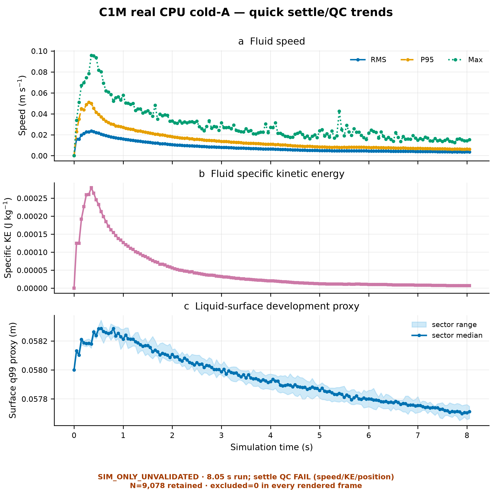
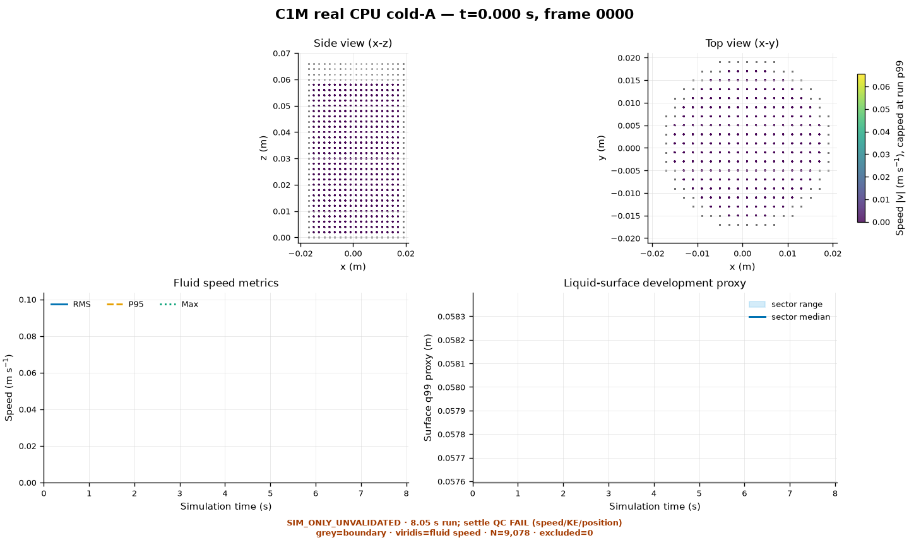
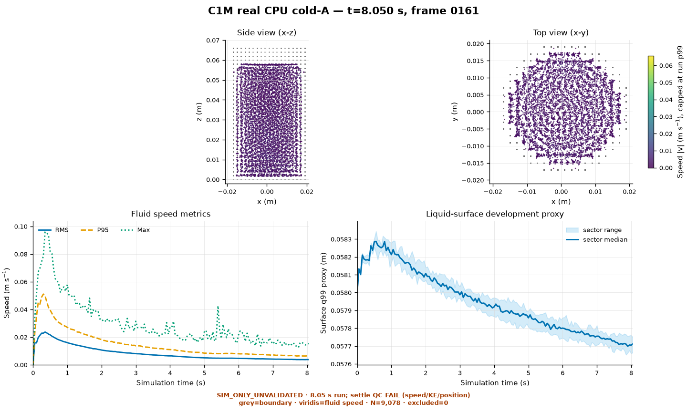

# 8 月 11 日阶段工作汇报：独立液体仿真与后续安排

## 1. 这几天主要完成的工作

### 1.1 已完成的具体事项

1. 静止液体的初始状态已经生成，并完成一次短时间试算。
2. 同一个条件下完成两次独立的较长计算；两次都正常结束。
3. 两次计算的主要粒子结果逐份比较，结果一致。
4. 从中间保存的结果继续计算，后续结果与原来的连续计算一致。
5. 已生成粒子变化动画、起始和结束状态图，以及液体运动趋势图。
6. 阅读了液体运输机器人液面测量相关论文，并编写了四路 VL6180X PCB 的设计代码及配套测试程序；本轮实物测试未达到稳定、可重复测量液面变化的目标，初步判定为失败。

## 2. 目前得到的实验结果

### 2.1 关键结果一览

| 项目           | 当前结果                             | 说明                                               |
| -------------- | ------------------------------------ | -------------------------------------------------- |
| 两次独立计算   | 都正常结束，计算到约 8.05 秒。       | 说明当前流程能够完整运行。                         |
| 粒子数量       | 始终为 9,078，没有粒子丢失。         | 输出结构保持完整。                                 |
| 输出数量       | 每次保存 162 份主要粒子结果。        | 覆盖了整个约 8 秒的计算过程。                      |
| 两次结果比较   | 162 / 162 份主要粒子结果完全相同。   | 当前设置下，重复计算能得到同一组结果。             |
| 从中间继续计算 | 后续位置、速度和密度与连续计算一致。 | 保存结果后继续计算的流程可以使用。                 |
| 液体是否稳定   | 尚未稳定。                           | 末段仍有明显运动，不能作为后续运动试验的稳定起点。 |

### 2.2 液体运动趋势

下图来自第一次数值较长计算。上图显示粒子的运动速度，中图显示整体运动强度，下图显示液面高度的变化。三条曲线总体都在下降，但到约 8 秒时仍没有达到稳定要求。

图 1 说明液体正在逐步减弱，但还没有完全静下来。第二次独立计算的 162 份主要粒子结果与第一次完全相同，因此这张图也能代表两次计算的粒子变化。

### 2.3 起始和结束状态对比

图 2 是计算开始时的粒子分布。此时液体刚从静止初始状态开始变化。

图 3 是约 8.05 秒后的粒子状态。粒子仍在运动，图中的速度曲线和液面曲线也说明它尚未完全稳定。

这些图片来自真实计算输出，不是示意图。不过它们只用于检查软件流程和结果变化，不能当作真实水的测量结果。

### 2.4 目前的限制

本轮计算没有加入小车运动，也没有回放真实小车数据。它只检查静止液体从初始状态开始时，程序能否运行、结果能否重复，以及保存后能否继续计算。

当前约 8 秒的计算时间还不够长。液体末段仍有速度和位置变化，所以不能把当前结果作为后续运动试验的起点，也不能据此判断真实容器中的水会怎样变化。

### 2.5 当前计算时间和对 S-MPCC 的影响

当前长计算只使用单个 CPU 工作线程，没有使用本机显卡。仿真中的约 8.05 秒，实际需要约 2 小时 20 分钟：

| 计算           | 仿真时间    | 实际耗时           |
| -------------- | ----------- | ------------------ |
| 第一次独立计算 | 8.050009 秒 | 2 小时 19 分 35 秒 |
| 第二次独立计算 | 8.050009 秒 | 2 小时 21 分 46 秒 |

第二次计算期间，CPU 温度曾达到 95 °C，程序暂停冷却后再继续完成。因此，当前每增加 1 秒仿真时间，大约还要增加 17.5 分钟实际等待时间。按相同条件粗略估算，30 秒仿真约需 8.5 至 9 小时，60 秒约需 17 至 18 小时。

这意味着，在当前设置下，这个粒子液体仿真**不能用于 S-MPCC 的大规模验证**。它暂时只适合用于少量代表性条件的独立检查，不适合覆盖大量路线、速度和参数组合。显卡虽然存在，但本轮结果没有使用显卡，不能把它当作已经验证过的加速方案。

### 2.6 本电脑配置

本轮液体计算只使用其中的 CPU，未使用显卡。

| 项目         | 配置                                                            |
| ------------ | --------------------------------------------------------------- |
| 系统         | Ubuntu 24.04.4 LTS，Linux 6.8.0-137-generic                     |
| CPU          | Intel Core Ultra 9 275HX，24 个逻辑 CPU                         |
| 内存         | 约 16 GB（系统可用总量为 15 GiB）                               |
| 显卡         | NVIDIA GeForce RTX 5080 Laptop GPU，16 GB 显存，驱动 580.173.02 |
| 本轮实际使用 | 单个 CPU 工作线程；GPU 未使用                                   |

### 2.7 论文阅读与 PCB 液面测量尝试

本阶段还阅读了液体运输机器人液面测量相关论文，包括 *Slosh Measuring Sensor System for Liquid-Carrying Robots*，并编写了四路 VL6180X PCB 的设计代码及配套测试程序。初步实物测试已经完成，但结果未达到稳定、可重复测量液面变化的基本目标，因此本轮 PCB 测试初步判定为失败。当前测量结果仍有明显跳动和偏差，不能作为可靠的液面真值，也不适合直接作为 MPC 的液体状态输入。

这些误差不能只归因于液体透明、液面反射不稳定等液体因素。VL6180X 本身的测距误差、不同通道的一致性、传感器安装位置和角度、试管壁及底部的多次反射、目标表面反射率，以及标定和滤波方法，都可能给整个测量链带来额外误差。后续应先使用已知距离的固定靶面分别测试每一路传感器，量化 PCB 与传感器测量链自身的误差，再逐步更换液体和液面条件，区分不同误差来源。

## 3. 为什么下一步重点应放在让液体静下来和整理记录

后续要加入小车运动时，需要先有一个可靠的静止液体起点。否则，新的运动带来的变化会和初始液体尚未停止的晃动混在一起，无法判断结果来自哪里。

同时，运行工具、自动检查和记录还需要整理到一致状态。这样后续每次计算都能清楚地说明用了什么条件、结果是否完整，以及是否可以与前一次比较。

当前单线程计算时间也决定了，不能把这个工具直接放入 S-MPCC 的大批量仿真实验。短期内应由较快的现有仿真承担大范围比较；粒子液体仿真只用于少量有代表性的复核。

因此，下一步不应急于加入更多运动，而应先完成三件事：让静止液体达到稳定状态，把当前的程序和记录整理完整，并明确粒子液体仿真只用于小规模复核。

## 4. 后期改进方向

1. **整理现有记录和检查。** 补齐当前检查工具，明确哪些检查只能在旧电脑上运行，并把这几天的程序、图表和文档整理为新的提交。
2. **延长静止计算。** 保持当前基本条件，增加计算时间，直到液体在连续一段时间内的运动足够小。
3. **重新确认结果。** 对新的稳定结果再做两次独立计算，并从中间结果继续计算一次，确认结果仍然一致。
4. **限制使用范围。** 在加速方案经过独立验证前，只用粒子液体仿真复核少量代表性条件，不用它替代 S-MPCC 的大规模验证。
5. **加入简单运动。** 稳定结果通过后，先加入小幅、规则的运动，检查液体变化方向和大小是否合理。
6. **回放实际运动并与实物对照。** 简单运动通过后，再使用小车实际运行记录进行回放，并逐步与相机记录的真实液面进行比较。

## 5. 当前结论

这几天的工作已经从“只有方案和准备工具”推进到“已经有可重复的液体计算结果”。静止液体的初始状态、短时间试算、两次较长计算、结果比较、继续计算和结果查看都已经完成。

但液体在当前约 8 秒的计算时间内还没有完全静下来，自动检查和程序整理也没有收尾。加上单线程计算约 8 秒就需要约 2 小时 20 分钟，当前粒子液体仿真不能承担 S-MPCC 的大规模验证。因此项目仍停留在静止液体检查阶段，暂不进入后续小车运动回放，也不能把当前仿真结果当作真实液体结论。
