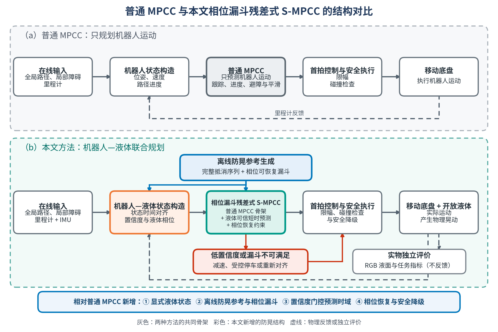

# 置信度门控、相位漏斗约束的残差式 S-MPCC 方案

日期：2026-08-18

英文名称：**Confidence-Gated Phase-Funnel Residual S-MPCC**

文档状态：`RESEARCH_PROPOSAL`。本文给出可实现、可消融和可形成论文方法章节的候选方案；尚未完成代码实现、漏斗计算、闭环仿真或实物验证，因此不得把本文中的预期性质写成已证实结论。

## 1. 方案结论

建议将下一阶段的论文主线定义为：

> 将离线优化得到的完整防晃抵消序列转换为随轨迹相位变化的可恢复漏斗；在线 MPCC 围绕该序列优化残差，只在经过数据验证的可信短时域内传播液体状态，同时保留较长的机器人和障碍预测时域。在线局部绕障造成的液体幅值与相位偏差必须在可信时域末端重新进入可恢复漏斗，否则控制器转入减速、恢复或安全停车。

该方案不是“离线轨迹规划 + 在线 MPC”的模块拼接。论文级方法对象由以下三个相互约束的部分组成：

1. **Phase-indexed recoverability funnel**：把离线 nominal 的完整相位抵消能力转换成在线可用的终端可恢复集合。
2. **Confidence-gated trusted slosh horizon**：液体预测时域随 observer、执行器和模型可信度变化，不再默认完整 `2 s` 液体预测都有效。
3. **Residual local replanning**：在线 MPCC 优化 `u = ū(τ) + δu`，在局部避障和保持离线防晃序列之间建立可观测的“相位债务—恢复”关系。

当前论文库足以支持这是一个明确的候选研究缺口，但不能据此宣称“世界首次”。正式形成 novelty claim 前仍需补充截至投稿日期的外部系统检索。

## 2. 文献综合与研究缺口

参考论文总览：

```text
/home/zrj/Obsidian/科大云盘/obsidian/vaults/StudyVault/30-Projects/MPC/参考论文整理/00_SPMPC参考论文总览.md
```

| 文献路线                     | 代表工作                | 已解决的问题                                         | 对本文留下的边界                                                               |
| ---------------------------- | ----------------------- | ---------------------------------------------------- | ------------------------------------------------------------------------------ |
| 固定命令整形和路径设计       | A07、B02、B03           | 用完整脉冲/速度/曲率序列降低残余晃动                 | 需要预先知道路径；无在线障碍处理和液体状态反馈                                 |
| 离线防晃轨迹优化             | B01、B11、C01、C06      | 在整段轨迹中显式考虑液体动力学、终端残余或时间最优性 | 执行时主要跟踪冻结 reference，不能承担标准 WMR local planner 的滚动改道任务    |
| 在线 predictive/MPC 防晃控制 | A12、C05、B12、C07、C11 | 证明在线液体状态反馈、预测控制和防溢急停已经存在     | 多为机械臂、专用平台、给定轨迹跟踪或急停，不等价于普通 WMR 在线 local planning |
| 普通移动机器人 MPC/MPCC      | D14、D17、D20           | 在线路径进度优化、感知、局部绕障和动态障碍安全约束   | 不传播液体内部状态，也不保护防晃输入的相位抵消序列                             |
| 液体相位与模型诊断           | A01、A02、A13           | 支撑低阶模态状态、能量和相位评价                     | 不直接给出移动机器人在线规划方法                                               |

因此，本文不能把贡献写成“首次使用 MPC 防晃”“首次预测液体状态”或“首次生成防晃轨迹”。更稳健的研究问题是：

> 在标准载液移动机器人发生在线局部改道时，能否通过置信度门控的短时液体预测和相位索引的可恢复漏斗，保留离线防晃轨迹的抵消能力，并在匹配任务约束下改善真实液面响应？

## 3. 为什么该方案针对当前实物问题

当前证据是“控制仿真正向，但实物 RGB 未复现”，而不是已经证明实物稳定反向。现有诊断进一步显示：

- 真正可用后的 planned liquid prediction 约在 `0--100 ms` 尚有方向信息；
- `100--333 ms` 相关性明显衰减；
- `333 ms` 后不宜继续作为强物理预测；
- 每 `33 ms` 只执行 MPC 第一拍，后续抵消动作会被下一轮重新规划覆盖；
- planned、commanded 与 realized 激励之间可能存在延迟、限幅和底盘内环失配；
- 当前 FixedProfile 只是传统方法框架和诊断基线，现有 R7 描述性仿真结果没有显示成熟的减晃能力。

本方案分别对应这些问题：

| 当前问题                      | 方法响应                                                                             |
| ----------------------------- | ------------------------------------------------------------------------------------ |
| 远期液体节点低可信            | 将机器人/障碍 horizon 与液体可信 horizon 分离                                        |
| 滚动重规划覆盖后续抵消动作    | 使用 phase funnel 保留“仍可恢复”的跨周期条件                                       |
| 离线轨迹无法在线避障          | 只优化 nominal 周围的 residual，并允许虚拟相位时钟调整                               |
| 理想计划输入与实车激励不一致  | 在 OCP 中加入执行器/realization state，液体由 realized excitation 驱动               |
| observer 新鲜度和模型误差变化 | 由 lead、age、innovation、realization 和 parameter confidence 决定液体时域及风险余量 |

## 4. 完成后的总体框架



**图 1. 普通 MPCC 与本文相位漏斗残差式 S-MPCC 的结构对比。** 两个子图按在线输入、状态构造、优化器、首拍执行和物理平台五个阶段对齐。普通 MPCC 只传播机器人状态，以跟踪、进度、避障和平滑为主要目标；本文方法保留该在线 local-planner 骨架，同时新增 IMU 驱动的液体状态、离线防晃参考与相位漏斗、置信度门控的液体预测时域，以及漏斗不可满足时的安全降级。RGB 液面仅用于独立实物评价，不直接进入当前控制器。

- 矢量图：[SVG](figures/20260818_相位漏斗残差SMPCC/20260818_confidence_gated_phase_funnel_residual_smpcc_framework.svg)
- 论文矢量图：[PDF](figures/20260818_相位漏斗残差SMPCC/20260818_confidence_gated_phase_funnel_residual_smpcc_framework.pdf)
- 可编辑源文件：[Python/Matplotlib](figures/20260818_相位漏斗残差SMPCC/draw_confidence_gated_phase_funnel_residual_smpcc_framework.py)

图中 RGB 的角色仍是独立实物评价和离线标定。除非延迟观测和 held-out 验证另行通过，不应把 RGB 直接接成当前在线 feedback，从而避免控制器用自身评价信号自证。

## 5. 离线阶段：从防晃 nominal 到相位漏斗

### 5.1 OfflineSloshOCP

第一版不重新选择全局路径几何，只在冻结路径或走廊内完成 model-based retiming。复用当前 10D 状态和控制语义：

\[
x=
[p_x,p_y,\theta,v,s,\omega,
\eta_x,\dot\eta_x,\eta_y,\dot\eta_y]^\mathsf T,
\qquad
u=[a,\alpha,v_s]^\mathsf T.
\]

离线 OCP 同时考虑：

- 完成时间或进度；
- `η/η_dot` 的运行期能量与终端残余；
- `a/α`、控制变化率和横向激励；
- `v/ω/a/α`、路径走廊和任务时间公平约束；
- 从独立数据识别的底盘延迟或一阶执行器模型；
- 起点和终点的机器人/液体状态合同。

输出冻结 artifact：

\[
\bar x(\tau),\qquad
\bar u(\tau),\qquad
\bar z(\tau),
\]

并保存 path/profile/model/config hash、求解状态、约束余量和完整 predicted trajectory。这里 `τ` 是 nominal 的虚拟时间或相位坐标。

### 5.2 液体能量—相位向量

定义二维主模态的归一化相位向量：

\[
z=
[\omega_n\eta_x,\dot\eta_x,
 \omega_n\eta_y,\dot\eta_y]^\mathsf T,
\qquad
E_{\mathrm{slosh}}=\frac12 z^\mathsf Tz.
\]

与只惩罚 `η²` 或单一非负液面峰值不同，`z` 同时保留幅值和速度符号。它在相平面中的位置表示当前振荡相位，因此能够区分“幅值相近但下一步应加速抵消”与“幅值相近但下一步应减速抵消”的状态。

### 5.3 相位索引的可恢复漏斗

沿 nominal 对包含液体与执行器误差的动力学进行线性化：

\[
e_{k+1}=A_ke_k+B_k\delta u_k+G_kw_k,
\]

其中 `w_k` 覆盖预冻结范围内的参数偏差、实现误差和外部扰动。以终端低残余集合为起点，反向计算：

\[
\mathcal F(\tau)=
\left\{e_z:
e_z^\mathsf TP(\tau)e_z\le \rho(\tau)
\right\}.
\]

该集合的目标语义是：如果可信时域末端的液体相位误差仍位于 `F(τ)` 内，则存在满足控制限幅的后续动作，使系统能够重新接回 nominal 的抵消尾段并回到终端低残余集合。

论文目标版本应使用 TVLQR、tube MPC、LMI 或近似 backward reachable set 给出 `P(τ), ρ(τ)` 的明确计算方法。若第一版只用密集 Monte Carlo 估计集合，则必须称为 **empirical recoverability tube**，不能写成带形式保证的 invariant/reachable funnel。

## 6. 在线阶段：置信度门控的残差式 local MPCC

### 6.1 虚拟相位对齐

在线根据机器人路径进度和带符号液体相位，将当前状态锚定到 nominal 的 `τ_t`。优化中允许：

\[
\tau_{k+1}=\tau_k+\Delta t\,\nu_k,
\]

其中 `ν=1` 表示按 nominal 时间运行，`ν<1` 表示减速或等待，`ν>1` 表示在放行范围内加快 nominal。应惩罚 `ν-1` 及其变化率，防止控制器通过不受约束的时间扭曲虚假满足漏斗。

相位对齐不能只使用几何最近点。连续转弯或在线绕障后，机器人可能位于相近路径进度，但液体处于不同振荡相位；对齐目标至少需要同时考虑进度、机器人状态和 `z-z̄(τ)`。

### 6.2 Residual control

控制命令写成：

\[
u_k^{\mathrm{cmd}}=\bar u(\tau_k)+\delta u_k.
\]

其中 nominal 提供完整防晃抵消骨架，`δu` 只承担：

- 局部静态或动态障碍绕行；
- 实际路径和速度误差修正；
- observer 检测到的液体相位偏差恢复；
- 执行器/环境扰动补偿。

`δu` 的幅值、变化率和累计激励均应受约束。否则 nominal 只会成为弱 reference，在线优化仍可能重新退化为从零规划的 full-horizon S-MPCC。

### 6.3 置信度门控的液体时域

将机器人/障碍预测长度 `N_r` 与液体可信预测长度 `N_s(t)` 分离。定义：

\[
c_{k|t}=
r_k^{\mathrm{lead}}
c_t^{\mathrm{age}}
c_t^{\mathrm{innovation}}
c_t^{\mathrm{realization}}
c_t^{\mathrm{parameter}},
\]

其中：

- `r_lead`：由 held-out 数据得到的预测误差—lead-time reliability profile；
- `c_age`：当前液体状态和机器人状态的时间新鲜度；
- `c_innovation`：observer innovation 或 normalized innovation consistency；
- `c_realization`：最近窗口 planned/commanded/realized 激励的一致程度；
- `c_parameter`：液位、固有频率、阻尼和安装外参的不确定度。

可信液体时域定义为：

\[
N_s(t)=\max\{k\le N_r:c_{k|t}\ge c_{\min}\}.
\]

`r_lead`、各 confidence 映射和 `c_min` 必须在独立 development 数据上冻结。当前约 `100 ms` 的诊断结果只能作为初始候选，不能直接写死为论文常数。

### 6.4 在线 OCP

一个最小目标函数为：

\[
\begin{aligned}
J={}&J_{\mathrm{MPCC}}
+\sum_{k=0}^{N_r-1}\|\delta u_k\|_R^2
+\sum_{k=0}^{N_r-1}\|\delta u_k-\delta u_{k-1}\|_{R_\Delta}^2\\
&+\sum_{k=0}^{N_s(t)}
c_{k|t}\|z_k-\bar z(\tau_k)\|_Q^2
+w_\nu\sum_k(\nu_k-1)^2
+w_\phi\epsilon_\phi^2.
\end{aligned}
\]

机器人和障碍仍在完整 `N_r` 上预测，液体只传播到 `N_s(t)`。在液体可信时域末端施加：

\[
e_z^\mathsf TP(\tau)e_z
+\beta\,\mathrm{tr}(P(\tau)\Sigma_z)
\le
\rho(\tau)+\epsilon_\phi.
\]

该约束不是要求液体在每次短时域末端立即归零，而是要求它回到“后续仍可恢复”的相位集合。`Σ_z` 占用不确定性余量；confidence 越低，允许控制器依赖的相位空间越小。`ε_φ` 是有记录、受惩罚的软 slack，用于避免障碍冲突时制造不可审计的求解失败。

### 6.5 Realization-aware liquid excitation

液体不能直接由理想命令驱动。可先加入一阶底盘实现模型：

\[
a_{k+1}^{\mathrm{real}}
=a_k^{\mathrm{real}}
+\frac{\Delta t}{\tau_a}
(a_k^{\mathrm{cmd}}-a_k^{\mathrm{real}}),
\]

偏航响应使用对应的一阶或延迟模型。液体输入使用：

\[
a^{\mathrm{real}},\qquad
v^{\mathrm{real}}\omega^{\mathrm{real}},
\]

并对 planned、solver raw、各级 gate 后 command、odom/IMU realized excitation 分层记录。模型复杂度应由 held-out input-output 识别结果决定，不能为了增加方法模块而盲目升阶。

## 7. 安全优先级和降级逻辑

推荐的约束优先级是：

1. 碰撞和平台硬安全约束；
2. 速度、加速度、转速、执行器和通信约束；
3. phase-funnel 约束；
4. 进度、时间最优和 nominal adherence。

当 confidence 过低、漏斗 slack 超过阈值或 obstacle maneuver 超出 residual authority 时：

1. 限制 `δu` 和 `ν` 的可用范围；
2. 进入 slosh-safe slowdown；
3. 必要时执行带液体状态的 controlled stop；
4. 静止或恢复后重新锚定 nominal phase；
5. 对需要大拓扑改道的场景触发 global replan 和新的 offline/local retiming。

这套逻辑不能宣称在任意障碍、任意感知误差和任意 NLP infeasibility 下提供无条件安全保证。大幅临时改道可能离开预计算 funnel 的有效走廊，是方法的明确适用边界。

## 8. 可以形成的论文贡献

在实现和实物证据成立后，贡献可写为：

1. 提出一种 phase-funnel residual MPCC，将离线防晃 nominal 转换为相位索引的可恢复集合，使标准 WMR 能在局部在线改道时显式管理液体相位债务。
2. 提出数据标定的 confidence-gated trusted slosh horizon，使 liquid prediction horizon 与 robot/obstacle horizon 解耦，避免低可信远期液体节点持续驱动第一控制动作。
3. 建立 realization-aware 的载液移动机器人闭环实现和评价合同，同时审计 planned、commanded、realized excitation、真实液面、路径任务和求解实时性。

第三条只有在完整实物实验和统计合同通过后才能作为论文贡献。目前只可写成计划评价设计。

建议避免的声明：

- 首次将液体模型加入 MPC；
- 首次在线预测液体状态；
- 首次生成防晃轨迹；
- phase funnel 等价于无条件防洒保证；
- 内部 `η/η_dot` 或 OCP cost 下降等价于真实 RGB 液面下降。

## 9. 对比、消融和测量合同

### 9.1 主对比

| 条件                                  | 用途                                         |
| ------------------------------------- | -------------------------------------------- |
| `Bsmooth`                           | ordinary smooth MPCC，同层无液体 baseline    |
| Hamaguchi-style FixedProfile          | 传统 input shaping / fixed-profile baseline  |
| `OfflineSloshOCP`                   | 检验完整离线抵消序列是否在实物有效           |
| 当前 full-horizon S-MPCC              | 检验“完整远期 node-wise liquid cost”的效果 |
| Proposed Phase-Funnel Residual S-MPCC | 完整方法                                     |

所有在线 MPC 条件必须复用同一 solver state、公共权重、速度/加速度限制、路径和状态输入，只切换预注册的方法组件。

### 9.2 必要消融

1. 去掉 phase funnel，只保留短时 liquid cost；
2. 固定 `2 s` liquid horizon 与 confidence-gated horizon；
3. 去掉 offline nominal，从当前 full-horizon S-MPCC 直接在线规划；
4. 去掉 actuator/realization model；
5. 固定 `ν=1`，去掉 virtual phase adaptation；
6. 去掉 runtime confidence，只使用冻结的固定短时域；
7. 去掉 uncertainty margin，只约束 terminal mean state。

### 9.3 场景

- 无障碍冻结路径，用于检查纯防晃收益；
- 临时静态障碍局部绕行，用于检查 nominal cancellation 是否被破坏；
- 动态障碍减速/恢复，用于检查 phase debt；
- 不同液位或固有频率偏差；
- 人为增加 command delay 或限幅；
- 带少量初始晃动启动；
- 超出 residual authority 的大幅改道，用于验证 fallback 而不是证明 efficacy。

### 9.4 必须记录的指标

| 层       | 指标                                                                               |
| -------- | ---------------------------------------------------------------------------------- |
| 真实液面 | RGB P95、RMS、signed feature、phase、motion 后 tail/settling                       |
| 内部液体 | `η/η_dot`、energy、funnel margin、phase slack、confidence 和 `N_s(t)`        |
| 激励实现 | planned/solver raw/commanded/realized`a` 与 `vω` 的 impulse、频谱、相位、RMSE |
| 路径任务 | contour P95/RMSE、完成时间、最短障碍距离、timeout、failure                         |
| 实时性   | solver median/P95/P99、deadline miss、fallback、bound activity                     |
| 统计     | block-level paired effect、区间、顺序效应、失败行和缺失原因                        |

RGB calibration、confidence 标定和候选选择数据不得进入正式 confirmation。完整 trial 或 ABBA block 是统计单位，不能把重叠 MPC cycle 当作独立样本。

## 10. 分阶段实现路线与放行门

### P0：修复证据链，不发车

- 补齐共享 `cycle_id`、state epoch、solve start/end、command publish/effective stamp；
- 完成 planned/commanded/realized excitation replay；
- 建立 matched-weight `w_slosh=0/5` snapshot；
- 冻结 RGB 测量分辨率、observer held-out error 和 confidence calibration protocol。

放行条件：能够解释状态时间、first action、实际激励和 RGB 的因果顺序。

### P1：实现并验证 OfflineSloshOCP

- 先只优化冻结路径上的时间律和控制；
- 加入终端液体残余和执行器模型；
- 与 Bsmooth 和现有 FixedProfile 做 matched-task 仿真与小规模实物 development。

放行条件：`OfflineSloshOCP` 在真实 RGB 上的改善超过预冻结测量分辨率，并在独立 block 中方向一致；完成时间和路径误差同时满足公平门。

### P2：计算 phase funnel

- 沿 nominal 线性化；
- 构造终端安全集并反向计算 `P(τ),ρ(τ)`；
- 用参数扰动、初始相位扰动和执行器偏差验证集合 coverage；
- 区分形式漏斗与 empirical tube 的声明等级。

放行条件：集合内外样本的恢复率、constraint violation 和 false-safe rate 达到预冻结门槛。

### P3：接入 residual S-MPCC

- 加入 `u=ū(τ)+δu` 和 virtual phase state；
- 首先固定短 liquid horizon，验证 phase-funnel terminal constraint；
- 再加入 confidence-gated `N_s(t)`；
- 最后加入降级和 re-anchor 状态机。

放行条件：仿真中同时通过防晃、局部绕障、实时性和 fallback 测试，不因 soft slack 掩盖持续 infeasibility。

### P4：实物 development 与正式确认

- 先做顺序平衡的小规模 development；
- 参数冻结后建立新 release；
- 重新进行正式 paired/ABBA confirmation；
- 动态障碍和参数扰动作为独立扩展场景，不与无障碍 efficacy 主结论混在一起。

## 11. Go/No-Go 判据

以下任一情况成立时，应暂停该主线而不是继续增加权重或模块：

1. `OfflineSloshOCP` 在 matched-time 实物比较中仍不能优于 Bsmooth；
2. actual-input replay 在 held-out bag 中不能稳定复现 RGB 的幅值、主频和相位；
3. phase funnel 只能通过事后选择参数得到较高 coverage；
4. proposed 方法的收益只来自明显更慢的完成时间；
5. 主要结果小于冻结的 RGB 最小可检测差异；
6. phase constraint 大量依赖 slack，或导致 solver P99 超过控制周期；
7. 删除 confidence/funnel/realization model 后结果不变，无法支持对应的机制性贡献。

如果 `OfflineSloshOCP` 正向而在线方法未复现，优先支持“滚动重规划、状态时间或实现失配破坏抵消序列”；如果二者都不正向，应回到液体模型、RGB 映射和执行器辨识，不应继续扩展 phase-funnel 控制器。

## 12. 预期论文题目和研究问题

候选题目：

> **Confidence-Gated Phase-Funnel Residual MPCC for Online Liquid-Carrying Mobile Robots**

候选研究问题：

> Does confidence-gated, phase-funnel residual MPCC preserve the recoverability of an offline anti-slosh cancellation sequence during online local obstacle avoidance, and reduce real liquid response relative to smooth-only MPCC, offline profiles, and conventional full-horizon S-MPCC under matched task constraints?

这一路线的核心创新不是“预测更多液体节点”，而是只在证据支持的范围内使用预测，并通过相位可恢复集合把短时反馈和完整离线抵消序列连接起来。

## 13. 图文件说明

- 图类型：方法框架/概念架构，不包含实验数据。
- 图源：本文方法定义、当前实物诊断和本地 A/B/C/D 论文综合。
- 推荐版式：双栏通栏或单页横向图；正式投稿优先使用 SVG/PDF 矢量版本。
- 限制：图中 funnel、confidence gate 和 fallback 均为待实现模块；实线表示预期因果数据流，不代表当前代码已全部接通。
