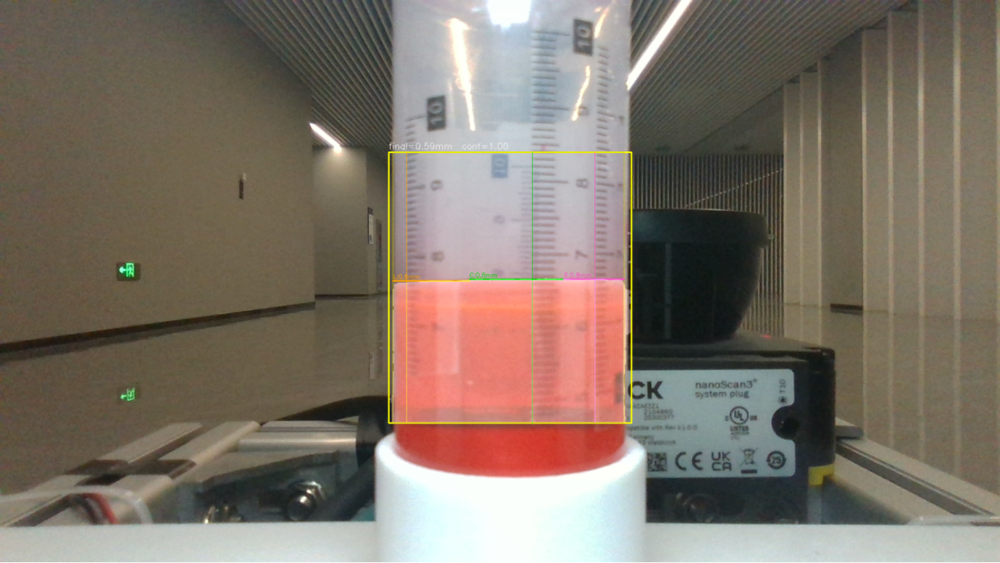

# 暑期阶段工作汇报：液体运输机器人实物验证、ROS 2 平台建设与论文推进

> 已完成工作范围：2026 年 7 月下旬至 8 月 24 日  
> 下一步实验：8 月 19 日方案已完成准备、即将开展的短时预测公平对照实验  
> 汇报目的：说明暑期完成了什么、发现了什么问题，以及下一步准备怎样解决。

## 一、总体情况

本阶段围绕两项相互关联的目标开展工作：一是**让移动机器人在运输敞口液体时，既能沿着预定路线稳定行驶，又尽量减少液体晃动**；二是将导航、任务、安全和设备接入整理成可复用的 ROS 2 平台，为不同移动底盘和实际场地部署打好基础。

工作主要分为五条线：实物测量和实车实验、机器人仿真、独立液体仿真、ROS 2 平台建设以及论文完善。减晃研究已经从“把传感器和控制程序接起来”，推进到“用相机和实物数据检查方法是否真的有效”；与此同时，也完成了 ROS 2 平台建设与移动机器人导航的大致框架。

目前得到的结果是：减晃方法在机器人仿真中表现出正向趋势，但放假前的实物对照没有稳定复现这一效果。因此，本阶段没有直接扩大正式实验，而是先查清仿真和实物不一致的原因，并准备一轮条件更加公平、判断标准更加明确的实物验证。

| 工作方向 | 已完成的主要内容 | 当前状态 |
| --- | --- | --- |
| 实物测量 | 完成惯性传感器标定、数据处理、相机液面测量和安全保护 | 当前状态测量已接通，未来预测仍需改进 |
| 实车实验 | 完成候选方法筛选和两组有效对照 | 未观察到可重复的真实液面改善 |
| 机器人仿真 | 核对并整理 88 组已有实验，分离仿真与实物程序 | 仿真支持减晃思路，但不能代替实物证据 |
| 独立液体仿真 | 完成重复性检查、显卡加速验证和运动轨迹转换 | 工具可用，但批量计算耗时过长，暂时封存 |
| ROS 2 平台建设 | 完成双底盘导航、安全和部署的大致框架 | 总体框架已成形，具体功能仍在完善和验证 |
| 论文工作 | 重画核心方法图，明确论文的主要表达 | 已完成第一步，仍需集中精简和统一全文 |

## 二、实物测量和实车实验

### 2.1 让机器人更准确地感知当前运动

完成了惯性传感器与动作捕捉系统的标定。结果表明，惯性传感器的角速度数据总体可靠；同时发现，仅依靠车轮里程计时，部分实际转动会被低估约 8%—10%。这会进一步影响程序对液体受力和晃动的判断。

为此，对惯性传感器数据增加了重力去除、静止偏差估计、滤波、安装位置补偿、时间检查和异常回退。处理后的数据已经能够进入控制程序，用于估计当前液体的运动状态。

在现有三组开发数据中，处理后的惯性传感器结果与相机液面测量的误差，相比只使用里程计平均减少约 35%。这说明当前状态的测量方向是有效的，但它只能帮助判断“液体现在怎样运动”，不能自动保证程序能够准确预测之后几秒的液体变化。

下面是实车上的相机液面测量画面。相机识别红色液体的可见液面，用作独立评价，不直接拿控制程序内部的计算结果给自己打分。

### 2.2 对候选减晃方法进行实车检查

放假前完成了候选方法筛选和两组完整对照，共获得四条质量合格的数据。候选方法在单次筛选中曾出现较好的结果，但在随后两组对照中没有稳定复现：相机测得的液面晃动没有明显降低，同时路径跟踪和计算时间还有一定代价。

按照事先确定的判断标准，即使继续完成剩余两次实验，也无法满足原定放行条件，因此及时停止了本轮采集。失败数据和过程记录均被保留，没有通过反复重录或挑选有利结果来改变结论。

进一步检查确认，当前液体状态确实已经进入控制程序，问题不是简单的“传感器没有接通”。现有数据更倾向于说明：程序计划的未来运动没有被实车完全实现，导致根据计划动作计算出的未来液体变化与相机结果逐渐偏离。

目前，靠近当前时刻的短时间预测仍有一定参考价值；时间拉长后，预测与真实液面的对应迅速变弱。这个发现直接决定了下一轮实验不再让液体减晃部分使用完整两秒预测，而是先集中检查最靠近当前的约 0.1 秒。

### 2.3 液面传感器板的探索

本阶段还设计并测试了一块四传感器液面测量板，希望从四个方向观察液面变化。实际测试中，透明液体、容器壁和底部反射会造成明显跳动，不同传感器之间也存在差异，暂时没有达到稳定、可重复测量的要求。

因此，这条路线目前只作为辅助探索保留，不替代相机，也不作为近期控制输入。后续若继续，应先用固定距离的普通目标分别检查四个传感器自身的误差，再逐步加入容器和液体，避免一次混入过多影响因素。

## 三、仿真验证和程序整理

### 3.1 整理已有的 88 组机器人仿真

本阶段重新核对并整理了此前完成的 88 组机器人仿真实验。其中 87 组正常到达终点，1 组因超过时间限制按失败保留，没有用补跑结果替换。

在现有仿真模型中，启用减晃考虑后，模型计算出的液体晃动量降低约 8%—14%。这说明方法思路在仿真环境中能够起作用。不过，相应的任务完成时间更长，路径跟踪误差也有所增加。因此，仿真反映的是“减小晃动、行驶效率和跟踪精度之间存在取舍”，不能表述成减晃方法在所有方面都优于普通控制。

更重要的是，这里的晃动量来自计算模型，不是真实液体测量。88 组仿真可以用于解释方法为什么可能有效，但不能代替实车相机结果，也不能与实物样本混在一起统计。

### 3.2 将仿真程序与实物程序分开

为避免后续仿真修改影响实车，已经将仿真使用的控制程序、编译环境和运行入口与实物程序分开，并完成了一次从启动、行驶到结束检查的完整测试。

这项工作的直接价值是：以后可以独立修改和复核仿真程序，不会因为共用文件而误改实车版本。新环境目前只通过了基础运行检查；如果以后重新开展大批量仿真，仍需重新固定实验条件和记录规则。

## 四、独立液体仿真

为了不只依赖控制程序内部的简化液体模型，本阶段还搭建了一个更加细致的液体仿真工具，用 9,078 个小粒子表示液体运动。

早期使用普通处理器完成了两次独立计算、保存后继续计算以及逐份结果比较。两次计算结果一致，且没有粒子丢失，说明计算流程可以重复。但约 8 秒的液体过程需要实际计算约 2 小时 20 分钟，而且结束时液体仍未完全稳定。

下图展示了这次约 8 秒计算中的液体运动趋势。整体运动在减弱，但末段仍没有达到稳定要求，因此该结果只用于检查程序，不能当作真实液体结论。

随后完成了 RTX 5080 显卡程序的构建和检查，将液体推进到稳定起点，并进行了静止、小幅平移和小角度转动三类简单运动测试。三类测试共保存 143 帧，9,078 个粒子始终完整保留。还对普通处理器和显卡结果进行了对照，确认当前固定设置下的计算链路可用。

在此基础上，从已有机器人仿真中只读取一条 49.38 秒的运动记录，完成了轨迹提取、格式转换和质量检查，为完整液体回放做好了准备。但单条回放的纯计算仍需约 65—70 分钟，加上首次检查、分析和出图，整体需要半天至一天；如果覆盖全部 88 组，仅计算时间就可能超过 95 小时。

综合时间投入和当前研究需求，本阶段暂停了完整轨迹回放。已有程序、配置、稳定液体状态和轨迹转换结果均已保留，今后只有在模型复核或论文审稿确有需要时，才恢复少量代表性计算。尚未实际完成的全轨迹回放不会写成论文证据。

## 五、ROS 2 平台建设与移动机器人导航

除液体减晃研究外，8 月 18 日至 24 日还推进了移动机器人软件向 ROS 2 的迁移，目前已经完成 ROS 2 平台建设与移动机器人导航的大致框架，为后续不同移动底盘的导航、任务和实物部署打下了基础。

### 5.1 当前进展

目前三个仓库的安排如下：

| 仓库 | 定位 | 主要存放内容 |
| --- | --- | --- |
| `rtrw` | 通用底层仓库 | 与具体机器人和 ROS 无关的基础能力，例如通用数据结构、算法和通信协议 |
| `rtrw_ros2` | ROS 2 功能仓库 | 可复用的导航、任务、安全、遥控和设备接入功能，不保存具体机器参数 |
| `ur7e_cell01` | 实际部署仓库 | 具体机器和场地的配置，例如地图、站点、标定、设备信息和整机启动安排 |

这种分工可以将通用程序与机器参数、地图和标定数据分开管理，后续更换底盘或场地时，不需要重新改写整套通用功能。

在此基础上，已经搭起航发和小科灵两类移动底盘的导航与仿真配置，站点任务、人工接管、速度安全、底盘通信和场地部署也形成了基础结构。相关软件接口和仿真流程已完成一轮初步检查。

### 5.2 当前边界

这部分工作目前仍处于软件搭建和仿真验证阶段，真实底盘通信、整机启动、机器标定和安全验收尚未完成。后续将结合完整仿真结果和实机接入情况，再对具体功能、测试结果和部署进展作专项汇报。

## 六、论文完善

目前已经重新绘制了核心方法架构图，并加入论文的方法部分。论文的核心思想进一步明确为：

> **机器人不仅要考虑怎样沿路线行驶，还要提前判断当前动作会不会使液体产生较大晃动，并据此选择下一步动作。**

下一轮论文修改将围绕这句话展开，主要包括：增加机器人、容器和液体的直观图示；用一次实际控制过程解释程序“输入什么、判断什么、执行什么”；删除重复内容和读者无法理解的内部版本名称；统一标题、摘要、方法、实验和结论的表达。

论文中会明确区分仿真趋势和实物结果，也不会把尚未完成的独立液体回放描述为已经得到的证据。

## 七、马上开展的实物实验

下一步将开展“短时间预测公平对照实验”。详细执行文件见：[G3R3 短可信时域公平配对实物验证方案](../对比试验/实物对比实验/20260819_G3R3短可信时域公平配对实物验证方案.md)。

目前实验所需的代码、配置、录制程序、自动检查和静止状态测试均已通过，但尚未采集这批新的实车运动数据。因此，下面内容是**已经固定的实验计划**，不是已经取得的实验结果。

### 7.1 实验要回答的问题

这次实验只回答一个问题：

> 在路径、速度、传感器、控制程序和其他参数完全一致的情况下，只让其中一种方法在最靠近当前的约 0.1 秒内考虑液体晃动，它能否稳定降低相机看到的真实液面变化，同时不影响机器人跟踪、安全和实时运行？

与上一轮相比，这次主要做了两项收缩：

1. 两种方法使用完全相同的公共设置，只切换是否考虑液体晃动，避免把其他参数差异误认为减晃效果；
2. 液体减晃部分只使用目前较可信的短时间范围，不再让较远期、可信度较低的预测影响当前动作。

### 7.2 实验怎样进行

实验共进行 6 次，组成 3 组一一对应的比较。两种方法按照“普通—减晃、减晃—普通、普通—减晃”的顺序交替进行，用来减小实验先后顺序和环境变化带来的影响。

每次实验都执行同一条路径、使用相同参考速度，并遵守以下要求：

- 人工将机器人放回同一起点并重新对齐；
- 等待液体静止至少 10 秒，相机液面稳定后再开始；
- 急停装置保持可用，场地内没有其他程序同时发送运动命令；
- 每次单独启动和保存，不连续循环运行；
- 每次结束后立即检查数据是否完整、传感器是否正常以及控制程序是否报错；
- 任意一次出现采集、跟踪或安全问题，都保留现有数据并停止本批，不现场修改规则，也不用成功重跑替换失败记录。

### 7.3 用什么判断结果

实验以相机测得的真实液面变化为主要结果，控制程序内部计算出的晃动量只用于解释原因，不能用来证明自身有效。

只有同时满足以下条件，才能认为候选方法值得进入下一轮开发验证：

1. 6 次实验全部完成并通过数据检查；
2. 三组对照的平均液面改善至少达到 0.10 mm；
3. 至少两组显示减晃方法更好，且结果不能由某一条异常数据单独造成；
4. 液面的整体波动不能变差；
5. 六次实验都满足到达、路径跟踪、安全和计算速度要求。

即使达到这些条件，也只能说明“小样本开发实验支持继续验证”，不能直接写成正式论文结论，更不会立即开始大规模正式实验。

如果差异小于相机能够稳定分辨的范围、三组结果方向不一致，或者实车没有按计划动作执行，则记为“暂时无法判断”，不能简单解释成两种方法完全相同。如果内部计算显示改善而相机没有改善，也不会继续盲目加大减晃力度，而是优先检查机器人实际执行、液体模型和相机测量之间的关系。

### 7.4 这轮实验还将查什么

除了比较液面变化，本轮还会逐步检查以下过程：

1. 程序上一时刻计划的动作，下一时刻是否仍被采用；
2. 计算出的原始动作在真正发送给机器人前，是否被其他软件环节改变；
3. 机器人收到命令后，实际速度和转动是否及时、准确地跟随；
4. 使用机器人实际运动重新计算液体变化时，能否更好地解释相机结果。

这些记录将帮助判断问题究竟出在减晃思路本身、未来动作没有被实车实现，还是测量和时间对应仍有误差。无论本轮结果正向、负向还是暂时无法判断，都能为下一步选择“保留当前方法、补机器人执行模型，或重新检查液体模型”提供依据。

## 八、阶段总结

暑期工作的主要成果，一方面是初步建立了液体减晃研究的完整验证链路：从惯性传感器和相机测量当前状态，到控制程序预测液体变化，再到机器人仿真、独立液体仿真和实车对照；另一方面是完成了 ROS 2 平台建设与移动机器人导航的大致框架，并形成了基本的软件分层和仿真基础。

现阶段已经确认，仿真中的减晃趋势不能直接等同于真实液面改善；当前状态测量基本接通后，下一项关键问题是程序计划的动作能否被实车准确执行，以及短时间液体预测能否带来可重复的真实收益。

马上开展的 6 次公平对照实验将围绕这个问题给出更直接的证据。只有真实液面、路径跟踪、安全性和运行速度同时通过，才继续推进正式实验；否则就依据过程记录有针对性地修改，而不是继续无方向地增加实验数量或调整参数。
