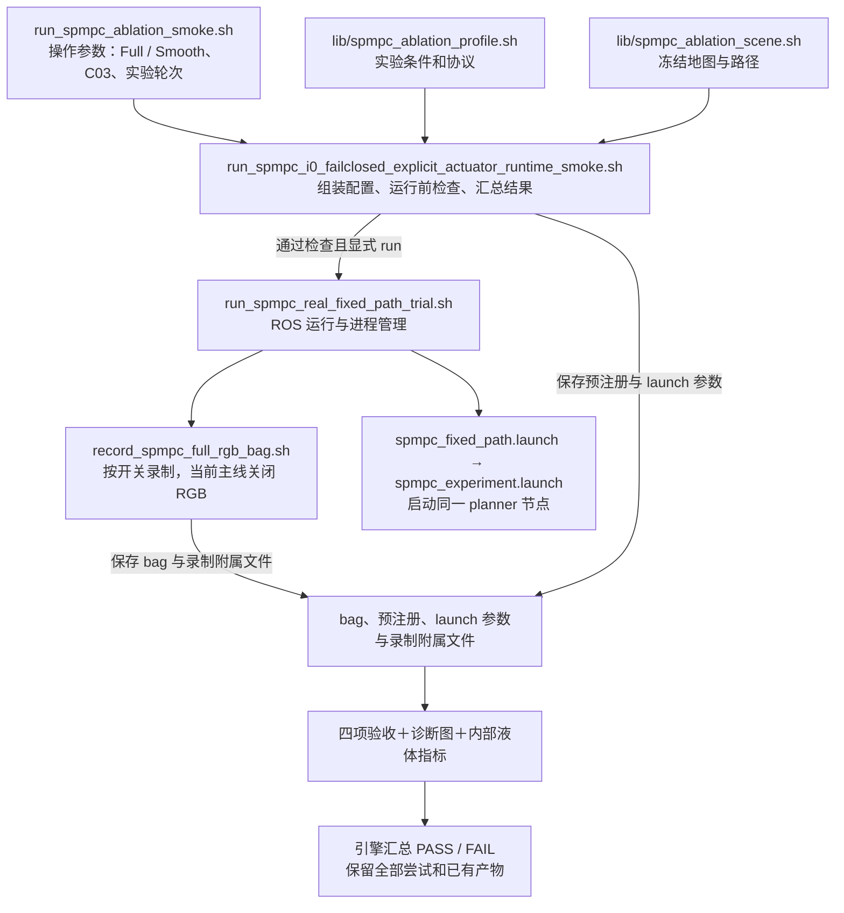

# SPMPC 主线代码梳理与兼容迁移方案

> 日期：2026-09-15。源码核对基线：`58cf95f8`。
> 状态：2026-09-15 按用户决定暂停实施，S0～S5 均不启动。保留本方案，当前先验证 [MPC 信息流框架与当前问题定位](../对比试验/解决问题的思路/MPC信息流框架与当前问题定位.md) 第 7 节的三曲线对照；控制代码、参数和生成 solver 保持当前主线。
> 范围：`src/scout_apps/control/spmpc_local_planner` 的运行入口、分析脚本、ROS 主节点及主线说明。

**目标：让当前 Full/Smooth 主线容易找到、信息流容易看懂、公共代码容易维护，同时保持已有控制行为、实验入口和结果判定。** 按小阶段推进，每阶段可以独立验收和回退。

当前问题的证据与原因分析继续维护在 [MPC 信息流框架与当前问题定位](../对比试验/解决问题的思路/MPC信息流框架与当前问题定位.md)。本文只规定怎样整理代码，不重复实验结论；延迟标定、液体模型、控制目标、硬约束和停车策略的调整另立行为变更。

## 1. 先确定哪些是冗余，哪些必须保留

| 核对结果 | 整理决定 |
| --- | --- |
| `spmpc_local_planner_ros.cpp` 共 3277 行，包含配置、状态构造、安全处理及大量诊断接线 | 按职责逐步抽取，保持调用顺序和状态所有权 |
| 当前执行器路径、旧 `delay_phase`、direct-omega 和 primitive 后端并存 | 先明确使用范围；旧后端继续保留，不能仅凭名称删除 |
| Full/Smooth 操作入口已经复用一个 runtime engine，部分 ABBA 入口也已有共享 engine | 在现有引擎上整理职责；不再复制一套“新主线”运行流程 |
| 分析入口之间互相导入哈希、消息解析、周期校验等公共函数 | 抽取公共模块，旧 CLI 和已有导入接口保留兼容转发 |
| 旧现状文档仍记录 6/10 维模型，当前模型已为 24/28 维 | 建立当前入口索引，旧文档明确日期和适用版本，保留原历史结论 |
| 初态前推、OCP 预测、实际命令重放都涉及执行器模型 | 三者处理的时间段、输入和离散方法不同，不能按“看起来重复”合并数值算法 |

共同状态时刻、实际发布命令历史、延迟 FIFO、IMU/odom 双监视器、安全门和周期审计均有明确作用。梳理应减少接线与维护重复，保留这些机制。代码冗余本身还不是当前预测偏差的已证实原因。

## 2. 本轮整理必须保护的主线契约

下表描述当前 C03 `internal-slosh` 普通 Full/Smooth 入口的生效配置。通用 launch 的默认值不完全相同，整理时不能用通用默认值覆盖实验入口。

| 项目 | 必须保持的行为 |
| --- | --- |
| 实验选择 | 显式指定 `--experiment internal-slosh --scene 20260907_c03`；旧 CLI 默认场景仍是 C02，不擅自改默认值 |
| 优化器与模型 | `continuous_mpcc_acados`＋`explicit_actuator`；30 Hz、N=60、约 2 秒；当前 schema 5 |
| 状态和积分 | Smooth 使用 24 维机器人/执行器模型，Full 使用 28 维含液体模型；每区间四子步 RK4，FIFO 与加速度记忆在周期末各更新一次 |
| 执行器 | 线/角 FIFO 为 5/10 步；现有 delay、tau、gain 保持原值；旧闭环补偿与显式执行器互斥校验保留 |
| 状态输入 | 保留 IMU 处理、odom/TF 车体状态、共同 epoch、命令历史前推及缺失数据拒绝；当前 IMU 来源故障策略保持 `fail_closed` |
| Full/Smooth 对照 | 两组通过同一 `B_slosh` 配置入口设置开关；普通条件仅 `slosh_enable` 和 `w_slosh` 不同。Smooth 保留共同硬 jerk，不能替换成关闭硬 jerk 的 `b0` 条件 |
| 普通实验设置 | `v_ref=0.2 m/s`、硬 jerk=0.6；Full 默认 `w_slosh=1`，Smooth 为 0；普通组液面硬约束关闭。已支持的 V3 参数/高度上限入口保持原限制 |
| 输出与停车 | 保持终点接管、求解失败与安全处理、命令发布及历史记录顺序；不新增后限幅，不改变既有停车控制权 |
| 数据接口 | ROS topic、消息字段/单位/时间语义、`cycle_id` 关联、报告 schema、缓存身份校验、失败原因和退出码保持兼容 |
| 运行与录制 | 默认 `--validate-only`；`--run` 语义、起点等待与显式跳过开关、清理停车、禁止覆盖旧输出及失败包保留机制保持原样 |

执行器状态尺寸与生成求解器 ABI 相连，依据 [actuator_model.h](../../../src/scout_apps/control/spmpc_local_planner/include/spmpc_local_planner/dynamics/actuator_model.h)。本轮不改模型方程、状态顺序或 codegen；不能为了整理目录而顺手重生成不同配置的 solver。

## 3. 当前主线脚本实际怎样连接



`--validate-only` 在启动运动前退出，但会核对冻结地图、路径、生成求解器和 ROS 环境，并运行相关软件检查；它不等于“任意电脑上只做 Bash 语法检查”。当前机器缺少实物端文件时，应报告缺少依赖，不能用放宽校验制造 PASS。

### 3.1 运行、配置和录包脚本

下表路径相对包内 [scripts 目录](../../../src/scout_apps/control/spmpc_local_planner/scripts/)。这些名称保留作为兼容接口。

| 脚本 | 用途与调用关系 | 整理方式 |
| --- | --- | --- |
| `run_spmpc_ablation_smoke.sh` | 当前操作入口；解析组别、场景、协议和显式覆盖参数，再交给 runtime engine；默认只检查 | 作为当前主线首选入口，补齐说明；保留所有已支持参数及错误处理 |
| `run_spmpc_i0_failclosed_explicit_actuator_runtime_smoke.sh` | 共享引擎；组装运行参数、校验模型/路径、登记实验、调用 runner，最后汇总验收及分析结果 | 后续分离配置、运行前检查、运行后汇总；保留这一公开路径 |
| `lib/spmpc_ablation_profile.sh` | 由引擎 `source`；把 Full/Smooth 等条件映射成模型开关、权重、协议 ID 和预期状态尺寸，区分 V2/V3 | 保持实验规则的集中位置；不当作独立可执行脚本 |
| `lib/spmpc_ablation_scene.sh` | 由引擎加载；提供冻结地图/路径及 SHA，更新场景标签和输出批次 | 与控制参数分开维护；搬路径前核对冻结文件身份 |
| `run_spmpc_real_fixed_path_trial.sh` | 通用实物单次 runner；管理 ROS 启动、路径重放、录制及退出清理；被当前引擎和其他实验复用 | 不直接改成仅支持 C03；保护进程所有权、退出停车和参数透传 |
| `record_spmpc_full_rgb_bag.sh` | 通用 recorder；按开关记录 topic 和附属文件；文件名含 RGB，当前内部主线仍调用它并关闭图像流 | 不因名字删除；保留当前 topic 集和启动/停止行为 |
| `run_spmpc_full_da_smoke.sh`、`run_spmpc_weight_smoke.sh` | 共享 runtime engine 的其他开发入口，分别用于全时域加速度变化诊断和权重 smoke | 标为专项开发；不把它们的默认配置当成当前 Full/Smooth 基线 |
| `lib/run_spmpc_i0_failclosed_fixed_abba_engine.sh` | 历史及专项 ABBA 的另一个共享引擎，由不同 profile 包装脚本调用 | 第一轮保持独立；以后只有确认相同职责和行为后才抽公共部分 |

尤其注意：`run_spmpc_i0_failclosed_fixed_abba_trial.sh`、`run_spmpc_i0_failclosed_explicit_actuator_abba_trial.sh`、`run_spmpc_i0_failclosed_explicit_actuator_ws1_wa03_abba_trial.sh` 多为薄包装，承担不同协议身份；`run_spmpc_ws1_wa03_rgb_abba.sh` 再提供短操作入口。它们的数量不等于重复实现数量。

### 3.2 运行后验收和指标脚本

| 脚本，位于 `scripts/analysis/` | 负责回答的问题 | 必须保留的边界 |
| --- | --- | --- |
| `validate_i0_failclosed_fixed_abba_bag.py` | observer、执行器、求解器、共同 epoch 和命令诊断是否符合预注册 | 名称虽带 ABBA，当前主线仍使用；不能归档移走 |
| `validate_explicit_actuator_runtime_smoke.py` | planner 收到的 odom 是否断续、30 Hz 回调是否超时，以及启用的连续性指标是否通过 | 不用模型验收替代时序验收，不放宽原阈值 |
| `validate_spmpc_ablation_smoke.py` | schema 5、液体/NoState/jerk 开关、终点接管与指定高度限制是否符合条件 | 保留组间公平性和消融语义 |
| `validate_spmpc_comparison_recording.py` | IMU/odom/Tracker0 等公共证据及指定图像录制策略是否完整 | 保持传感器原生时间戳口径；录制通过不代表效果通过 |
| `analyze_internal_slosh_pair.py` | 读取六个小话题并缓存；形成单包内部指标，或比较指定报告 | 保留四项验收依赖、任务/中段/到达后窗口和 IMU 主评价规则 |
| `freeze_internal_slosh_evaluation.py` | 固定候选、主评价监视器和 Full/Smooth 顺序，校验源码/二进制/评价链身份 | 这是实验身份管理工具，不能作为普通重复哈希代码整体删掉 |
| `plot_spmpc_full_da_diagnostics.py` | 按周期和有效时间生成固定诊断图，帮助解释命令、预测与运动 | 失败包仍可出图；图片存在不等于验收通过 |
| `validate_mocap_s_path.py`、`validate_mocap_field_map.py` | 运行前检查冻结路径/地图的结构及身份 | 继续由现有运行前流程调用 |

前四项各自检查不同问题，第一轮保持四份报告及汇总逻辑。可共享底层读取函数，不能先合并成一个宽松的 PASS。

### 3.3 定位 MPC 问题的离线脚本

| 脚本，位于 `scripts/analysis/` | 输入和用途 | 保留或归类方式 |
| --- | --- | --- |
| `analyze_actuator_excitation_consistency.py`＋`actuator_excitation_consistency_core.py` | 读取质量 PASS 的 Full/IMU 内部报告和缓存；对照原 OCP、实际发布命令重放、处理后 IMU，输出 JSON/CSV/图 | 当前定位工具；不拟合参数，不发布命令 |
| `analyze_ocp_imu_forecast.py` | 对照记录的 OCP 与随后 IMU 驱动液体模型状态；也提供 horizon 加载和周期校验函数 | 保留 CLI；公共读取/校验逐步移到公共模块，分析算法留在此处 |
| `analyze_robot_state_prediction.py`＋`robot_state_prediction_core.py` | 检查机器人初态和执行器前推；core 的命令支持区间与重放函数被三曲线工具复用 | 保留可复用数值核心，不复制重放算法 |
| `analyze_exact_ocp_cost.py` | 结合冻结的生成 C 函数，对记录轨迹重建 OCP 各项代价 | 保留模型/生成文件身份；结果不能直接解释成权重的控制因果效应 |
| `analyze_same_bag_actuator_delay.py`＋`same_bag_delay_core.py` | 使用同包真实命令、NOKOV/odom/IMU 检查延迟、响应及跨包验证 | 执行器标定分析分支；依赖合适实物数据，不自动写控制参数 |
| `analyze_mocap_execution_chain.py` | 分开检查计划覆盖、软件改命令和动捕响应；被其他分析脚本导入部分公共函数 | 保留入口，公共统计/几何函数按实际复用关系抽取 |
| `analyze_horizon_future_liquid_alignment.py`、`summarize_horizon_future_liquid_alignment.py` | G3R2 等带原生 RGB 数据的预测/监视器对齐和汇总 | 历史/专项诊断；与当前无 RGB 三曲线分析的数据条件不同 |
| `analyze_slosh_nowcast_same_bag.py` | 在支持的旧包中，将 O0/I0/I1/L22 与冻结在线 RGB 比较 | 保留复现入口；I1/L22 诊断存在不代表它们在当前闭环中接管输入 |

新增三曲线工具已在当前工作区实现，相关 13 项合成测试和 25 项既有回归曾通过；尚没有本轮新实物结果。工具、测试和相关文档随本次提交保存；以后建立整理基线时需包含这些成果，不能只检出 `58cf95f8` 后视为完整工作成果。

### 3.4 模型生成、测试和其他历史入口

- `scripts/acados/generate_spmpc_acados.py` 负责组装并生成求解器；同目录 `spmpc_acados_model.py`、`spmpc_acados_cost.py`、`spmpc_acados_constraints.py` 分别提供模型、代价和约束。结构整理第一轮不移动、不重写这四个文件。
- `scripts/tests/` 是 Python/脚本契约回归，`test/` 是 C++ 模块回归。保留有意义的行为断言；文件拆分后可调整测试定位，不能靠删除失败测试完成整理。
- `run_spmpc_g2*`、`run_spmpc_g3*`、`run_spmpc_g4*`、`run_spmpc_g5*`、`run_spmpc_short_horizon_matched_trial.sh` 等按原协议分组索引；历史运行需要匹配当时源码和生成产物，不承诺所有旧协议都能使用当前 solver。
- `run_continuous_real.sh`、`phase3_smoke.sh`、`phase4_fixed_path_run.sh`、`compare_b0_bslosh_smoke.sh` 等标为历史或专项 smoke；外部 baseline 和建图/路径准备脚本单独列出用途。
- `validate_spmpc_formal_freeze.py` 等正式协议工具维持自己的版本边界，不拿旧协议 PASS 放行当前其他协议。

第一轮“归档”指调整索引和适用范围说明，文件仍在原位置。真正移动/删除放到后续独立阶段，先查 shell 调用、Python 导入、动态加载、路径推导、测试、安装和 SHA 清单的完整依赖。

### 3.5 整理后的脚本说明标准

每个本轮涉及的脚本，在文件头或 `--help` 中说明：用途、调用者、主要输入、输出产物、是否启动 ROS/发布命令，以及失败退出的含义。运行脚本另外标明默认检查模式和所需现场文件；库文件明确“由谁导入/source，不单独运行”；历史包装脚本标明对应协议和实际引擎。

`scripts/README.md` 负责入口导航和使用边界，具体参数以脚本 `--help` 与 profile 定义为准，避免多份文档重复维护完整参数表。新抽取的内部函数解释输入/输出和副作用，优先说明时间戳、状态所有权、文件身份等容易误用的约定。

## 4. 目标结构：沿现有模块继续拆职责

### 4.1 分析代码

拟新增 `scripts/analysis/common/`，只放已有重复或跨入口复用的基础能力。以下为候选名称，尚未创建：

| 候选文件 | 负责什么 | 不应混入什么 |
| --- | --- | --- |
| `__init__.py` | 明确公共包入口 | 导入时读取 bag、启动 ROS 或写文件 |
| `bag_io.py` | 文件身份、消息标量化、已支持的缓存读取；保留各原有身份判定规则 | 为不同 schema 猜默认值、用 bag 接收时间替代测量时间 |
| `cycle_contract.py` | 按 `cycle_id` 关联预测/快照/审计，校验时间、状态尺寸与数据完整性 | 液体指标、执行器拟合或放宽无效窗口判断 |

先迁移三曲线与预测诊断间已共享的函数；`robot_state_prediction_core.py` 等数值核心继续保留。旧模块导出兼容函数，避免已有 CLI、测试和外部使用者因导入路径变化失效。发现不同脚本规则不同，应保留显式策略参数或分开实现，先不强行统一。

公共函数移动后必须同步检查 `dependencies_sha256`、缓存身份和 `freeze_internal_slosh_evaluation.py` 的链身份范围。凡被验收/评价工具调用的新公共文件，都要纳入实际依赖记录，不能留下“包装脚本 SHA 未变、真实实现已变化”的盲区。包当前通过 CMake 安装整个 `scripts` 目录，仍需验证安装后导入和路径查找。

### 4.2 ROS 主节点

复用已有 `ProcessedImuPipeline`、observer bank/selector、`CommandHistoryBuffer`、`ExecutionStatePredictor`、`SpmpcProblem`、`TerminalController` 和 `DiagnosticsPublisher`。按下列顺序抽取，不另建一套并行控制器：

| 顺序 | 从 ROS 主文件抽出的职责 | 候选落点与保护要求 |
| --- | --- | --- |
| 1 | 参数读取、默认值、覆盖与校验 | `ros/planner_config_loader.h/.cpp`；先移动现有逻辑，保持参数优先级和非法配置处理 |
| 2 | observer/comparison/effective-config 等诊断组装 | 优先整理到已有 `DiagnosticsPublisher` 附近；节点提供已取得的数据快照，保持时间戳和发布位置 |
| 3 | 共同 epoch、车体状态重建、前推结果到 `SolverInput` 的接线 | 候选 `ros/solver_input_builder.h/.cpp`；继续调用现有 predictor/history，保留错误状态和拒绝路径 |
| 4 | 主循环阅读结构 | 让主节点按“取快照 → 构造初态 → 调用 problem → 安全处理 → 发布及审计”阅读；终点接管仍由现有 problem/controller 管理 |

第一次抽取尽量保留变量类型、运算顺序、取时刻位置、锁范围、回调队列和对象生命周期。不能因为拆文件顺手改变 odom/IMU 接纳顺序、减少诊断频率或提前/延后命令历史记录。`ExecutionStatePredictor` 的原始状态到当前时刻前推，与 OCP 当前时刻到未来的预测仍分别实现。

本轮不同时拆 CMake 库目标、不改求解器 factory 行为、不移除旧后端。需要进行这些变化时，另做有独立回归的小阶段。

## 5. 分阶段实施与交付

| 阶段 | 具体工作 | 完成条件 |
| --- | --- | --- |
| S0 保存基线 | 记录当前 SHA、工作区差异及已完成诊断文件；保存现有生成产物身份、Full/Smooth launch 展开值和可用报告；后续重构使用独立工作区与独立构建目录 | 原实验工作区可继续运行；明确哪些材料已有、哪些缺失，不覆盖未提交成果 |
| S1 收拢入口说明 | 更新包 README 的当前主线快照；`scripts/README.md` 按当前运行、离线诊断、专项/历史分组；旧现状文档加适用版本及新入口链接 | 用户从一个入口索引能找到运行、分析和历史复现；旧脚本路径全部保留 |
| S2 抽分析公共能力 | 按第 4.1 节逐个迁移已有函数、保留旧导入接口、更新依赖身份清单 | 相同输入的指标、窗口、拒绝原因和退出码一致；产物身份差异如实记录 |
| S3 整理运行引擎 | 继续使用现有 CLI/profile/scene/engine；将配置、运行前检查和运行后汇总拆为清楚的内部函数，暂不扩充用户命令集 | Full/Smooth/V3 生效参数与旧入口一致；启动、退出清理、失败保留和四项验收行为通过回归 |
| S4 拆 ROS 职责 | 按配置 → 诊断 → 初态构造的顺序独立修改和验证 | 构建和相关 C++ 回归通过；相同状态/命令序列的数值与故障处理一致，并核对运行时序 |
| S5 可选历史隔离 | 有完整依赖清单后，再考虑目录移动、兼容包装或可选构建旧后端 | 当前入口及保留复现入口均可定位到正确实现；不以删除历史文件数量作为验收目标 |

若以后恢复整理，推荐第一批只做 S0～S2，S3、S4 分开推进。当前按用户决定暂停全部整理阶段，先使用已有分析工具验证 MPC 信息流。

## 6. 怎样证明没有破坏主线

### 6.1 检查按改动范围执行

| 修改范围 | 对应验证 |
| --- | --- |
| 仅文档/索引 | 检查文件链接、命令拼写、当前与历史版本标注；不运行实物流程 |
| 分析公共模块 | 先运行 `test_actuator_excitation_consistency`、`test_ocp_imu_forecast`、`test_robot_state_prediction`；若触及内部指标、评价锁、精确 cost 或延迟分析，再运行其直接相关测试 |
| CLI/profile/运行引擎 | `test_spmpc_ablation_smoke`、`test_spmpc_comparison_recording`、`test_explicit_actuator_runtime_smoke` 及直接受影响的脚本测试；检查参数透传、失败退出、输出保留；在冻结文件齐全的环境展开 Full/Smooth/V3 launch 参数比较 |
| ROS 配置/状态/诊断拆分 | 按影响范围运行 `test_variant_config`、`test_processed_imu_pipeline`、observer、command history、execution predictor、control cycle、terminal、speed safety 和 replay diagnostics 等 C++ 回归；按仓库既有方式编译并确认真实 acados 后端启用 |
| 实验机采用新运行代码前 | 先完成软件回归及不运动的配置校验，再由操作者安排同条件运行，核对掉帧、回调耗时、命令审计和停车；软件通过不冒充实物通过 |

现有三曲线及相关回归可在包内 `scripts/tests/` 目录运行：

```bash
python3 -m unittest -v \
  test_actuator_excitation_consistency \
  test_ocp_imu_forecast \
  test_robot_state_prediction
```

冻结文件和 ROS 环境齐全时，使用现有入口检查普通 Full 与 Smooth；以下命令均保持 `--validate-only`，本次编写方案未执行它们：

```bash
bash src/scout_apps/control/spmpc_local_planner/scripts/run_spmpc_ablation_smoke.sh \
  --experiment internal-slosh --scene 20260907_c03 \
  --condition full --trial-id refactor_full --phase screening --validate-only

bash src/scout_apps/control/spmpc_local_planner/scripts/run_spmpc_ablation_smoke.sh \
  --experiment internal-slosh --scene 20260907_c03 \
  --condition smooth --trial-id refactor_smooth --phase screening --validate-only
```

### 6.2 比较什么

- **配置**：分别比较重构前后同一组的全部生效控制参数；Full 与 Smooth 之间再核对预期的液体开关/权重差异。V3、显式跳过起点和非法组合分别验证，不能只测默认 Full。
- **离线输出**：同一份输入保留原报告，另存新结果；比较样本/周期集合、窗口边界、指标、失败原因、schema 和退出码。路径、源码 SHA 等身份字段单独解释，不要求重构后哈希仍相同。
- **控制行为**：对确定性输入，比较初态、延迟队列、命令历史、首拍输出和安全/停车状态。优先精确比较；必要的浮点容差须事先说明，不按新结果放宽。若缺少覆盖某条接线的测试，再补该行为的最小回归。
- **时间行为**：ROS 文件拆分也可能影响锁持有与回调耗时，保留 odom/IMU 接纳及 30 Hz 时序检查。只跑编译不能证明运行性能一致。

模型参数调整需要合适的实物数据；文档、公共代码和等行为拆分可以先用已有测试、合成输入及已有报告进行。暂时缺少旧 bag 时，记录同包比较未完成，不要求为写方案重新录包，也不宣称等价性已完全验证。

## 7. 实验身份与回退

`freeze_internal_slosh_evaluation.py` 将模型/滤波源码、构建产物、生成 solver 和评价代码纳入身份检查。即使只搬动函数，源码或二进制 SHA 也可能改变，旧评价锁会拒绝新链。这是已有实验追溯机制，不能删除校验或修改旧锁来绕过。

每阶段保存独立变更、验证结果和基线到新版本的文件映射。原工作区及原构建产物继续支持原实验；新工作区需要核对 ROS 包解析、动态库路径和生成 solver，避免新源码混用旧二进制。采用新链做后续实验时，按原规则建立新身份；若创建新评价锁要求新链的候选报告，就依原流程取得报告，旧数据仍以原身份归档。

发现回归时，停止采用该阶段，切回保存的完整版本及对应二进制/生成产物，不只回退单个 `.cpp` 或 YAML。已有 bag、报告、锁、失败尝试以及用户其他工作区文件均保留；不使用清空工作区的方式完成整理。

本方案的验收结果应是：当前命令继续可用、每个脚本职责明确、主循环信息流清楚、行为和实验身份可追溯。代码行数下降作为参考，不能替代这些检查。
