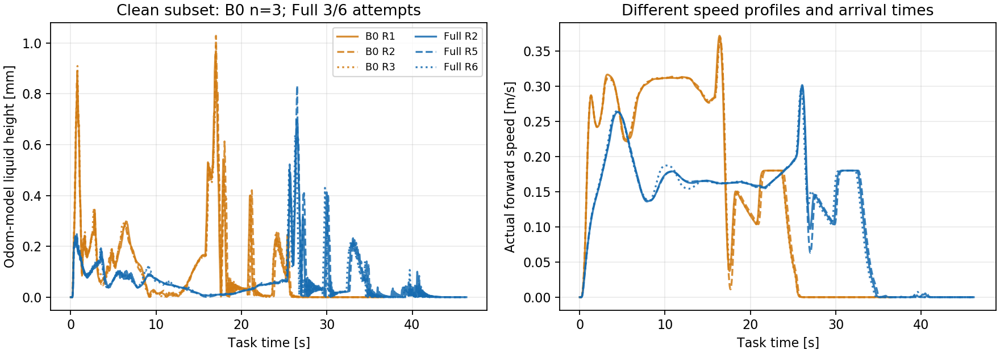

# B0 与 Full 无异常样本对比（2026-09-18）

**已按用户要求补齐 Full 三次无异常完整运行。** B0 保留原三次无异常运行；Full 保留 R2, R5, R6。两组用于展示的样本量均为 **n=3**。

Full 是在累计 **6 次尝试中筛选出 3 次**；本次采用“取得两次新的无异常运行即停止”的规则。筛选单位为完整运行，未裁去尖峰或停顿，也没有以液面高低作为选择条件。全部未选中尝试继续归档。

## 三次 Full 完整运行

| 保留运行 | 到点时间 | 模型液面峰值 | 运输阶段液面 P95 | 验收 |
| --- | ---: | ---: | ---: | --- |
| Full R2 | 41.167 s | 0.698 mm | 0.210 mm | 无异常、45 s 内到点 |
| Full R5 | 41.462 s | 0.831 mm | 0.220 mm | 无异常、45 s 内到点 |
| Full R6 | 41.024 s | 0.638 mm | 0.200 mm | 无异常、45 s 内到点 |

## 与 B0 三次无异常运行比较

| 指标 | B0 三次均值 | Full 三次均值 | Full 相对变化 |
| --- | ---: | ---: | ---: |
| 模型液面峰值 | 0.993 mm | 0.722 mm | 降低 27.3% |
| 运输阶段液面 P95 | 0.484 mm | 0.210 mm | 降低 56.6% |
| 运输阶段液面 RMS | 0.204 mm | 0.109 mm | 降低 46.3% |
| 到点时间 | 31.493 s | 41.218 s | 增加 30.9% |

本筛选集的 Full 模型液面表现较低，耗时更长。两种方法的参考路线和速度过程仍不同，这是无异常运行条件下的比较；**3/6 的完整尝试记录另行保留，不能把本表当作未经筛选的成功率或稳定性结果。**

## 样本、运行物和统计口径

- 控制代码对应 `c82a09db`，本次未调参、未修改控制逻辑。默认仍为 N40、30 Hz、Full rate=0.0001，同一任务和可行诊断计划、辨识执行器适配。
- 原 `/tmp/scout_handoff_20260916_6XlFYy/ros_devel` 已不存在。本次将 R2 归档的节点/控制库恢复到 `/tmp/scout_full_clean3_overlay_20260918`；两者及 B0/slosh 生成库均与 R2 hash 相同。共享 `slosh_models` 使用现有库，源码最近变更为 7 月 12 日，库编译于 8 月 3 日；其本次 hash 另存。未覆盖工作区现有编译产物。
- 补跑逐次 fresh ROS/Gazebo，源配置和运行物前后 hash 一致，live 参数与 R2 一致，端口在各次前后均关闭，bag 正常闭合。
- 合格标准不变：45 s 内通过；只允许初始化、等待 odom/路线、正常 OCP 接纳、正常末端排空和到点状态。其他状态一律排除；包括已到点但中途有预算停车的运行。
- 峰值统计到首次到点后 5 s；P95/RMS 统计任务开始至首次到点。高度为 odom 模型估算，`formal=false`。不使用到点后静止等待拉低 P95。

[六条保留结果 CSV](./20260918_B0与Full无异常样本/selected_results.csv) · [筛选清单、排除原因、均值/标准差和来源 hash](./20260918_B0与Full无异常样本/selected_results.json) · [生成脚本](./20260918_B0与Full无异常样本/generate.py) · [原三组及后续补跑记录](./20260918_B0与Full三组重复对比.md)

补跑根目录：`/data/a/scout_sim_replacement/results/20260918_full_clean3_supplement/`。`manifest.json` 保存全部尝试与停止规则，`isolated_runtime.json` 保存运行物恢复说明；各例完整 bag、参数、状态、时间序列和指标均已保留。
