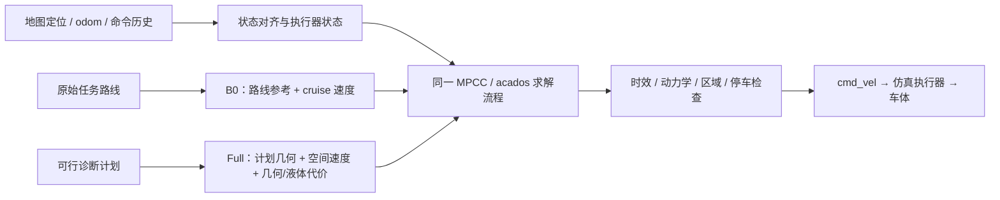

# 2026-09-17 B0 与 Full 框架差异及首弯停滞定位

**当前 Full 不等于“B0 加防晃”：它同时改变了参考几何、速度来源和几何代价。**
本轮对齐实际运行参数，并用两次首弯停滞的原始状态做离线对照。
结果将重点收窄到 Full 的低速计划参考与转弯代价组合；关闭防晃、增加迭代均没有解除基线停滞。
最后约 43.7 s 的求解失败，则可明确解释为预测窗口触及 45 s 硬截止后，终点约束已不可行。

本轮没有新开 Gazebo、改控制参数或重新编译。当前代码基于 `af0284ec`，
仍保留 `w_contour=1.0`、全程终点吸引 0、末端权重 2.0、`w_progress=0.2`。

## 一、先区分模式名称与实际框架

当前录像里的 **B0 = `raw_mpcc` profile + `B0` variant**；
**Full = `planned_slosh` profile + `B_slosh` variant**，不是 `B_ours`。
`planned_mpcc` 同样使用名为 B0 的 variant，但参考和几何代价属于计划跟踪框架，
不能仅凭 `planner_variant=B0` 就把它当作已成功的 raw 基线。

| 环节 | 已到点的 B0 | 最近停滞的 Full |
|---|---|---|
| ROS 入口 | `trajectory_mpcc.launch` | 相同 |
| 位置与执行反馈 | map TF、odom、命令历史对齐 | 相同 |
| 参考几何 | 绿色原始路线 → spline/局部拟合 | 蓝色诊断计划的状态轨迹 → 按进度采样、局部拟合 |
| 参考速度 | cruise 0.25 m/s，按曲率限速 | 计划的 `v(s)`、`v_s(s)`；首弯处约 0.1165 m/s |
| 进度模式 | 原始路线投影 | 投影到计划；按进度查计划时间，不按当前任务时间追赶 |
| 基础代价 | 贴线、lag、速度、进度、控制及平滑 | 相同种类；目前主要基础权重已对齐 |
| 额外几何代价 | 关闭 | 曲率 0.05、曲率变化 0.01，低速正则尺度 0.05 m/s |
| 液体模型/代价 | 关闭 | 增加 4 个液体状态，`w_slosh=5.0` |
| 液体硬约束 | 关闭 | 本批同样关闭；不是液面超限强制停车 |
| 状态/控制维数 | 24 / 3 | 28 / 3 |
| 执行模型 | 实际/命令分离，固定 5/10 拍 FIFO、tau/gain | 相同；两者仿真均使用 identified actuator |
| 区域和运动限制 | 房间区域、速度/加速度/jerk、队列限制 | 相同，另有计划插值有效区间的进度约束 |
| 求解与验收 | acados SQP-RTI、预算、时效和动力学检查 | 相同流程 |
| 终点规则 | 末端代价、停车门限、45 s 任务截止 | 相同规则；Full 停滞后撞上硬截止 |
| 本批实际 N | 60，约 2 s | 40，约 1.33 s；测试结束后恢复工作区默认 60 |

两者共享的主链路：

Full 的计划身份仍为 `REPLAYED_FEASIBLE_SEED_NOT_REOPTIMIZED`，不是本批重新优化的计划。
此外，仓库中尚未调整的 `planned_mpcc` 仍含旧的贴线权重 0.02、全程终点权重 2.0；
不能直接用它与当前 Full 做“只差防晃”的对照。

## 二、首弯停滞时到底差在哪里

从 B0 成功录像与两次 Full bag 抽取参考参数及实际状态：

| 样本 | B0 首弯附近 | Full，进度奖励 0.2 | Full，进度奖励 1.0 |
|---|---:|---:|---:|
| 任务时间 | 5.767 s | 20.001 s | 20.000 s |
| 实际速度 | 0.2560 m/s | 约 0 | 0.00235 m/s |
| 与局部参考切线的航向误差 | 3.28° | 46.60° | 18.60° |
| 实际消费的参考速度 | cruise 0.25，另做曲率限速 | 0.11651 m/s | 0.11692 m/s |

Full 此时的位置离计划不远，但车头方向已偏离，继续前进会增加贴线误差。
在线曲率/曲率变化惩罚又不鼓励低速转向，容易形成“少走、少转”的局部停滞解。
例如曲率变化项在 `v≈0`、实际线加速度≈0 时，对实际角加速度的未除 N 系数约为
`0.01 / (0.05³ × 0.8) = 100`；B0 没有这一项。
这解释的是低速转向受到强惩罚的机制，不代表仅关闭该项已经验证能跑通。

基线 Full 在任务 20 s 时仍使用计划约 7.863 s 对应的参考。
progress 模式本身不会因为落后任务时钟就自动改为追赶速度；0.25 的 YAML `v_ref`
也不会覆盖计划的空间速度，实际代价使用 `speed_references()` 中的计划值。

停滞样本的插值进度边界余量约 0.297 m，区域余量超过 2.3 m，
`stop_active=0`、`task_goal_active=0`、液体上界处于禁用值。
因此这些样本不是因为撞到区域边界、插值边界、终点停车或液体硬上限而必须停车。

## 三、同一状态的离线对照

分别固定 `full_tracking_fix_video` 的 cycle 616 和 `full_progress1_video` 的 cycle 614，
装入本批归档的同一 N40 求解器、原始 x0、命令/FIFO、阶段参数及 primal 初值。
保留全部原运动/区域/jerk 约束，只按表格改变代价参数，观察同一输入下的优化结果。

以下是 **20 次离线 RTI 后、预测 1 秒处的车速**，不是新仿真实际车速：

| 对照 | 原进度奖励 0.2 的停滞状态 | 进度奖励 1.0 的爬行状态 |
|---|---:|---:|
| 原 Full | 0.0093 m/s | 0.0323 m/s |
| 仅关闭液体代价 | 0.0101 | 0.0352 |
| 仅关闭额外几何代价 | 0.0105 | 0.0953 |
| 仅将各阶段速度参考换为 0.25 m/s | 0.0655 | 0.1342 |
| 0.25 m/s 速度参考 + 关闭额外几何代价，保留液体 | **0.1005** | **0.2039** |

同时检查了曲率幅值与变化项、保持原值但冻结空间速度导数的对照：
仅冻结空间速度导数改善有限，不能把问题简单归咎于分段插值导数。
仅关闭曲率变化项，比仅关闭曲率幅值项更有助于转向，但也未解除基线低速。
基线样本的首条转向加速度在原目标下约 `-0.000054 rad/s²`，
关闭额外几何代价后约 `-0.1364 rad/s²`；组合对照达到允许的 `-1.2 rad/s²`，
说明这些几何代价确实显著压制了该状态下的航向纠正。

**增加迭代并没有自动解决原 Full 的停滞。** 原目标从 1 次到 20 次的速度几乎不变，
20 次后的 stationarity 残差约为 `5.9e-15` / `1.1e-12`，属于当前初值附近的收敛低速解。
线上确实只按可行性提前退出，未检查最优性；但这两处停滞不能据此直接归为“迭代次数不足”。

证据边界：快照不含 dual/internal memory，首轮重求解与录制 horizon 的最大状态差分别为
`4.30e-5`、`3.01e-4`，不是逐位复现。各项代价重构与 solver 总代价差小于 `5e-16`。
离线取消墙钟预算是为了区分算不完和目标本身的低速解，不能把 20 次离线结果当作 30 Hz
可直接上线，也没有证明全局最优或闭环已经成功。

## 四、最后的 ACADOS 4 失败是硬截止造成的不可行

`OcpPlanningAdapter::prepare()` 在 `task_elapsed + k*dt >= deadline` 时启用该阶段的
硬到点约束，包括位置/朝向/低速，并要求命令和 FIFO 状态清零。

| 运行 | 最后正常周期时间 | 首次失败时间 | 激活硬到点的阶段 | 当时距终点 |
|---|---:|---:|---:|---:|
| 进度奖励 0.2 | 43.666 s | 43.700 s | 40 | 3.9744 m |
| 进度奖励 1.0 | 43.633 s | 43.667 s | 40 | 3.9046 m |

预测窗口只有 1.333 s，即使忽略加速、转弯和延迟，按最高速度 0.8 m/s 也只能走
**1.0667 m**，不可能进入约 4 m 外目标的 5 cm 容差。此时约束已经确定不可行，
与 `ACADOS_SOLVE_FAILED_4` 出现的周期完全对应。

因此链条是：**首弯低速停滞 → 任务进度落后 → 预测窗口触及硬截止 → OCP 不可行 → 停车/超时**。
它不是“计算资源在 43.7 s 突然不足”。不应靠取消硬截止来掩盖前面的停滞。

## 五、结论与下一步范围

已经排除“主要是防晃计算量导致首弯停车”的简单解释；本次两状态的防晃代价消融无明显改善，
增加迭代同样无效。重点应放在 **Full 的计划速度 + 在线几何惩罚 + 已偏离的航向** 如何形成低速解，
而不是继续单独增大进度奖励。N40 缩短前视的影响尚未单独隔离。

最清楚的下一次闭环对照是 **沿用 B0 的参考/速度/几何代价框架，仅加入 Full 的液体状态和代价**，
其余控制频率、N、执行模型和安全检查固定；先确认液体机制本身能否沿路线行驶，
再逐项恢复计划参考。当前离线的组合对照仍保留蓝色计划几何，并不等同于这一闭环模式。
本轮没有擅自替换模式或追加实车/仿真运行。

## 证据与代码入口

归档：`/data/a/scout_sim_replacement/results/20260917_b0_full_framework_audit/`。
包含 `live_parameter_diff.json`、`reference_comparison.json`、`constraint_review.json`、
`deadline_failure.json`、三组 `offline_*comparison.json`、对应脚本/日志和 `summary.json`。
归档求解器通过独立 JSON 指向 N40 库，`generate=False/build=False`，未替换当前 N60 运行库。

- [raw_mpcc.yaml](/home/a/scout_ws/src/scout_apps/control/spmpc_local_planner/config/experiments/trajectory_mpcc/raw_mpcc.yaml)
  与 [planned_slosh.yaml](/home/a/scout_ws/src/scout_apps/control/spmpc_local_planner/config/experiments/trajectory_mpcc/planned_slosh.yaml)：两种模式配置。
- [horizon_reference_builder.cpp](/home/a/scout_ws/src/scout_apps/control/spmpc_local_planner/src/reference/horizon_reference_builder.cpp:31)：按空间进度或时间选参考。
- [planning_terms.py](/home/a/scout_ws/src/scout_apps/control/spmpc_local_planner/scripts/acados/planning_terms.py:45)：速度、曲率代价和区域/参考/终点约束。
- [ocp_planning_adapter.cpp](/home/a/scout_ws/src/scout_apps/control/spmpc_local_planner/src/planning/ocp_planning_adapter.cpp:172)：硬截止激活与末端代价。
- [continuous_mpcc_solver_acados.cpp](/home/a/scout_ws/src/scout_apps/control/spmpc_local_planner/src/solvers/continuous_mpcc_solver_acados.cpp:1135)：RTI 可行性提前退出。

分析为开发诊断，`formal=false`。只提交分析文档，不 push。
