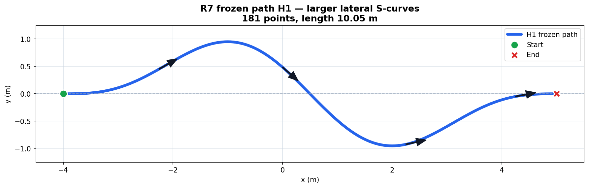
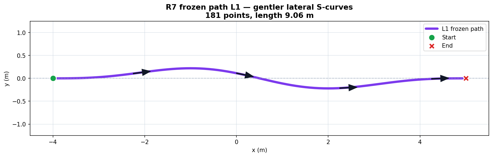

# 20260804 SIM-MECHANISM R7：40/64/88 结果分析与正式实物 S-MPCC 流程对照

日期：2026-08-04  
仿真 release：`SIM-MECHANISM-40-64-88-R7`  
仿真协议：`SMPCC-SIM-MECHANISM-40-64-88-v3`  
范围：`SIMULATION_MECHANISM_ONLY`  
状态：88 个冻结 planned rows 已闭合；`87` 个 method success、`1` 个 terminal method failure。

> [!danger] 结论边界
> 本文记录的是**独立、可复核的仿真机制实验**，不是“对齐实物”的正式实验，也不替代实物 primary。R7 的 release 标记为 `formal=true`，但其 formal scope 仅为 `SIMULATION_MECHANISM_ONLY`：`physical_alignment=false`、`physical_primary=null`、`physical_primary_eligible=false`、`original_aligned_protocol_eligible=false`。
>
> 因而它可以作为论文中独立的 simulation/mechanism experiment，支撑代码路径、固定条件、机制 trade-off 与有限的仿真条件迁移描述；不能用于“真实液面 efficacy 已验证”“与实物结果合并配对”或 physical-primary 结论。

---

## 1. 本次仿真的身份、证据与数据位置

| 项目 | 固定值 |
| --- | --- |
| release hash | `e7dcbeab9797561265be2836f683d663f28ec6b4dc9bcb3486e7310cf4ada2bf` |
| freeze hash | `9a2a1cf43cc12fbb6fa1309f3102254bdddfbfd383af5fa547f9fbf846eb316f` |
| master hash | `c215f19fd03c4831ac7cc316c7b1188c62a6f3a61c40eefc90ddc3966414b37f` |
| dataset-index file SHA-256 | `c875301f5cb307a11fc3c0dca668bbfb82cb28906c0ee4569572b13a77113458` |
| 最终 ledger head | `a08cb36365ff533b278d41b0466bcc784437b8b83cb8d65fd7b11389e2515ac5` |
| analysis-manifest file SHA-256 | `b4f05e1dc4353309ad5503d4cca7999ee06ce4efaf86cf68eec6cb56d1fa7460` |

原始大数据仅保留在：

```text
/data/a/scout_sim_replacement/SMPCC-SIM-MECHANISM-40-64-88-R7/
```

人读报告、CSV、图和分析清单在：

```text
/data/a/Obsidian/vaults/StudyVault/30-Projects/MPC/
规控一体的实验记录/仿真实验/
20260804_SIM-MECHANISM-R7_40_64_88正式矩阵结果/
```

其中的主入口为：

- `01_R7_40_64_88结果与分析.md`
- `analysis_manifest.json`
- `evidence_inventory.json`
- `metrics_per_planned_row.csv`
- `metrics_by_stage_condition.csv`
- `paired_differences_per_block.csv`
- `paired_contrasts.csv`

分析器先调用 canonical runner 的 release admission/ledger 校验，后只读闭合 bag；不从 `/spmpc/status` 或几何阈值重新推断成功与失败。所有 88 个 manifest、88 个闭合 bag、append-only hash chain 和 16 个 analysis-manifest 声明输出已复核一致。自动测试为 `279/279 PASS`。

---

## 2. 矩阵闭合与固定分母

| 累计边界 | N_plan | N_attempt | N_method_success | N_method_failure | N_continuous_eligible |
| --- | ---: | ---: | ---: | ---: | ---: |
| `SIM-S1_CORE`：H1/C1，5×8 | 40 | 40 | 40 | 0 | 40 |
| 加 `SIM-S2A_SELECTIVITY`：L1/C1，3×8 | 64 | 64 | 64 | 0 | 64 |
| 加 `SIM-S2B_TRANSFER`：H1/C2，3×8 | 88 | 88 | 87 | 1 | 87 |

没有 acquisition failure，也没有 retry。每个 planned row 只消费一次，统计单位始终是 planned row，而不是 Gazebo step、topic message 或 attempt 内的控制周期。

唯一终态方法失败为：

```text
planned row  = SIM-S2B_TRANSFER_H1_C2_FixedProfile_b08
attempt      = SIM-S2B_TRANSFER_H1_C2_FixedProfile_b08_r01
terminal     = GOAL_TIMEOUT
elapsed      = 60.06927520199679 s after first executed motion
goal error   = 1.651269527314952 m   (frozen geometry tolerance: 0.2 m)
classification = METHOD_FAILURE / ADVANCE_WITH_TERMINAL_METHOD_FAILURE
```

该行的 fresh ROS/Gazebo、冻结 zero-command tail、owned-PID cleanup、postflight 和 protocol QC 都通过；因此它不是基础设施 acquisition failure，`retryable=false`，不能用成功重跑覆盖。

### 2.1 H1/L1 冻结路径示意

两张图使用相同坐标比例。H1 与 L1 均从 `(-4, 0)` 到 `(5, 0)`，各包含 181 个冻结点；H1 用于 SIM-S1 H1/C1 和 SIM-S2B H1/C2，L1 用于 SIM-S2A L1/C1。

#### H1：较大横向 S 弯



H1 路径长约 `10.05 m`，横向范围约为 `-0.95～+0.95 m`，转向激励较强。

#### L1：较平缓横向 S 弯



L1 路径长约 `9.06 m`，横向范围约为 `-0.22～+0.22 m`，转向激励明显弱于 H1。

---

## 3. 条件汇总

下表为描述性均值。`H_proxy peak` 是从 first effective motion 到冻结 5 s tail 结束的闭合窗口；`H_modal motion peak` 只取运动窗口。FixedProfile 设计上不发布 `H_modal`，故为 NA。

| Stage / 路径 / 容器 | Condition | success/plan | completion (s) | tracking RMSE (m) | H_proxy peak (mm) | H_modal motion peak (mm) |
| --- | --- | ---: | ---: | ---: | ---: | ---: |
| SIM-S1 / H1 / C1 | Bsmooth | 8/8 | 33.0837 | 0.0121 | 1.1229 | 1.6468 |
| SIM-S1 / H1 / C1 | FixedProfile | 8/8 | 50.8569 | 0.0161 | 1.6234 | NA |
| SIM-S1 / H1 / C1 | B0 | 8/8 | 30.6917 | 0.0164 | 1.3782 | 1.9409 |
| SIM-S1 / H1 / C1 | SmoothMatch | 8/8 | 33.8835 | 0.0126 | 1.2939 | 1.9029 |
| SIM-S1 / H1 / C1 | Bslosh | 8/8 | 33.5446 | 0.0302 | 0.9689 | 1.3564 |
| SIM-S2A / L1 / C1 | Bsmooth | 8/8 | 31.5309 | 0.0070 | 1.1553 | 1.6133 |
| SIM-S2A / L1 / C1 | Bslosh | 8/8 | 38.3719 | 0.0213 | 0.9961 | 1.4428 |
| SIM-S2A / L1 / C1 | FixedProfile | 8/8 | 45.8952 | 0.0047 | 1.6311 | NA |
| SIM-S2B / H1 / C2 | FixedProfile | 7/8 | 50.8489 | 0.0161 | 4.6089 | NA |
| SIM-S2B / H1 / C2 | Bslosh | 8/8 | 35.2913 | 0.0308 | 2.7438 | 3.2577 |
| SIM-S2B / H1 / C2 | Bsmooth | 8/8 | 33.3393 | 0.0130 | 2.9919 | 3.5813 |

### 3.1 `Bsmooth − Bslosh` 的注册配对描述

所有差值方向为 `Bsmooth − Bslosh`：正值表示 Bslosh 数值更低。没有预注册科学阈值、p 值或 confirmatory pass，因此下表只描述 trade-off。

| Stage | N_pair | H_proxy motion+tail peak (mm) | H_modal motion peak (mm) | completion time (s) | tracking RMSE (m) |
| --- | ---: | ---: | ---: | ---: | ---: |
| SIM-S1 | 8 | +0.15397 | +0.29039 | -0.46087 | -0.01805 |
| SIM-S2A | 8 | +0.15921 | +0.17048 | -6.84095 | -0.01430 |
| SIM-S2B | 8 | +0.24812 | +0.32367 | -1.95199 | -0.01778 |

三个 stage 都显示：Bslosh 的两个**机制量**较低，但 completion 更慢、tracking RMSE 更高。这可以作为论文仿真部分的“机制—效率—跟踪 trade-off”结果，不能简化成“Bslosh 已证明更优”。

### 3.2 模型计算 slosh 高度的直观比较

从模型计算结果看，Bslosh 在三个 stage 中都比 Bsmooth 得到更低的 slosh 高度。`H_proxy` 使用 motion+tail peak，`H_modal` 使用运动窗口 peak；百分比均以 Bsmooth 为基准。

| Stage | H_proxy：Bsmooth → Bslosh | 降低 | H_modal：Bsmooth → Bslosh | 降低 |
| --- | ---: | ---: | ---: | ---: |
| SIM-S1 H1/C1 | 1.1229 → 0.9689 mm | 0.1540 mm（13.7%） | 1.6468 → 1.3564 mm | 0.2904 mm（17.6%） |
| SIM-S2A L1/C1 | 1.1553 → 0.9961 mm | 0.1592 mm（13.8%） | 1.6133 → 1.4428 mm | 0.1705 mm（10.6%） |
| SIM-S2B H1/C2 | 2.9919 → 2.7438 mm | 0.2481 mm（8.3%） | 3.5813 → 3.2577 mm | 0.3237 mm（9.0%） |

SIM-S1 五种方法的 `H_proxy peak` 描述性排序为：

```text
Bslosh       0.9689 mm
Bsmooth      1.1229 mm
SmoothMatch  1.2939 mm
B0           1.3782 mm
FixedProfile 1.6234 mm
```

在相同 H1 路径下，C2 条件中的 Bsmooth、Bslosh 和 FixedProfile 的 `H_proxy` 均高于 C1，且 Bsmooth/Bslosh 的 `H_modal` 也更高。这只能表述为当前仿真模型对容器条件变化的响应，不能外推为真实 C2 容器的液面结论。FixedProfile 设计上不发布 `H_modal`，因此只能参与 `H_proxy` 比较。

以上结果说明 Bslosh 压低了其针对的模型机制量，但 `H_proxy` 和 `H_modal` 都不是独立实物液面测量，而且下降同时伴随更慢的完成时间和更高的 tracking RMSE。因此不能将这组排序写成“真实液面已降低”或“Bslosh 总体更优”。

### 3.3 配对分母

- SIM-S1 的 10 个注册 contrast 均为 `N_pair=8/8`。
- SIM-S2A 的 3 个注册 contrast 均为 `N_pair=8/8`。
- SIM-S2B：`Bsmooth-vs-Bslosh=8/8`；`Bsmooth-vs-FixedProfile=7/8`，`FixedProfile-vs-Bslosh=7/8`。
- FixedProfile 的 protocol pair 可以存在，但其 `H_modal` metric pair 必为 0；不得以零替代 NA。
- H1/L1、C1/C2 均为独立 batch，禁止按相同 block 编号跨 stage 配对或合并 N_pair。

---

## 4. R7 仿真流程与正式实物 S-MPCC 流程的共同部分

两者在试验设计层共用以下不变量；这也是仿真可作为独立论文实验的基础：

1. 五条件与矩阵结构：S1 为 `5×8=40`，S2A/S2B 为各 `3×8=24`，总计 88；每个 block 内条件只出现一次。
2. planned row 是统计单位；attempt 与 retry 不扩大确认性分母。
3. Stage II 不增加 B0/SmoothMatch；跨 H1/L1 或 C1/C2 只能是 batch-restricted supporting analysis。
4. 条件身份冻结：SmoothMatch 相对 Bsmooth 只能改变冻结的 `v_ref`；FixedProfile 必须只读 replay；Bslosh 不能临场改权重、observer、delay 或 profile。
5. 每个 row fresh 启动，recorder 在运动前，成功与 timeout 都保留 tail，方法失败不能被成功 retry 覆盖。
6. 分开报告 `N_plan/N_attempt/N_method_success/N_method_failure/N_pair`；连续 pair 只在同 stage、同 block segment、双方 eligible 时成立。
7. 所有释放、路径、容器、seed/randomization、attempt manifest、bag 与 index 都通过 hash 绑定。

---

## 5. 与正式实物 S-MPCC 的关键流程区别

| 流程层 | R7 仿真实际执行 | 正式实物 S-MPCC 设计 | 对论文解释的影响 |
| --- | --- | --- | --- |
| 协议身份 | `SMPCC-SIM-MECHANISM-40-64-88-v3`，sim-only release/freeze/master | `SMPCC-REAL-40-64-88-v2.0`，需要唯一 `FREEZE_ID` | 两套 release、数据和分母完全独立，不能 pool。 |
| 当前放行状态 | 88 行已执行、闭合 | 仍为 formal NO-GO | R7 不能被写成“实物正式已完成”。 |
| Bslosh 身份 | 仿真专用机制 release；禁止映射为实物 source-specific release | G2S → G2C 后才可冻结唯一 observer source 与 Bslosh | `W5_S10` 已被 G3R2 paired confirmation 否证，不可借 R7 复活。 |
| 前置门 | sim release、frozen path/container/world/map/config、CRN、stage authorization | G0–G6、source selection、候选确认、独立 RGB efficacy、trajectory/replay、公平性、measurement/analysis freeze、`FREEZE_ID` | 实物的科学放行链更长，不能以仿真 PASS 代替。 |
| 路径/容器 | H1/L1 为仿真冻结 JSON；C2 为 `SIM_ONLY_C2_D95_H58_UNVALIDATED` | H1/L1/C1/C2 必须来自实物 freeze、几何/液深/freeboard/标定 manifest | R7 C2 只支持仿真条件迁移描述，不支持实物容器结论。 |
| 启动环境 | 每条 fresh ROS/Gazebo、headless world、map/world/path/config hash；30 s settle | Scout Mini、NanoScan/Cartographer、IMU、RealSense、现场安全与姿态/容器/传感器 readiness | 仿真没有实车硬件、操作员、传感器吞吐与安全风险。 |
| 运动前门 | pre/post ROS 与 Gazebo master 不可达；recorder graph、初始 pose、冻结 path replay | 无旧 `/cmd_vel` publisher、机器人/传感器/TF/RGB zero-lock/quality READY、人工安全门 | 门的目的相似，但具体 failure mode 不同。 |
| 液体主量 | `/slosh/height`=`H_proxy`（m→mm）和 `/spmpc/slosh_height`=`H_modal`（mm） | 冻结在线 RGB scalar/quality 导出的 `H_vis`，记录 `/liquid/measurement`，且不录视频流 | `H_proxy/H_modal` 不是 physical primary；实物 `H_vis` 才是候选物理效果量。 |
| liquid truth | 没有独立 plant；H_proxy 与 controller 同属 LiquidSloshModel 家族 | 真实液体以冻结视觉链测量，但仍需 G6 验证 measurement contract | R7 只能证明模型机制，不证明真实液面下降。 |
| observer / delay | sim-native：零实车执行延迟；不得把实物 delay predictor 冒充对齐 | G2S 冻结 odom 或 processed-IMU，且 delay/fallback/solver-input 语义必须随 release 冻结 | 两端的状态链不可默认等价。 |
| 随机与扰动 | 每 block 共享 CRN seed bundle、独立 sub-seed/time-index trace；每 condition 仍 fresh Gazebo | 物理 randomized complete blocks；环境与初始液体扰动不能 reset，需记录/控制并由 freeze 规定 | 都做 block 随机化，但仿真能控制 CRN，实物不能将它等同为同一机制。 |
| recorder | rosbag 记录 `/odom`、`/cmd_vel`、H_proxy/H_modal、状态、路径、QC；大 bag 留 sim 根 | 记录 odom、IMU、raw/post/published command、solver/observer、profile、在线 RGB scalar/quality；所有 image/compressed/depth/debug image 必为 0 条 | 仿真少了物理视觉测量；实物更强调 timestamp/quality/image-stream audit。 |
| 终点/timeout | 从 first executed motion 起 60 s；`GOAL_REACHED` 且冻结几何门才 success | 由冻结 first-effective-motion/arrival/安全门和 `T_MOTION_MAX` 判定，同时检查视觉窗口 | 都保留 failure；实物还需 H_vis motion/tail 覆盖。 |
| retry | 仅运动前 `INFRASTRUCTURE_ACQUISITION` 经授权可 retry；本次为 0 | 仅方法无关、运动前 camera/rosbag/visual-start/外部中断经盲化 classifier + verifier 授权可 retry | timeout、tracking、solver/tracker、运动诱发视觉失效两侧都是方法/测量失败，不得覆盖。 |
| Stage gate | R7 的 S2A/S2B 是基于 exact closure 的人工 operator authorization，明确 `automatic_scientific_effect_inference=false` | S1→S2A、S2A→S2B 必须由预注册 physical effect/interval/quality/LOBO/analysis report 和 trigger 放行 | R7 的 88 完成不代表物理效应 gate 已通过。 |
| 分析 | 事后描述性：无 physical threshold、无 p 值、无 scientific PASS | 预冻结 `H_vis,p95`、`δ_H`、failure-inclusive `Y_plan`、层级/区间/随机化规则 | R7 支持解释性图表；实物才能产生预注册物理确认性结论。 |

### 5.1 Stage II-B 放行差异必须特别注明

R7 的 Stage II-B trigger 绑定 64 行 closure，但它的原文明确为人工操作员触发：

```text
manual operator trigger
automatic_scientific_effect_inference = false
scientific_effect_evaluated_by_tool    = false
```

这是为了完成一个冻结的 `SIMULATION_MECHANISM_ONLY` 实验矩阵，而不是从 R7 的 H_proxy/H_modal 结果推导“科学效果已成立”。正式实物则不能这样做：它必须先满足 Stage I 的 `H_vis` effect、区间、SmoothMatch、FixedProfile、公平性、runtime、LOBO 与冻结分析规则，再以 S2A 独立分析/trigger 决定是否进入 C2。

---

## 6. 对论文写作的可用口径

### 6.1 可以写入仿真实验部分

1. R7 是 frozen、fresh-run、CRN complete-block 的独立仿真机制矩阵，固定分母为 40/64/88。
2. 在 H1/C1、L1/C1、H1/C2 三个仿真 strata 中，Bslosh 相对于 Bsmooth 显示较低的 H_proxy/H_modal 数值，同时存在完成时间与 tracking 的代价。
3. 该结果说明在固定仿真模型、冻结路径、容器参数与控制配置下，S-MPCC 的机制量和执行性能之间存在可复核 trade-off。
4. 87/88 的 method success 与一条不重试的 FixedProfile timeout 必须完整报告；不能只展示 87 个成功 bag。

### 6.2 不可以写入论文的表述

- “R7 验证了真实液体抑晃”或“仿真 primary 与实物 primary 等价”。
- “R7 已对齐并替代正式实物 S-MPCC 40/64/88”。
- 将 H_proxy 写成 `H_sim_truth`、`H_plant` 或 physical primary。
- 将 H_modal 写成独立液体测量，或把 FixedProfile 的 H_modal 填零。
- 将 H1/L1、C1/C2 的同编号 block 跨 stage 强配对，或将仿真 N 加入实物 N。
- 用 R7 的 Stage II-B completion 当作实物 Stage II-B 的科学放行证据。

### 6.3 逻辑隔离说明

本次 R7 在**实验编排、进程、数据根、release、冻结资产、随机表和结论域**上与实物流程隔离：没有启动实物传感器/底盘栈、没有写实物 bag、没有消费实物 planned row，也没有向 physical-primary 字段写入数据。

底层 `spmpc_local_planner` 仍存在共享控制器源码，因此这不等价于“所有源码/构建产物已经物理拆分”。若论文或部署要求源级双向隔离，下一步应把 simulation-only adapter/target 与实物 target 分离，并让实物 target 显式拒绝 `sim_only_*` 参数。那会形成新 release，不能倒灌重标本 R7 数据。

---

## 7. 当前仍未关闭的 NO-GO

1. 没有与 controller implementation 隔离、由实际 simulated base motion 驱动的独立 liquid plant truth。
2. H_proxy/H_modal 都没有 physical-primary 资格。
3. C1/C2 只是仿真机制条件；C2 95 mm 配置没有实物校准/transfer 身份。
4. 没有实物 final `FREEZE_ID`、source-specific real Bslosh release、H1/L1/C1/C2 实物 manifest、正式随机表及 confirmatory analysis plan。
5. 2026-08-01 的 G3R2 结论已将实物 `W5_S10` 标为 `REJECT_FOR_FORMAL_STAGE`；不得将仿真 Bslosh 回写为它的正式继承者。

因此，R7 的正确定位是：**论文中的独立仿真机制实验已完成；正式实物 S-MPCC 仍应按其 G0–G6 → FREEZE_ID → S1/S2A/S2B 流程单独推进。**

---

## 8. 相关文件

- 仿真原设计/对齐合同：`docs/实物实验注意事项/对比试验/仿真对比试验/20260801_S-MPCC仿真实验矩阵_对齐实物40_64_88.md`
- 仿真运行总入口：`docs/实物实验注意事项/对比试验/仿真对比试验/README.md`
- 仿真启动指南：`docs/实物实验注意事项/对比试验/仿真对比试验/仿真对比试验启动指南.md`
- 正式实物矩阵：`docs/实物实验注意事项/对比试验/实物对比实验/0717_S-MPCC正式实物实验矩阵_先40后88.md`
- 正式实物启动/录制合同：`docs/实物实验注意事项/对比试验/实物对比实验/0717_S-MPCC正式实物实验启动与录制命令.md`
- W5_S10 否证证据：`docs/实物实验注意事项/对比试验/实物对比试验分析/20260801_G3R2_W5_S10四条ABBA配对确认与Futility停止分析.md`
- R7 人读报告：`/data/a/Obsidian/vaults/StudyVault/30-Projects/MPC/规控一体的实验记录/仿真实验/20260804_SIM-MECHANISM-R7_40_64_88正式矩阵结果/01_R7_40_64_88结果与分析.md`
- R7 machine-readable analysis manifest：`/data/a/Obsidian/vaults/StudyVault/30-Projects/MPC/规控一体的实验记录/仿真实验/20260804_SIM-MECHANISM-R7_40_64_88正式矩阵结果/analysis_manifest.json`
