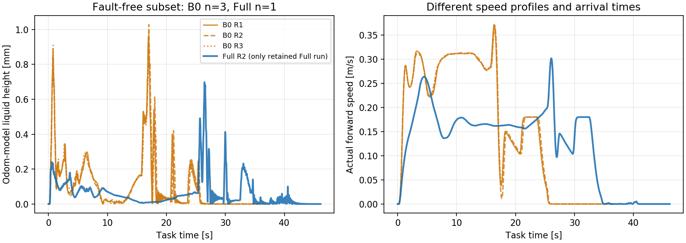

# B0 与 Full 无异常样本对比（2026-09-18）

按用户要求，本次展示仅保留无异常的 Full R2；B0 三次均无异常，全部保留。筛选后样本量为 **B0 n=3、Full n=1（原 Full 三次中保留 1 次）**。筛选单位为完整运行，未裁去运行中的尖峰或停顿片段。

## 筛选后的结果

| 指标 | B0 三次均值 | Full R2 单次 | Full 相对变化 |
| --- | ---: | ---: | ---: |
| 模型液面峰值 | 0.993 mm | **0.698 mm** | **降低 29.7%** |
| 运输阶段液面 P95 | 0.484 mm | **0.210 mm** | **降低 56.6%** |
| 运输阶段液面 RMS | 0.204 mm | 0.109 mm | 降低 46.4% |
| 到点时间 | 31.493 s | 41.167 s | 增加 30.7% |

该无异常样本的模型液面结果正向，同时耗时更长。Full 只有一次保留样本，且两种方法的路线和速度过程不同，因此这里描述无异常运行条件下的表现，不代表三次重复的整体稳定性或单独 slosh 代价的因果收益。

## 筛选和数据口径

- 来源为 `c82a09db` 下已完成的六次运行；本次不补跑、不调参。
- 要求 45 s 内通过；允许初始化、等待 odom/路线、正常 OCP 接纳、正常末端排空和到点状态，出现其他状态即不纳入。
- 保留 `b0_01`、`b0_02`、`b0_03`、`full_02`。`full_01`、`full_03` 因对齐/停车/动力学拒绝排除出此筛选表，原始 bag 和全量结果继续归档。
- 峰值统计到首次到点后 5 s；P95/RMS 统计任务开始至首次到点，沿用原统计窗口。高度仍为 odom 观察器模型估算，`formal=false`。

[筛选结果 CSV](./20260918_B0与Full无异常样本/selected_results.csv) · [筛选清单、排除原因与来源 hash](./20260918_B0与Full无异常样本/selected_results.json) · [生成脚本](./20260918_B0与Full无异常样本/generate.py) · [全量三组记录](./20260918_B0与Full三组重复对比.md)
