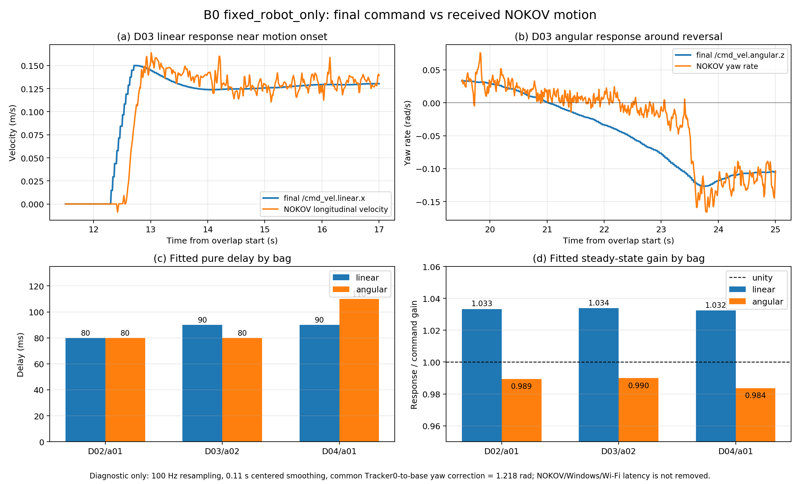

# 配合动捕测动作延迟

创建日期：2026-08-29
最后更新：2026-08-30

当前状态：`B0_DELAY_A_B_COMPLETE / FIXED_ROBOT_ONLY_SELECTED / FORMAL_R01_PENDING`

## 一眼看懂

本实验在动捕小场地重复跟踪同一条冻结 S 路径，记录：

```text
规划器 horizon / 控制审计
             ↓
最终发布 /cmd_vel
             ↓
底盘真实运动：NOKOV 动捕 pose
             ↓
与 odom、IMU 交叉比较
```

主要测量：

- `/cmd_vel` 到动捕真实线速度、角速度的响应延迟、增益和时间常数；
- odom 相对动捕的幅值、相位和时间偏差；
- IMU 角速度、加速度相对动捕的符号、相位和可信范围；
- solver command 到最终 `/cmd_vel` 是否被终点控制、安全门或限幅器修改。

本实验不录 RGB、深度、CameraInfo 或其他图像流。动捕只作为离线真值，不接入控制闭环，也不替换 `/odom` 或控制 TF。

## 两阶段安排

### 第一阶段：不加入 slosh 状态

使用 `B0`：

- 后端为 `continuous_mpcc_acados`；
- 6D MPCC 状态，不包含 slosh 状态；
- `slosh_enable=false`、`w_slosh=0`；
- IMU 仍被记录和处理，但只用于离线分析，不进入 B0 求解器。

先用 B0 辨识底盘本体动作延迟。同一路径、速度、起点门和载荷至少重复 3 次，推荐 5 次。

2026-08-30 的单次 A/B 已经证明：`shadow` 在当前 C02_v2/B0 上未到达终点，`fixed_robot_only` 在其他条件相同时成功到达。因此后续 B0 重复采集选用 `fixed_robot_only`；这组 A/B 只说明延迟补偿对跟踪成功很重要，不能单独证明当前配置的 `0.15/0.22 s` 就是真实执行器延迟。

延迟辨识仍统一使用“最终发布的 `/cmd_vel` 到动捕真实运动”的时间关系。`fixed_robot_only` 中配置的 `0.15/0.22 s` 是控制器使用的先验补偿值，必须与离线辨识的物理延迟分开报告，不得将两者直接相加。

### 第二阶段：加入 slosh 状态

B0 批次完成后，再冻结一个含 slosh 状态的 variant，单独重复同一条路径。两阶段使用不同的批次标识，不能混在一起拟合一个执行器模型。

`fixed_robot_only` 只预测车体状态，不把液体状态传播到同一未来时刻，因此它可用于 B0 诊断和执行链辨识，不能直接作为最终 slosh matched 实验的延迟模式。第二阶段必须让车体与液体状态对齐到同一执行时刻。

若要证明液体代价本身有效，必须另按 G3R3 方案使用 `B_slosh_matched0` 与 `B_slosh_matched5` 公平配对；不能把 B0 与含 slosh 版本直接写成公平减晃对比。

## 当前冻结资产

### 动捕场地地图

```text
/home/geist/scout_maps/real/20260829_mocap_exec/map_carto_20260829_mocap_exec_v1.pbstream
SHA-256: 34e45fd8205a766dbc6e3dcea667c5a0a618e26b331d48351c25645e31a19595
```

### 当前路径 C02

```text
/home/geist/fixed_paths/real/20260829_spmpc_mocap_execution_chain/candidates/mocap_compact_s_C02.json
SHA-256: 1464ef37857bcb899d8b0e4867ff63ea06f017e1b871bed80e077f450be14164
```

C02 当前为 v2，共 182 点、长约 `5.429 m`，最大曲率 `0.901 1/m`。把未知地图区域视为障碍后，中心线最小净空约 `1.092 m`；扣除保守车体/容器半径后剩余约 `0.666 m`。地图检查不能代替现场临时障碍、终点停止距离、Marker 和容器包络确认。

当前 B0 现场参数：

```text
V_REF=0.10 m/s
RECORD_SEC=90
START_POS_TOL=0.08 m
START_YAW_TOL=0.15 rad
SPEED_SAFETY_ENABLE=true
V_SAFE_MAX=0.15 m/s
SPEED_SAFETY_TOLERANCE=0.0001 m/s
DELAY_PHASE_LINEAR_DELAY_SEC=0.15 s
DELAY_PHASE_ANGULAR_DELAY_SEC=0.22 s
B0_REPEATED_COLLECTION_MODE=fixed_robot_only
```

## 启动顺序

### 1. 基础传感器栈（只有重新建图时才单独启动）

```bash
cd /home/geist/scout_ws
source /opt/ros/noetic/setup.bash
source devel/setup.bash

START_REALSENSE=false \
  bash src/scout_apps/control/scout_local_planner/scripts/launch_real_sensors_no_localization.sh
```

该入口启动底盘、雷达和 IMU，但不启动定位。当前地图已经建好，正常延迟实验不使用这一入口。

### 2. 建图（当前不需要重复）

只有重新建图时，在基础传感器栈保持运行的情况下执行：

```bash
cd /home/geist/scout_ws
source /opt/ros/noetic/setup.bash
source devel/setup.bash
export CATKIN_SETUP_UTIL_ARGS=--extend
source src/scout_apps/sensors/cartographer_ws/install_isolated/setup.bash

roslaunch nanoscan3_mapping scout_nanoscan3_cartographer.launch \
  scan_topic:=/scan_front \
  odom_topic:=/odom \
  occupancy_grid_resolution:=0.02 \
  use_rviz:=true \
  respawn:=false
```

建图与定位不能同时运行。

### 3. 使用动捕小场地图启动定位

```bash
cd /home/geist/scout_ws
source /opt/ros/noetic/setup.bash
source devel/setup.bash
source /home/geist/scout_maps/real/20260829_mocap_exec/map_carto_20260829_mocap_exec_v1_freeze.env

LOG_DIR=/tmp/mocap_localization_$(date +%Y%m%d_%H%M%S) \
START_LOCALIZATION=true START_REALSENSE=true \
  bash src/scout_apps/control/scout_local_planner/scripts/launch_real_sensors_stack.sh
```

### 4. 启动 NOKOV 接收与监测

另开终端：

```bash
cd /home/geist/scout_ws
source /opt/ros/noetic/setup.bash
source devel/setup.bash

roslaunch nokov_mocap_monitor nokov_monitor.launch \
  server:=192.168.203.85 \
  vrpn_port:=3883 \
  tracker:=Tracker0 \
  publish_tf:=false \
  use_rviz:=false
```

该命令同时启动 VRPN 接收端和 `/mocap/*` 监测桥。只读检查：

```bash
rostopic echo -n 1 /vrpn_client_node/Tracker0/pose
rostopic echo -n 1 /mocap/status
```

### 5. 候选路径 C02 低速安全试跑（已完成）

C02 是新路径，必须先做 `PATH_SELECTION`，不能直接占用正式 R01：

```bash
cd /home/geist/scout_ws
source /opt/ros/noetic/setup.bash
source devel/setup.bash
source /home/geist/scout_maps/real/20260829_mocap_exec/map_carto_20260829_mocap_exec_v1_freeze.env
source /tmp/mocap_execution_chain.env

SELECTION_ID=C02 ATTEMPT=02 ACQUISITION_RETRY=true \
RETRY_REASON_FILE=/home/geist/fixed_paths/real/20260829_spmpc_mocap_execution_chain/archive/C02_v1_rejected_curvature_eb62d44f/ARCHIVE_MANIFEST.json \
V_REF=0.10 \
RECORD_SEC=90 \
ARM_MOTION=YES \
bash src/scout_apps/control/spmpc_local_planner/scripts/run_spmpc_mocap_path_selection_trial.sh
```

该次 a02 已完成并标记为 `formal_trial_consumed=false`。bag 和自动 postflight 的 SHA-256 分别为 `ee08cdc2423bcfba0ee0654b4cd98e9e0baa3e2081fe159f5a94e7e549a4c293`、`21b04588321d0b7e363bdb2f2ea3c87ca5478aa4643b745904d502336788038f`。

### 6. B0 延迟模式诊断（已完成单次 A/B，不占用 R01）

专用脚本：

```text
src/scout_apps/control/spmpc_local_planner/scripts/run_spmpc_mocap_b0_delay_mode_trial.sh
```

该脚本固定使用 `B0`、C02_v2、动捕小场地地图、`V_REF=0.10 m/s`、`V_SAFE_MAX=0.15 m/s` 和 `0.15/0.22 s` 延迟参数，只允许两种诊断模式：

- `shadow`：补偿只计算和记录，不进入 B0 求解器；
- `fixed_robot_only`：把预测后的车体状态送入 B0，液体状态仍不被 B0 使用。

独立 `SpeedSafetyContract` 已实现并通过单元测试。它把 ACADOS 运行时边界、warm start、solver 命令和最终发布命令统一限制在 `0.15 m/s`；超限或非有限值会锁存并持续发布零速。旧的 `CONFIRM_HARD_SPEED_LIMIT` 人工占位已删除，不再使用。

真实运动必须同时显式设置 `VALIDATE_ONLY=false` 和 `ARM_MOTION=YES`。本轮 A/B 的标准启动形式如下；当前这些编号/次数已经存在输出，不得原样重跑或覆盖。

`shadow`：

```bash
cd /home/geist/scout_ws && \
DELAY_TEST_ID=D01 \
ATTEMPT=01 \
DELAY_PHASE_MODE=shadow \
VALIDATE_ONLY=false \
ARM_MOTION=YES \
bash src/scout_apps/control/spmpc_local_planner/scripts/run_spmpc_mocap_b0_delay_mode_trial.sh
```

本轮 `D01/a01` 没有完成后续自动验收；有效 `shadow` 重试仅将 `ATTEMPT` 改为 `02`，具体文件记录见文档末尾。

`fixed_robot_only`：

```bash
cd /home/geist/scout_ws && \
DELAY_TEST_ID=D02 \
ATTEMPT=01 \
DELAY_PHASE_MODE=fixed_robot_only \
VALIDATE_ONLY=false \
ARM_MOTION=YES \
bash src/scout_apps/control/spmpc_local_planner/scripts/run_spmpc_mocap_b0_delay_mode_trial.sh
```

脚本内部会 source ROS 和当前工作区，但定位、激光、odom、IMU 和 NOKOV 必须事先正常运行。如果已有同名 bag 或任一配套报告，脚本会拒绝覆盖，必须改用未占用的 `ATTEMPT` 或 `DELAY_TEST_ID`。

每条结束后自动检查：

- 实际延迟模式和模式代码是否正确；
- effective `v_max`、solver、post-gate、published command 和 bag 内 `/cmd_vel` 是否都满足 `0.15 m/s` 硬上限；
- `fixed_robot_only` 的车体补偿应用率与历史完整率是否至少为 `99%`；
- `shadow` 的车体补偿应用率是否不高于 `5%`；
- 液体补偿应用率是否不高于 `5%`；
- B0 是否仍明确记录 `LIQUID_NOT_CONSUMED`；
- bag、动捕、odom、IMU、路径和求解器证据是否完整。

自动 `PASS` 只证明采集完整、模式正确且速度安全契约成立，不等于路径跟踪质量合格。诊断 bag 使用 `D01～D09` 编号，文件名会明确包含延迟模式，永远不得命名为 `R01～R05`。

### 7. B0 重复采集（已选定模式，R01～R05 入口待对齐）

当前单次对照已选定 B0 重复采集使用 `fixed_robot_only`。但原 `run_spmpc_mocap_execution_chain_trial.sh` 仍固定 `shadow`，默认 variant 也仍为 `B_slosh_matched5`，没有对齐本轮 B0 硬限速契约，因此不得直接用它启动 R01。

正式 R01 前必须先将该入口固定为：

```text
variant=B0
slosh_enable=false
w_slosh=0
delay_phase_mode=fixed_robot_only
delay=0.15/0.22 s
v_ref=0.10 m/s
speed_safety_enable=true
v_safe_max=0.15 m/s
path/map SHA=当前冻结值
```

在 R01 入口对齐前，如果只需敏捷补采，继续使用本文第 6 节的专用脚本，改用未占用的 `D03～D09` 并保持 `fixed_robot_only`；这些仍是诊断数据，不占用 R01～R05。

对齐后按 `R01 → R02 → R03 → R04 → R05` 重复；每条结束后先检查 postflight 和跟踪质量，再开始下一条。前三条用于拟合，后两条用于 held-out 验证。

## 必须录制的数据

```text
/spmpc/debug/control_cycle_audit
/spmpc/debug/predicted_horizon
/spmpc/debug/pre_solve_snapshot
/spmpc/debug/cmd_vel_output
/cmd_vel
/odom
/imu/data
/vrpn_client_node/Tracker0/pose
/mocap/scout_pose
/mocap/scout_odom
/mocap/status
/scout/global_path_fixed
/tf
/tf_static
```

正式 B0 bag 必须逐周期证明 horizon/snapshot 中 `slosh_enabled=false`，并记录 `LIQUID_NOT_CONSUMED`，以证明 IMU/slosh 诊断没有进入 B0 求解器。

## 当前 NOKOV、IMU 与 odom 数据口径

2026-08-30 的 `D01/shadow/a02`、`D02/fixed_robot_only/a01`、`D03/fixed_robot_only/a02` 和 `D04/fixed_robot_only/a01` 已完成基本检查：NOKOV、IMU 和 odom 均连续、时间戳单调且没有非有限值，足够用于当前延迟和跟踪分析。下次分析直接按下表取数据：

| 数据                                | 当前基本情况                                                                                           | 正确用途                                                                                                                        |
| ----------------------------------- | ------------------------------------------------------------------------------------------------------ | ------------------------------------------------------------------------------------------------------------------------------- |
| `/vrpn_client_node/Tracker0/pose` | 约`90 Hz`；`Tracker0` 是由多个 Marker 解算的刚体；消息只有刚体位姿，没有速度字段                   | NOKOV 原始真值，优先使用`header.stamp` 离线计算运动                                                                           |
| `/mocap/scout_pose`               | 对原始 NOKOV 位姿的等值转发，frame 改为`mocap_world`                                                 | 需要统一的动捕监测 frame 时使用                                                                                                 |
| `/mocap/scout_odom`               | 只把同一份刚体 pose 包装成`Odometry`；当前桥接节点没有计算 twist，所以这些 bag 的 twist 始终为 `0` | 只能使用 pose，**不得把其 twist 当作真实速度**                                                                            |
| `/odom`                           | 约`50 Hz`，`odom -> base_link`；线速度和角速度连续并与 NOKOV/IMU 运动趋势一致                      | 控制器实际使用的轮式里程计；可分析响应，但不能代替动捕真值                                                                      |
| `/imu/data`                       | 约`50.1 Hz`，frame 为 `imu_link`；角速度与 NOKOV 转向一致；原始加速度含重力、安装倾斜和静态偏置    | 角速度可交叉检查；加速度应使用当前 processed-IMU 的偏置校正和滤波结果，不能直接把原始`linear_acceleration.x` 当车体真实加速度 |
| `/mocap/status`                   | 本轮全部为`OK`，`dropped_nonmonotonic=0`                                                           | 每包先确认 tracker、数据年龄和非单调丢弃计数                                                                                    |

当前四个有效 bag 中，NOKOV 原始位姿约有 `8029～8050` 条，IMU 为 `4483～4489` 条，odom 为 `4472～4479` 条。三者的角向变化能够互相对应；轮式 odom 的距离尺度比 NOKOV 约小 `3%～5%`，应视为轮式里程计滑移/尺度差异，不是录包损坏。IMU、odom 和 mocap odom 的 covariance 当前均未填写，不能拿这些全零 covariance 做不确定性结论。

离线分析统一遵守以下规则：

1. 动作响应的输入使用最终发布的 `/cmd_vel`，不能只用 solver 内部命令；
2. NOKOV 真实线速度由刚体位置平滑后求导，真实角速度由展开后的刚体 yaw 平滑后求导；
3. 若要区分车体纵向/横向速度，或换算到 `base_link` 中心，必须加入 Tracker 到车体的固定朝向和杠杆臂；只看速度大小和 yaw 角速度时不需要固定平面朝向偏置；
4. 不使用单个 Marker 的速度代表车辆速度；Marker 在转弯时还包含绕刚体中心转动产生的切向速度；
5. 当前 `analyze_mocap_execution_chain.py` 从原始 NOKOV pose 离线求速度，不读取 `/mocap/scout_odom.twist`。其他分析脚本若直接读取该 twist，会错误地判断车辆始终静止。

因此，这些 bag 不需要因为 `/mocap/scout_odom.twist=0` 重新录制。若以后确实需要实时动捕速度，应新建一个明确经过滤波、外参换算并带有效 covariance 的速度话题，不能直接给现有 pose-only 桥接结果填入未经验证的速度。

## 2026-08-30 当前状态

- 动捕小场地地图、C02_v2 路径及两者 SHA 已冻结，定位和无图像录制链均已验证；
- NOKOV `Tracker0` 接收正常，odom 和 IMU 也已验证；
- 独立速度硬上限已实现：诊断入口固定 `v_ref=0.10 m/s`、`v_safe_max=0.15 m/s`，运行时和最终发布共用同一上限；
- `test_speed_safety_contract` 6/6 通过，catkin 累计结果为 204 tests、0 failure；
- `D01/shadow/a02` 采集完整性和延迟模式 gate 均为 `PASS`，补偿应用率为 `0%`，但 90 s 内未到达终点；
- `D02/fixed_robot_only/a01`、`D03/fixed_robot_only/a02` 和 `D04/fixed_robot_only/a01` 的 postflight 与延迟模式 gate 均为 `PASS`，车体补偿应用率均为 `100%`，三次均成功进入 `GOAL_REACHED`；
- `D01` 的最终 `/cmd_vel.linear.x` 最大值约为 `0.1392 m/s`，三个有效 `fixed_robot_only` bag 均为 `0.1500 m/s`，全部无 speed-safety violation 或 latch；
- 单次 A/B 加上三次 `fixed_robot_only` 重复支持“当前车体延迟补偿是 B0 成功跟踪的重要因素”；
- 这一结果不能证明 `0.15/0.22 s` 已精确辨识，也不等于完整 Stage 2 延迟算法已修复；
- 原 R01～R05 入口仍固定 `shadow` 且默认为 slosh variant，尚未对齐当前 B0/`fixed_robot_only`/硬限速契约；正式 R01～R05 仍未开始。

注意：NOKOV 通过 Wi-Fi/VRPN 接收，最终报告必须把网络与时间戳不确定性和底盘物理执行延迟分开，不能把一次互相关峰值直接当成固定动作延迟。以 `fixed_robot_only` 采集时，延迟辨识仍从最终 `/cmd_vel` 到动捕/IMU 响应建模，实测值不再加上控制器配置的 `0.15/0.22 s`。

## 2026-08-30 有效 bag 记录

共同实验身份：

```text
path SHA-256: 1464ef37857bcb899d8b0e4867ff63ea06f017e1b871bed80e077f450be14164
map SHA-256: 34e45fd8205a766dbc6e3dcea667c5a0a618e26b331d48351c25645e31a19595
variant: B0
slosh_enable: false
w_slosh: 0
v_ref / hard ceiling: 0.10 / 0.15 m/s
configured delay: linear 0.15 s / angular 0.22 s
```

采集时的源码身份按运行分开记录：

| 数据        | Git commit                                   | Git dirty |
| ----------- | -------------------------------------------- | --------: |
| `D01/a02` | `ddf965644b8b3dfb192ae8541a6a9f3254d6351b` |     `0` |
| `D02/a01` | `ddf965644b8b3dfb192ae8541a6a9f3254d6351b` |     `0` |
| `D03/a02` | `ffa6922d466e5c2ad13cff690af6e83442a47f6f` |     `0` |
| `D04/a01` | `ffa6922d466e5c2ad13cff690af6e83442a47f6f` |     `1` |

`ffa6922` 是对本文档的数据口径补充，未修改 B0 控制代码。`D04/a01` 的采集元数据如实记录了 `git_dirty=1`；其 postflight 和 mode gate 仍均为 `PASS`，后续分析时保留该污染状态声明。

| 数据        |              模式/代码 |         时长 | 车体补偿率 | 最大`/cmd_vel.linear.x` | 终点                   | postflight / mode gate |
| ----------- | ---------------------: | -----------: | ---------: | ------------------------: | ---------------------- | ---------------------- |
| `D01/a02` |           `shadow/2` | `89.569 s` |     `0%` |          `0.139153 m/s` | `goal_reached=false` | `PASS / PASS`        |
| `D02/a01` | `fixed_robot_only/4` | `89.583 s` |   `100%` |          `0.150000 m/s` | `goal_reached=true`  | `PASS / PASS`        |
| `D03/a02` | `fixed_robot_only/4` | `89.667 s` |   `100%` |          `0.150000 m/s` | `goal_reached=true`  | `PASS / PASS`        |
| `D04/a01` | `fixed_robot_only/4` | `89.551 s` |   `100%` |          `0.150000 m/s` | `goal_reached=true`  | `PASS / PASS`        |

### D01 / shadow / a02

```text
bag:
/home/geist/slosh_bags/real/20260830_spmpc_mocap_execution_chain/delay_diagnostic/DEV_MOCAP_B0_DELAY_D01_shadow_a02.bag
SHA-256: 792804c4c460fae061024552d40742e34f12356ef9eaa964b00353035408acc7

postflight:
/home/geist/slosh_bags/real/20260830_spmpc_mocap_execution_chain/delay_diagnostic/DEV_MOCAP_B0_DELAY_D01_shadow_a02_mocap_delay_postflight.json
SHA-256: 7665a588149a67653a3d9e81485ec1ecab6e2a8a38c824810cd81ac423c6ccf1

delay-mode gate:
/home/geist/slosh_bags/real/20260830_spmpc_mocap_execution_chain/delay_diagnostic/DEV_MOCAP_B0_DELAY_D01_shadow_a02_delay_mode_gate.json
SHA-256: da1c9e336e8ded7bd4b2d45b4eae5a1b7693577e8ae045b60cc7b8b4d1f7210a
```

关键结果：`history_complete_frac=1.0`、`robot_delay_compensation_applied_frac=0.0`、`speed_safety_violation_frac=0.0`、`goal_reached=false`，记录的 `max(progress_s)=0.855128`。

### D02 / fixed_robot_only / a01

```text
bag:
/home/geist/slosh_bags/real/20260830_spmpc_mocap_execution_chain/delay_diagnostic/DEV_MOCAP_B0_DELAY_D02_fixed_robot_only_a01.bag
SHA-256: dbad29e7390e2634228ab6325d59b88874244026f9570e8634bf82b83b0219ad

postflight:
/home/geist/slosh_bags/real/20260830_spmpc_mocap_execution_chain/delay_diagnostic/DEV_MOCAP_B0_DELAY_D02_fixed_robot_only_a01_mocap_delay_postflight.json
SHA-256: 66ecd11f2dd3198dd23e5f50c5e1570d2e3898f8bb6ce53b9d6ad6ddf7ee63f0

delay-mode gate:
/home/geist/slosh_bags/real/20260830_spmpc_mocap_execution_chain/delay_diagnostic/DEV_MOCAP_B0_DELAY_D02_fixed_robot_only_a01_delay_mode_gate.json
SHA-256: 27cef4cfeb85cd34c86b123daf6df09c7b77acc3cdf148911ce48c44f61d878c
```

关键结果：`history_complete_frac=0.999622`、`robot_delay_compensation_applied_frac=1.0`、`liquid_delay_compensation_applied_frac=0.0`、`speed_safety_violation_frac=0.0`、`goal_reached=true`，记录的 `max(progress_s)=0.963873`。

### D03 / fixed_robot_only / a02

```text
bag:
/home/geist/slosh_bags/real/20260830_spmpc_mocap_execution_chain/delay_diagnostic/DEV_MOCAP_B0_DELAY_D03_fixed_robot_only_a02.bag
SHA-256: cfa8f955b97a719367b7e66a8aa8bd6193cfe22b79a502f78c18c5fa3d512ac5

postflight:
/home/geist/slosh_bags/real/20260830_spmpc_mocap_execution_chain/delay_diagnostic/DEV_MOCAP_B0_DELAY_D03_fixed_robot_only_a02_mocap_delay_postflight.json
SHA-256: eccb65ca25b96698f1fd3657db921b027614bf409b0df9fb4395b0e9f22e8761

delay-mode gate:
/home/geist/slosh_bags/real/20260830_spmpc_mocap_execution_chain/delay_diagnostic/DEV_MOCAP_B0_DELAY_D03_fixed_robot_only_a02_delay_mode_gate.json
SHA-256: 5e87902c76b07c9218fde16f1964934691815f83484d9f770de7c598cfca9403
```

关键结果：`history_complete_frac=1.0`、`robot_delay_compensation_applied_frac=1.0`、`liquid_delay_compensation_applied_frac=0.0`、`speed_safety_violation_frac=0.0`、`goal_reached=true`，记录的 `max(progress_s)=0.963807`。

### D04 / fixed_robot_only / a01

```text
bag:
/home/geist/slosh_bags/real/20260830_spmpc_mocap_execution_chain/delay_diagnostic/DEV_MOCAP_B0_DELAY_D04_fixed_robot_only_a01.bag
SHA-256: 2d432213e203cca91b8151897a65d3830e1df04a73f068a75687729ac4248c0f

postflight:
/home/geist/slosh_bags/real/20260830_spmpc_mocap_execution_chain/delay_diagnostic/DEV_MOCAP_B0_DELAY_D04_fixed_robot_only_a01_mocap_delay_postflight.json
SHA-256: 08a175f2a59911a38c26a8604609f230a6dd635ddfaecafa1af54a31a502c9f6

delay-mode gate:
/home/geist/slosh_bags/real/20260830_spmpc_mocap_execution_chain/delay_diagnostic/DEV_MOCAP_B0_DELAY_D04_fixed_robot_only_a01_delay_mode_gate.json
SHA-256: 67db7484220794c49faf69cd43c331f35208bc01c2183bf09af990d5c86044c7
```

关键结果：`history_complete_frac=1.0`、`robot_delay_compensation_applied_frac=1.0`、`liquid_delay_compensation_applied_frac=0.0`、`speed_safety_violation_frac=0.0`、`goal_reached=true`，记录的 `max(progress_s)=0.964034`。

`fixed_robot_only` 当前有效重复数据为 `D02/a01`、`D03/a02`、`D04/a01` 共 3 包，三次均到达终点，车体延迟补偿应用率均为 `100%`。

### 不纳入有效数据的记录

`DEV_MOCAP_B0_DELAY_D01_shadow_a01.bag` 保留原始文件，但该次没有生成 postflight、summary 和 delay-mode gate，因此不纳入有效 A/B 数据，也不得与 a02 拼接。

`DEV_MOCAP_B0_DELAY_D03_fixed_robot_only_a01` 的起点门和路径发布均正常，规划器也持续发布非零命令；但底盘全程报告 `base_state=2`、`fault_code=4`（RC signal loss）而拒绝运动。该次 bag 及配套侧车文件已移入系统回收站，不纳入有效数据；恢复后的有效重试为 `D03/a02`。

## 2026-08-30 三包 `fixed_robot_only` 动作响应分析

### 分析对象与输入语义

本轮使用 `D02/a01`、`D03/a02` 和 `D04/a01` 三个有效 bag，将最终真正发给底盘的 `/cmd_vel` 作为动作输入，由原始 `/vrpn_client_node/Tracker0/pose` 平滑求导得到动捕线速度和 yaw 角速度。三个 bag 都录制了以下计划与执行链话题：

| 话题                                        | 本轮用途                                                            |
| ------------------------------------------- | ------------------------------------------------------------------- |
| `/scout/global_path_fixed`                | 冻结全局路径                                                        |
| `/spmpc/debug/predicted_horizon`          | 完整滚动时域中的`v/omega/a/alpha` 计划                            |
| `/spmpc/debug/control_cycle_audit`        | 求解器第一拍、terminal、post-gate 和 published command 的同周期证据 |
| `/spmpc/debug/cmd_vel_output`             | 控制器输出与限幅状态                                                |
| `/cmd_vel`                                | 最终实际发给底盘的命令，用作执行链辨识的主输入                      |
| `/odom`、`/imu/data`、`/scout_status` | 轮式里程计、IMU 和底盘状态交叉检查                                  |

正常跟踪周期数分别为 `975/970/981`；三包中 `solver_cmd - published_cmd` 的线、角速度 P95 和最大绝对差全部为 `0`，safety intervention 均为 `0`。终点附近分别有 `66/70/64` 个 terminal intervention 周期，因此正常跟踪段中命令没有在求解器出口后被软件改坏；当前可见的滞后主要位于 `/cmd_vel` 发布之后的底盘执行与测量链。

### 坐标修正与处理参数

当前 `Tracker0` 刚体自身 x 轴与车体前向不一致。三包运动方向给出的共同诊断性修正约为：

```text
tracker_to_base_yaw_rad = 1.218 rad  (about 69.8 deg)
resample_hz = 100
centered_smooth_window_sec = 0.11
maximum_fit_lag_sec = 0.60
base_to_tracker_lever_arm = 0 in this diagnostic fit
```

不做这个轴向修正就直接将 Tracker x 轴投影当车体纵向速度，会虚假得到约 `0.357` 的线速度增益。`1.218 rad` 是本轮三包的共同诊断值，尚未通过独立几何测量冻结；本轮用与刚体轴向无关的平面速度大小交叉检查后，再进行统一修正下的纵向拟合。尚未引入刚体原点到 `base_link` 的杠杆臂，因此不把约 `3%` 的线速度增益偏差解释为底盘标定误差。

### 逐包拟合数据

线速度一阶动态加纯延迟拟合：

| bag         |    纯延迟 |  时间常数 |   稳态增益 |            RMSE |        R² |
| ----------- | --------: | --------: | ---------: | --------------: | ---------: |
| `D02/a01` | `80 ms` | `95 ms` | `1.0333` | `0.00699 m/s` | `0.9887` |
| `D03/a02` | `90 ms` | `74 ms` | `1.0338` | `0.00720 m/s` | `0.9880` |
| `D04/a01` | `90 ms` | `65 ms` | `1.0324` | `0.00730 m/s` | `0.9876` |

角速度一阶动态加纯延迟拟合：

| bag         |     纯延迟 |   时间常数 |   稳态增益 |              RMSE |        R² |
| ----------- | ---------: | ---------: | ---------: | ----------------: | ---------: |
| `D02/a01` |  `80 ms` | `623 ms` | `0.9894` | `0.01361 rad/s` | `0.9110` |
| `D03/a02` |  `80 ms` | `623 ms` | `0.9899` | `0.01336 rad/s` | `0.9151` |
| `D04/a01` | `110 ms` | `623 ms` | `0.9836` | `0.01321 rad/s` | `0.9168` |

三包中位数为：线速度纯延迟约 `90 ms`、增益约 `1.033`、时间常数约 `74 ms`；角速度纯延迟约 `80 ms`、增益约 `0.989`、时间常数约 `623 ms`。因此当前证据支持：

1. **没有明显的稳态幅值衰减**：线速度偏差约 `+3%`，角速度偏差约 `-1%～-2%`，当前不是主问题；
2. **存在稳定的可见相位滞后**：线、角速度的拟合纯延迟都约为 `0.08～0.11 s`；
3. **角速度建立明显更慢**：拟合时间常数约 `0.62 s`，因此不能只用一个纯时移解释转向响应；
4. 目前更像“幅值基本能做到，但动作做得晚，尤其转向建立慢”，而不是严重的命令幅值不足。



图中 (a)(b) 为 `D03/a02` 的代表性线速度起步和角速度换向时序，(c)(d) 为三包的纯延迟和稳态增益汇总。图中的“纯延迟”是一阶动态模型中的时移项，不包含随后的时间常数；因此不能用图中 `80～110 ms` 单独代表整个转向建立过程。

### NOKOV/Windows/Wi-Fi 未知延迟边界

当前 VRPN 配置明确为：

```yaml
vrpn_client_node:
  use_server_time: false
```

因此 `/vrpn_client_node/Tracker0/pose.header.stamp` 接近 Ubuntu 客户端收到消息的时刻，无法从现有 bag 中恢复“相机曝光 → Windows 解算 → Wi-Fi/VRPN → Ubuntu”的上游时间。三包的 bag arrival 减 header 只是 ROS 客户端收包后到 rosbag 记录的可见差值：

| bag         |       中位数 |   P95 绝对值 |   最大绝对值 |
| ----------- | -----------: | -----------: | -----------: |
| `D02/a01` | `0.092 ms` | `0.357 ms` | `5.449 ms` |
| `D03/a02` | `0.081 ms` | `0.334 ms` | `8.932 ms` |
| `D04/a01` | `0.110 ms` | `0.369 ms` | `7.593 ms` |

上表不能被写成“NOKOV 物理延迟约 `0.1 ms`”。本节拟合得到的 `80～110 ms` 当前只能命名为：

```text
最终 /cmd_vel → Ubuntu 收到的 NOKOV 动作响应的观测纯延迟
```

它同时混合底盘执行延迟、NOKOV 采样/解算延迟、Wi-Fi/VRPN 传输延迟和少量 ROS 调度误差。当前不得将它直接命名为“底盘纯执行器延迟”，也不得与 `fixed_robot_only` 配置的 `0.15/0.22 s` 直接相加。

下一步单独测量 NOKOV/Windows/Wi-Fi 链路时，至少记录：同一物理事件的本地硬件时间参考、原始 VRPN pose、`use_server_time` 和两端时钟状态，并对多次事件报告中位数/P95/最大值。若只用另一个未标定延迟的软件传感器作“真实时刻”，最终仍只能得到两个传感器的相对延迟。

这三包全部用于当前诊断拟合，尚无独立 held-out bag；再加上 Tracker 杠杆臂未冻结和 NOKOV/Wi-Fi 时间未剥离，因此本轮只形成“幅值误差不明显、观测相位滞后明显”的阶段性结论，不冻结最终执行器模型。
