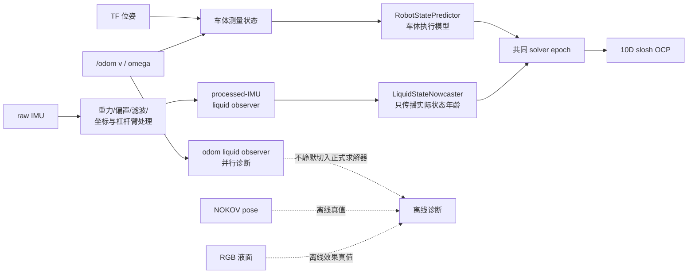

# slosh 状态输入与短时延迟补偿验证方案

日期：2026-08-31

协议 ID：`SMPCC_slosh_state_nowcast_dev_v1`

状态：`PROPOSED_NOT_IMPLEMENTED`。本文件只冻结下一步验证思路，当前尚未实现独立的液体短时预测模块、专用 runner 和对应 postflight，因此不能按本文直接启动新的实车闭环，也不占用正式 `R01～R05`。

## 1. 本次要回答什么

本轮只回答三个问题：

1. slosh 求解器的当前液体状态应由 processed-IMU 还是 odom 驱动的液体观察器提供；
2. processed-IMU 液体状态是否需要从其测量时刻短时传播到本周期求解开始时刻；
3. 当前基于 `/cmd_vel` 历史统一滚动 `0.22 s` 的液体预测，能否进入闭环，还是只能保留为诊断对照。

本轮不直接证明 S-MPCC 已经减晃，也不重新辨识全部液体模型参数。真实减晃效果仍必须由独立 RGB 液面指标验证，不能用求解器内部的 `eta` 或预测液面高度自证。

## 2. 当前结论与依据

### 2.1 状态来源

当前 development 首选配置为：

```text
robot pose/twist source       = TF pose + /odom v/omega
liquid excitation source      = processed_imu
liquid state entering solver  = processed-IMU excitation经过液体模型得到的
                                eta_x, eta_x_dot, eta_y, eta_y_dot
odom liquid observer          = parallel diagnostic only
IMU failure policy            = fail_closed
```

这里不是把原始 IMU 消息直接放进 MPC。IMU 先经过重力、偏置、滤波、坐标和杠杆臂处理，再驱动与 odom 通道相同的液体动力学模型，最终进入 10D 求解器的是液体模态状态。

已有 G2S 三包预分析中，processed-IMU 相对 odom 的 motion-window MAE 平均改善 `34.56%`，三包方向一致，RMSE、P95 绝对误差和相关性也均更好。因此它足以成为下一阶段 development 的首选输入源，但由于正式第四包未完成，不能写成最终论文结论。

### 2.2 已知时间语义

当前三包审计结果一致：

```text
source - measurement      = 15.000 ms
source - accel_effective  = 21.834 ms
source - gyro_effective   = 20.020 ms
source - alpha_effective  = 30.001 ms
```

这些数值已经写进 processed-IMU 的时间戳语义，不能再次盲目减一遍。NOKOV 相对 raw IMU 的约 `-10～-20 ms` 只用于离线真值解释，不能加到或减去车体的 `0.15/0.22 s`，也不作为在线液体补偿参数。

### 2.3 B0 延迟实验能证明和不能证明的内容

同一路径、速度和参数下，`shadow` 未到终点，三次 `fixed_robot_only` 都到达终点。这证明车体延迟状态前推对当前 B0 跟踪很重要。

但 B0 不消费液体状态，`fixed_robot_only` 也不把预测液体放进求解器。因此该结果不能证明当前 `fixed_closed_loop` 的液体 rollout 正确，更不能据此把 slosh 固定预测 `0.22 s`。

当前 `ExecutionStatePredictor` 使用 `/cmd_vel` 历史作 ZOH 传播，并把命令速度直接当成已实现速度，以 `Delta cmd_v / dt` 和 `v * omega` 激励液体。实物 bag 已显示角速度存在很慢的建立过程，远期 `a/alpha` 还会被下一周期重规划明显改写，所以这套 liquid rollout 暂时只能作为诊断对照。

## 3. 目标数据流



车体和液体允许使用不同的观测器和不同的传播模型，但最终交给求解器的两部分状态必须属于同一个物理时刻。

## 4. 液体应该补偿多少

液体补偿量不写死为 `0.022 s`，也不使用车体的 `0.15/0.22 s`。每个控制周期按时间戳计算：

```text
dt_slosh = solve_start_stamp - selected_liquid_state_stamp
```

当前可把 `20～30 ms` 作为理解量级，实际值会随 IMU 采样相位、回调和求解调度逐周期变化。实现必须记录每周期真实的：

- 原始 IMU source stamp；
- measurement、accel、gyro、alpha effective stamp；
- observer state stamp；
- solve start stamp；
- 实际传播跨度 `dt_slosh`；
- 使用的激励覆盖范围和末端外推长度；
- 是否发生丢包、epoch reset、过期或降级。

短时传播优先使用同一 processed-IMU 管线中已经接受的实测激励缓存。最后不足一个传感器周期的部分只能采用有界的短时保持；若数据过期、历史不连续、时间回退或预测跨度超过预先冻结的安全上限，则正式实验 fail-closed，不能静默切换到 odom，也不能继续沿用上一拍液体状态。

OCP horizon 内仍按未来决策变量继续预测液体响应。这里增加的 nowcast 只负责把初始液体状态 `q0` 对齐到求解开始时刻，不额外平移或重复计算整个 OCP horizon。

## 5. 分阶段验证顺序

### Stage A：单元测试与合成时序测试，不发车

先实现独立 `LiquidStateNowcaster`，不得继续向 `ExecutionStatePredictor` 内堆叠 source 选择、时间戳守卫和故障策略。

最低测试项：

1. 零激励下按液体自由衰减模型传播，结果与 `SloshDynamics` 一致；
2. 常值 `ax/ay` 的可控时间跨度传播与直接积分一致；
3. `dt_slosh=0` 时严格保持输入状态；
4. 只传播 `state_stamp -> solve_start`，不会再减一次 `15/21.834/20.020/30.001 ms`；
5. 50 Hz IMU 与 30 Hz solver 异步时，输出 timestamp 始终等于目标共同 epoch；
6. 丢包、时间回退、reset epoch、非有限值、过期和历史缺口均按合同失败；
7. processed-IMU 失效时正式 profile 停车，不能无提示改用 odom；
8. 车体预测与液体 nowcast 分别可测试，最终组合只接受同一 solver epoch；
9. legacy `0.22 s` command-history liquid rollout 不得因配置别名意外进入求解器。

### Stage B：同一 bag 内离线比较，不发车

先复用已有同时包含 IMU、odom 和 RGB 液面结果的有效 bag 开发分析器和排查明显错误。已有 G2S 三包已经参与输入源选择，不能重新命名为 held-out 放行数据。分析器、模型参数、时间戳口径和门限冻结后，仍需新采集独立验证 bag。若独立数据不足，使用 B0 采集新的统一激励 bag：B0 不消费液体状态，因此多个液体估计器可以在完全相同的真实运动上并行比较，不会因估计器改变车体轨迹。

同一 `q0`、同一模型参数和同一分析窗口下并行计算：

| 代号 | 液体输入与传播 | 用途 |
| --- | --- | --- |
| `O0` | odom observer，不做额外 nowcast | 旧输入源基线 |
| `I0` | processed-IMU observer，不做额外 nowcast | 当前测量状态基线 |
| `I1` | processed-IMU observer，按实际 timestamp 短时 nowcast | 本轮候选方案 |
| `L22` | processed-IMU 初始状态，按当前命令历史滚动约 `0.22 s` | legacy 诊断反例，不进入闭环 |

冻结分析口径：

```text
visual reference = 冻结 RGB 液面标量
window           = first effective motion 到 arrival 后固定尾段
observer output  = total_height_m，统一换算为 mm
lag              = 0 s，不对每条 trial 单独寻优
scale            = 不拟合
primary metric   = motion-window MAE
secondary        = RMSE、P95 abs error、corr、peak timing、coverage
```

development 放行门必须在查看新验证 bag 的结果前冻结，最低要求为：

- 至少 `3` 条独立有效 bag；
- `I1` 相对 `I0` 的平均 MAE 必须下降；
- 至少 `2/3` trial 的 MAE 同向改善；
- 有效对齐 coverage 不低于 `0.98`；
- 不允许靠逐包调 lag、缩放或修改 RGB 标定得到改善；
- 必须完整公开 `O0/I0/I1/L22`，不能只保留最好的曲线。

若 `I1` 没有稳定优于 `I0`，先检查时间戳语义、激励缓存和模型相位，不进入 slosh 实车闭环。若 `L22` 偶然表现较好，也只能触发新的执行器模型研究，不能直接放行现有 `fixed_closed_loop`。

### Stage C：整条控制链 bag replay，不发车

Stage B 通过后，使用 `publish_cmd_vel=false` 或隔离命令 topic 回放完整 planner，确认：

- solver 实际选择源始终是 processed-IMU；
- observer fallback 次数为 `0`；
- liquid nowcast 的应用率、跨度和状态码符合预期；
- 车体和液体最终 epoch 完全一致；
- 求解器实际消费的是 nowcast 后状态，而不是只发布了 shadow 诊断；
- `eta/eta_dot`、液面 proxy、warm start 和 horizon 全部有限；
- governor 与内层 OCP 使用同一套对齐后初始状态；
- legacy command-history liquid rollout 的 applied rate 为 `0`；
- 任一时间合同失败都会阻止求解和命令发布。

此阶段需要新增机器可读 postflight，不能只通过查看曲线人工判断。

### Stage D：B0 实物激励采集，液体估计只作 shadow

如果需要新的 held-out 数据，先在安全低速下使用 B0 产生包含左右换向、起步和停车的激励。建议保持当前已经验证的车体设置：

```text
planner variant             = B0
robot delay baseline        = 0.15 / 0.22 s（provisional）
robot delay mode            = fixed_robot_only
v_ref                       = 0.10 m/s
v_safe_max                  = 0.15 m/s
liquid estimators           = O0 / I0 / I1 / L22 parallel shadow
solver consumes liquid      = false
```

录制至少包括：

- solver command、最终 `/cmd_vel`；
- `/odom`、TF；
- raw IMU、processed-IMU excitation 及其全部有效时间戳；
- 四套液体估计结果与 nowcast 诊断；
- NOKOV 原始 pose 与桥接 odom；
- RGB 液面原始结果或已冻结、可追溯的在线液面标量；
- solver input、cycle audit、horizon、命令干预与 effective config。

若现场无法同时获得冻结 RGB 液面指标，这批数据只能用于运动和时间戳诊断，不能用于选择 `I0/I1/L22` 的液体效果。

### Stage E：含 slosh 求解器的实物验证

只有 Stage A～D 全部通过后，才建立新的代码 release、协议 ID、runner、bag 目录和 postflight。不得覆盖现有 G3R3、C02 或 R01～R05 资产。

第一批闭环继续使用公平的 10D matched pair：

```text
observer source        = processed_imu
fallback               = fail_closed
liquid alignment       = accepted I1 short nowcast
robot/liquid epoch     = required common epoch
legacy L22 rollout     = shadow only
Matched0 / Matched5    = 同一状态管线、同一车体模型和同一公共权重
```

采用平衡顺序 `A B | B A | A B`，其中 `A=Matched0`、`B=Matched5`。主结果仍是 RGB 液面 `P95/RMS` 的配对 block 差值；同时报告跟踪误差、完成时间、安全介入、求解实时性、nowcast 覆盖率和状态时间对齐。内部 `eta` 只能解释机制，不能替代 RGB 主结果。

## 6. 当前允许和禁止的设置

| 项目 | 当前决定 |
| --- | --- |
| 车体测量来源 | `TF + odom` |
| 液体观察器首选 | `processed_imu` |
| odom 液体观察器 | 并行诊断，不静默 fallback |
| 当前不改代码的 slosh development | `processed_imu + fail_closed + common_epoch + shadow` |
| 候选液体补偿 | 按每周期实际状态年龄短时 nowcast，量级约 `20～30 ms` |
| 车体 `0.15/0.22 s` | 保留为经过 B0 A/B 支持的 provisional 基线 |
| 当前 `0.22 s` 液体 rollout | 只作 shadow/离线对照，不进入正式闭环 |
| NOKOV 相对 IMU 时差 | 只作离线解释，不进入在线补偿 |

明确禁止：

1. 把 raw IMU 加速度直接当作 `eta/eta_dot`；
2. 把 `/mocap/scout_odom.twist=0` 当作真实动捕速度；动捕速度必须由原始 pose 离线求导；
3. 将 `-10～-20 ms` NOKOV/IMU 相对时差与 `0.15/0.22 s` 相加或相减；
4. 把 processed-IMU 状态再次固定补偿 `0.15 s` 或 `0.22 s`；
5. 只修改 timestamp、却不传播液体数值来伪造 common epoch；
6. 在要求共同 epoch 的 slosh 求解器中强行使用 `fixed_robot_only`；
7. processed-IMU 失效后在同一正式 trial 中静默切换到 odom；
8. 用 B0 到点结果宣称 liquid rollout 已经通过验证；
9. 在实验中途根据曲线临时修改补偿跨度、滤波器、液体模型或 RGB 标定。

## 7. 放行判定

本方案只有满足以下条件才可从 `PROPOSED` 改为 `READY_FOR_SLOSH_HARDWARE`：

1. `LiquidStateNowcaster` 为独立模块并有完整单元测试；
2. 至少三条 held-out bag 的 `O0/I0/I1/L22` 同口径报告完成；
3. `I1` 达到预先冻结的离线放行门；
4. 无运动整链回放和机器 postflight 通过；
5. 新 runner 能同时冻结代码 revision、solver artifact、路径、地图、液体参数、IMU 参数和补偿策略；
6. 实车前门继续保持独立速度硬上限和发布前 fail-closed；
7. 失败 bag、日志和报告原样保留，不用成功重跑覆盖失败身份。

若这些条件尚未满足，当前最保守且可解释的 slosh 设置仍是：processed-IMU 当前液体状态进入求解器、机器人回溯到同一液体 epoch、delay-phase 保持 `shadow`。这是一条 development 基线，不是最终延迟补偿方案。

## 8. 关联记录

- [配合动捕测动作延迟](20260829_配合动捕测动作延迟.md)
- [动捕场地 S-MPCC 执行链辨识实验方案](20260826_动捕场地SMPCC执行链辨识实验方案.md)
- [G3R3 短可信时域公平配对实物验证方案](20260819_G3R3短可信时域公平配对实物验证方案.md)
- [G2S 重标尺与 IMU/odom 输入源三包预分析](../实物对比试验分析/20260731_G2S重标尺与IMU_odom输入源三包预分析.md)
- [延迟问题分析](../解决问题的思路/20260830_延迟问题.md)
