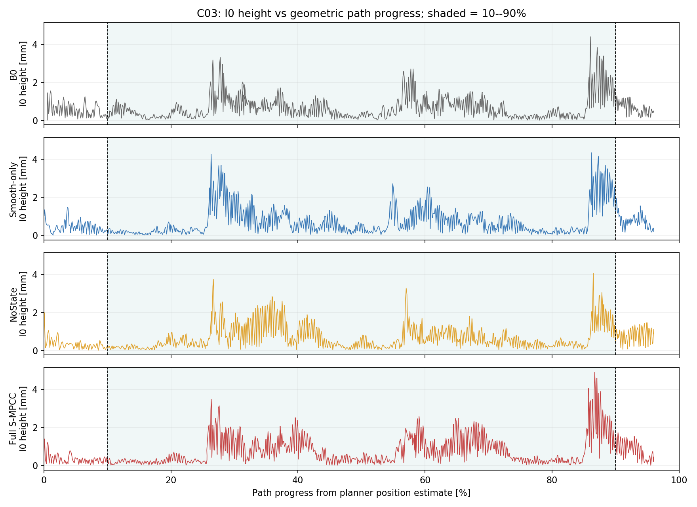
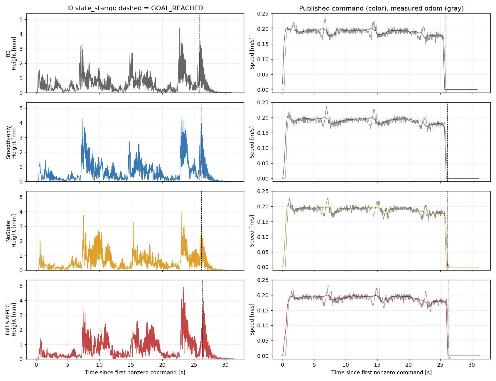

# 20260907 C03 新地图四组消融内部液面高度分析

日期：2026-09-07；开发实物 smoke，每组一次，无 RGB。

**结论：只看路径进度 10%～90%，结论也没有反转。B0 的 I0 高度 P95、RMS 最低，NoState 峰值最低；完整 S-MPCC 的 RMS 比 B0 高 19.2%、比 NoState 高 17.2%。完整方法相对 Smooth-only 的 P95 低 11.8%，但 RMS 高 2.5%、峰值高 12.8%，尚无一致的内部降晃收益。四组运行检查均 PASS，终端停车接管后没有 MPC 重入。**

本次高度是实测 processed-IMU 驱动统一 I0 模型得到的模态液面起伏，支持比较内部模型指标；不是 OCP 预测高度，也不是 RGB 液面真值。全任务和到达后尾段结果一并保留，不以事后中段切窗替换正式主终点。方案入口：[全时域加速度变化硬约束与 NoState 开发验证思路](../解决问题的思路/20260907_全时域加速度变化硬约束与NoState三组开发验证思路.md)。

## 1. 数据与冻结条件

协议：`SMPCC_I0_FAILCLOSED_EXPLICIT_ACTUATOR_ABLATION_SMOKE_DEV_V1`；场景：`20260907_c03`。四包录制元数据均记录 `e4b1d05f684579debd23038ea85ca347a2283b18`，分支 `diag/lt-dwa-collision-tracking`。`*_info.txt` 均记录 `git_dirty=3`，不能描述为干净提交复现；实际组别另由 rosparam、effective_config 与消融 postflight 核对。

数据根目录：

```text
/home/geist/slosh_bags/real/20260907_spmpc_i0_failclosed_explicit_actuator_ablation_smoke_v1_20260907_c03
```

以下路径相对于该根目录，按实际录制顺序列出：

| 组别 | bag 相对路径 |
| --- | --- |
| 完整 S-MPCC | `full/H0/DEV_I0FC_EXPACT_ABLATION_full_J1_20260907_c03_212120_Bslosh.bag` |
| Smooth-only | `smooth/H0/DEV_I0FC_EXPACT_ABLATION_smooth_J1_20260907_c03_212446_Bslosh.bag` |
| NoState | `nostate/H0/DEV_I0FC_EXPACT_ABLATION_nostate_J1_20260907_c03_212738_Bslosh.bag` |
| B0 | `b0/H0/DEV_I0FC_EXPACT_ABLATION_b0_J1_20260907_c03_213037_Bslosh.bag` |

四包固定路径内容一致：171 个点、总长 `5.080783715387174 m`。地图与路径冻结信息：

| 项目 | 路径与 SHA256 |
| --- | --- |
| 地图 | `/home/geist/scout_maps/real/20260907_mocap_exec/map_carto_20260907_mocap_exec_v1.pbstream`；`86085992407b90571454d1f3c2a1379f602f0259df9535c60a6119470ccbcda6` |
| 路径 | `/home/geist/fixed_paths/real/20260907_spmpc_mocap_execution_chain/candidates/mocap_compact_s_C03.json`；`bda11f74194bb65d7df3b4ba5f1f5c3cc756dafdfd7bc06e753a288e30f7e006` |

共同设置为 `v_ref=0.20 m/s`、`v_safe_max=0.25 m/s`、`w_accel=0.3`、`w_du_a=0.1`、`w_alpha=0.1`，30 Hz、60 步。使用显式执行器，legacy delay off，processed-IMU I0、fail_closed、common_epoch，终端停车锁存开启。执行器线速度/角速度通道延迟 `0.166667/0.333333 s`、时间常数 `0.112/0.119 s`、增益 `1.018/1.096`；容器内半径 `0.01725 m`、液深 `0.053 m`、阻尼比 `0.05`，第一模态约 5.15 Hz。共同 effective_config 未发现组间差异或包内漂移，预期差异如下：

| 组别 | 液体优化 / w_slosh | 送入 OCP 的液体初态 | 全时域硬 jerk |
| --- | --- | --- | --- |
| B0 | 关 / 0 | 不参与液体优化 | 关，保留软平滑 |
| Smooth-only | 关 / 0 | 不参与液体优化 | 1.0 m/s³ |
| NoState | 开 / 1 | 每轮仅 OCP 初态置零 | 1.0 m/s³ |
| 完整 S-MPCC | 开 / 1 | 使用对齐、前推后的 I0 状态 | 1.0 m/s³ |

所有组都从 `B_slosh` 配置源构造，不能靠 bag 的 `Bslosh` 后缀判断实验组别。硬约束组 `|Δa_cmd|≤0.033333 m/s²`，包括首拍衔接；NoState 的后台 I0 没有清零。终端接管后的独立停车不属于 MPC 硬 jerk 保证范围。本轮未录“完整方法去 jerk”，不能据这四包单独估计硬约束在完整方法中的贡献。

本轮 C03 无排除样本。旧地图/C02 的数据不混入配对；旧批第一次 Smooth 按用户要求不再分析，也不列入本轮排名。早先 full 的 4 次终端求解失败保留在方案第 8 节，不能因新包通过而删除。

## 2. 高度、路径窗口与时间对齐

高度统一取 `/spmpc/debug/slosh_observer_imu.modal_height_m × 1000`，单位 mm，即 `c_h sqrt(η_x²+η_y²)`。53 mm 是静态液深，不是本表统计量。P95 使用原生约 50 Hz 有效样本的 NumPy 线性百分位数；RMS 为样本均方根，峰值为原始最大值，不删高值或按高度裁去上下 10%。

三个窗口分别报告：

1. **路径 10%～90%**：在完整任务内，使用有效 `PreSolveSnapshot.robot_x/y` 向 `map` 下的固定折线做最近投影，得到几何进度 `s_proj`；以 `robot_state_stamp` 为横轴将 `s_proj(t)` 线性插值到 I0 `state_stamp`，保留 `0.5080783715≤s_proj≤4.5727053438 m`。不对高度重采样，不将 OCP 虚拟进度当作独立实测轨迹。
2. **完整任务**：第一条实际发布的非零线/角速度命令（绝对值大于 `1e-9`）至首次 `GOAL_REACHED`，事件使用 `command_publish_stamp`，高度仍用自己的 `state_stamp` 选窗。
3. **到达后 5 s**：首次 `GOAL_REACHED` 至其后固定 5 秒，单列残余晃动。

这里的车体位置是规划器在 common epoch 的估计，包含显式执行器短时前推，**不是独立 NOKOV 真值**。因此该中段窗口是有时间戳的几何进度估计，不能证明新地图定位或物理相位已标定。headerless `projector` 的 bag 接收时间未用于 I0 对齐。与[历史 10%～90% 口径](20260705_三方法peak规律与20260702差异分析.md)使用 `stage0_reference.s0` 的差别也保留说明：本轮另外按快照 `s0` 复算，所选 I0 样本及三项指标恰好全部相同。

四组任务至到达后 5 秒的 I0 均 READY、有效，无重置、重复/倒序时间戳或观测器更新计数跳步；`state_stamp=measurement_stamp`，最大采样间隔 20.5～22.7 ms，`sample_dt_sec` 与接受样本时间差一致。状态按测量时间推进，未额外扣除延迟或逐包搜索相位。共同坐标为 `base_link`，作用点为 `liquid_observer_target_icr_proxy`。起动前 1 秒 I0 RMS 为 0.010～0.014 mm。

中段几何投影存在少量回退：B0 / Smooth / NoState / Full 分别 5 / 6 / 1 / 4 次，最大单步回退分别 30.3 / 3.9 / 9.4 / 9.2 mm；未强行做单调裁剪，也不能把回退直接判为真实倒车或唯一定位故障。两条窗口边界每组均只向前穿越一次，没有边界重入，所选 I0 样本连续；定位快照最大间隔 35.3～43.9 ms，中段 I0 最大间隔 20.3～21.0 ms。

固定敏感性检查：四组边界统一整体平移 `−33.333 ms / 0 / +33.333 ms`，P95 最大变化小于 0.0015 mm、RMS 小于 0.0031 mm、峰值不变，组间排名不变。这只说明小幅选窗误差不改变本轮结论，不能替代物理延迟标定。按样本覆盖时长加权的中段 RMS 与原生样本 RMS 差异小于 0.0003 mm。

## 3. 路径进度 10%～90% 的结果

时间从第一条非零发布命令起算；各组统计相同路径区间，按各自原生时间样本计算，不作等距离加权。

| 组别 | 起止时间 s | 区间耗时 s | 样本数 | P95 mm | RMS mm | 峰值 mm |
| --- | ---: | ---: | ---: | ---: | ---: | ---: |
| B0 | 2.721～23.764 | 21.043 | 1054 | **1.996** | **0.923** | 4.395 |
| Smooth-only | 3.112～23.988 | 20.876 | 1046 | 2.449 | 1.073 | 4.353 |
| NoState | 3.167～24.034 | 20.866 | 1045 | 2.036 | 0.939 | **4.042** |
| 完整 S-MPCC | 3.216～24.282 | 21.066 | 1056 | 2.159 | 1.100 | 4.908 |

完整方法相对对照组的变化（负值表示完整方法更低）：

| 对照组 | P95 | RMS | 峰值 |
| --- | ---: | ---: | ---: |
| B0 | +8.2% | +19.2% | +11.7% |
| Smooth-only | −11.8% | +2.5% | +12.8% |
| NoState | +6.0% | +17.2% | +21.4% |

四组全任务峰值均落在路径 10%～90% 内。因此高峰不能全部解释为起步或终端接管后的停车产物。不过，图中约 86%～89% 的强响应仍被该窗口保留；10%～90% 不等于已完全排除接管前的末端减速影响，不能借此单独给转弯或停车机制定因。



## 4. 完整任务及到达后尾段

| 组别 | 全任务 P95 mm | RMS mm | 峰值 mm | 到达后 5s P95 mm | RMS mm | 峰值 mm |
| --- | ---: | ---: | ---: | ---: | ---: | ---: |
| B0 | 1.870 | 0.893 | 4.395 | 1.893 | 0.767 | 3.554 |
| Smooth-only | 2.322 | 1.019 | 4.353 | 2.083 | 0.784 | 3.997 |
| NoState | 1.969 | 0.897 | 4.042 | 1.349 | 0.540 | 2.783 |
| 完整 S-MPCC | 2.060 | 1.033 | 4.908 | 2.184 | 0.817 | 4.002 |

全任务 B0 的 P95/RMS 最低；到达后 NoState 三项最低。完整方法相对 NoState 的全任务 RMS 高 15.2%、尾段 RMS 高 51.3%。完整方法相对 Smooth 的全任务 P95 低 11.3%，但 RMS 高 1.4%、峰值高 12.8%。这些整段结果与中段结果方向一致，不能只选较有利的单项指标。



## 5. 运行、跟踪与停车

| 组别 | 完成时间 s | 规划器位置投影距离 RMS cm | 终端报告距离 cm | 整包求解失败 | 原 smoke 约 5 Hz 命令幅值 m/s² |
| --- | ---: | ---: | ---: | ---: | ---: |
| B0 | 25.894 | 0.844 | 15.05 | 0 | 0.00318 |
| Smooth-only | 26.098 | 0.846 | 16.73 | 0 | 0.00308 |
| NoState | 26.159 | 0.819 | 15.24 | 0 | 0.00221 |
| 完整 S-MPCC | 26.357 | 0.598 | 12.79 | 0 | 0.01724 |

四包 runtime、I0 显式执行器契约、消融检查均 PASS；全包求解、common-epoch、fault-zero 失败均为 0，无控制回调超过 33.3 ms。有效计划 B0 / Smooth / NoState / Full 为 764 / 771 / 772 / 779 条；三个硬约束组全部通过全时域与首拍核验，B0 的关闭约束配置核验通过。终端接管后无求解尝试，发布速度单调降至零并保持，终端报告位置均在当前 20 cm 容差内。终端控制没有伪记为 MPC 成功。

跟踪指标来自规划器有效输入位置至路径最近线段，未包含缺少求解快照的完整终端停车段，也不是独立动捕定位误差。各包起点到路径首点约 0.6～3.2 cm，完成时间和终端位置不同，不能视为严格等轨迹、等耗时条件。新地图下仍存在投影回退，本次没有完成新的绝对定位精度评定；旧、新批次地图和路径同时改变，不作换图效果的单变量推断。

### 5.1 B0 距离 1.0 m/s³ 硬约束有多远

B0 保留 `w_du_a=0.1` 的全时域软惩罚，是为了与 Smooth-only 保持相同非液体设置，只有硬 jerk 开关不同。它是本轮构造的同参数对照，不能按名称理解为“完全没有平滑项的原始 B0”。

使用同 cycle ID 的 `ControlCycleAudit.solver_u0_a` 和 `PreSolveSnapshot.actuator_a_cmd_memory`，按 `j0=(a0-a_mem)/snapshot.dt` 计算绝对值。这与首拍硬约束完全同口径；`a_mem` 来自真实最终发布历史在 OCP 网格上的重建，不是简单取上一轮求解的 `a0`。仅保留求解成功且实际发布命令的周期；中段采用第 2 节的边界、按该周期 `command_publish_stamp` 归窗。“完整 MPC 段”从首次非零发布至终端接管前，包含起步首拍。

| 组别 / 窗口 | 控制拍数 | 首拍 \|j0\| P95 m/s³ | 最大值 m/s³ | 超过 1.0 的拍数 / 比例 |
| --- | ---: | ---: | ---: | ---: |
| B0 / 路径 10%～90% | 632 | 0.640 | 2.792 | 10 / 1.58% |
| Smooth-only / 路径 10%～90% | 626 | 0.647 | 1.000 | 0 / 0% |
| B0 / 完整 MPC 段 | 764 | 0.753 | 18.000 | 23 / 3.01% |
| Smooth-only / 完整 MPC 段 | 771 | 0.928 | 1.000 | 0 / 0% |

计数忽略 `1e-5 m/s³` 内的数值尾差。B0 中段 P95 比 1.0 低约 36.0%，但最大值是其 2.79 倍；起步第一拍 `a_mem=0`、`a0≈0.6 m/s²`，在 1/30 秒网格上对应 18.0 m/s³。原消融报告中的全时域最大 `Δa=0.6 m/s²` 与此一致。Smooth-only 的全时域最大差分为 0.033333 m/s²，全部预测阶段约束通过。

另核对实际发布时间下的命令差分：先按相邻发布速度计算 `a_i=(v_i-v_{i-1})/(t_i-t_{i-1})`，将其归到区间中点，再对相邻区间加速度求差分。路径 10%～90% 的 B0 绝对 jerk P95 / 最大值为 `0.648 / 2.927 m/s³`，Smooth-only 为 `0.658 / 1.016 m/s³`。这属于最终速度命令的离散重建，不是 IMU 实测车体 jerk；发布时间抖动也会影响它，不能将 Smooth-only 的该重建值稍超 1.0 判为 OCP 网格约束失效。该三点差分不包含窗口外的首个历史点，尤其不能拿它的全段最大值替代包含起步锚点的上表。

因此，本包 B0 多数实际执行的首拍已经低于候选上限，硬约束主要限制少数较快变化；它不是降低 I0 高度的充分条件。完整方法仍有液体优化带来的不同动作偏好，当前数据不能单凭 jerk 指标给高度差异定因。原 smoke 报告的相邻 `a0` P95 采用其自身有效运动筛选，也不与这里的 10%～90% / 完整 MPC 窗口混用。

详细数值见 [B0 与 Smooth jerk 补充统计](figures/20260907_c03_i0/b0_smooth_jerk_comparison.json)。

## 6. 当前判断与下一步

1. 停车锁存修复已得到本轮四包运行证据支持；硬约束已生效。这两项通过不等于内部或真实液面降晃有效。
2. 本轮完整方法未超越 NoState，不能主张液体状态记忆带来额外收益；每组仅一包，也不能据此证明状态记忆无用或 NoState 普遍更优。
3. 继续优先核对完整方法的预测激励与 processed-IMU 激励：固定真实发布命令历史重放执行器模型，在同作用点、时间和处理口径下比较 `a_actual`、`v_actual·omega_actual` 与 I0 输入。约 5 Hz 命令残余、定位修正和末端减速均为诊断线索，尚无唯一根因。
4. 若继续验证方法收益，冻结参数和统计窗口，补成对重复、平衡运行顺序，并同时记录耗时与跟踪。当前中段是用户追加的描述性分析，不据本轮结果改正式主终点或通过阈值。真实液面效果仍待 RGB 证据。

## 7. 可追溯产物

本轮既有提取与全任务分析目录为数据根目录下 `analysis_20260907_c03_i0_comparison/`，其中 `extract.py`、`analyze.py`、四份原始字段 JSON 缓存、`comparison.json`、`report.md` 保留。各 bag 同目录的 `*_runtime_postflight.json`、`*_ablation_postflight.json`、`*_i0_explicit_actuator_contract_postflight.json`、`*_one_click_meta.env`、`*_info.txt` 和 `*_rosparam.yaml` 为原验收及配置证据，未改写。

本次补充并随文档保存：[10%～90% CSV](figures/20260907_c03_i0/progress_10_90.csv)、[完整中段数字与质量检查](figures/20260907_c03_i0/progress_10_90.json)、[全任务及尾段 CSV](figures/20260907_c03_i0/comparison.csv)、[中段复算脚本](figures/20260907_c03_i0/analyze_progress.py)。脚本从既有缓存读取，不启动 ROS 或发布命令：

```bash
cd /home/geist/scout_ws
python3 docs/实物实验注意事项/对比试验/实物对比试验分析/figures/20260907_c03_i0/analyze_progress.py \
  --analysis-dir /home/geist/slosh_bags/real/20260907_spmpc_i0_failclosed_explicit_actuator_ablation_smoke_v1_20260907_c03/analysis_20260907_c03_i0_comparison \
  --output-dir /tmp/20260907_c03_progress_recheck
```

写入前仓库已有一份用户修改的动作延迟文档及 `VALIDATE_ONLY=false`、`bash` 两个未跟踪文件，本次均保留。此次仅新增离线分析产物与项目记录，不修改控制器代码、参数或原始 bag；按用户要求纳入本地中文提交，不推送。
