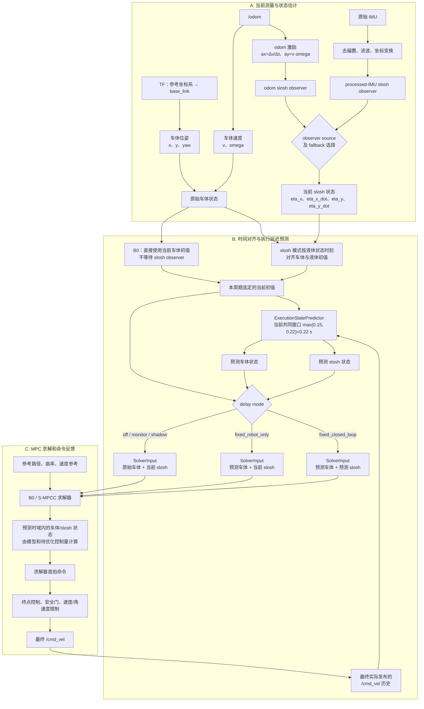

# 八月底开学时遇到的 S-MPCC 代码问题总结

日期：2026-08-30

详细修改方案见：`src/scout_apps/control/spmpc_local_planner/代码改进方案与现状.md`。

## 1. 当前结论

当前没有证据表明某次提交直接把 B0 的核心数学模型改坏了。B0 的状态、控制量、主要代价和生成求解器相较于以前成功的版本基本没有变化。

这次跟踪效果差，主要是新的实验设置和新路径把原来就存在的问题暴露了出来：

1. 以前成功的 B0 使用了真正生效的延迟补偿；当前 C02 试跑使用 `shadow`，只记录“如果补偿会怎样”，没有把补偿后的状态送进求解器。
2. 控制命令每一拍都从滞后的实测速度重新计算，不能沿上一拍命令继续积累转向能力。
3. 设置的 `V_REF=0.10 m/s` 只是优化软目标，不是速度硬上限；实车实际最高约为 `0.36 m/s`。
4. C02_v2 是连续 S 弯，需要快速左右换向，比以前的平滑路径更容易暴露转向滞后。
5. 终点控制从剩余约 `1.2 m` 时开始介入，覆盖了最后一个弯，并修改了部分速度和角速度命令。

一句话概括：

> 不是新的路径本身坏了，也不是 ACADOS 求解失败；而是延迟没有真正补偿、实际速度过快、转向命令建立太慢和终点控制提前介入共同造成了跟踪误差。

## 2. C02_v2/B0/a02 的主要证据

该次 bag 数据完整，自动 postflight 为 `pass=true`，最终也到达了终点；但是“数据录完整”和“车跟踪得好”是两件事。

主要行为指标：

- 设置速度：`0.10 m/s`；
- 发布速度 P95/最大值：约 `0.350/0.363 m/s`；
- 横向误差 P95/最大值：约 `0.149/0.159 m`；
- 航向误差 P95/最大值：约 `0.400/0.410 rad`；
- `1180` 个求解周期中，有 `645` 个周期的角加速度接近硬上限；
- 没有 solver failure，也没有 safety gate 先触发；
- 在 S 弯换向处，求解器已经看见前方曲率，但发布角速度换向仍晚约 `1.8～2.4 s`；底盘本身的物理延迟只有约 `0.1～0.2 s` 量级，因此主要滞后先出现在控制链内部。

所以后续不能只检查 `GOAL_REACHED`，还必须检查速度、横向误差、航向误差、转向饱和和换向时序。

## 3. MPC 模型的状态输入

S-MPCC 的模型状态分为两部分：车体状态和液体晃动状态。

### 3.1 车体状态

B0 的求解状态为：

```text
[x, y, yaw, v, s, omega]
```

含义：

- `x, y, yaw`：机器人在地图中的位置和朝向；
- `v, omega`：机器人线速度和角速度；
- `s`：机器人在参考路径上的进度。

这些信息主要来自 `/odom`、定位 TF 和路径投影。延迟补偿开启后，还要利用历史控制命令，把实测状态预测到新命令真正开始生效的时刻，再送入求解器。

### 3.2 Slosh 状态

slosh 版本在 B0 六维状态后面增加：

```text
[eta_x, eta_x_dot, eta_y, eta_y_dot]
```

它们表示液体在两个平面方向上的晃动状态和晃动速度。

正式流程不是把原始 IMU 数据直接放进求解器，而是：

```text
原始 IMU
→ 去重力、去偏置、滤波和坐标转换
→ 得到底盘运动激励
→ 液体状态估计器结合 slosh 模型进行更新
→ 得到四维 slosh 状态
→ 与车体状态对齐到同一时刻
→ 输入 S-MPCC
```

因此，更准确的说法是：

> slosh 状态优先由处理后的 IMU 和液体动力学模型共同估计，而不是把 IMU 加速度直接当成液面状态。

当前还保留 odom 驱动的液体状态通道用于对照或降级，但正式配置必须明确选择数据源，并记录是否发生回退。

### 3.3 B0 是否使用 IMU

B0 没有 slosh 状态。B0 实验可以继续录制和处理 IMU，但 IMU 只用于离线分析和诊断，不进入 B0 求解器。bag 中应明确记录：

```text
slosh_enabled=false
state_alignment_status=LIQUID_NOT_CONSUMED
```

## 4. 延迟模块的简单解释

车辆从“收到控制命令”到“真正做出动作”会慢一小段时间。延迟模块的作用，就是根据当前测量和过去发布的命令，估计“新命令开始生效时，车实际会在哪里、以什么速度运动”。

当前代码有 5 种模式：

先明确表中的三类数据：

- **当前车体状态**：`x/y/yaw` 来自 TF，`v/omega` 来自 `/odom.twist`；
- **当前 slosh 状态**：来自选定的 slosh observer，默认是 odom 激励驱动的液体模型，也可以显式选择 processed IMU；
- **命令历史**：终点控制、安全检查和限幅后最终发布的 `/cmd_vel`，它是命令而不是底盘真实运动测量。

| 模式                  | 延迟模块读取的数据               | 延迟模块做什么                             | MPC/S-MPCC 实际收到的状态       |
| --------------------- | -------------------------------- | ------------------------------------------ | ------------------------------- |
| `off`               | 不运行延迟预测                   | 完全关闭延迟处理                           | 当前车体 + 当前 slosh           |
| `monitor`           | odom 新鲜度、命令历史和时间状态  | 只监测，不计算预测状态                     | 当前车体 + 当前 slosh           |
| `shadow`            | 当前车体 + 当前 slosh + 命令历史 | 计算预测车体和预测 slosh，仅用于记录和诊断 | 当前车体 + 当前 slosh           |
| `fixed_closed_loop` | 当前车体 + 当前 slosh + 命令历史 | 使用同一预测窗口前推车体和 slosh           | **预测车体 + 预测 slosh** |
| `fixed_robot_only`  | 当前车体 + 当前 slosh + 命令历史 | 预测器仍可计算两部分，但只应用车体预测结果 | **预测车体 + 当前 slosh** |

延迟模式不会自动切换传感器数据源；slosh 使用 odom 还是 processed IMU，由独立的 `slosh_observer/source` 参数决定。B0 根本不消费 slosh 状态，因此 B0 的 `fixed_robot_only` 实验可简化为：

```text
TF 位姿 + odom 速度 + 最终 /cmd_vel 历史
                       ↓
              预测车体状态进入 B0
```

这里的 `shadow` 只是“延迟补偿不进入求解器”，不是说整个 planner 不控车；车仍然会按未补偿的求解结果运动。

不同时期并非一直使用同一模式：

- 当前 C02 动捕路径试跑脚本和 G3R3 短时域方案使用 `shadow`；
- 历史上跟踪成功的 B0 使用 `fixed_closed_loop`，线速度和角速度延迟分别约为 `0.15 s` 和 `0.22 s`；
- 通用启动入口也可以使用 `off`，因此不能只看脚本名称，每次实验都要在 meta 和 effective config 中核对实际模式。

### 4.1 延迟补偿修改后的正确关系

当前 `shadow` 模式只生成诊断结果，不改变求解器输入。后续修改需要让补偿真正进入闭环：

```text
实测车体状态 + 历史命令
              ↓
预测到命令生效时刻的车体状态

当前 slosh 估计状态 + 同一段运动历史
              ↓
预测到同一时刻的 slosh 状态

两部分状态时间一致
              ↓
送入 S-MPCC 求解器
```

线速度通道延迟约为 `0.15 s`，角速度通道延迟约为 `0.22 s`。实现时可以分通道描述执行器响应，但最终必须形成同一物理时刻的一套完整车体状态，不能把 `v` 和 `omega` 分别留在两个不同时间点。

### 4.2 从传感器到 MPC 的完整数据流



阅读这张图时要注意：

- 车体的原始状态是“TF 位姿 + odom 速度”；planner 不直接用 IMU 生成车体的 `x/y/yaw/v/omega`。
- slosh 状态是 observer 结合液体模型估计的，不是 odom 或 IMU 直接给出的。当前默认源是 `odom`；只有显式选择 `processed_imu` 时，处理后的 IMU 才进入 slosh observer。
- B0 不消费 slosh 状态。`fixed_robot_only` 只把预测车体替换进求解器；当前要求车体/液体共同时刻的 slosh 求解器不允许使用这个模式。
- 延迟预测使用最终已发布的 `/cmd_vel` 作为前推驱动，而不是再读一次未来 odom。这仍是基于命令的模型预测，不是对底盘真实运动的新测量。
- 求解器内的预测时域是另一层预测：它从选定的 `SolverInput` 出发，使用车体/液体模型和待优化控制量计算未来，不使用“未来的 odom 或 IMU”。
- NOKOV topic 在当前对比实验中主要用于录制和离线真值验证，不直接进入 planner；如果以后有上游节点用 NOKOV 发布 planner 所查询的 TF，它才会通过 TF 间接影响车体位姿。

## 5. 修改方案如何保持模块化

修改时不要一次把所有问题混在一起。建议保持以下模块边界：

| 模块           | 只负责什么                                             |
| -------------- | ------------------------------------------------------ |
| 数据完整性检查 | 检查 bag、topic、时间戳、路径 SHA 和求解器产物是否完整 |
| 跟踪质量检查   | 检查速度、横向误差、航向误差、饱和、换向和终点行为     |
| 速度契约       | 区分期望速度`v_ref` 和独立安全速度硬上限             |
| 延迟预测       | 根据实测状态和历史命令生成命令生效时刻的状态           |
| 参考几何       | 统一提供路径位置、航向、曲率和曲率变化率               |
| 可行速度规划   | 根据曲率、角速度和角加速度约束计算能跟上的速度         |
| 跟踪安全门     | 区分合法转弯和真正失控或原地自旋                       |
| 终点控制       | 只负责尾段减速、捕获终点和停车                         |
| OCP 代价       | 使用统一参考，处理位置、航向和角速度跟踪收益           |

其中，B0 与 slosh 必须共用车体跟踪、参考路径、延迟补偿、安全门和终点控制。slosh 版本只能在此基础上追加液体状态、液体代价和液体约束，不能让 slosh 版本单独获得更好的车体控制。

## 6. 推荐实施顺序

1. 先冻结失败数据并补自动测试，不改变控制行为；
2. 增加独立的跟踪质量检查；
3. 修复速度硬上限；
4. 修复延迟补偿和命令建立逻辑；
5. 拆出独立的跟踪安全门；
6. 统一参考路径的航向和曲率口径；
7. 增加满足角速度、角加速度约束的速度规划；
8. 再加入航向和曲率角速度跟踪；
9. 最后分别修复路径投影和终点控制。

每一步都应单独测试、单独记录，不能同时修改路径、速度、延迟、权重和物理上限，否则无法判断究竟是哪项修改起作用。

## 7. 下一次实物实验前的门槛

当前不要直接开始正式 R01。代码修改和仿真通过后，先继续使用冻结的 C02_v2 做一次新的 B0 低速安全试跑。

只有同时满足以下条件，才允许开始 R01～R05：

- 实际发布速度没有超过独立安全上限；
- 横向误差和航向误差通过冻结门限；
- 左右换向不再明显滞后；
- 延迟补偿实际生效，而不只是配置成 `shadow`；
- 没有未解释的终点控制或安全门干预；
- bag 数据完整并最终正常停车。

## 8. 后续测量 NOKOV 延迟的简单方案

可以暂时假定 IMU 的延迟较小，通过比较 IMU 和 NOKOV 看到同一次车体转动的时间，估计 NOKOV 相对 IMU 的延迟。

建议测量方法：

1. 将 IMU 和 NOKOV 刚体 Marker 固定在同一车体上；
2. 让车原地左右转动多次，同时录制 IMU 原始角速度、NOKOV pose、`/mocap/status`、`/odom` 和 `/cmd_vel`；
3. 从 NOKOV 的姿态中计算 yaw，再求导得到 NOKOV 角速度；
4. 将 NOKOV 角速度和 IMU 的 `angular_velocity.z` 做互相关，两条曲线最佳对齐时的时间差就是估计的相对延迟；
5. 左、右方向至少重复 10 次，最后记录中位数和 P95，不要只使用一次起步阈值的结果。

`/mocap/scout_odom` 的 twist 为 0 不影响这项分析，因为 NOKOV 角速度应从 pose 离线计算。应优先使用 IMU 原始陀螺仪数据，避免把姿态滤波延迟算进去。

这个结果应命名为“NOKOV 相对 IMU 延迟”，不能直接称为“NOKOV 绝对延迟”。如果后续需要绝对延迟，还需要光电传感器、硬件触发器或统一硬件时钟作为独立基准。

### 8.1 一键快速测量入口

传感器栈和 NOKOV 监测已经启动后，执行：

```bash
cd /home/geist/scout_ws && \
LATENCY_TEST_ID=N01 \
ATTEMPT=01 \
bash src/scout_apps/sensors/nokov_mocap_monitor/scripts/run_mocap_imu_relative_latency_trial.sh
```

该脚本不会发布 `/cmd_vel`，也不会自动移动车辆。默认流程为：

```text
静止 5 s
→ 操作者用遥控/受监督 teleop 让车原地左右转动 30 s
→ 静止 5 s
→ 自动停止并封存 bag
→ 自动互相关分析并生成 JSON、Markdown、CSV 和图片
```

运动阶段应大约每 `1～2 s` 左右反转一次，至少完成 10 次清晰换向。脚本会先检查 IMU、NOKOV pose、odom 和 `/mocap/status`；默认拒绝在已有 `/cmd_vel` 发布者时启动，避免未停止的 planner 意外控车。

输出默认位于：

```text
/home/geist/slosh_bags/real/<date>_mocap_imu_relative_latency/
```

结果中正值表示 NOKOV 比 IMU 晚，负值表示 NOKOV 更早或 IMU 更晚。只有结果为 `USABLE_RELATIVE_LAG_ESTIMATE` 时才记录延迟数值；激励太弱、相关性太低或最佳值落在搜索边界时，脚本会返回 `INCONCLUSIVE`，不给出可用补偿值。
