# 20260902 底盘速度连续性快速测试分析

> 日期：2026-09-02
>
> 性质：development 底盘快速诊断，不作为额定极速或正式标定结果
>
> 协议：`MOCAP_VELOCITY_CONTINUITY_V1`、`MOCAP_HARDWARE_ACCEL_LIMIT_V2`
>
> 归档定位：底盘执行连续性与 SMPCC 命令连续性问题的后续判断依据
>
> 对应方案：[20260902_底盘速度连续性快速测试.md](../实物对比实验/20260902_底盘速度连续性快速测试.md)

## 0. 当前实验 MPC 闭环框架

> 本图对应 20260901 使用的 `processed-IMU I0 + fail_closed + common_epoch + legacy fixed_closed_loop` 实验组合，不代表程序默认配置。B0 与 Bslosh-short100 的输入链并不相同。

```text
[1. 参考与测量]

/scout/global_path_fixed ───────────────→ 路径投影与速度参考
TF：x、y、yaw + /odom：v、omega ───────→ 机器人状态
/imu/data → processed-IMU → I0 observer → 液体状态
                              ↓
[2. 求解初态：按 variant 分支]

B0：
  最新机器人状态 → legacy fixed_closed_loop → L22 robot → 6D solver
  （不消费 I0；I0 失效不会直接触发在线停车）

Bslosh-short100：
  I0 READY/fresh？── 否 → fail_closed 发布零速
         │是
         ↓
  robot 对齐至 I0 时刻 ── 失败 → fail_closed 发布零速
         │成功
         ↓
  common epoch(robot + liquid) → legacy fixed_closed_loop
                               → L22 robot + L22 liquid → 10D solver

legacy L22：用最终 /cmd_vel 历史作 ZOH rollout；统一滚动
max(线延迟 0.15 s，角延迟 0.22 s) = 0.22 s。
预测守卫不通过时不应用 L22，保留未前推的输入状态。
                              ↓
[3. continuous_mpcc_acados]

30 Hz，dt ≈ 33.3 ms，N = 60，预测约 2.0 s
状态：robot = [x,y,yaw,v,s,omega]；Bslosh 另加 4 维液体状态
控制：[a, alpha, v_s]；short100 仅在状态节点 0..3 计算液体代价
                              ↓
只取首拍生成速度：
v_cmd = v(x0) + a0·dt；omega_cmd = omega(x0) + alpha0·dt
                              ↓
[4. 输出与真实反馈]

solver/终点限幅 → terminal/tracking gates → 公共限幅
→ execution contract → speed safety contract → 最终 /cmd_vel
  ├→ 写入命令历史 → 下一轮 L22
  └→ scout_base_node / 驱动器 → 真实底盘
                               ├→ odom、IMU、LiDAR/TF → 下一轮求解
                               ├→ 真实液体 → RGB（仅离线液面评估）
                               └→ NOKOV（仅离线运动评估）
```

当前确定的结构缺口是：OCP 没有显式区分 `command` 与 `actual`，也没有建模线、角通道各自的 `L/τ/K`；实车约 `0.12～0.20 s` 的起效与渐进建立过程只被 legacy L22 粗略近似。

## 1. 结论

两包均完整有效。对平滑、连续的 `/cmd_vel` 输入，底盘能够连续建立和降低速度，没有发现与此前 Bslosh 实物表现相同的“一卡一卡”。

主要依据是：

1. 最终 `/cmd_vel` 与带时间戳的录制副本数值误差为 `0`，确认实际发布命令本身连续且 bag 没有录错命令。
2. odom 在两种轮廓下均平滑，爬升形状拟合 `R²` 分别为 `0.9979/0.9985`，加速段显著掉速均为 `0` 次。
3. IMU 加速度能够分别复现“近似恒定加速度”和“随时间线性增加的加速度”，支持真实车体运动是连续的。
4. NOKOV 位置推导速度存在明显尖齿，但这些尖齿没有在 odom 和 IMU 中同步出现。梯形包约 `1.7 s` 的孤立大尖峰尤其如此，应判为动捕位置求导异常，不是底盘真实瞬时加减速。

因此，本轮不支持“底盘收到平滑命令后会自行周期性顿挫”的判断。若 SMPCC/Bslosh 仍然一卡一卡，应优先检查 solver 生成并最终发布的命令是否连续，而不是先归因于底盘硬件。

## 2. 有效数据

数据目录：

```text
/home/geist/slosh_bags/real/20260902_mocap_velocity_continuity_v1/development
```

有效 bag：

```text
DEV_CHASSIS_CONT_TRAP_LIN_F_V080_a01.bag
DEV_CHASSIS_CONT_LA_LIN_F_V080_a01.bag
```

两包的共同设置为：

```text
目标速度       = 0.80 m/s
静止/加速/恒速/减速/静止 = 3/3/2/3/3 s
命令发布频率   = 约 50 Hz
NOKOV 频率     = 约 90 Hz
IMU/odom 频率  = 约 50/50 Hz
```

### 2.1 发送的速度如何生成

脚本发送的是速度，不发送加速度。每个周期直接计算一个 `geometry_msgs/Twist`，把结果写入 `/cmd_vel.linear.x`。

统一记号为：

```text
V = 0.80 m/s             # 目标速度
T = 3.0 s                # 单个加速段或减速段的总时长
t = 当前加速段或减速段开始后的实际经过时间，范围 0～3 s
p = t / T                # 当前阶段完成比例，范围 0～1
```

这里的 `t` 不是从实验开始一直累计的全局时间，也不是固定增加的整数。代码在每个阶段开始时记录单调时钟，然后每一轮使用：

```text
t = 当前单调时钟 - 本阶段开始时的单调时钟
```

发布频率设为 `50 Hz`，所以相邻两次速度计算的名义时间间隔为：

```text
Δt = 1 / 50 = 0.020 s
```

两包实测命令频率分别约为 `50.2052/50.2050 Hz`，即实际平均间隔约 `19.9 ms`。程序始终使用真实经过的 `t` 代入公式，因此单次调度轻微抖动不会逐周期累积成速度误差。

#### 梯形速度

加速阶段使用：

```text
v(t) = V × p = 0.80 × t / 3
```

随后保持 `v=0.80 m/s` 共 `2 s`；减速阶段使用：

```text
v(t) = V × (1-p) = 0.80 × (1-t/3)
```

因此加减速度大小恒定为 `V/T≈0.2667 m/s²`。按 `20 ms` 的名义发布间隔，相邻命令速度约变化 `0.00533 m/s`。

#### 线性增加加速度

加速阶段使用：

```text
v(t) = V × p² = 0.80 × (t/3)²
a(t) = 2Vt/T² = 2 × 0.80 × t / 3²
```

随后保持 `v=0.80 m/s` 共 `2 s`；减速阶段使用：

```text
v(t) = V × (1-p²) = 0.80 × [1-(t/3)²]
a(t) = -2Vt/T²
```

这条速度公式等价于对预设的线性变化加速度进行解析积分，但代码直接计算上述速度公式，没有对 IMU 加速度做数值积分。这样可以避免 IMU 零偏和每周期积分误差累积。

## 3. 定量结果

下表以 odom 连续性结果为主；“有效对齐延迟”只是连续曲线的整体对齐量，不替代阶跃实验的纯延迟和时间常数辨识。

| 指标                     |       梯形速度 | 线性增加加速度 |
| ------------------------ | -------------: | -------------: |
| NOKOV 实测净位移         |        4.096 m |        4.100 m |
| NOKOV 横向 5%～95% 范围  |         2.7 mm |         3.0 mm |
| odom 有效对齐延迟        |        0.200 s |        0.190 s |
| odom 对齐增益            |          1.011 |          1.007 |
| odom 恒速中位值          |     0.7980 m/s |     0.7980 m/s |
| odom 恒速标准差          |    0.00350 m/s |    0.00301 m/s |
| odom 恒速标准差/目标速度 |         0.437% |         0.376% |
| odom 加速形状`R²`     | 0.9979（一次） | 0.9985（二次） |
| odom 加速段显著掉速      |           0 次 |           0 次 |
| odom 加速度正负翻转      |           1 次 |           0 次 |

梯形速度的命令加速度约为 `0.265 m/s²`，odom 拟合值为 `0.274 m/s²`。线性增加加速度的命令末端加速度约为 `0.530 m/s²`，odom 拟合值为 `0.537 m/s²`；命令/odom jerk 约为 `0.178/0.175 m/s³`。两种轮廓的幅值和形状均吻合。

实际净位移均约为 `4.10 m`，与理论 `4.00 m` 接近。用户现场观察终点仍有约 `3～4 m` 余量，也与该估计一致。

## 4. NOKOV 尖齿如何解释

NOKOV 推导速度的恒速标准差为：

```text
梯形速度       0.0199 m/s
线性增加加速度 0.0293 m/s
```

它们明显高于同包 odom 的 `0.0035/0.0030 m/s`。NOKOV 的加速度和每 `20 ms` 速度变化图也出现大量正负尖峰；但：

- odom 没有对应掉速；
- IMU 没有对应的同相大冲击；
- 两包的整体速度形状仍分别达到 NOKOV `R²=0.9761/0.9962`；
- 实测横向漂移范围只有约 `3 mm`。

所以 NOKOV 尖齿不能直接统计成底盘掉速次数。它更符合“由离散位置求导时放大采样间隔和微小位置误差”的表现。原始 NOKOV 曲线保留用于审计，不通过过度平滑把异常隐藏；连续性主判断采用 odom，并由 IMU 交叉验证。

## 5. 发布和录制链完整性

| 指标                 | 梯形速度 | 线性增加加速度 |
| -------------------- | -------: | -------------: |
| 命令副本匹配率       |     100% |           100% |
| 命令数值最大误差     |        0 |              0 |
| 两命令话题时间差 P95 | 0.463 ms |       0.572 ms |
| NOKOV 到包时间差 P95 | 0.254 ms |       0.318 ms |
| odom 到包时间差 P95  | 0.322 ms |       0.403 ms |
| IMU 到包时间差 P95   | 0.468 ms |       0.644 ms |

这些传输时间均远小于约 `0.19～0.20 s` 的运动曲线有效对齐量，不能用 rosbag 写入时间解释底盘响应。

## 6. 十张核心曲线

图中的灰色虚线都是根据直接发布的速度命令得到的参考曲线。速度命令由时间公式直接生成，并不是用 IMU 加速度积分出来的。

### 6.1 梯形速度：恒定加速度

#### 图 1：NOKOV 实际速度

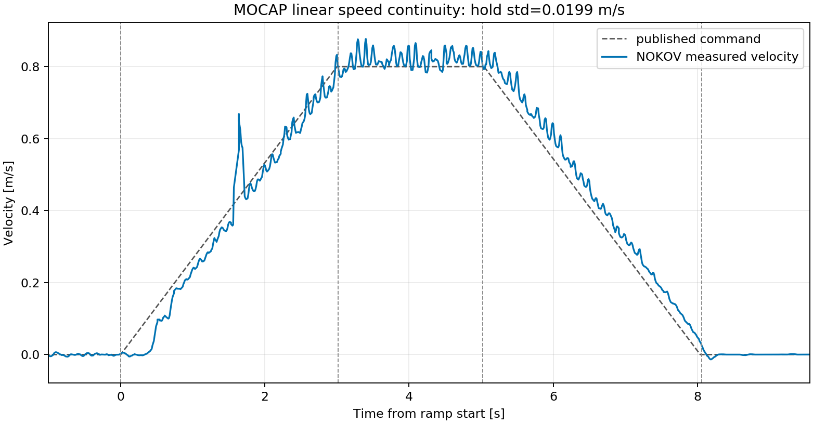

蓝线是由 NOKOV 位置对时间求导得到的实际速度。整体能够跟随梯形速度，但位置求导放大了动捕噪声；约 `1.7 s` 的孤立尖峰没有得到 odom 和 IMU 支持，不按真实底盘顿挫解释。

#### 图 2：对应的 NOKOV 加速度

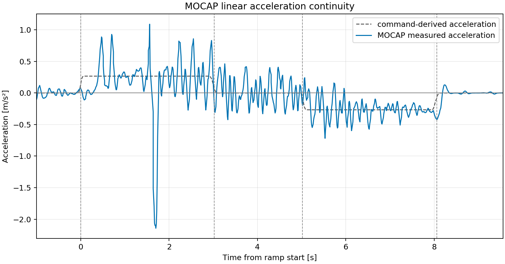

蓝线由上方同一条 NOKOV 速度曲线继续求导得到。整体正负趋势与灰色命令加速度一致，但速度中的小尖齿经过再次求导后被明显放大；约 `1.7 s` 的负尖峰不是可信的真实瞬时制动。

#### 图 3：odom 速度

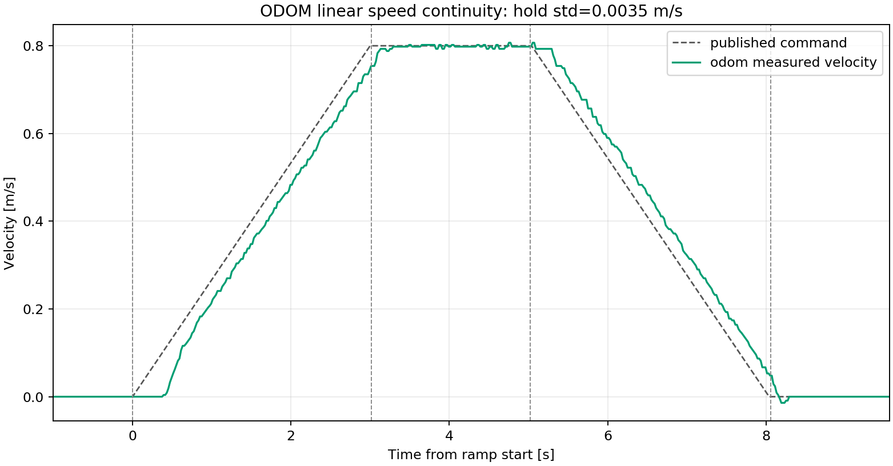

绿线是底盘 odom 直接报告的速度。加速、恒速和减速均连续，恒速标准差只有 `0.00350 m/s`，是判断本包速度连续性的主图。

#### 图 4：对应的 odom 加速度

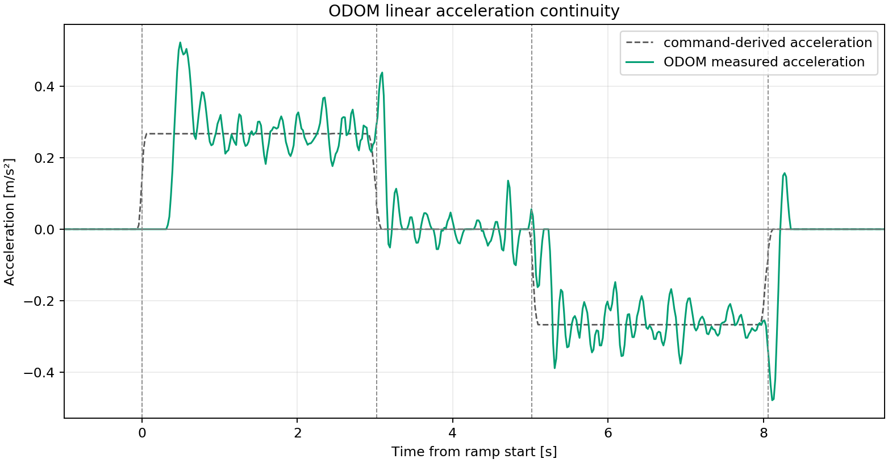

绿线由上方 odom 速度求导得到，采用与 NOKOV 相同的 `0.12 s` 局部斜率窗口。除加减速切换处的短暂过渡外，曲线稳定围绕理论 `±0.265 m/s²`，明显比 NOKOV 二次求导结果平滑。

#### 图 5：IMU 加速度

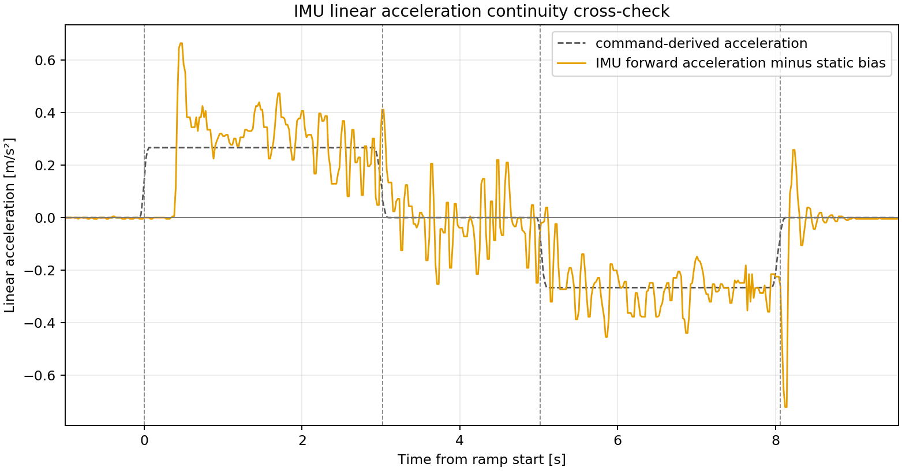

橙线是去除静止偏置后的 IMU 前向加速度。它能够复现“正恒定加速度—接近零—负恒定加速度”的主要过程，说明车体确实连续完成了加速和减速。

### 6.2 线性增加加速度：二次速度边沿

#### 图 6：NOKOV 实际速度

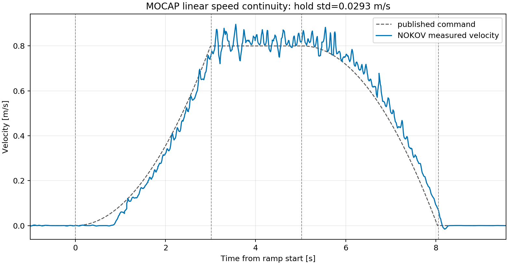

蓝线是 NOKOV 位置求导速度。整体跟随二次速度边沿，细小尖齿仍主要来自位置求导，因此只用它判断真实速度趋势，不单独统计底盘掉速。

#### 图 7：对应的 NOKOV 加速度

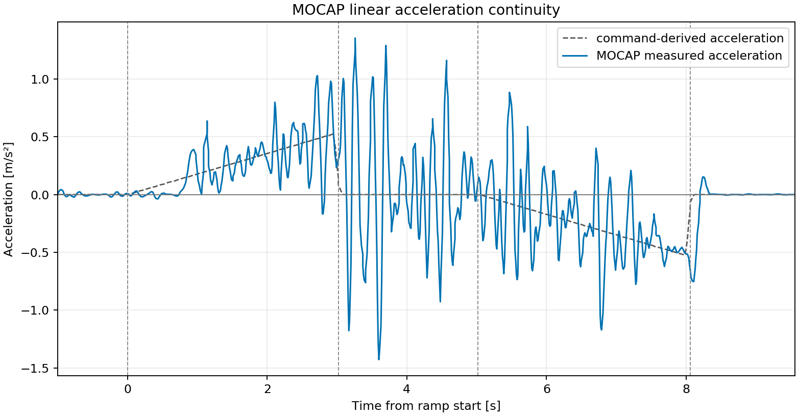

灰色虚线是随时间增加的理论加减速度，蓝线是 NOKOV 二次求导结果。蓝线的总体包络能够反映先增强加速、后增强减速，但恒速附近的大幅正负尖峰没有得到 odom 和 IMU 支持，不能当成真实加速度突变。

#### 图 8：odom 速度

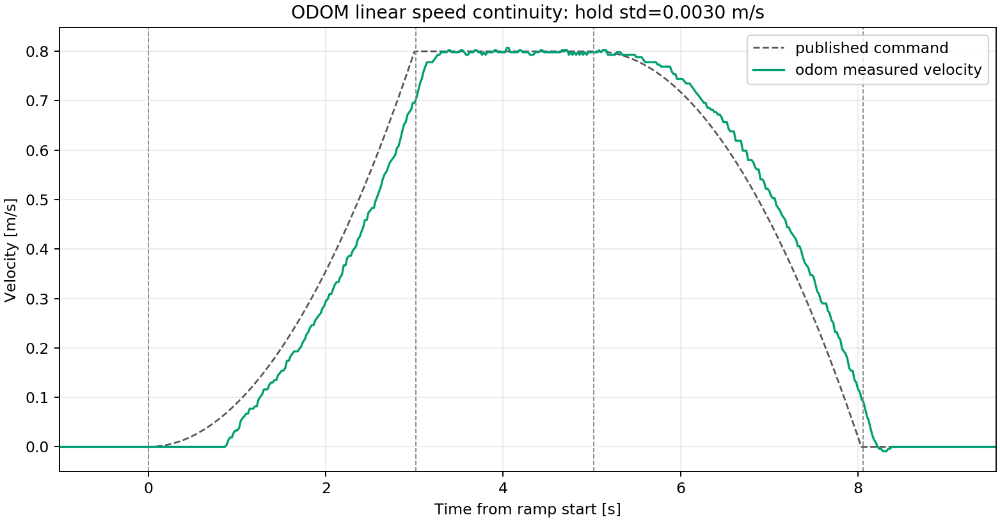

绿线清楚显示底盘能够连续执行弯曲的速度边沿，没有突然掉速；二次形状拟合 `R²=0.9985`，恒速标准差为 `0.00301 m/s`。

#### 图 9：对应的 odom 加速度

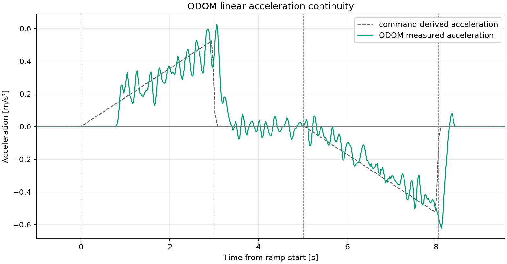

绿线能够清楚复现理论加速度逐渐增大和逐渐减小的斜坡，末端拟合值为 `0.537 m/s²`，与理论 `0.530 m/s²` 接近。小幅周期纹波存在，但没有 NOKOV 加速度中的大尖峰和频繁正负翻转。

#### 图 10：IMU 加速度

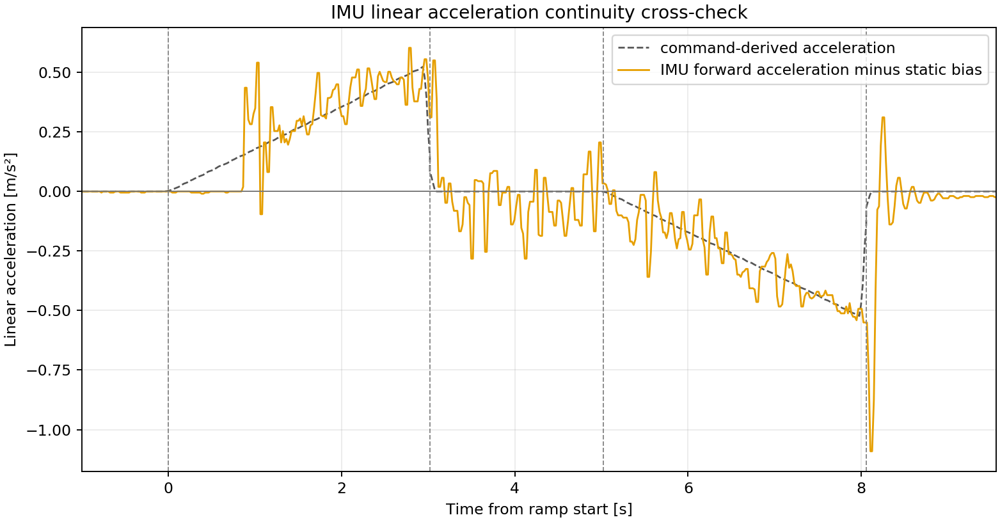

橙线是 IMU 实测加速度。加速段总体随时间增加，减速段总体随时间向负方向增加，与预设轮廓一致，进一步支持底盘运动是连续的。

简要阅读顺序：先看图 3、图 8 判断速度是否一卡一卡，再看紧随其后的图 4、图 9 检查 odom 加速度，最后用图 5、图 10 的 IMU 交叉验证。图 1、图 6 用于确认相对地面的整体速度趋势；图 2、图 7 是对应的 NOKOV 加速度，但只用于观察总体趋势和动捕求导噪声。

## 7. 后续决策

本轮两包已经回答“底盘在连续命令下是否自行卡顿”，不需要为了凑重复继续采集。随后已完成独立的《[底盘硬件有效加减速度上限三档测试](../实物对比实验/20260902_底盘硬件有效加减速度上限三档测试.md)》：H01=`0→0.8 m/s`、H02=`0→1.5 m/s`、H03=`0→3.0 m/s` 三包均有效，结果见第 8 节。该结果不改变本节关于速度连续性的结论。

下一步应回到 SMPCC 数据链：把 solver 计划速度、最终 `/cmd_vel`、odom、NOKOV 和 IMU 放在同一包中，检查 Bslosh 卡顿发生时最终命令是否也发生离散跳变。若命令本身跳变，底盘只是忠实执行该命令；若命令平滑而三路实测同步顿挫，才需要重新打开底盘执行问题。

## 8. 实物最高加减速度三档辨识

### 8.1 结论

当前高速挡、约 `27.7 V` 电池、当前负载和地面条件下，底盘与驱动器的**持续有效线加速度上限约为 `3.0 m/s²`**。H02 到 H03 已进入饱和区，继续把速度命令从 `1.5 m/s` 加大到 `3.0 m/s`，没有让实际加速度继续明显增加。

建议区分三个数值：

- 实物辨识上限：`a_hw,eff≈3.0 m/s²`，用于描述当前整车实际能力；
- 短时峰值：约 `4.0～4.3 m/s²`，只作瞬态证据，不能直接作为规划或限幅参数；
- 若以后需要设置高性能底盘约束，建议不超过 `2.5 m/s²`，给电量、负载和地面变化留出余量。

当前 SMPCC 配置中的 `robot.a_max=0.6 m/s²` 和最终命令线加速度限制 `linear_accel_max=0.6 m/s²` 仅约为实物能力的 `20%`。因此，当前低速 SMPCC 实验并没有撞到硬件加速度上限；不能用“底盘加速能力不足”解释此前 Bslosh 的一卡一卡。现阶段也不应仅凭本次硬件测试就把 SMPCC 的 `0.6 m/s²` 改成 `2.5～3.0 m/s²`。

### 8.2 有效数据

数据目录：

```text
/home/geist/slosh_bags/real/20260902_mocap_hardware_accel_limit_v2/development
```

有效 bag：

```text
DEV_CHASSIS_HWACC_H01_LIN_F_V080_a01.bag
DEV_CHASSIS_HWACC_H02_LIN_F_V150_a01.bag
DEV_CHASSIS_HWACC_H03_LIN_F_V300_a01.bag
```

三包均满足 `acceleration_capability` 验收，NOKOV、odom、IMU 的加速和制动证据均有效；底盘 `fault_code=0`，控制模式均为 `1`。三包电池电压中位数约为 `27.7～27.8 V`，H03 最低瞬时电压为 `26.7 V`。

### 8.3 加速度数据

`10%～90%` 有效加速度反映整段速度建立能力；P95 是 `0.12 s` 局部斜率加速度曲线的高分位值。IMU 数据为去静止偏置、按约 `0.08 s` 平滑后，在启动至 NOKOV `t90` 区间内统计。

| 指标               | H01：0.8 m/s | H02：1.5 m/s | H03：3.0 m/s×1 s |
| ------------------ | -----------: | -----------: | ----------------: |
| NOKOV 实际峰值速度 |    0.894 m/s |    1.697 m/s |         3.042 m/s |
| odom 实际峰值速度  |    0.807 m/s |    1.509 m/s |         2.848 m/s |
| NOKOV 有效加速度   |  3.000 m/s² |  3.313 m/s² |       3.245 m/s² |
| odom 有效加速度    |  2.428 m/s² |  2.822 m/s² |       2.964 m/s² |
| NOKOV 加速度 P95   |  4.047 m/s² |  4.340 m/s² |       4.205 m/s² |
| odom 加速度 P95    |  2.705 m/s² |  3.207 m/s² |       3.109 m/s² |
| IMU 加速段中位值   |  2.786 m/s² |  3.014 m/s² |       2.903 m/s² |
| IMU 加速段 P95     |  3.962 m/s² |  4.180 m/s² |       3.597 m/s² |

H02 相对 H01，NOKOV/odom 有效加速度分别增加 `10.5%/16.2%`，说明 `0.8 m/s` 单档激励确实还不足以完全确认上限。H03 相对 H02，NOKOV 有效加速度反而降低 `2.1%`，odom 只增加 `5.0%`；两路加速度 P95 都降低约 `3.1%`。IMU 加速段中位值也保持在约 `2.9～3.0 m/s²`。三路共同支持“有效加速度在约 `3.0 m/s²` 饱和”。

NOKOV 的 `4.0～4.3 m/s²` P95 以及 IMU 的约 `4 m/s²` 初始峰值持续时间很短，且 odom 没有同等幅度的平台，不能把它们写成持续硬件上限。

### 8.4 制动能力和高速余程

| 指标                   |         H01 |         H02 |         H03 |
| ---------------------- | ----------: | ----------: | ----------: |
| NOKOV 有效减速度       | 2.691 m/s² | 3.322 m/s² | 3.643 m/s² |
| odom 有效减速度        | 3.085 m/s² | 3.296 m/s² | 3.187 m/s² |
| 零命令后停车距离       |     0.257 m |     0.615 m |     1.961 m |
| 从启动到停车总位移     |     1.666 m |     3.109 m |     3.170 m |
| IMU 检出的制动起效延迟 |     0.005 s |     0.064 s |     0.155 s |

可把当前高速制动的持续有效能力概括为约 `3.2～3.5 m/s²`。H03 在零命令之后仍继续建立速度：NOKOV/odom 的速度峰值分别出现在零命令后约 `0.145/0.177 s`，与 IMU 检出的约 `0.155 s` 制动起效延迟一致。H03 随后又前进约 `1.96 m` 才停车，因此高速安全距离不能只按理想公式 `v²/(2a)` 计算，还必须加入命令到制动实际起效的余程。

自动报告中 H03 基于“速度下降到阈值”的 `brake_onset_delay` 约为 `0.50 s`，它包含先继续加速、再从峰值降回阈值的时间，不是纯执行器制动死区。本节采用 IMU 负加速度首次持续出现的 `0.155 s` 作为更接近物理起效的证据。

### 8.5 对 SMPCC 的含义

1. 底盘能够在平滑命令下连续运动，而且物理加速度能力明显高于当前 SMPCC 的 `0.6 m/s²` 设计限制。
2. 当前跟踪较差或 Bslosh 顿挫的首要排查对象仍是 solver 输出、最终命令连续性和约 `0.12～0.17 s` 的动作起效延迟，不是硬件最高加速度不够。
3. 如果后续建立执行器预测模型，加速可先使用约 `3.0 m/s²` 的物理饱和值，制动可使用约 `3.2 m/s²`，并单独保留起效延迟；不要用 `4 m/s²` 尖峰替代持续能力。
4. 如果后续只调整 SMPCC 的安全运行参数，当前 `0.6 m/s²` 可以继续保持。是否提高它应由路径跟踪与液体安全实验决定，而不是由底盘能否做到决定。

### 8.6 自动曲线位置

每包的 `_plots/` 目录均包含独立的 NOKOV/odom 速度、NOKOV/odom 加速度和 IMU 加速度曲线。下面保留四张最直接的判断图。

#### 图 11：三档有效加速度

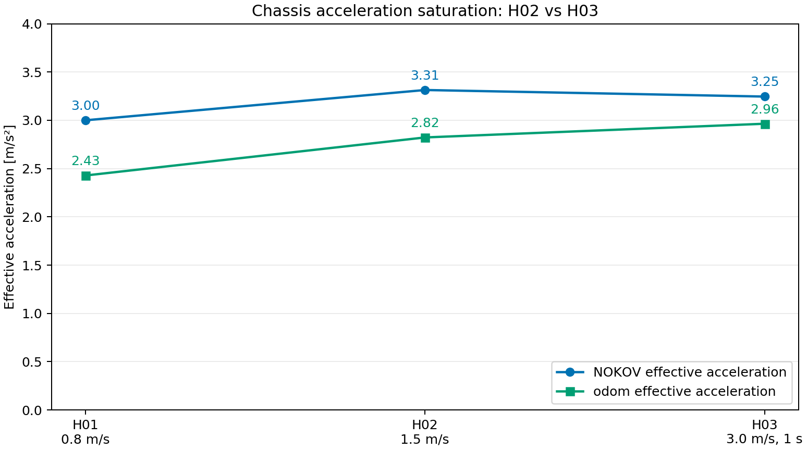

H01 到 H02 的有效加速度明显提高；H02 到 H03 基本变平，直接显示底盘已经进入约 `3.0 m/s²` 的有效加速度饱和区。

有效加速度 = 实际速度从 10% 上升到 90% 的速度变化量÷这段过程所用的时间

#### 图 12：H03 的 NOKOV 实际速度

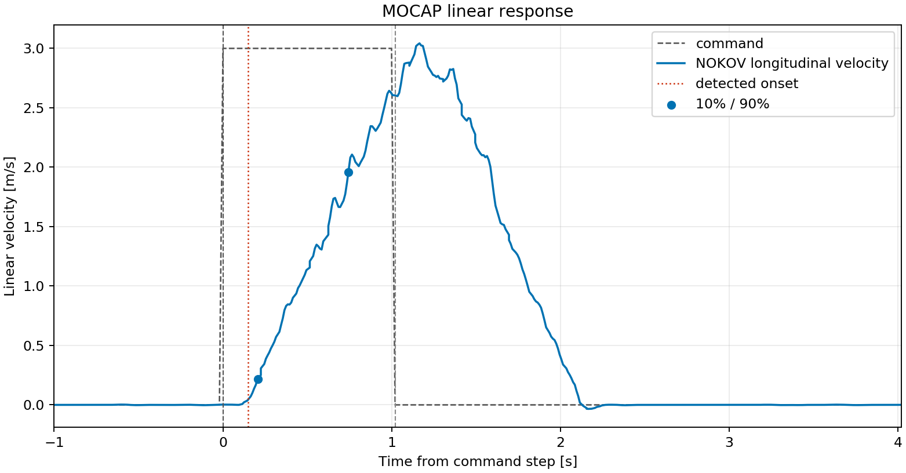

灰色虚线在约 `1.0 s` 回到零，但蓝色实际速度继续增加并在约 `1.15 s` 达到峰值，随后才下降。这说明高速下不能把零命令时刻直接当作制动已经起效。

#### 图 13：对应的 H03 NOKOV 加速度

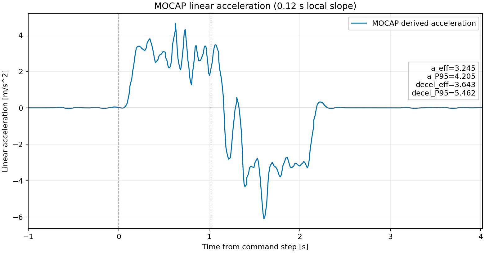

这张图由上方 H03 NOKOV 速度曲线求导得到。加速段大部分处于约 `2～4 m/s²`，有效加速度为 `3.245 m/s²`；制动段出现更大的负向尖峰，因此持续能力采用有效值和 P95，不采用最深单点峰值。

#### 图 14：对应的 H03 odom 加速度

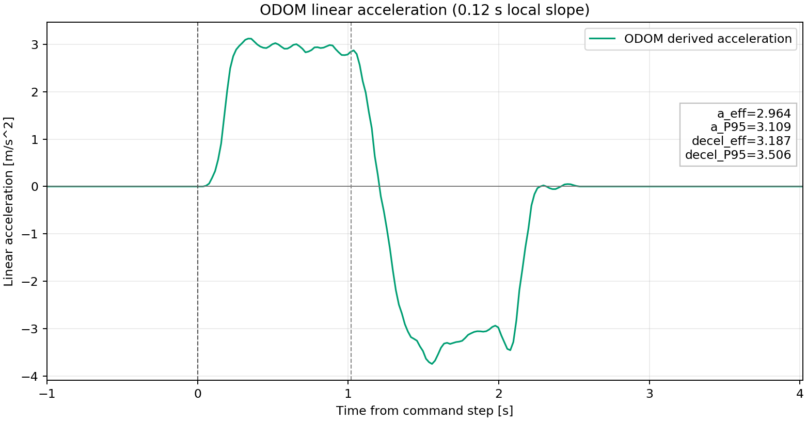

odom 加速度在主要加速阶段稳定在约 `3.0 m/s²`，有效值为 `2.964 m/s²`、P95 为 `3.109 m/s²`；制动有效值为 `3.187 m/s²`。它比 NOKOV 加速度平滑，并与 IMU 的整体平台一致，是约 `3.0 m/s²` 有效上限的重要交叉证据。

#### 图 15：H03 的 IMU 实测加速度

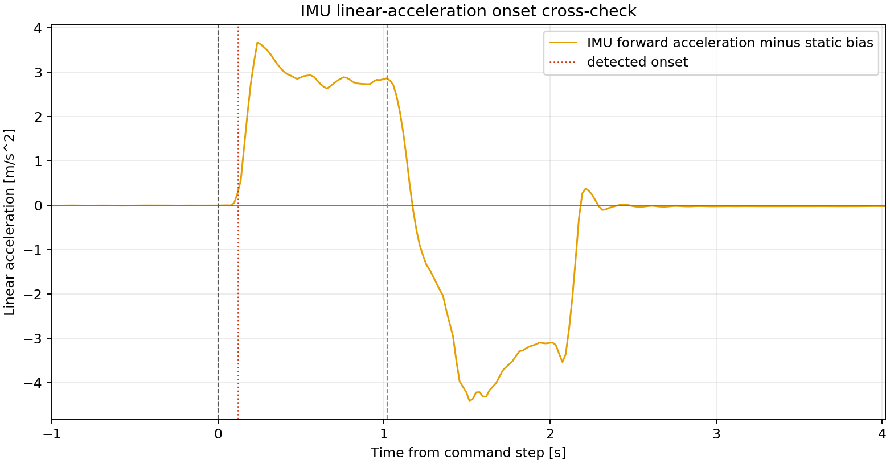

加速阶段大部分时间维持在约 `2.8～3.0 m/s²`，与有效上限结论一致；零命令后约 `0.15 s` 才出现持续负加速度，随后显示制动过程。

#### 图 16：零命令后的停车距离

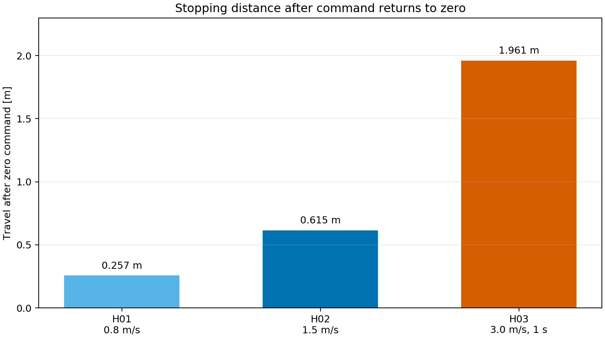

H03 零命令后仍前进约 `1.96 m`。该图反映的是实际高速余程，安全规划必须同时考虑起效延迟和减速度，不能只看最大加速度。

H03 的 1 秒短脉冲没有足够稳态区间，FOPDT 拟合无效是预期现象，不影响本节的加速度能力结论。

## 9. 是否重录 B0/Bslosh-short100

当前不原样重录 `processed-IMU I0 + fail_closed + fixed_closed_loop` 的 B0/Bslosh-short100。昨日两包均通过有效性检查，且 Bslosh-short100 的 RGB P95 由 B0 的 `1.357 mm` 增至 `7.663 mm`，solver 输出也已出现频繁加减速翻转。

本日底盘测试说明：平滑命令下底盘运动连续，加速度能力充足，现有线/角 `0.15/0.22 s` 只能继续作为主要工作点的 legacy 基线。昨日实验已经使用这组参数，因此今日结果不构成原样重录的新条件。

只有在执行器响应模型、状态时刻对齐或 solver 命令平滑机制发生实质修改后，才使用新 protocol 和新目录重新进行 B0/Bslosh-short100 对比。
