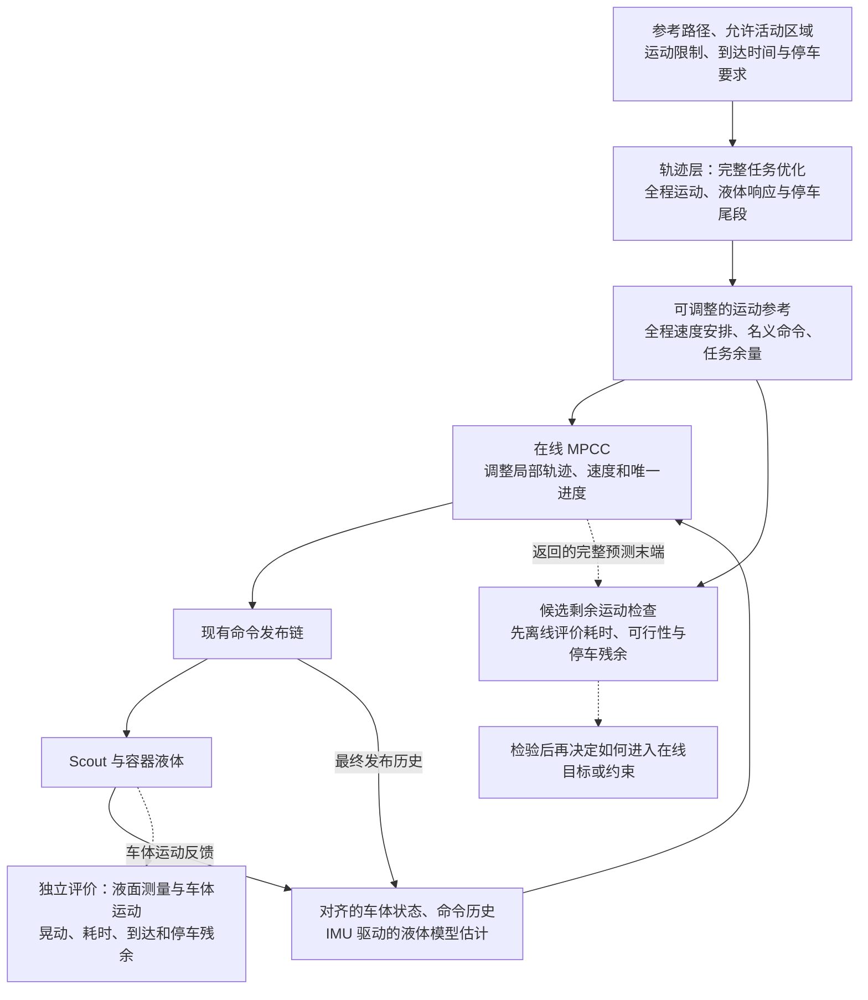

# 轨迹层与 MPCC 协同：框架修改思路

日期：2026-09-15。开发分支：`feat/spmpc-liquid-control`，核对基线 `f00ed4f`。状态：**文献支撑的方案草稿，供复盘；新轨迹层、参考接口和剩余段检查尚未实现**。本轮整理方法及代码方案，没有实施控制器或开展实验。实现顺序见[代码修改方案](20260915_轨迹层与MPCC协同代码修改方案.md)。

## 1. 要解决什么问题

**轨迹层提前安排全程运动，MPCC 根据实际运行情况调整接下来的动作。** 目标是在完成运输、满足运动边界和共同耗时要求的前提下降晃。

当前 MPCC 已能调整加减速、转向和进度，但贴线、速度跟踪、低速惩罚与进度奖励可能限制调整空间。旧版远期晃动预测偏小也可能影响动作选择；“跟踪太紧”还不是已确认根因。不能把地图上的轨迹重合解释成控制动作完全相同，也不能预设偏离越大越防晃。

`diag/lt-dwa-collision-tracking` 是用户此前一直使用的实物实验分支。9 月 14 日已记录的 diag 实验尚无重复的全程内部降晃收益；其随后四子步积分修正也不能由旧包直接验收。当前 feat 已有统一液体模型、四子步 RK4、代价缩放修正及可选完整停车；这些是软件基础，尚无对应新版本的实车降晃结论。

### 1.1 当前不足与本轮补充

| 不足 | 本轮明确的处理 | 仍需验证的内容 |
|---|---|---|
| 在线改速或改轨迹后，原全程消晃安排可能失效 | 按当前状态重新预测，并从预测末端检查候选剩余运动 | 剩余段检查能否影响动作、改善全程效果，以及运行开销 |
| 跟踪、进度、耗时与液体目标的关系不清 | 分开设计 contour、lag、速度、进度及液体目标，明确共同任务边界 | 可用调整空间、实际权衡和可行阈值 |
| 模块清单先于优化问题 | 先写已知量、决策、完整动力学、目标及终点条件，再确定参考接口 | 时间律参数化、跟踪可执行性、参考插值与优化精度 |
| 四组比较尚不能单独说明在线时序调整的作用 | 保留四组，再用同一防晃计划比较固定时序跟踪与在线进度调整 | 收益究竟来自计划、液体目标、时序调整还是额外耗时 |

本轮候选问题是：**全程防晃计划怎样指导允许改速、局部改轨迹的 MPCC，使其在实际执行偏差下仍能完成运输并控制晃动与停车残余？** 这是待验证的问题，不是已成立的新机制或效果结论。

### 1.2 论文机制与适配边界

| 论文 | 原文提供的方法 | 本方案采用或研究的部分 | 适配边界 |
|---|---|---|---|
| [R32]（总览 C01） | 全程时间律与液体状态联合优化；时间/jerk 折中、运输中及停机后液面限制 | 上层完整任务优化与停车尾段 | 原文固定路径版使用进度 jerk 和机械臂约束；改用 Scout 动力学与共同耗时要求属于适配 |
| [C06]、[B11] | 预先存储参考，在线估计与反馈跟踪；分别使用 Lyapunov MPC、TSMC/CBF | 上下层状态/输入参考接口，以及固定时序跟踪对照 | 未提供受扰后全程时序更新；C06 需要液体位置层输出，平坦性有直线等假设；两篇均为数值仿真 |
| [R08]、[D19]、[D20] | 联合优化运动与路径进度；区分 contour/lag；D19/D20 显式处理活动区域 | 下层进度调整、参考装配和区域内轨迹选择 | 不含液体；进度奖励本身不保证共同到达期限，软跟踪项也不替代区域边界 |
| [B01]、[B02] | 移动机器人液体模型轨迹优化；速度与曲率整形 | 分别验证速度、几何对激励的作用，保留移动底盘近邻 | B01 为离线摆模型仿真；B02 的恒速转弯、直线加减速及曲线入口静止假设不覆盖一般连续转弯 |
| [R13]（总览 D12）、[R15] | 反向可控速度区间；带二次目标的路径重定时 | 检查剩余任务可完成性，研究速度与输入余量的权衡 | 液体相位、FIFO 和 jerk 记忆不能压成一个速度区间；原求解结构与复杂度不能直接沿用 |
| [R19]、[R16] | 成功后缀的终端集合/剩余代价；轨迹、反馈和状态包络的联合描述 | 先研究从预测末端检查完整剩余运动；反馈能力研究后置 | 检查一条候选后缀不是 Learning MPC 或 funnel；其可行性与鲁棒保证依赖额外假设 |
| [R36]、[C11] | 计入延迟的整形/滤波对照；保留相同 jerk 代价的液体机制对照 | 简单防晃参照、公平耗时与单因素验证 | R36 主要是直线前馈；C11 是机械臂急停预印本，不能直接复制运动权限与效果数字 |

论文题录、版本和复核位置见第 7 节。R32/C01、R13/D12 是同篇的两套编号，C06 在两处文献库中也是同篇。两层结构、液体预测、在线 MPCC 分别已有先例；需要由本项目验证的是具体协同机制及其在 Scout 信息和执行条件下的增量。

## 2. 两层分别负责什么

这是目标架构。剩余段检查首阶段只分析，不筛选发布命令；进入在线目标或约束需另行实现和验证。独立液面测量用于评价，当前不把它作为已经具备的实时控制反馈。

| 层次 | 决定什么 | 给下一层什么 |
|---|---|---|
| 轨迹层 | 哪里提前减速、怎样衔接连续转弯、如何安排最终停车 | 全程运动参考、名义命令及预测响应、允许调整的范围与剩余任务要求 |
| MPCC | 根据实际偏差，接下来怎样加减速、转向和推进 | 本周期控制动作及后续预测，继续由现有唯一出口发布速度命令 |
| 底盘 | 按自身延迟和动态响应执行命令 | 实际运动反馈；它可能偏离名义计划 |

### 2.1 上层先求一个完整问题

首版固定几何路径，在相同起终条件、运动限制和共同到达期限下，比较普通平滑安排与模型防晃安排。已知量包括路径、完整初态、待执行命令、模型参数、活动区域和停车评价要求；决策是能通过现有发布接口执行的全程运动。液体与实际运动由当前共源动力学传播。

建议先给定名义运输时长，在共同期限内研究全程液体响应、运动代价和停车残余的折中；需要比较不同名义时长时单独列出。**这是对 R32 的任务适配**，不称为原文时间最优问题的直接复现。先写完整问题，再选择速度节点、命令序列或进度 jerk 等参数化；进度 jerk 与实际命令 jerk 的量纲及约束不能混用。

计划必须能到达真实目标位姿并完成制动、命令/FIFO 释放及液体尾段传播。只到达路径进度终点、只让瞬时液体位移过零，都不足以代表完成。固定几何是首轮隔离速度作用的实验条件；区域内几何调整仍保留为后续方法范围。

## 3. 路径和速度怎样放宽

1. **路径提供方向，允许在明确区域内调整。** 区域边界要考虑车体尺寸与余量；跟踪误差作为辅助指标。现有 `corridor_width` 主要参与误差归一化，不能直接当作已经实现的安全走廊。
2. **contour 与 lag 分开设计。** contour 调节横向贴线程度，lag 维持虚拟进度与实际位置的对应；扩大横向调整空间时保留进度一致性，并检查投影跳变、自交和近邻路径。R08/D19 的机制不支持把两项一起视作无用的跟踪惩罚。
3. **允许暂时减速，保留共同耗时要求。** 实际速度参考、虚拟速度参考、anti-creep 应使用同一有效计划语义，检查 progress 是否抵消提前减速。到达期限与剩余任务检查单独定义；增加进度奖励不等于按时完成。R15 提供速度与控制余量的权衡思路，不直接给出本任务的权重。
4. **两种作用分开验证。** 先固定参考几何检查速度安排；再固定其他条件检查局部几何调整，最后组合。区域内的几何自由度应同样提供给有无防晃目标的对照组。

目标、运动/区域边界、液体性能目标与已知物理上限分别记录。液体恢复预算沿用当前策略的显式语义，不能用有限代价惩罚代替物理限制；未知杯沿余量仍记为未知。模型节点满足约束与实物全过程不溢出分开评价。

首版建议在无障碍、明确活动边界的场地开展。上层先优化给定几何路径上的快慢，在线 MPCC 的区域内几何调整单独接入；上层联合重画全程路径、动态避障和受扰恢复能力优化留作后续。这是实施顺序建议，不把固定几何变成长期方法限制。

## 4. 两层必须接得上

- **共用物理定义。** 复用当前 feat 的实际运动、旋转液体模型与积分规则；名义实际速度和发布命令分开保存，待执行命令历史纳入预测。
- **传递整个预测窗口的参考。** 当前单个 `v_ref_current` 不足以表达前方的减速安排，需要逐阶段的参考和剩余任务信息。
- **在线只有一套进度决策。** 建议以路径弧长关联名义速度和时间安排。名义进度是参考，不新增一套强行追赶计划的独立控制进度。
- **调整后重新预测液体。** 在线改变速度或轨迹后，从当前估计状态重新传播；上层液体序列不能按索引伸缩后冒充实际状态。
- **全程安排包含停车。** 复用当前 `TaskStopManager` 的真实任务终点处理，普通 2 秒预测窗口末端不强制停车。剩余时间不足或计划失效要明确报告。

### 4.1 在线调整后，怎样处理剩余计划

例如名义计划安排在弯前减速，而实际底盘因执行延迟晚到了一段时间：下层按当前完整状态和真实命令历史重新预测，在线进度可以调整；名义液体状态不被直接赋给实际估计状态。上层计划身份保持可追溯，在线参考重新装配不自动意味着上层又完成了一次全程优化。

受 R13/R19 启发，先实现以下**离线检查候选**：

1. 取 MPCC 返回的预测末端完整状态及其预计有效时刻，保留液体相位、command/actual、FIFO、jerk 记忆和进度。
2. 按明确的进度/阶段匹配规则取候选名义后缀，从这个末端状态继续传播。出现位姿、速度或命令衔接偏差时真实保留；不能投影成名义状态或清空队列。必要的接续控制也必须显式生成并核验。
3. 传播到实际任务终点及固定停车窗口，检查运动/区域/液面边界、到达期限、车体停稳和残余晃动，保留候选身份和失败原因。
4. 分别记录“候选通过”“候选未通过”“未完成检查”。没有找到合格候选不证明所有后续运动都不可行；检查通过也仅支持该模型、初态和候选下的名义结果。

当离线检查能区分有后果差异的动作后，再研究怎样把剩余代价或可接续条件纳入在线优化，并测量开销。只做解后统计不能声称已经影响决策。使用历史状态凸包、严格 terminal set、funnel 或受扰恢复能力优化留作后续；本轮没有继承 R19 的递归可行性或 R16 的鲁棒保证。

### 4.2 信息条件与停车时间

当前可用的是车体反馈、最终命令历史及 IMU 驱动的液体模型估计。C06 的 LESO 创新项需要液体位移输出，其测量与平坦性条件不能直接移植。C11 也使用实际加速度传播液体状态，说明此类信息能支持模型驱动的在线调整；在本项目当前单向模型下，未知初始液体状态或独立液体扰动不会仅凭车体运动自动被校正。

弧长用于关联移动段参考，停等和停车尾段仍在时间域演化；同一个进度可能对应多个停等时刻，不能只凭 `s` 选取液体相位。任务起点、到达期限和停车窗口采用一致的事件定义，各组分别记录几何到达、车体停稳和液体稳定时间。窗口不能随某组晃动较慢而延长。

## 5. 先证明什么

先用同一初态、路径、运动边界和运输时间要求，对比普通平滑安排与模型防晃安排，确认上层是否存在收益空间。再在同一个 MPCC 框架下做四组：

| 上层参考 | 在线液体目标关闭 | 在线液体目标开启 |
|---|---|---|
| 普通运动安排 | A | C |
| 防晃轨迹优化 | B | D |

B/A 检查轨迹层贡献，D/B 检查在线液体目标增量，D/C 检查给普通参考下的完整方法增加轨迹层的效果。四组都采用同一种在线进度模式；它们属于新的两层消融，不能直接把 A/C 与旧 diag 包等同。各组共享非液体目标、运动与区域限制、信息来源及停车评价窗口。

“在线液体目标开/关”需要列出具体代价、约束与恢复开关。若只验证液体代价作用，建议保留共同液体传播与监视器，液体硬约束/恢复另做对照；若同时改变多项，则解释为组合机制。剩余段检查首轮只诊断，不能在 A/B 中暗中用液体评分筛选动作。

再增加两项有明确用途的比较：

| 比较 | 保持什么一致 | 唯一需要检验的机制 |
|---|---|---|
| 同一防晃计划：固定时序跟踪 vs 在线进度调整 | 模型、状态信息、非时序目标、运动/区域限制、液体机制和停车评价 | 固定时序版按任务时钟查询参考，不随误差重置时钟；在线版允许改变进度。参考/进度项的必要差异显式记录 |
| 剩余段信息进入决策前/后 | 同一计划、在线进度模式和液体设置 | 仅当该机制真正进入目标或约束后，检验是否减少短视动作；离线报告本身不算控制增益 |

固定时序对照受 C06/B11 的参考跟踪结构及 R08 的 MPC/MPCC 比较启发，是我们的实验设计，不是这些论文的 Scout 复现。旧阅读笔记中的 B/D 名称与本表四组含义不同，记录时使用完整方法名称。

R36 的 ZV/FIR 可作为简单防晃参照，先在其适用的直线任务中核验，并计入整形延迟；曲线扩展要重新检查底盘可执行性。加入轨迹层后，R32/C06/B11 成为直接的结构比较对象，旧总览中的“补充基线”定位需按新任务重判，但不自动等于已实现的实验 baseline。

先报告到达、超限和求解失败，再比较全程晃动、峰值、停车残余及实际耗时。独立仿真对象与液面测量用于确认效果；共用模型的自洽检查只能解释机制。没有可靠实时液面反馈时，主要对照不能使用未来扰动或真实液体状态。

## 6. 其他分支提供了什么

下列来源按 Git 快照引用，避免误把其他分支文件视为本分支现有实现；可用 `git show <提交>:<路径>` 读取。

| 来源 | 文档与采用内容 |
|---|---|
| offline：`96d44b5` | `docs_for_offlineslosh/思路/20260911_面向受扰恢复的防晃规划与在线MPCC协同思路.md`：两层分工、共同物理链、唯一进度、可用信息与全程评价。其旧代码迁移清单需按 feat 重写。 |
| diag：`6a5b7a2` | `docs/实物实验注意事项/对比试验/解决问题的思路/20260914_以降晃为重点的局部规划目标与参考路径作用.md`：允许路径及速度调整、分别验证、共同效率要求。 |
| diag：`6a5b7a2` | `docs/实物实验注意事项/对比试验/实物对比试验分析/20260914_C03当前版本J0.6_Full与Smooth修改前基线分析.md`：近期负结果、预测偏差和停止小范围扫参的依据；不当作 feat 新模型实验。 |
| mainline：`80e2b4e` | `docs/实物实验注意事项/后续改进/唯一主线/代码改造方案_唯一主线.md`：物理、参考、求解、发布和诊断分层；不照搬其另一套状态布局和未完成的整链重构。 |
| 当前 feat：`f00ed4f` | [代码改进方向与现状](../../../../src/scout_apps/control/spmpc_local_planner/代码改进方向与现状.md)：模型、代价、停车和已知工程问题的代码基础。 |

offline 的历史 PR-RMPC／Tail-Commit 负结果继续保留，R19 的启发不覆盖这些负结果。diag 旧模型 bag 也不能直接作为 feat 新模型下已验证的成功后缀。当前活动区域、到达期限、评价阈值及最终轨迹参数化尚未冻结，下一步先复盘优化问题与评价合同，再按代码方案形成最小可验证实现。

## 7. 文献来源与复盘重点

本轮读取来源：[双层论文阅读路线](/home/zrj/Obsidian/科大云盘/obsidian/vaults/StudyVault/20-Papers/双层液体晃动/00-双层液体晃动论文阅读路线与笔记要求.md)、[八篇综合对照](/home/zrj/Obsidian/科大云盘/obsidian/vaults/StudyVault/20-Papers/双层液体晃动/09-八篇方法对照与Scout实现线索.md)、[SPMPC 参考论文总览](/home/zrj/Obsidian/科大云盘/obsidian/vaults/StudyVault/30-Projects/MPC/参考论文整理/00_SPMPC参考论文总览.md)。主要机制回看了本地 Zotero PDF 的关键段落；这是 AI 辅助文献整理与方案推导，没有复现论文实验或改动本人阅读状态。绝对路径只作本机导航，公开来源与定位如下。

| 编号 | 文献与本轮相关位置 |
|---|---|
| [R32] | Ferrari 等，*Time-Optimal Anti-Sloshing Trajectory Planning for Multiple Liquid-Filled Containers Subject to SCARA Motion*，RA-L 2026；§III-A、式(19)、§IV。原文固定复杂路径实验也报告模型偏差及液面超限 |
| [C06] | Viet 等，*Anti-sloshing control: Flatness-based trajectory planning and tracking control with an integrated extended state observer*，IET 2024；Assumption 2、§4–5、式(49)/(82)、§7。LMPC 指 Lyapunov MPC |
| [B11] | Nguyen Viet 等，*Time-Optimal Motion Planning and Anti-Sloshing Control For a Container Under Disturbances*，IEEE Access 2025；§III–V，存储参考、LESO/TSMC/CBF 与数值验证 |
| [R08] | Romero 等，*Model Predictive Contouring Control for Time-Optimal Quadrotor Flight*，T-RO 2022；§IV、式(15)–(17)、算法1、§VI–VII |
| [D19] | Liniger 等，*Optimization-Based Autonomous Racing of 1:43 Scale RC Cars*，OCAM 2015；§III、式(9)–(14)、算法1 |
| [D20] | Brito 等，*Model Predictive Contouring Control for Collision Avoidance in Unstructured Dynamic Environments*，RA-L 2019；§III，参考、凸自由区域与滚动求解 |
| [B01] | Lim 等，*2D Trajectory Optimization Using Spherical Pendulum Dynamic Constraints for Reducing Liquid Sloshing on Mobile Robots*，ICCAS 2024；模型、配点优化、Gazebo 仿真与结论 |
| [B02] | Hamaguchi 等，*Path design and trace control of a wheeled mobile robot to damp liquid sloshing in a cylindrical container*，ICMA 2005；§III–V，纵向/向心激励和开环整形 |
| [R13] | Pham 与 Pham，*A New Approach to Time-Optimal Path Parameterization based on Reachability Analysis*，T-RO 2018；本地 arXiv v2（2017），§III–IV、§VII 的 jerk 扩展边界 |
| [R15] | Chen 等，*Generalizing Trajectory Retiming to Quadratic Objective Functions*，ICRA 2024；式(22)、§II-C、§III。经验计算效率不替代加入液体后的复杂度验证 |
| [R16] | Majumdar 与 Tedrake，*Funnel Libraries for Real-Time Robust Feedback Motion Planning*，IJRR 2017；本地 arXiv v3，§4–6，反馈/状态包络与接续条件 |
| [R19] | Rosolia 与 Borrelli，*Minimum Time Learning Model Predictive Control*，IJRNC 2021；§3–5、式(12)、§7。终端凸包和鲁棒扩展有额外条件；LMPC 指 Learning MPC |
| [R36] | Guagliumi 等，*Antisloshing Trajectories for High-Acceleration Motions in Automatic Machines*，JDSMC 2022；本地接受稿，§3–4、§6，整形延迟与真实液面比较 |
| [C11] | Hynninen 与 Kyrki，*Emergency Stopping for Liquid-manipulating Robots*，arXiv:2604.16667v1（2026，预印本）；§IV–V，实际加速度传播与同 jerk 代价对照 |

复盘时优先确认四件事：上层完整优化问题及共同耗时要求；参考/进度与停车事件的定义；剩余段检查从诊断进入决策的条件；能分离计划、液体目标和时序贡献的对照。具体参数和实车执行仍待后续验证。

[R32]: https://doi.org/10.1109/LRA.2025.3643281
[C06]: https://doi.org/10.1049/csy2.12121
[B11]: https://doi.org/10.1109/ACCESS.2025.3533541
[R08]: https://doi.org/10.1109/TRO.2022.3173711
[D19]: https://doi.org/10.1002/oca.2123
[D20]: https://doi.org/10.1109/LRA.2019.2929976
[B01]: https://doi.org/10.23919/ICCAS63016.2024.10773274
[B02]: https://doi.org/10.1109/ICMA.2005.1626862
[R13]: https://arxiv.org/abs/1707.07239v2
[R15]: https://doi.org/10.1109/ICRA57147.2024.10610854
[R16]: https://arxiv.org/abs/1601.04037v3
[R19]: https://doi.org/10.1002/rnc.5284
[R36]: https://doi.org/10.1115/1.4054224
[C11]: https://arxiv.org/abs/2604.16667v1
