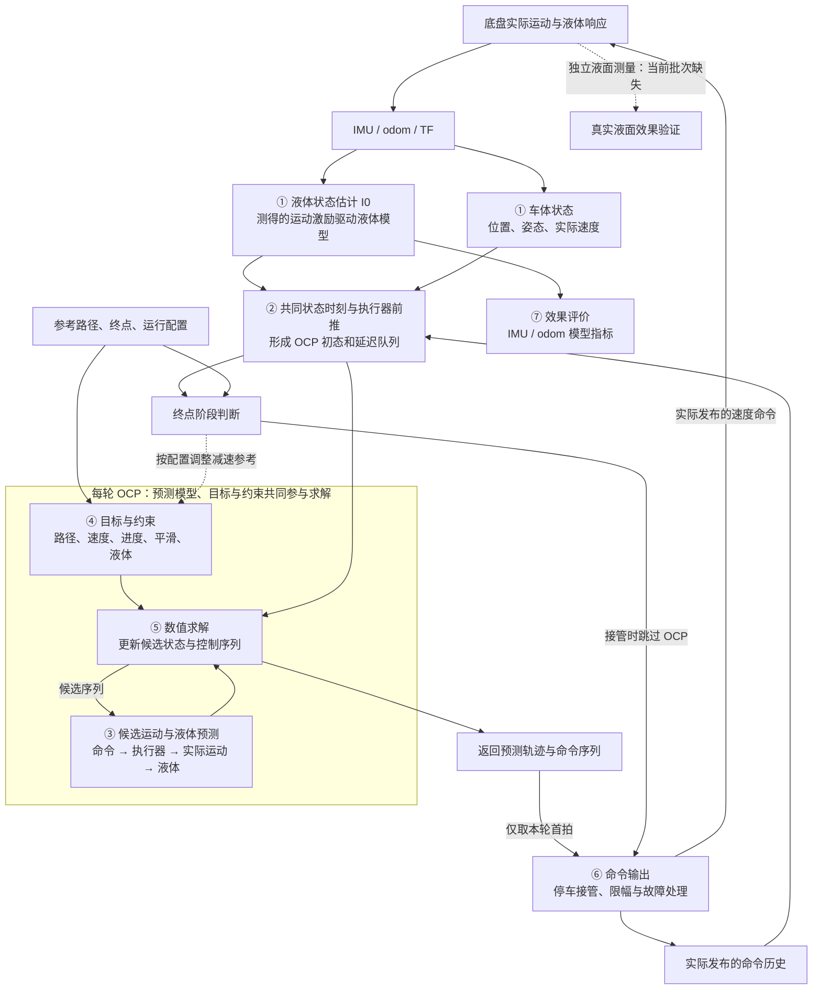

# MPC 信息流框架与当前问题定位

> 日期：2026-09-15。核对基线：`58cf95f8`（2026-09-14）。本文梳理当前实物 S-MPCC 主线，依据源码和已归档实验，不新增实物或离线重放结论。
> 阅读目标：先看完整信息流，再判断异常落在哪条连接上。各环节“已经接通”“预测准确”“动作有效”分别判断。
> **最新接续：第 7 节三曲线对照工具已实现，13 项合成测试通过，入口见第 7.4 节。当前还没有新实物 bag 分析结果；延迟、响应时间常数、增益的校准，以及前推/OCP 控制模型修改仍待数据决定。用户计划稍后在实物端继续。**
> **当前优先级（2026-09-15）：按用户决定暂停代码重构，先验证本节第 7.1 步骤 1 的三曲线对照。保持当前控制代码、参数和生成 solver，先用已有实物数据定位误差，再决定后续行为修改。执行状态见第 7.5 节。**

**当前最明确的两个问题是：预测的降晃结果没有在后续运动中兑现；收紧液面硬约束后，求解与约束满足不稳定。** 前者还没有定位到唯一环节，后者已有失败和超限证据。Full 尚未稳定优于 Smooth，是需要解释的整体结果。

## 1. 完整信息流：MPC 每一轮到底在做什么



预测与优化在同一个 OCP 中联立进行：优化器利用模型比较不同动作的后果，选择一条候选轨迹。正常 MPC 周期只执行首拍，随后根据新状态重新求解，上一轮后续动作可能变化。停车接管可以跳过 OCP 直接生成命令；输入无效或求解失败时也可能直接发布零速，因此每个控制周期不一定都有有效预测。

当前 C03 普通 Full/Smooth 使用 **30 Hz、60 步、约 2 秒预测窗口、J0.6、参考速度 0.2 m/s**。Full 启用液体预测和软代价；Smooth 关闭液体优化，保留共同硬 jerk 和非液体设置。普通 Full 的液面硬约束关闭；9 月 14 日另有开启高度上限的开发尝试。

## 2. 沿信息流必须分清的四件事

### 2.1 测得车体运动，不等于测得液体状态

当前 I0 使用经过处理的 IMU 加速度等运动量推进液体模型，得到四维液体状态：两个方向的模态位移及模态速度。odom 监视器用另一条运动估计链推进模型。

因此，当前反馈中包含**运动测量驱动的液体状态估计**，但没有直接用真实液面测量持续校正液体状态。IMU/odom 监视器的毫米高度都是模型量。两条监视器一致，可以支持内部一致性判断；是否对应真实液面，仍需要独立测量验证。

当前批次不录 RGB/depth，NOKOV Tracker0 只作辅助运动记录。选择 IMU 液体初态也不会把车体定位切换为 IMU 定位，车体仍使用 odom/TF 链。

### 2.2 初态前推与未来预测处理两个时间段

| 时间段 | 当前主线怎样处理 | 要核对什么 |
|---|---|---|
| 原始状态时刻 → 本轮 OCP 基准时刻 | 先把车体状态对齐到液体状态时刻，再用已发布命令历史及显式执行器模型前推到本轮基准时刻 | 状态时间、历史覆盖、坐标、前推结果是否一致 |
| OCP 基准时刻 → 未来约 2 秒 | 用初始延迟队列、候选新命令和执行器动力学预测实际运动及液体响应 | 旧命令的影响是否保留，新命令何时生效，预测激励是否可信 |

当前 `legacy delay off` 表示旧补偿路径关闭，显式执行器仍处理延迟。前推到本轮时刻后，队列中的旧命令仍影响近期运动，不能再把整份初态随意向后平移一个延迟时间。

`state_stamp` 表示状态所对应的时间，`solver_input_epoch` 是预测基准；求解完成、命令发布和底盘物理响应又是不同时间。共同 epoch 已实现，但它不代表传感器滤波相位和物理响应时间都已精确校准。源码中的 I1 nowcaster 在当前相关分支用于对照诊断，不能因存在该工具就把它当作主线实际输入。

### 2.3 加速度决策、速度命令、实际加速度是三个量

```text
优化变量：a_cmd、alpha_cmd、v_s
    ↓ 更新预测中的命令状态
速度命令：v_cmd、omega_cmd
    ↓ 延迟队列与执行器响应
实际运动：v_actual、omega_actual、a_actual
    ↓ 作用于液体的加速度
液体状态：eta_x、eta_x_dot、eta_y、eta_y_dot
```

`v_s` 是虚拟路径进度速度；真正发送给底盘的是速度命令。当前 solver 从下一拍命令状态提取 `v_cmd/omega_cmd`，之后还经过停车及输出处理。比较预测与实测时，应把 **预测实际加速度** 与对齐后的 IMU 激励比较，不能直接把 `a_cmd` 当成 IMU 应测到的加速度。

### 2.4 OCP 预测末端，不等于实际任务终点

每个 2 秒窗口末端通常只是预测边界；接近真正任务终点时，应提前安排减速，并检查实际停车及到达后残余晃动。已有停车控制权锁存，新的停车消晃策略尚未实现。

`GOAL_REACHED` 是控制事件，不是独立测得的物理停止时刻。分析中应分开普通 MPC 运动、停车接管、故障零速和到达后残余，避免把它们混成同一种动作。

## 3. 当前问题分别落在哪个环节

| 信息环节 | 已确认的事实 | 当前未解决的问题 |
|---|---|---|
| ① 传感器 → 状态估计 | IMU/odom 液体模型链运行，Full 使用选定液体初态 | 实际液体状态准确性未独立验证；安装参数、作用点统一仍待落实 |
| ② 初态 → OCP 初始条件 | 共同 epoch、命令历史及显式执行器前推已接通 | 时间对齐通过不等于物理相位准确；前推误差需与未来预测误差分开 |
| ③ 候选命令 → 预测响应 | 命令/实际运动分离，含延迟 FIFO 与一阶响应；四子步 RK4 已修正积分精度 | 远期预测明显小于随后 IMU 模型响应；执行器激励误差、液体传播差异尚未拆开；完整旋转耦合未实现 |
| ④ 预测响应 → 动作取舍 | 液体代价已进入实际 OCP，已有精确 cost 重建证据 | 液体目标对可执行动作的影响未充分解释；速度、进度与路径要求如何允许降晃仍待验证 |
| ⑤ 约束 → 求解结果 | 低高度上限出现 MINSTEP、持续 NaN；部分成功结果仍超限 | 近期不可行、数值尺度、非线性残差和失败恢复尚未区分 |
| ⑥ 计划 → 发布 → 底盘 | 有首拍输出、实际命令历史、停车/故障处理与审计记录 | 原消晃计划是否在重规划、输出处理或底盘响应中改变，尚未完成分层定位 |
| ⑦ 后续响应 → 效果结论 | Full 尚无稳定超过共同硬 jerk Smooth 的收益 | 内部指标重复性、真实液面收益仍需验证，单包与不同参数结果不能合并作复验 |

**“已接通”只说明信息确实被使用；是否准确、是否改变动作、是否产生收益，需要逐层验证。**

另有一项诊断问题：在线 cost 分项与实际 OCP 目标的口径存在差异，包括 anti-creep、速度参考、阶段/终端缩放。精确离线重建工具已实现；诊断分项不准不能直接推导为优化目标本身写错。小跟踪误差、液体项数值较大，也都不能单独证明某类目标主导了决策。

## 4. 两个已确认异常的证据与含义

### 4.1 预测降晃没有在后续响应中兑现

9 月 14 日四子步版本的两包 Full，在同一未来时刻比较 OCP 预测与 IMU 驱动模型，得到：

| 预测提前量 | 普通 Full：OCP / IMU 模型 RMS（mm） | Full＋5 mm 上限：OCP / IMU 模型 RMS（mm） |
|---|---:|---:|
| 0.1 秒 | 0.818 / 0.986 | 0.749 / 0.903 |
| 0.5 秒 | 0.409 / 0.999 | 0.371 / 0.902 |
| 1 秒 | 0.163 / 1.011 | 0.148 / 0.887 |
| 2 秒 | 0.030 / 1.029 | 0.031 / 0.925 |

这说明当前计划所预期的高度衰减，没有在后续闭环响应中兑现。排除未来停车/安全接管窗口后，远期低估仍存在，停车不是唯一解释。

但随后 2 秒通常经历约 59 次重规划，实际输入未必等于原计划输入。**上述落差还不是同输入条件下的纯模型误差**，不能全部归给液体方程、执行器或数值积分。初态 RMS 比约 98% 也主要反映同源初态的一致性，不能证明真实液体估计准确。

另一个口径是全任务效果：普通 Full、Smooth、Full＋5 mm 的 IMU 模型 RMS 分别为 **0.995、0.867、0.920 mm**；两种 Full 相对 Smooth 高 **14.8%、6.1%**。各仅一包、起点定位偏差不同，没有形成可重复收益。该全任务统计与上表滚动预测统计分别使用，不能混算。

### 4.2 硬约束没有稳定转化为合格的可执行结果

| 高度上限 | 已归档结果 | 对信息流的提示 |
|---|---|---|
| 0.6 mm | 1633 次求解失败；29 个有效预测中有 55 个未来节点超限，最高 0.792 mm | solver success 与非线性高度约束满足需要分别检查 |
| 0.8 / 1 mm | 有失败日志，完整验收报告缺失 | 不能补造成功率或合格结论 |
| 2 mm | 1252 次求解失败，未完成任务 | 只检查成功周期的高度会漏掉主要故障 |
| 3 mm | 到达/采集通过，但有 14 次求解失败，整体不合格 | 到达终点不能替代运行质量通过 |
| 5 mm | 整包通过，有效预测峰值 2.840 mm | 上限未明显激活，不能据此确认硬约束带来收益 |

约束施加在预测节点 1..N，初态节点放宽。但初态液体状态和队列中的旧命令，仍可能使近期响应来不及降低；硬 jerk 又限制新命令的调整幅度。这是需要检查的可行性机制，尚未确认为全部失败的原因。

还需区分平方高度约束的数值尺度、SQP-RTI 线性化后的非线性残差、失败后的状态/乘子/热启动恢复。多个失败包先出现 MINSTEP，再持续 NaN，不能只用“上限太小”解释。3 mm 的失败时刻尚未与停车阶段逐周期对齐。

以上数值来自[9 月 14 日主分析第 12 节][results]，本次未重算 bag。普通 Full/Smooth 的合格运行也存在负向结果，因此硬约束失败不能解释此前全部降晃负结果。

## 5. 将预测与反馈之间的落差拆成三条连接

先选同一版本、同一初态、时间连续的短窗口，用现有记录逐层比较。窗口同时观察 0.1、0.3、0.5、1、2 秒，区分近期误差与累积差异。

| 连接 | 固定什么、比较什么 | 能定位什么 |
|---|---|---|
| A：原计划 → 实际发布命令 | 固定初态、延迟队列和模型，比较原计划命令与实际发布的速度命令，并分别离线传播；先统一控制量和命令状态的语义 | 原计划变化造成的预测落差。进一步分开滚动重规划、停车、限幅和故障处理 |
| B：实际命令 → 实际运动激励 | 用实际命令历史驱动归档执行器模型，将预测的实际速度/加速度与 odom、对齐后的 IMU 激励比较 | 执行器模型、延迟及未建模运动造成的差距；约 5 Hz 成分在这一层重点观察 |
| C：相同激励 → 液体状态传播 | 固定同一液体初态、激励、坐标、作用点和物理参数，比较 OCP 对应液体传播与监视器传播 | 数值积分、采样保持、公式和输入口径的一致性；通过后仍需独立液面验证物理准确性 |

这三类差异可能同时存在；由于模型及控制链有非线性，不能把三次比较的 RMS 差直接相加，宣称各自解释了多少百分比。

滚动重规划本身是 MPC 的正常机制。需要验证的是：是否持续改变原先有益的消晃动作，或把收益推到尚未执行的未来；目前没有证据认定已发生这一具体机制。

完成 A/B/C 后，再做**同一快照下的目标作用检查**：保留同一增广状态模型、初态、参考、非液体参数、约束和初猜，仅开关液体代价，观察首拍及未来速度/转向如何变化。cost 大小之外，要看可执行动作差异。该诊断不同于改变状态维数的 Full/Smooth 实物对照，也不同于将液体初态清零的 NoState。

## 6. 延迟、5 Hz、模型缺项和规划目标各放在哪里

| 问题 | 在框架中的位置 | 当前判断 |
|---|---|---|
| 延迟 | ①→② 的测量/处理时序；③及⑥→实际运动的执行器响应 | 已有补偿与队列模型，准确性仍要由时间对齐和实际响应分别验证；不能用一个常数包办所有延迟 |
| 约 5 Hz 振动 | 实际运动→传感器，以及③预测激励与实际激励的差异 | 无 MPC 直发命令的旧包也有约 5 Hz 成分；与 C03 是否同源、是否结构共振仍未证实。车体振动频段与液体约 5.15 Hz 模态是不同物理量 |
| 安装偏移与作用点 | ①、②、③对液体激励的共同定义 | 统一改造尚未实施；容器暂按接近 base 原点，IMU 杆臂仍需核实，不能默认存在一个非零容器偏移根因 |
| 液体旋转耦合 | ①观测传播、②初态前推、③未来传播 | 当前有 `a_actual` 和 `v_actual*omega_actual` 激励，完整旋转耦合仍待验证/实现；容器零偏移也不能自动略过 |
| 数值积分 | ③未来传播 | 四子步 RK4 精度修复已完成，控制周期与队列更新频率未变；新版仍远期低估，不再将旧积分误差列为未修复项 |
| 路径、速度与进度取舍 | ④目标结构 | 小范围权重/jerk 对照未建立重复收益；“降晃优先”的目标结构和可行空间尚待设计，跟踪过强仍是待验证假设 |
| 预测窗口 | ③～⑤未来可见范围和决策 | 当前 2 秒覆盖多个液体周期，尚无“连一次振荡都看不到”的问题；机动预见长度与远期可信度仍需分别判断 |
| 停车残余 | ④终点要求、⑥接管及实际停车尾段 | 已有停车锁存；面向真实终点的减速、延迟命令消退和残余晃动处理仍待完善 |
| 避障与可活动空间 | 参考/环境输入→④ | 当前后端障碍 OCP 项未接入，属于规划能力边界；不能作为无障碍 C03 负结果的已知原因 |

## 7. 2026-09-15 接续：执行器预测的校准与代码一致性

**接续安排：诊断工具和软件检查先在当前工作区完成，再用实物 bag 决定具体修改哪些参数或方程。** 当前已有延迟补偿，优先核查它与真实运动是否匹配；尚未确认执行器模型就是唯一根因。

### 7.1 三步代码思路

| 步骤 | 具体做法 | 代码入口与交付 |
|---|---|---|
| 1. 补齐同输入对照 | 固定同一初态、已有命令历史和模型参数，输出三条曲线：原 OCP 预测加速度、实际发布命令重放出的加速度、处理后的 IMU 加速度。将重规划/命令处理的影响与执行器响应误差分开 | [三曲线工具][excitation-tool]已实现，复用[机器人重放内核][robot-replay]；输出曲线、误差及拒绝记录。13 项合成测试通过，实际 bag 结果待补 |
| 2. 校准已有响应参数 | 分别核对线向、角向的延迟、响应时间常数和增益。先用辨识数据估计，再用独立数据验证预测误差是否下降；依据结果选需更新的参数 | 沿用 `execution_model/linear_delay_sec`、`angular_delay_sec`、`linear_tau_sec`、`angular_tau_sec`、`linear_gain`、`angular_gain`；归档旧值、候选值、辨识数据与独立验证结果 |
| 3. 同步修改前推与 OCP | [初态前推][prefix]与[OCP 模型][model]采用一致的参数、时间定义和命令队列语义，同时核对[热启动传播][solver]。先验证同输入传播，再评估实物效果 | 参数或模型修改单列版本；完成必要的模型一致性回归，涉及生成模型时重新生成 Full/Smooth 对应 solver 并编译，随后进行短 smoke 和同版本对照 |

三条曲线按物理量分别比较：纵向用预测 `a_actual`，横向使用与模型对应的运动激励，角向另看实际角速度/角加速度；不能把 `a_cmd` 直接当成 IMU 应测到的加速度。统一时间、坐标、作用点和滤波口径，并保留原始时序数据，避免通过逐包任意移时或额外滤波得到表面一致。

现有机器人诊断包含依赖动捕参考的分支；本轮复用其数值内核，不把动捕外参标定重新设为 IMU 对照的前置。连续时间命令重放与 OCP 的固定步长 FIFO/RK4 传播要分别标注，不能把二者的离散差异直接认定为实物执行误差。

### 7.2 延迟修改的代码限制

当前[执行器契约][actuator-contract]和 OCP 生成模型都固定为**线向 5 拍、角向 10 拍**；在 30 Hz 下分别约为 **0.167 秒、0.333 秒**。这些是当前模型配置，不代表此次已经重新辨识了真实延迟。

延迟必须等于对应整数拍数乘 `dt`。仅修改 YAML 中的延迟秒数，若与当前队列不匹配，会被一致性检查拒绝。若结果支持修改延迟拍数，需要同步 C++ 队列尺寸、生成模型、状态索引与相关包装/诊断契约，重新生成并编译双 solver；不能通过删除检查让不一致的配置运行。

时间常数和增益已有运行参数入口，按实际改动范围验证。若辨识结果需要非整数拍延迟，应另外设计并验证离散实现，不能默认四舍五入后就精确补偿。

### 7.3 实物端接续顺序与判断标准

先核对现场代码版本、实际参数和已有合格 Full 包的小话题覆盖。优先复用已有数据完成第 1 步；确需补录时，沿用现有录包流程，保留同一路径、载液、速度及传感器处理条件，并记录起点与静置条件。现有主线已录 `pre_solve_snapshot`、`predicted_horizon`、`control_cycle_audit` 和 IMU/odom 监视器，实际覆盖以包内检查为准。

| 对照结果 | 后续处理 |
|---|---|
| 实际命令重放与 IMU 主要相差稳定时间偏移，多个运动阶段及独立数据均支持 | 先核对 IMU 有效时间，再重点校准线/角延迟；一次最佳互相关时移不足以冻结参数 |
| 时间对齐后，幅值或波形仍明显不同 | 检查时间常数、增益和模型未覆盖的运动扰动，单独调整延迟不足以解决 |
| 原 OCP 预测与实际命令重放差异明显，而实际命令重放较好对应 IMU | 优先检查滚动重规划、停车接管和输出处理怎样改变原计划 |
| 实际运动激励已能对应，但液体传播仍有差异 | 转入第 5 节 C 项：同初态、同激励的液体传播一致性核对，再考虑液体模型修正 |

采用候选参数或方程前，用独立数据验证；代码修改后先完成相应软件检查，再由用户执行短 smoke。运行质量通过且形成候选后，再做同版本 Full/Smooth 公平配对，分别报告运动预测精度、内部液体指标和可获得的真实液面效果。

每轮保存：**代码/solver 身份、实际参数、数据身份、三条对齐曲线、误差统计、支持的解释及下一处改动**。本节尚无新的标定值、实物 bag 诊断结果或实车通过记录。

硬约束首个失败周期与持续 NaN 的定位保留为独立问题，按第 4.2 节分析；不将其修复设为上述普通 Full 同输入对照的前置。局部规划目标、作用点统一、旋转耦合和新停车策略仍按对应方案分版本推进。

### 7.4 已实现的工具与实物端使用入口

```bash
python3 src/scout_apps/control/spmpc_local_planner/scripts/analysis/analyze_actuator_excitation_consistency.py \
  --report /path/to/trial_internal_slosh.json \
  --output /path/to/new_excitation_comparison
```

替换为已有合格 Full/IMU 的内部报告路径和新的输出目录。工具复用报告、参数文件与小话题缓存；
仅在缺少预测时域缓存时读取对应 bag 话题。无需先录新包，是否需要补录由实际话题覆盖决定。

输出 `report.json`、`samples.csv`、`excitation_comparison.png`；图中为最早的有效预测起点，
CSV 保留全部接受窗口，也可用 `--cycle-id` 指定起点。两条模型曲线都会套用名义 IMU 的
滤波、角加速度差分和杆臂处理，使用记录的有效时戳。名义几何与物理时延仍需核验；
实际命令的连续重放和 OCP 离散传播之间仍有近似差异。工具不拟合参数，也不据此自动判定唯一根因。

目前完成的是诊断代码与 13 项合成测试（包括缓存 CLI、CSV 和 PNG 输出），另有 25 项既有诊断回归通过，合计 38 项；不代表实物预测已改善。
控制器、运行参数及 solver 未因本工具改变。详细输入契约、拒绝条件和输出口径见
[scripts README](../../../../src/scout_apps/control/spmpc_local_planner/scripts/README.md)。

### 7.5 当前执行状态：暂停重构，先验证信息流

首选数据为 [9 月 14 日实验分析第 12 节][results] 的四子步普通 Full：`rk4s4_smoke_full`，21:26:50 录制，液面硬约束关闭。它已经通过原有质量检查，适合先检查当前模型的命令—运动一致性。Full＋5 mm 可作为另一个条件补充检查，结果分开报告；先不为此次诊断增加新硬约束实验。

| 当前工作 | 状态与下一步 |
|---|---|
| 结构重构 | 已暂停；入口/公共模块/ROS 节点均不开始拆分，整理方案保留供以后使用 |
| 软件工具 | 三曲线 CLI 及相关测试已有，不重复实现；本次未修改运行代码或重新生成 solver |
| 现有数据 | 用户已确认数据在实物机，当前开发机没有本批数据；本轮不再搜索开发机或用旧批次替代验证 |
| 数据位置 | 在实物机原目录分析；归档根目录为 `/home/geist/slosh_bags/real/20260914_spmpc_internal_slosh_v3_20260907_c03/`。同步本次分析代码后，按第 7.6 节操作 |
| 第一轮交付 | 先核对接受/拒绝样本及时间覆盖，再分别比较 OCP/重放、重放/IMU；分开报告普通运动、未来干预与跨终点窗口，依据第 7.3 节决定下一步 |

数据应包含原 bag、同名 `_internal_slosh.json`、报告绑定的小话题缓存与 `_launch_params.yaml`；预测时域缓存可复用，缺少时工具只补读对应 bag 话题。报告和缓存校验绝对路径、文件大小、修改时间及相关 SHA，复制到新目录后不能直接改身份字段冒充原位置校验通过；优先在原数据位置运行，迁移时保留原文件并核对来源与缓存身份。

目前只完成验证入口与数据条件核对，**尚无这次三曲线实包结果，也未确认“仅补偿延迟就能解决”**。`DIAGNOSTIC_COMPLETE` 只表示生成了有效对照；最终要说明误差在哪个环节、哪些解释得到支持、哪些仍未验证。

### 7.6 实物机直接执行：先分析已有普通 Full 包

先在实物机获取本次提交。新增的两个分析文件为 `scripts/analysis/analyze_actuator_excitation_consistency.py` 和 `actuator_excitation_consistency_core.py`；测试文件为 `scripts/tests/test_actuator_excitation_consistency.py`。已有依赖为同目录的 `analyze_ocp_imu_forecast.py`、`robot_state_prediction_core.py`、`analyze_internal_slosh_pair.py`、`horizon_liquid_replay.py`、`analyze_mocap_execution_chain.py`。使用完整仓库版本即可，不要只复制 CLI 单文件。

本次提交只包含离线诊断、测试和文档，不改变运行控制代码、参数、消息或生成 solver。执行以下离线分析无需重新编译控制器、启动 planner 或让底盘运动。

在实物机已更新的 `scout_ws` 根目录，使用 Bash 终端运行：

```bash
source /opt/ros/noetic/setup.bash
source devel/setup.bash

excitation_report="/home/geist/slosh_bags/real/20260914_spmpc_internal_slosh_v3_20260907_c03/full/H0/DEV_INTERNAL_SLOSH_V3_screening_rk4s4_smoke_full_full_W1_WV1_WC1_WL0.2_J0.6_V0.2_StartManual_20260907_c03_212650_Bslosh_internal_slosh.json"
excitation_output="/home/geist/slosh_bags/diagnostics/actuator_excitation_rk4s4_full_$(date +%Y%m%d_%H%M%S)"

python3 src/scout_apps/control/spmpc_local_planner/scripts/analysis/analyze_actuator_excitation_consistency.py \
  --report "${excitation_report}" \
  --output "${excitation_output}"
```

命令中的输入路径来自归档，开发机无法代查实物文件是否仍在原位；若有移动，先核对报告及缓存绑定关系，不修改身份校验。输出使用新的时间戳目录；已有缓存可复用，缺少预测时域缓存时会在 bag 旁补建该小话题缓存。

完成后保留整个输出目录，先查看 `report.json` 的状态、接受/拒绝周期及 `task_no_future_intervention` 对照，再结合 `samples.csv` 判断近/远期差异。`excitation_comparison.png` 只画最早接受的起点，不能代替全窗口统计。若返回 `INCONCLUSIVE` 或输入错误，保留终端信息与已生成报告，先解释数据条件；不因此直接重录或改模型参数。

## 8. 继续分析时的证据与源码入口

| 要追踪的信息 | 已有记录或工具 |
|---|---|
| 原始液体模型状态、来源和时间 | `/spmpc/debug/slosh_observer_imu`、`slosh_observer_odom`、`slosh_observer_selection` |
| 真正进入 OCP 的初态与参数 | `/spmpc/debug/solver_input_state`、`pre_solve_snapshot`；结合有效配置及归档 solver 身份 |
| 原计划与下一轮改写 | `/spmpc/debug/predicted_horizon`、`control_cycle_audit`；审计含前一计划移位值与本轮首拍差异，仅连续有效周期可比 |
| 首拍、停车、安全处理及最终发布命令 | `/spmpc/debug/first_shot_summary`、`command_intervention`、`control_cycle_audit`；使用发布时刻，不用无 header 的 `/cmd_vel` bag 到达时间冒充精确物理时间 |
| 预测与后续 IMU 模型高度 | [analyze_ocp_imu_forecast.py][forecast]；保留失败、缺口、跨停车与未来可用时刻的区别 |
| 车体初态及未来运动对照 | [analyze_robot_state_prediction.py][robot-diagnostic] |
| 实际目标函数分解 | [analyze_exact_ocp_cost.py][exact-cost]；使用对应版本归档库，不把在线近似分项作为唯一依据 |

上表简写话题均位于 `/spmpc/debug/`。终点处理可能在调用 solver 前调整速度参考，该周期实际 OCP 参数应以 `pre_solve_snapshot` 核对。现有工具提供部分证据，不表示 A/B/C 分解或失败恢复分析已经自动完成。

源码核对入口：[ROS 主控制与发布链][ros]、[IMU 处理][imu]、[液体观测器][observer]、[显式执行器前推][prefix]、[OCP 预测模型][model]、[OCP 代价][cost]、[solver 包装与命令提取][solver]、[任务与停车接管][problem]。

已有结论与方案：[9 月 14 日实验分析][results]、[局部规划目标与参考路径作用][planning]、[模型一致性与停车分版本安排][versions]、[安装偏移与作用点方案][geometry]、[约 5 Hz 复查][frequency]。

[results]: ../实物对比试验分析/20260914_C03当前版本J0.6_Full与Smooth修改前基线分析.md
[planning]: 20260914_以降晃为重点的局部规划目标与参考路径作用.md
[versions]: 20260913_模型一致性液面约束与停车处理分版本验证安排.md
[geometry]: ../../后续改进/20260911_容器安装偏移与液体作用点加速度统一改造方案.md
[frequency]: ../实物对比试验分析/20260908_底盘速度连续性两包5Hz离线复查.md
[ros]: ../../../../src/scout_apps/control/spmpc_local_planner/src/ros/spmpc_local_planner_ros.cpp
[imu]: ../../../../src/scout_apps/control/spmpc_local_planner/src/estimation/processed_imu_pipeline.cpp
[observer]: ../../../../src/scout_apps/control/spmpc_local_planner/src/estimation/slosh_observer_bank.cpp
[prefix]: ../../../../src/scout_apps/control/spmpc_local_planner/src/ros/execution_state_predictor.cpp
[model]: ../../../../src/scout_apps/control/spmpc_local_planner/scripts/acados/spmpc_acados_model.py
[cost]: ../../../../src/scout_apps/control/spmpc_local_planner/scripts/acados/spmpc_acados_cost.py
[solver]: ../../../../src/scout_apps/control/spmpc_local_planner/src/solvers/continuous_mpcc_solver_acados.cpp
[problem]: ../../../../src/scout_apps/control/spmpc_local_planner/src/core/spmpc_problem.cpp
[forecast]: ../../../../src/scout_apps/control/spmpc_local_planner/scripts/analysis/analyze_ocp_imu_forecast.py
[robot-diagnostic]: ../../../../src/scout_apps/control/spmpc_local_planner/scripts/analysis/analyze_robot_state_prediction.py
[robot-replay]: ../../../../src/scout_apps/control/spmpc_local_planner/scripts/analysis/robot_state_prediction_core.py
[actuator-contract]: ../../../../src/scout_apps/control/spmpc_local_planner/include/spmpc_local_planner/dynamics/actuator_model.h
[excitation-tool]: ../../../../src/scout_apps/control/spmpc_local_planner/scripts/analysis/analyze_actuator_excitation_consistency.py
[exact-cost]: ../../../../src/scout_apps/control/spmpc_local_planner/scripts/analysis/analyze_exact_ocp_cost.py
