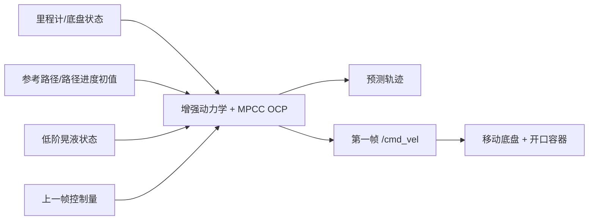
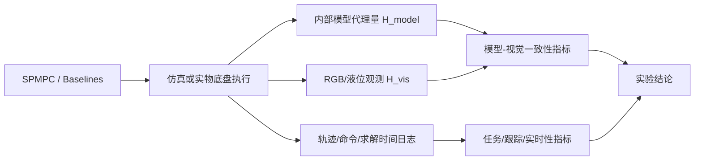

# SPMPC 五章论文骨架重构与 Ferrari 保真度扩展报告

## 执行摘要

你当前稿件的主线已经是对的：摘要与引言已经把问题界定为“液体晃动是具有动态记忆的状态预测问题”，相关工作已经形成“同层普通局部规划器 / 同任务移动底盘防晃近邻 / 跨平台防晃建模与预测控制”的三分结构，方法章已经围绕增强状态、低阶晃液动力学和 MPCC 局部规划问题展开，实验章也已经明确区分了 `/spmpc/slosh_height` 这类内部模型代理量与 RGB/外部液面观测这类真实液面指标。换言之，论文不需要推倒重写，而需要收束成**五章式方法论文**：把独立 Discussion 章消去，将其内容分别迁移到 Method、Experiments 和 Conclusion；同时在实验章中新增 Ferrari-style 模型—视觉保真度分析，使“内部代理量能否解释真实液面”从防御性说明升级为可量化证据。这样可在保持五章叙事节奏的同时，为后续填充实验结果保留统一、规范、可替换的占位接口。fileciteturn0file0L6-L21 fileciteturn0file0L34-L53 fileciteturn0file0L115-L129 fileciteturn0file0L267-L323 fileciteturn0file0L553-L579

## 结构重构原则

Ferrari 的 RA-L 论文本身就是五章式：Introduction、Sloshing Model、Trajectory Planning、Experimental Validation、Conclusion，并没有独立 Discussion；同时它把模型保真度 \(\gamma_{\text{model}}\)、优化收益 \(\gamma_{\text{opt}}\)、GoPro 视觉液面提取、以及 \(1.25t_{end}\) 的积分时间窗都放在实验验证章里处理，而不是在单独章节里“自我防御”。这正是你当前稿件最适合借鉴的结构路径。fileciteturn0file3L128-L131 fileciteturn0file3L644-L650 fileciteturn0file3L673-L690

你想模仿的 Jian D-CBF-MPC 论文，其叙事方式也不是“先写一个 Discussion 再补边界”，而是沿着“挑战 → 系统框架 → 关键实现 → 仿真/实物验证”向前推进：引言先提出动态环境的三个困难，随后通过框架总览图把感知、预测、局部规划与控制连接起来，再进入实现与实验。这个风格非常适合 SPMPC，因为你也有一条清晰的链路：里程计/路径 → 液体状态传播 → slosh-aware MPCC → `/cmd_vel` → 外部液面评价。citeturn1view0turn1view0

当前稿件之所以显得“还没收口”，不是因为主线错了，而是因为实验章和结论仍保留了多处“结果占位”，而独立 Discussion 章又重复说明了低阶模型边界、内部代理量与真实液面边界、以及“降低风险而非严格防溢出保证”等内容。当前实验章已经明确指出：`/spmpc/slosh_height` 只能作为模型内部预测或诊断代理量，真实结论必须依赖 RGB 或其它外部液面观测；而当前 Discussion 章又重复展开了同一层意思。五章重构的核心，就是把这些边界分配到更合适的位置，并保留统一的结果占位格式。fileciteturn0file0L573-L579 fileciteturn0file0L630-L690 fileciteturn0file0L691-L764

## 可直接替换的论文主体 Markdown 骨架

下面给出的骨架严格基于你要求的五章结构：**Abstract, I Introduction, II Related Work, III Method, IV Experiments and Validation, V Conclusion**。其中只有实验结果段和结论定量结果句允许保留统一占位；其余部分都应写成完成态文本，而不是“计划书式说明”。

### 占位格式统一规范

后续全稿只保留三类方括号占位，且**只允许出现在实验章和结论末段**：

- 图占位：`[待绘图-Fig.X：图目的与内容说明]`
- 表占位：`[待填表-Table X：表字段与比较对象说明]`
- 结果句占位：`[待填结果：需填入的比较对象、指标、统计量和结论句骨架]`

不再使用“a) 结果占位”“后续补图”“结果完成后本段应……”这类作者备忘录语气。当前稿件的结果占位主要集中在实验章与结论末段，因此这一步是最直接的结构清理。fileciteturn0file0L630-L690 fileciteturn0file0L779-L784

### Abstract

| 项目 | 建议内容 |
|---|---|
| 要回答的问题 | 这篇论文解决了什么交叉缺口，提出什么方法，用什么证据评估 |
| 是否保留占位 | 不保留结果占位；摘要必须是完整段落 |
| 关键句 | “液体晃动不是简单的轨迹平滑问题，而是具有动态记忆的状态预测问题。现有普通局部规划器在线可执行但通常不传播液体状态；已有防晃方法虽然显式考虑液体模型，但多数不处于标准移动底盘在线局部规划层。为连接这两类研究，本文提出 SPMPC，将低阶晃液模态状态嵌入移动底盘 MPCC 局部规划问题，在滚动时域内联合优化路径轮廓误差、滞后误差、路径进度、控制平滑性和预测晃液响应。本文通过内部消融、普通局部规划器对比、移动底盘防晃近邻对比以及模型—视觉液面一致性分析，评估显式晃液状态预测相对于仅平滑控制在降低液体晃动方面的作用，并分析其路径跟踪、运行效率和实时求解性能。” |
| 公式/表/图 | 无 |
| 写作提醒 | 若实验尚未完成，摘要最后一句保持“评估/分析”，不要写“结果表明” |

当前摘要中的问题定义与方法定位已经基本成立，只需把实验表述从三组对比升级为“加入模型—视觉一致性分析”的四类证据即可。fileciteturn0file0L6-L21

### I. Introduction

推荐在五章版本中使用四个子节：**A. Motivation and Gap, B. Challenges, C. Proposed Approach, D. Contributions and Scope**。这与 Jian 论文“困难—框架—实现动机”的推进方式一致，也与你当前引言内部逻辑相符。citeturn1view0turn1view0 fileciteturn0file0L34-L53

#### A. Motivation and Gap

| 项目 | 建议内容 |
|---|---|
| 要回答的问题 | 为什么移动底盘开口液体运输不是普通平滑规划问题 |
| 关键句 | “对于开口液体运输，底盘运动不仅需要几何可行和速度平滑，还需要能够预测液体在当前相位下对未来激励的响应。” |
| 应保留内容 | 当前稿件中“液体晃动不是简单的轨迹平滑问题，而是具有动态记忆的状态预测问题”这句应原样保留为引言中心句 |
| 图 | Fig. 1 任务与方法定位图，现在就应该绘制 |
| 占位 | `[待绘图-Fig.1：普通局部规划器 / 已有防晃方法 / SPMPC 在线局部规划 三块定位图，SVG重绘，必要时先导出PNG预览]` |

#### B. Challenges

| 项目 | 建议内容 |
|---|---|
| 要回答的问题 | 这类问题为什么在局部规划层难 |
| 关键句 | “困难不在于液体能否建模，或局部规划器能否在线运行，而在于如何在标准轮式移动底盘的在线局部规划层同时处理路径推进、底盘可执行性与液体动态记忆。” |
| 建议结构 | 保留三条挑战：动态记忆、普通局部规划器通常不含液体状态、已有防晃方法多数不在同一决策层 |
| 图/表 | 不再保留引言中的挑战表；由 Fig. 1 承担定位功能 |
| 占位 | 无 |

#### C. Proposed Approach

| 项目 | 建议内容 |
|---|---|
| 要回答的问题 | SPMPC 是怎样的局部规划框架 |
| 关键句 | “SPMPC 以 MPCC 为局部规划骨架，在机器人状态与路径进度之外加入低阶晃液模态状态，使当前液体模态位移与速度能够直接影响未来局部运动选择。” |
| 图 | 在引言末尾只提及 Fig. 1，不放方法细节图 |
| 占位 | 无 |

#### D. Contributions and Scope

| 项目 | 建议内容 |
|---|---|
| 要回答的问题 | 你到底做了什么，没做什么 |
| 关键句 | “本文不声称首次将晃液状态引入 MPC；更准确的贡献是把低阶晃液动态记忆引入标准轮式移动底盘在线 MPCC 局部规划层。” |
| 贡献三条 | 问题表述；方法框架；实验与评价协议 |
| 范围句 | “本文不处理完整动态避障、同伦/走廊推理、高保真流体仿真、形式化防溢出证明或真实液面闭环观测。” |
| 占位 | 无 |

你当前引言已经具备上述核心内容，只需压缩文献细节并删除讨论式重复。fileciteturn0file0L71-L95 fileciteturn0file0L96-L114

### II. Related Work

这一章应继续保持你已经建立的三段式，因为它正好与实验章的三类比较一一对应：**普通移动机器人在线局部规划器**对应同层基线，**移动底盘液体运输与防晃近邻**对应同任务但不同层级比较，**跨平台防晃建模与预测控制**对应方法学基础和创新边界。当前稿件这一部分已经成熟，应整体保留。fileciteturn0file0L122-L129 fileciteturn0file0L253-L266

#### A. Online Local Planning and Trajectory Optimization for Mobile Robots

| 项目 | 建议内容 |
|---|---|
| 要回答的问题 | 同层方法有哪些，为什么它们是公平基线 |
| 关键句 | “这些方法与本文共享在线部署接口和底盘命令输出，但通常不传播容器内液体的模态位移与模态速度。” |
| 表 | 不需要额外表；文字+代表文献即可 |
| 占位 | 无 |

#### B. Mobile-Base Liquid Transport and Anti-Slosh Near Neighbors

| 项目 | 建议内容 |
|---|---|
| 要回答的问题 | 同物理任务领域做到了什么，为什么仍与本文不同层 |
| 关键句 | “移动底盘液体运输并非缺少研究；真正缺少的是把液体动态记忆放入标准移动底盘在线局部规划闭环的方法。” |
| 表 | 保留近邻工作层级差异表 |
| 表建议标题 | `Table I. 移动底盘液体运输近邻工作的规划/控制层级比较` |
| 占位 | 无 |

#### C. Cross-Platform Slosh Modeling, Trajectory Generation, and Predictive Control

| 项目 | 建议内容 |
|---|---|
| 要回答的问题 | 低阶建模、输入整形、预测控制、视觉液面验证等跨平台方法如何限定你的创新边界 |
| 关键句 | “本文不将创新点表述为首次将晃液状态引入 MPC，而强调其在标准轮式移动底盘在线局部规划层的集成方式。” |
| Ferrari 放置方式 | 放在本小节后半段，作为‘方法学与验证口径可借鉴、但不是同层 baseline’的代表 |
| 推荐句 | “近期 Ferrari 等针对 4D SCARA 运动下多容器运输提出了时间最优防晃轨迹规划，并以视频液面曲线与模型曲线的一致性指标验证模型保真度；其方法面向 prehensile 工业机械臂的离线优化，不直接构成本文的同层在线基线，但其模型—实验比较口径对本文实物评价具有直接借鉴意义。” |
| 占位 | 无 |

#### D. Positioning of SPMPC

| 项目 | 建议内容 |
|---|---|
| 要回答的问题 | 你到底位于哪个交叉点 |
| 关键句 | “本文的研究对象位于这些方向的交叉处：面向标准轮式移动底盘的在线晃液感知 MPCC 局部规划。” |
| 占位 | 无 |

Ferrari 的原文明确说明其贡献是 4D SCARA、多容器、两类时间最优轨迹规划和实验验证；论文结构也正是五章式，这为你把 Ferrari 放在“跨平台方法学边界”而非“同层对比对象”提供了充分依据。fileciteturn0file3L111-L131

### III. Problem Formulation and SPMPC Method

这一章保留四个子节：**A. Problem Statement and Framework, B. Augmented State and Low-Order Slosh Dynamics, C. Slosh-Aware MPCC Formulation, D. Receding-Horizon Execution and Model Proxy Definition**。当前方法章的骨架已经非常接近这个结构，只需要把“模型代理量的定义”前置，以便后面俄让 Ferrari-style 保真度分析自然接上。fileciteturn0file0L267-L323 fileciteturn0file0L397-L523

#### A. Problem Statement and Framework

| 项目 | 建议内容 |
|---|---|
| 要回答的问题 | 在什么系统边界内定义本文问题 |
| 关键句 | “在给定安全参考路径附近，局部规划器每个控制周期根据当前增强状态重新求解短时域 MPCC 问题，并仅执行第一帧底盘速度命令。” |
| 图 | Fig. 2 现在就应画成正式结构图 |
| 占位 | `[待绘图-Fig.2：odometry + reference path + slosh state → augmented dynamics + MPCC OCP → predicted trajectory + first /cmd_vel]` |

可先用 Mermaid 生成预览，再由用户手工重绘 SVG：

#### B. Augmented State and Low-Order Slosh Dynamics

| 项目 | 建议内容 |
|---|---|
| 要回答的问题 | 你到底传播了哪些状态，为什么足够支持局部规划 |
| 必含公式 | \(x_r=[p_x,p_y,\theta,v,s,\omega]^\top\)，\(u=[a,\alpha,v_s]^\top\)，\(x_l=[\eta_x,\dot{\eta}_x,\eta_y,\dot{\eta}_y]^\top\)，增强状态 \(x=[x_r,x_l]^\top\) |
| 晃液动力学 | \(\ddot{\eta}_i + 2\zeta_i\omega_i\dot{\eta}_i + \omega_i^2\eta_i = -\kappa_i a_i\) |
| 底盘激励近似 | \(a_x=a,\; a_y\approx v\omega\) |
| 关键句 | “增强状态的作用不仅是为目标函数提供晃液惩罚项，更重要的是让预测模型在低阶近似下显式包含液体动态记忆。” |
| 代理量定义 | 新增 \(H_{\text{model}}(t)=\mathcal{H}(x_l(t),\omega(t))\)；若系统实现使用 `/spmpc/slosh_height`，应在此明确其为内部模型晃液高度代理量，而不是真实液面测量 |
| 占位 | 无 |

Ferrari 原文对低阶 MSD 模态与液面高度的关系给出了清晰的第一模态高度近似式，这正支持你在方法章里把“模态状态 \(\rightarrow\) 模型高度代理量 \(H_{model}\)”写清楚，而不必等待实验完成再解释。fileciteturn0file3L355-L367

#### C. Slosh-Aware MPCC Formulation

| 项目 | 建议内容 |
|---|---|
| 要回答的问题 | SPMPC 到底优化什么、权衡什么 |
| 必含公式 | 轮廓误差 \(e_c\)、滞后误差 \(e_l\)、离散 OCP、阶段代价与终端代价 |
| 关键代价项 | 跟踪误差、路径进度奖励、控制幅值、控制变化、晃液状态代价 |
| 关键句 | “若只增加控制平滑惩罚，规划器只能倾向于选择较平滑的控制序列；而加入晃液状态后，规划器可以区分两条同样平滑但对当前残余晃动相位影响不同的局部运动。” |
| 表 | 保留 `Table II. SPMPC 目标函数各项的作用`，但把最后一列从“叙事作用”改为“功能说明” |
| 软约束边界 | 式(18) 保留，但明确写成“可扩展形式”，不作为主实验核心 |
| 占位 | 无 |

#### D. Receding-Horizon Execution and Model Proxy Definition

| 项目 | 建议内容 |
|---|---|
| 要回答的问题 | 求解后的第一帧如何执行，以及模型代理量如何用于实验解释 |
| 必含公式 | \(v_{cmd}=v_0+a_0^\star\Delta t,\; \omega_{cmd}=\omega_0+\alpha_0^\star\Delta t\) |
| 关键句 | “SPMPC 的输出仍是普通移动底盘可执行的局部速度命令；方法内部的晃液状态和由其导出的 \(H_{\text{model}}\) 仅用于预测和实验诊断，不直接等同于真实液面观测。” |
| 消融表 | 保留 `Table III. SPMPC 内部消融变体` |
| 占位 | 无 |

### IV. Experiments and Validation

这是本次重构的核心章节。和 Ferrari 一样，实验章不只负责比较方法优劣，还要负责回答**内部模型指标与真实液面之间的关系**。当前实验章已经把内部代理量与真实液面分开，这是正确基线；后续需要加上 Ferrari-style 模型—视觉一致性分析作为独立小节。fileciteturn0file0L562-L579 fileciteturn0file0L683-L690

建议实验章固定为六个子节：

- A. Experimental Setup and Fairness Protocol
- B. Metrics and Model-to-Visual Slosh Fidelity
- C. Internal Ablation Study
- D. Comparison With Ordinary Online Local Planners
- E. Comparison With Mobile-Base Anti-Slosh Near Neighbors
- F. Runtime, Robustness, and Real-World Validation

#### A. Experimental Setup and Fairness Protocol

| 项目 | 建议内容 |
|---|---|
| 要回答的问题 | 比较是否公平、任务接口是否一致、外部液面如何观测 |
| 关键句 | “正式比较固定起点、终点、参考路径、容器配置、任务终止条件和失败判据，并尽量对齐最大线速度、角速度、线加速度和角加速度。” |
| 表 | `Table IV. 评价指标与评价目的`，扩充一类“模型—视觉一致性”指标 |
| 图 | Fig. 3 实验评价流程图，现在就可以画 |
| 占位 | `[待绘图-Fig.3：planner/baselines → robot execution → internal H_model → RGB/液面观测 → metrics pipeline]` |

Mermaid 预览建议：

#### B. Metrics and Model-to-Visual Slosh Fidelity

这是新增小节，建议用完整公式直接写入正文。

**本小节应写成完成态，不保留结果占位。**

设 \(H_{\text{model}}(t)\) 为内部模型晃液高度代理量，\(H_{\text{vis}}(t)\) 为 RGB 或外部液面观测得到的真实液面运动指标。借鉴 Ferrari 将模型曲线与实验视频曲线比较并在 \(1.25t_{end}\) 时间窗内积分的做法，本文定义以下模型—视觉一致性指标。Ferrari 的原始 \(\gamma_{\text{model}}\) 为带符号偏差指标，且作者在实验讨论中用其正负号区分模型整体高估与低估；\(\gamma_{\text{opt}}\) 则衡量优化轨迹相较非优化轨迹的最大液面高度下降百分比。fileciteturn0file3L673-L690 fileciteturn0file3L738-L744

**建议正文定义如下：**

\[
\gamma_{\text{bias}}
=
100\cdot
\frac{\int_{t_0}^{t_1}\left(H_{\text{model}}(t)-H_{\text{vis}}(t)\right)\,dt}
{\int_{t_0}^{t_1}H_{\text{model}}(t)\,dt+\epsilon}.
\]

解释：

- \(\gamma_{\text{bias}} > 0\)：模型整体偏保守；
- \(\gamma_{\text{bias}} \approx 0\)：模型整体吻合；
- \(\gamma_{\text{bias}} < 0\)：模型整体低估真实液面，存在安全风险。

\[
\gamma_{\text{abs}}
=
100\cdot
\frac{\int_{t_0}^{t_1}\left|H_{\text{model}}(t)-H_{\text{vis}}(t)\right|\,dt}
{\int_{t_0}^{t_1}H_{\text{vis}}(t)\,dt+\epsilon}.
\]

\[
\text{RMSE}
=
\sqrt{\frac{1}{T}\int_{t_0}^{t_1}\left(H_{\text{model}}(t)-H_{\text{vis}}(t)\right)^2dt}.
\]

\[
\rho
=
\mathrm{corr}\!\left(H_{\text{model}}(t),H_{\text{vis}}(t)\right).
\]

\[
e_{p95}=H_{\text{model},p95}-H_{\text{vis},p95},\quad
e_{\text{peak}}=H_{\text{model},peak}-H_{\text{vis},peak},\quad
e_{\text{rms}}=H_{\text{model},rms}-H_{\text{vis},rms}.
\]

\[
e_{\text{under,peak}}
=
\max_t\left[H_{\text{vis}}(t)-H_{\text{model}}(t)\right]_+.
\]

\[
\tau^\star
=
\arg\max_{\tau\in[-\tau_{\max},\tau_{\max}]}
\mathrm{corr}\!\left(H_{\text{model}}(t),H_{\text{vis}}(t+\tau)\right).
\]

其中 \(\tau^\star\) 用于区分“模型幅值错误”和“时间相位/延迟错误”。这一点尤其适合你当前系统，因为你已经识别到执行链路延迟、命令门控和最终 `cmd_vel` 发布可能污染实物结论。fileciteturn0file0L752-L757

**时间窗建议**

优先采用 Ferrari 的思路，将积分上限扩展至 \(1.25t_{end}\) 以覆盖残余振荡；对于移动底盘任务，可在论文里写成两种等价实现之一：

\[
[t_0,t_1]=[t_{\text{motion-start}},\,t_{\text{motion-start}}+1.25T_{\text{task}}]
\]

或

\[
[t_0,t_1]=[t_{\text{cmd-start}},\,t_{\text{goal-reached}}+T_{\text{settling}}].
\]

推荐你最终使用第二种实现，并令 \(T_{\text{settling}}=3\text{–}5\,\mathrm{s}\)。Ferrari 明确将上限设为 \(1.25t_{end}\) 以把残余振荡，也就是“运动结束之后的液面收敛行为”，纳入一致性评价。fileciteturn0file3L673-L683

**数据对齐与延迟校正建议**

本小节建议写成一个标准流程，而不是散在实验附录里：

1. 以第一条非零底盘命令、路径进度开始变化时刻或液面 ROI 首次持续偏离静止阈值时刻作为粗对齐锚点；
2. 将 \(H_{\text{model}}\) 与 \(H_{\text{vis}}\) 重采样到同一采样率；
3. 先报告原始时间对齐下的 \(\gamma_{\text{bias}},\rho,e_{\text{peak}}\)；
4. 再计算 \(\tau^\star\) 并报告延迟校正后的 \(\rho_{\max}\) 或 \(\rho(\tau^\star)\)；
5. 明确区分“原始一致性”与“延迟校正后一致性”，以避免把相位错配误判为模型幅值错误。

**Hard gate 建议与证据要求**

这一部分必须写得谨慎。可以建议，但不能把它写成形式化安全证明。当前稿件已经非常明确：即使采用模型预测边界，也不构成严格防溢出保证。这个立场应保留。fileciteturn0file0L500-L512

因此建议在实验章写成：

> Ferrari-style \(\gamma_{\text{bias}}\) 适合判断模型整体偏保守还是低估，但它是积分平均指标，可能掩盖局部峰值低估。因此，任何基于 \(H_{\text{model}}\) 的 hard gate 都不应仅依赖 \(\gamma_{\text{bias}}\)，而必须同时满足峰值、高分位和最大低估量约束。

推荐的**工程性 hard gate 证据组合**为：

\[
\gamma_{\text{bias}} \ge 0,
\quad
e_{p95} \ge -\delta_{p95},
\quad
e_{\text{peak}} \ge -\delta_{\text{peak}},
\quad
e_{\text{under,peak}} \le \delta_{\text{safe}},
\quad
\rho_{\max}\ge \rho_{\min},
\quad
|\tau^\star|\le \tau_{\max}.
\]

若你需要给出“建议阈值”，建议以**相对比例**而非绝对数值写入正文，例如：

- \(\delta_{p95}\)：不超过真实 \(p95\) 的 \(5\%\text{–}10\%\)
- \(\delta_{\text{peak}}\)：不超过真实峰值的 \(10\%\)
- \(\delta_{\text{safe}}\)：不超过容器安全裕度的 \(5\%\)
- \(\rho_{\min}\)：建议 \(0.7\text{–}0.8\)
- \(\tau_{\max}\)：建议不超过一个控制周期或主要执行链路延迟预算

同时写明：

> 上述阈值仅作为工程诊断建议，不构成形式化安全证明；若需将其转化为运行时 hard gate，必须进一步通过多路径、多液位、多容器参数和多次实物重复试验验证其保守性。

**本小节图表建议**

- `Table V. 模型—视觉一致性指标定义与解释`
- `Fig. 4. \(H_{\text{model}}\) 与 \(H_{\text{vis}}\) 的原始/延迟对齐曲线示例`
- 占位示例：
  - `[待填表-Table V：γ_bias, γ_abs, RMSE, ρ, e_p95, e_peak, e_rms, e_under_peak, τ* 的定义与单位]`
  - `[待绘图-Fig.4：模型曲线与RGB曲线在同一试次下的原始对齐与τ*校正后对齐对比]`

Ferrari 的原文还提供了两个你可以直接引用的验证习惯：一是使用视频提取的实验液面高度作为外部真值，二是用 \(\gamma_{\text{opt}}\) 报告优化轨迹相对非优化轨迹的收益比例。fileciteturn0file3L644-L650 fileciteturn0file3L685-L690

#### C. Internal Ablation Study

| 项目 | 建议内容 |
|---|---|
| 要回答的问题 | “不是 smooth-only，而是真有 slosh-aware 贡献”是否成立 |
| 应完成的对比 | B0 vs B_smooth；B0 vs B_slosh；B_smooth vs B_ours；B_slosh vs B_ours |
| 关键句 | “B_ours 相对于 B_smooth 的差异用于回答仅增强平滑性是否足够，B_ours 相对于 B_slosh 的差异用于说明平滑控制仍是可执行局部规划的一部分。” |
| 图/表 | `Table VI` 聚合统计；`Fig. 5` 内消融结果图 |
| 占位 | `[待填表-Table VI：B0/B_smooth/B_slosh/B_ours 在成功率、到达时间、轮廓误差、peak/p95/RMS-LCR、γ_bias、求解时间上的均值±标准差]` ；`[待绘图-Fig.5：B_smooth 与 B_ours 的代表性时间序列 + 各变体柱状图]`；`[待填结果-内消融：在[路径族]上，B_ours 相比 B_smooth 将 [peak/p95/RMS-LCR] 从 [x] 降至 [y]，同时到达时间由 [a] 变化至 [b]]` |

#### D. Comparison With Ordinary Online Local Planners

| 项目 | 建议内容 |
|---|---|
| 要回答的问题 | 普通在线局部规划器调好以后是否已经足够 |
| 主比较对象 | DWA、TEB、mpc_local_planner、LT-DWA 或可复现的同层方法 |
| 关键句 | “这组实验不是导航排行榜，而是针对‘在线可执行和平滑是否已经足以替代液体状态预测’这一更窄问题组织证据。” |
| 图/表 | `Table VII` 主对比表；必要时 `Fig. 6` 总览柱状图 |
| 占位 | `[待填表-Table VII：SPMPC 与 DWA/TEB/mpc_local_planner/LT-DWA 的成功率、到达时间、轮廓误差、peak/p95/RMS-LCR、求解时间]`；`[待填结果-同层基线：SPMPC 在保持 [成功率/到达时间/误差] 可比的前提下，将 [液面指标] 从 [x] 降至 [y]]` |

#### E. Comparison With Mobile-Base Anti-Slosh Near Neighbors

| 项目 | 建议内容 |
|---|---|
| 要回答的问题 | 同物理任务但不同层级的方法，与在线局部规划层之间差异何在 |
| 关键句 | “这一组对比的作用不是形成同层排行榜，而是说明具有液体模型的防晃方法若位于离线规划、速度剖面或跟踪控制层，与在线局部规划层的 SPMPC 仍存在接口与决策层级差异。” |
| 图/表 | `Table VIII` 可复现近邻方法对比或“不可公平复现说明表” |
| 占位 | `[待填表-Table VIII：可复现近邻方法与 SPMPC 在任务完成、真实液面指标、路径误差和执行时间上的比较；若不可公平复现，则改为层级说明表]`；`[待填结果-近邻方法：若 [方法名] 可复现，则比较其在 [指标] 上与 SPMPC 的异同；若不可复现，则删除定量结果句，仅保留层级差异说明]` |

#### F. Runtime, Robustness, and Real-World Validation

| 项目 | 建议内容 |
|---|---|
| 要回答的问题 | 是否满足在线求解；实物真实液面是否支持方法主张；模型—视觉一致性在实物里是否成立 |
| 关键句 | “在实物实验中，`/spmpc/slosh_height` 仍只作为模型内部代理量；真实液体晃动降低的结论必须由外部液面观测支持。” |
| 结果组成 | solver time、control frequency、failure count、1–2 条代表路径的实物 RGB 结果、模型—视觉一致性表 |
| 图/表 | `Table IX` runtime 统计；`Fig. 7` 实物液面与模型曲线；`Fig. 8` 失败案例 |
| 占位 | `[待填表-Table IX：求解时间中位数、p95、失败次数、控制频率]`；`[待绘图-Fig.7：实物路径上 H_model 与 RGB 液面曲线对比]`；`[待绘图-Fig.8：失败案例或相位错配案例]`；`[待填结果-实物验证：在 [路径名] 上，SPMPC 与 [B_smooth/基线] 各重复 [n] 次，外部液面指标 [x] 显示前者 [降低/未降低]，模型—视觉一致性指标表明 [整体保守/局部低估/主要为延迟错配]]` |

你当前实验章已经明确了公平比较、真实液面与内部代理量分离、控制平滑性/任务完成/在线计算这几类指标；后续只需要将 Ferrari-style 小节嵌入其中，并统一占位格式。fileciteturn0file0L562-L579 fileciteturn0file0L599-L619

### V. Conclusion

结论必须回到一个单一主张，并用一到两个句子处理边界；不再保留独立 Discussion 章。

| 项目 | 建议内容 |
|---|---|
| 要回答的问题 | 这篇论文最后留下了什么 |
| 关键句 | “本文的核心结论不是构造了严格防溢出的终极控制器，而是证明了在标准轮式移动底盘在线 MPCC 局部规划层引入液体动态记忆是有意义的。” |
| 结果占位是否允许 | 允许，但只保留一条统一结果句占位 |
| 占位 | `[待填结论：在 [路径族/液位/容器配置] 上，SPMPC 相比 [B_smooth/普通局部规划器] 将 [peak/p95/RMS-LCR] 由 [x] 降至 [y]，同时保持 [到达时间/轮廓误差/控制频率] 在 [范围] 内]` |

当前结论的前两段已经合格，只需删除“结果占位说明书式段落”，改成上面这一条标准占位即可。fileciteturn0file0L765-L784

## Ferrari-style 指标复用与引文优先级

推荐把可复用指标按“必须优先引用 / 建议补强 / 视需要补充”分为三层。

### 必须优先引用

第一优先级是 Ferrari 2026 原文及其配套数据集。

原因很直接：它不仅给出了模型液面高度的低阶近似式，也给出了实验验证口径，包括 GoPro 视觉液面提取、\(\gamma_{\text{model}}\) 的带符号积分偏差、\(\gamma_{\text{opt}}\) 的优化收益比例，以及 \(1.25t_{end}\) 的时间窗选择。它还在正文中明确解释了 \(\gamma_{\text{model}}<0\) 表示模型低估、风险更高，这一点与你计划中的 hard gate 讨论直接相关。Ferrari 还公开了 Zenodo 数据集，适合在论文中作为“可复现实验口径来源”引用。fileciteturn0file3L355-L367 fileciteturn0file3L644-L650 fileciteturn0file3L673-L690 fileciteturn0file3L738-L744 fileciteturn0file3L880-L881

建议复用项目如下：

| 指标/做法 | 是否直接复用 | 用途 |
|---|---|---|
| \(\gamma_{\text{model}}\) 的带符号积分偏差思想 | 直接复用，但名称改为 \(\gamma_{\text{bias}}\) 更清晰 | 判断模型是整体高估还是低估 |
| \(1.25t_{end}\) 时间窗 | 直接复用思想，按移动底盘任务改写为“到达后继续观测” | 覆盖残余振荡 |
| \(\gamma_{\text{opt}}\) | 可直接复用为 “baseline vs optimized” 的收益比例口径 | 在 B\_smooth vs B\_ours 或 baseline vs SPMPC 上报告收益 |
| 视频液面提取与模型曲线对比 | 直接复用方法学 | 证明内部代理量并非自证闭环 |
| 模态状态到液面高度的低阶关系 | 方法学复用 | 在 Method 中引入 \(H_{model}\) 定义 |

### 建议补强

第二优先级是与方法层定位相关的 RA-L/ICRA/原始 MPCC / 低阶晃液建模文献。

这一层的作用不是给你新指标，而是支撑论文叙事边界：MPCC 与移动机器人局部规划已有成熟主干，低阶晃液建模已有控制友好的基础模型，移动底盘液体运输已有近邻工作，因此 SPMPC 的创新点应收敛到“局部规划层上的晃液状态集成”。当前稿件已经把这些文献组织好了，因此只需在最终定稿时确保原始来源优先、引用风格统一。fileciteturn0file0L130-L157 fileciteturn0file0L158-L232 fileciteturn0file0L235-L266

建议这一层优先保留：

- MPCC foundational：Liniger 2015，Brito 2019
- low-order slosh modeling：Guagliumi 2021，Di Leva 2022
- mobile-base anti-slosh neighbors：Hamaguchi、Lim、Nguyen Viet、Prabakaran
- local planner benchmark：MRPB 1.0

### 视需要补充

第三优先级是外部液面观测与测量文献，以及叙事风格参考文献。

这层不一定进入主结果段，但很适合支撑实验评价小节与 related work 的边界。

- 外部液面或液位观测：Weaver 2024、Bobovnik 2021、Shao 2026、Ren 2024
- Jian D-CBF-MPC：作为“挑战—框架图—实现—仿真/实物验证”的叙事模板，而非技术 baseline

Jian 论文的价值主要在叙事与系统图组织：它先在引言中把问题拆解为三个挑战，再通过框架总览图将感知、预测、局部规划与控制连接，最后进入实现与仿真/实物实验。这种“统一主张下的模块化推进”，正是你五章版最应该模仿的部分。citeturn1view0turn1view0

## 图表清单与绘制策略

建议最终主文图表清单如下。原则是：**结构图现在就画，结果图保持标准占位；最终定稿优先 SVG，自用预览可先用 PNG。**

### 图清单

| 图号 | 目的 | 现在可画 | 推荐格式 | 占位文本示例 |
|---|---|---:|---|---|
| Fig. 1 | 任务与方法定位，解释两条研究线断层 | 是 | SVG | `[待绘图-Fig.1：普通局部规划器 / 防晃方法 / SPMPC 的层级定位图]` |
| Fig. 2 | SPMPC 增强状态与 OCP 结构 | 是 | SVG | `[待绘图-Fig.2：增强状态、滚动时域 OCP、第一帧 /cmd_vel 输出]` |
| Fig. 3 | 实验平台与评价流程，区分内部代理量与外部液面 | 是 | SVG | `[待绘图-Fig.3：planner→execution→H_model / H_vis→metrics pipeline]` |
| Fig. 4 | 模型—视觉一致性曲线示例 | 否，等数据 | SVG/PNG预览皆可 | `[待绘图-Fig.4：H_model 与 H_vis 的原始/延迟对齐曲线]` |
| Fig. 5 | 内部消融主结果图 | 否，等数据 | SVG | `[待绘图-Fig.5：B0/B_smooth/B_slosh/B_ours 的主结果图]` |
| Fig. 6 | 普通局部规划器总对比图 | 否，等数据 | SVG | `[待绘图-Fig.6：SPMPC 与 DWA/TEB/mpc_local_planner/LT-DWA 的主对比图]` |
| Fig. 7 | 实物 RGB 液面与模型代理量对比图 | 否，等数据 | SVG | `[待绘图-Fig.7：实物环境中 H_model 与 H_vis 的对比]` |
| Fig. 8 | 失败案例 / 极端相位错配案例 | 否，等数据 | SVG/PNG皆可 | `[待绘图-Fig.8：失败案例或相位错配案例]` |

### 表清单

| 表号 | 目的 | 现在可填 | 占位文本示例 |
|---|---|---:|---|
| Table I | 近邻工作层级差异 | 是 | 无需占位，应现在定稿 |
| Table II | 目标函数各项作用 | 是 | 无需占位，应现在定稿 |
| Table III | 内部消融变体定义 | 是 | 无需占位，应现在定稿 |
| Table IV | 评价指标与评价目的 | 是 | 无需占位，应现在定稿 |
| Table V | 模型—视觉一致性指标定义与解释 | 是 | `[待填表-Table V：各一致性指标定义、单位、解释]` |
| Table VI | 内消融聚合统计 | 否 | `[待填表-Table VI：B0/B_smooth/B_slosh/B_ours 聚合统计]` |
| Table VII | 同层普通局部规划器对比 | 否 | `[待填表-Table VII：SPMPC 与普通局部规划器主对比]` |
| Table VIII | 近邻防晃方法对比/层级说明 | 条件性 | `[待填表-Table VIII：可复现近邻方法对比或不可复现说明]` |
| Table IX | Runtime、实物验证与保真度统计 | 否 | `[待填表-Table IX：runtime、γ_bias、e_peak、ρ、τ* 等统计]` |

当前稿件已经有 Fig. 1 / Fig. 2 / Fig. 3 的正确叙事位置，以及 Table I / II / III / IV 的雏形；这些属于“应立即定稿的结构件”。真正保留占位的只应是结果图表。fileciteturn0file0L67-L69 fileciteturn0file0L307-L309 fileciteturn0file0L596-L597 fileciteturn0file0L599-L619

## 写作与叙事分配建议

五章风格的关键不是“少写边界”，而是**把边界写在最该出现的位置**，避免重复。

### 在 Introduction 中只保留问题边界与范围边界

引言只做两件事：定义问题交叉口、限定本文范围。不要在引言里展开“内部代理量不是真实液面”“不构成严格防溢出保证”的长段解释。当前稿件的引言已经把“液体晃动是动态记忆问题”“两条研究线不在同一决策层”讲清楚，这部分应保留；范围只需一句。fileciteturn0file0L34-L53 fileciteturn0file0L96-L114

### 在 Related Work 中只处理创新边界

Related Work 里只说明一次：“本文不宣称首次将晃液状态引入 MPC，而是关注其在标准轮式移动底盘在线局部规划层的集成方式。”这句话已经在你当前稿件里出现过，应该保留为唯一的“novelty guardrail”。不要在后文反复重复。fileciteturn0file0L244-L248 fileciteturn0file0L261-L266

### 在 Method 中只处理建模边界

Method 里只说明两件事：一是为什么使用低阶晃液模型而非高保真流体仿真；二是 \(H_{\text{model}}\) 只是内部模型代理量。不要在 Method 里展开“真实液面观测很重要”的大段讨论，只需一句把话说清。当前方法章已经具备这个边界，只需把模型代理量定义得更前置。fileciteturn0file0L276-L277 fileciteturn0file0L320-L323

### 在 Experiments 中完整处理保真度与安全声明

“内部代理量能否代表真实液面”这个问题，不应再放入独立 Discussion 章，而应在 Experiments 里**被量化**。Ferrari 的做法正是如此：模型保真度不是附录，而是实验验证的一部分。你的实验章应成为唯一展开 \(\gamma_{\text{bias}},\gamma_{\text{abs}},e_{\text{peak}},\tau^\star\) 和 hard gate 证据要求的地方。fileciteturn0file3L673-L690 fileciteturn0file3L738-L744

同时，关于“降低风险而非严格防溢出保证”的安全声明，也应在实验指标解释中出现一次，而不是再单独开章。因为你的结论是否安全，本质上取决于模型—视觉一致性证据是否支持保守性。当前稿件已经正确写出了“模型预测晃液边界并不构成严格防溢出保证”，这句话应迁移到 Method 一句 + Experiments 一句，不再独立成章。fileciteturn0file0L500-L512

### 在 Conclusion 中只留一个边界句

结论最后只留一句边界：

> “上述结论成立于给定安全参考路径、低阶晃液建模和外部液面评价的前提下；因此本文更准确的贡献是一个将液体动态记忆引入在线 MPCC 局部规划层的框架，而不是高保真液面重建器或严格防溢出控制器。”

这样就足够，不需要独立 Discussion。

### 为什么不再保留独立 Discussion

当前 Discussion 章的内容本身是正确的，但其功能已经可以完全分配到 Introduction、Method、Experiments 和 Conclusion 中：低阶模型适用范围进入 Method，内部代理量与真实液面进入 Experiments，安全声明进入 Method+Experiments+Conclusion，导航层级边界进入 Introduction/Related Work/Conclusion。当前稿件的独立 Discussion 主要是在重复这些点，因此将其消去更符合 Ferrari 和 Jian 所代表的五章式风格。fileciteturn0file0L691-L764 fileciteturn0file3L128-L131

## 下一步行动清单

1. **先把全文固定为五章，并删除独立 Discussion 章。** 将其中“低阶模型边界”“内部代理量不等于真实液面”“非严格防溢出保证”分别迁移到 Method、Experiments 和 Conclusion。  
2. **立即定稿所有结构件。** 现在就完成 Fig. 1、Fig. 2、Fig. 3，以及 Table I、II、III、IV、V 的文字与版式，不再让这些位置保留“占位说明”。  
3. **在 Experiments 中新增 Ferrari-style 模型—视觉一致性小节。** 先把全部公式、时间窗、数据对齐流程、\(\tau^\star\) 和 hard gate 证据要求写完整；这一节不需要等结果。  
4. **统一所有占位为方括号格式。** 只允许在 IV-C、IV-D、IV-E、IV-F 和 V 结论最后一句保留 `[待填结果…] / [待填表…] / [待绘图…]`，删除其它“结果完成后……”语句。  
5. **优先完成最小证据链。** 至少要拿到 B\_ours vs B\_smooth、至少两个普通局部规划器基线、runtime 统计、至少一组实物 RGB 液面结果，以及一组 \(H_{\text{model}}\) vs \(H_{\text{vis}}\) 的保真度曲线。  
6. **补齐 Ferrari 与 Jian 的文内定位。** Ferrari 放在跨平台方法学与验证口径处，Jian 只用于叙事风格与系统框架组织，不进入技术对比。  
7. **清洗参考文献。** 删除 `local Zotero item not found` 等内部注记，优先保留正式版与 DOI，统一 IEEE 风格。当前旧稿中这类注记曾真实出现，必须彻底移除。fileciteturn0file5L770-L772  
8. **等数据一出来，先填 Table VI / VII / IX 和 Fig. 4 / 5 / 7。** 不要先扩写 Discussion 或 Related Work；后续工作重点应始终放在证据链闭合上。