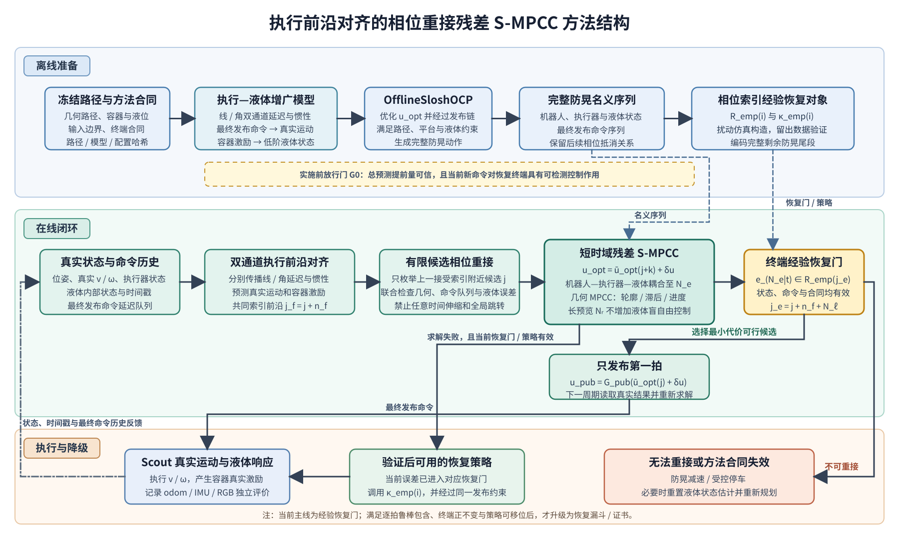

# Phase-Rejoining Residual S-MPCC：Methods 章节组织思路

> 用途：固定论文的方法主线、关键符号和证据边界。实现细节、ROS 配置和完整实验清单不放在这里。
>
> 状态：`RESEARCH_PROPOSAL`。当前优先落地 **empirical recovery gate**；只有完成鲁棒包含证明后，才升级为 recovery funnel/certificate。

## 1. 核心问题与方法主张

Scout 的求解器命令不会立即变成真实运动，且线速度和角速度具有不同的延迟与惯性。在线 MPC 又只执行第一拍，若随意修正离线序列，可能破坏后续用于抵消晃液的动作。因此核心问题不是“当前液面是否更低”，而是：

> 当前修正真正作用于底盘后，系统是否仍能在约束内接回离线防晃序列的剩余尾段？

本文采用“离线生成完整防晃动作，在线只做短时残差修正”的结构。核心贡献可概括为：

> 通过执行前沿对齐和相位索引的尾段恢复条件，把离线防晃序列的剩余抵消能力压缩为短时域残差 S-MPCC 的终端约束。

第一篇论文的范围限定为冻结几何路径上的防晃执行，只处理执行误差和预注册的小幅偏离；大幅改道、动态障碍和容器条件变化触发重新规划，不纳入当前恢复声明。

## 2. 方法结构图

**图 1　方法总体结构。** 阅读顺序为“离线准备 → 在线闭环 → 执行与降级”。黄色 G0 是启用在线液体修正前的放行门；鲁棒恢复对象与经验恢复 gate 是两种证据等级，不是并行判据。矢量源图见 [phase_rejoining_method_structure_zh.svg](assets/figures/phase_rejoining_method_structure_zh.svg)。

## 3. Methods 正文章节

正文按图 1 的因果顺序组织为七节，每节只承担一个问题。

### III-A. 问题定义与总体结构

定义冻结路径、离线 artifact、在线状态、控制输入和约束。明确输出是最终发布给 Scout 的线/角速度命令，性能由路径误差、任务时间和独立测得的液面响应共同评价。本节只解释图 1 与任务边界。

### III-B. 执行感知的机器人—液体动力学

区分求解器命令 $u^{\mathrm{opt}}$、最终发布命令 $u^{\mathrm{pub}}$ 和真实运动 $(v^r,\omega^r)$，并建立唯一的闭合因果链：

$$
u_k^{\mathrm{pub}}
=\mathcal G_{\mathrm{pub}}(u_k^{\mathrm{opt}},x_k^a),
\qquad
u^{\mathrm{pub}}\rightarrow x^a\rightarrow(v^r,\omega^r)
\rightarrow(\dot v^r,v^r\omega^r)\rightarrow z_\ell,
$$

其中 $x^a$ 保留线/角双通道 delay buffer、限速与惯性状态，$z_\ell$ 为受 $a_x^C=\dot v^r$ 和 $a_y^C=v^r\omega^r$ 驱动的双轴低阶液体状态。离线和在线必须使用同一模型；buffer 记录 $u^{\mathrm{pub}}$，全部状态按源时间戳对齐，RGB 液面仅作独立评价。

### III-C. 离线防晃名义序列

OfflineSloshOCP 使用同一增广模型生成完整名义序列

$$
\mathcal A=\{\bar x_i,\bar x_i^a,\bar z_{\ell,i},\bar u_i^{\mathrm{opt}},
\bar u_i^{\mathrm{pub}},\mathcal R_i,\kappa_i,t_i,\mathrm{hash}\}_{i=0}^{M}.
$$

artifact 冻结路径、容器/液位、模型、约束和终端条件；合同或哈希变化即重新生成。

> **实物使用说明：**这里的“离线”是指在闭环执行开始前完成计算，不等于必须人工提前制作。实验室现场可以在收到目标后自动完成全局规划、路径平滑与可行性检查以及 OfflineSloshOCP 求解，检查通过后机器人再启动；运行中若需大幅改道，则先安全减速或停车，待液体满足重启条件后重新规划并生成 artifact。常用路线可以缓存，第一版不支持运动中无缝更换整条路径。

### III-D. 执行前沿与有限相位重接

线、角延迟在状态中分别传播，共同前沿只用于索引：

$$
d_f=\max(d_v,d_\omega),
\qquad
n_f=\left\lceil\frac{d_f}{\Delta t}\right\rceil,
\qquad
N_e=n_f+N_\ell,
$$

其中 $N_\ell$ 是执行前沿后的可信液体窗口，$j$ 是**候选当前名义索引**：

$$
j_f=j+n_f,
\qquad
j_e=j+N_e=j_f+N_\ell.
$$

残差相对 $\bar u_j$ 构造，终端在 $\mathcal R_{j_e}$ 检查。从当前测量时刻计数时，终端是 $N_e=n_f+N_\ell$；实现中先把状态传播到执行前沿再交给求解器，因此求解器内部只预测 $N_\ell$ 步。两种计数对应同一个 $j_e$，不能重复计算延迟。候选只在上一接受索引附近单调枚举；几何进度 $s$ 与防晃相位 $j$ 分开，并限制

$$
\left|s_{k|t}-\bar s_{j+k}\right|\le\epsilon_s^{\max}
$$

以禁止自由时间伸缩和全局相位跳转。预测只能从当前增广状态传播一次，不能重复施加延迟。

### III-E. 相位索引尾段恢复对象

恢复误差 $e_i$ 必须具有 Markov 性，覆盖路径、真实速度、执行器、液体和命令历史。当前先构造 rollout 拟合、held-out 验证的 $(\widehat{\mathcal R}^{\mathrm{emp}}_i,\kappa_i^{\mathrm{emp}})$；只有满足逐拍鲁棒包含、终端正不变与策略可移位，才升级为：

$$
\widehat{\mathcal F}^{\mathrm{rob}}_i
\subseteq
\left\{
e\;\middle|\;
(e,\kappa_i(e))\in\mathcal Z_i,
\ f_i^e(e,\kappa_i(e),w)
\in\widehat{\mathcal F}^{\mathrm{rob}}_{i+1},
\ \forall w\in\mathcal W_i
\right\}.
$$

| 证据                           | 名称                        | 可报告结论                   |
| ------------------------------ | --------------------------- | ---------------------------- |
| rollout + held-out             | empirical recovery gate     | coverage、误判率、重接成功率 |
| 鲁棒包含 + 正不变 + 可移位策略 | recovery funnel/certificate | 声明范围内的尾段可行性       |

两条路线都必须同时保存恢复对象和可执行策略 $\kappa_i$。

### III-F. 在线残差 S-MPCC

对每个候选 $j$，以 $u_{k|t}^{\mathrm{opt}}=\bar u_{j+k}^{\mathrm{opt}}+\delta u_{k|t}$ 进行增广预测，并最小化

$$
J=J_{\mathrm{MPCC}}+J_{\mathrm{nominal}}+J_{\mathrm{residual}}
+J_{\mathrm{liquid,rel}}+J_{\mathrm{rejoin}}.
$$

终端必须满足

$$
e_{N_e|t}^{(j)}\in\widehat{\mathcal R}^{\mathrm{emp}}_{j_e}
\quad\text{（经验路线）},
\qquad\text{或}\qquad
\mathcal T_{N_e|t}^{(j)}
\subseteq\widehat{\mathcal F}^{\mathrm{rob}}_{j_e}
\quad\text{（鲁棒路线）}.
$$

经验路线检查点预测，鲁棒路线检查可达 tube。几何参考可预览到 $N_r\ge N_e$，但 $N_e$ 后不得增加液体模型未覆盖的自由控制。选择最低代价可行候选，只发布第一拍，并在下一周期基于真实 $u^{\mathrm{pub}}$ 历史重新求解。

若最终实现没有路径进度、contouring/lag error 和 progress term，方法名应改为 **Phase-Rejoining Residual MPC**，不使用 MPCC。

### III-G. 恢复、降级与适用范围

| 在线状态                             | 动作                                           |
| ------------------------------------ | ---------------------------------------------- |
| 候选可行且终端判据通过               | 发布所选候选的第一拍                           |
| 下周期求解失败，但已保存策略仍有效   | 移位执行在线策略前缀，再按索引调用$\kappa_i$ |
| 所有候选均不可重接                   | 防晃减速或受控停车，必要时重新规划             |
| 时间戳、命令覆盖、状态估计或合同失效 | 立即撤销恢复声明并进入验证过的降级逻辑         |

经验路线中，“上一周期预测未来会进入 gate”不等于“当前已经可恢复”；只有当前误差确实位于对应经验集合内，才能调用经验策略。人员安全所需的急停始终优先于液体恢复逻辑。

## 4. 研究放行门

最重要的是 G0。若 $d_v\approx150\,\mathrm{ms}$、$d_\omega\approx220\,\mathrm{ms}$，而前沿后液体窗口取 $T_\ell\approx100\,\mathrm{ms}$，则恢复终端实际位于当前时刻约 $250$–$320\,\mathrm{ms}$ 后，而不是 $100\,\mathrm{ms}$ 后。

| 阶段         | 必须证明                                          | 不通过时                         |
| ------------ | ------------------------------------------------- | -------------------------------- |
| G0：总 lead  | 终端预测可信，且新命令对终端液体有可检测作用      | 退回执行感知的离线前馈与低频纠偏 |
| G1：离线名义 | 同任务时间下优于 smooth/jerk-limited 基线         | 不构造恢复对象                   |
| G2：恢复对象 | held-out 上能区分是否可重接；鲁棒路线另需逐拍包含 | 降为 empirical gate 或停止       |
| G3：在线闭环 | 残差控制和恢复判据均有独立增益                    | 收缩在线修正权限                 |

G0 至少检查总 lead 预测误差、第一拍控制灵敏度、IMU 在液体主频附近的幅相误差，以及延迟参数跨 trial、电量和地面的稳定性。

## 5. 写作边界

证据完整时可写：

> 本文通过执行前沿对齐和相位索引的尾段恢复漏斗，将离线防晃序列的剩余抵消能力编码为短时域残差 S-MPCC 的终端条件。

只有数据验证时应写：

> 本文通过执行前沿对齐和相位索引的经验恢复 gate，筛选短时域残差修正，并报告接受后实际重接成功与失败的统计结果。

不要声称首次移动机器人防晃、首次 slosh-aware MPC、$100\,\mathrm{ms}$ 是跨平台天然可信时域、低阶液高 surrogate 等于现实绝对不洒，或平均求解时间足以证明硬实时。

ROS topic、完整辨识流程、控制权重、求解器配置和实验参数统一移至实验节或补充材料，避免再次挤入 Methods 主线。
