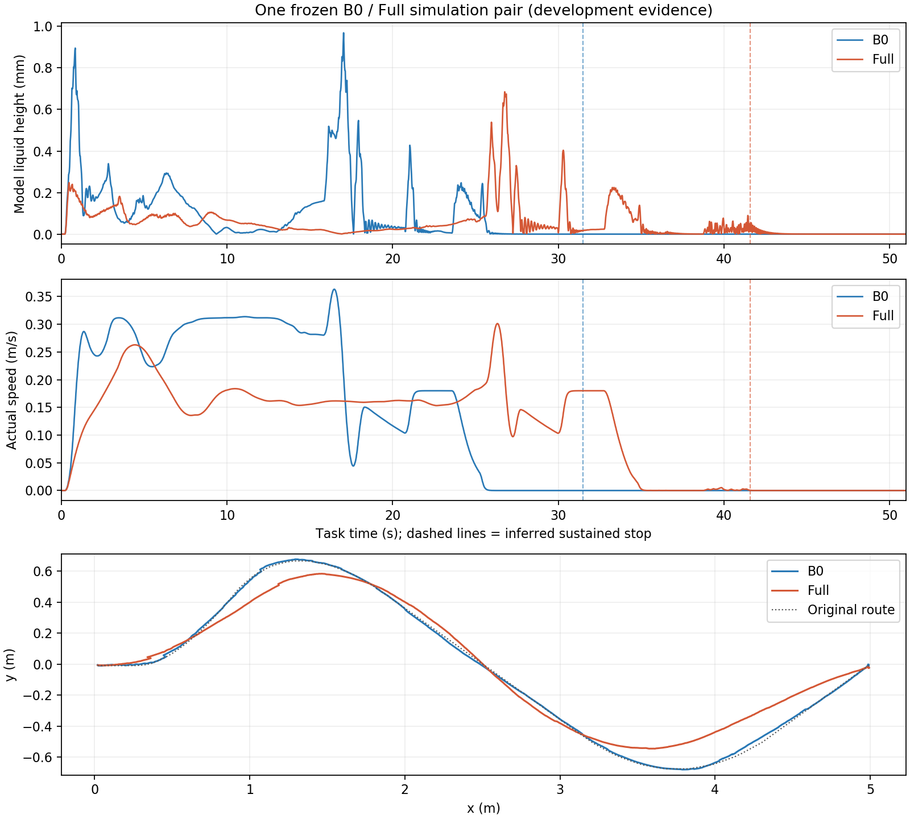

# B0 与 Full 单次仿真复核

日期：2026-09-18。用户明确要求测试 B0 和 Full，本次各运行一次，不补跑、不筛选。**两次均在 45 s 内到点并停稳，全过程未发现对齐拒绝、求解预算耗尽、求解失败、命令过期或异常零命令。** 原始全部尝试均保留，`formal=false`。

本次 Full 使用归档的 `REPLAYED_FEASIBLE_SEED_NOT_REOPTIMIZED` 计划。此前[40 s 上层重新优化两次超时](../../实现与修复/20260918_限晃时长搜索基础链路复核与停车评价.md)的结论保持不变；这是已验证种子的执行回归，不是缩短时长的新计划闭环。

## 1. 同条件与运行身份

- Git：`abdd66d8`；控制二进制对应 `c82a09db` 的归档恢复版本。运行物、生成求解器、物理与控制配置和输入任务核对一致；本轮只调整录制结束逻辑，未改下层控制。
- B0=`raw_mpcc`，Full=`planned_slosh`。N40、30 Hz；Full contour=1、curvature_rate=0.0001、slosh weight=5。
- 同一原始 S 路线任务，目标 `[5,0,0]`，45 s 截止，容差 5 cm / 0.1 rad；identified 执行器，同一地图、世界初态和仿真种子。
- 两次分别独立启动和关闭环境；定位得到的初态略有差异，B0 为 `[0.01869480447542589, -0.0062819743733742925, 0.0010640611599955743]`，Full 为 `[0.02053477242908826, -0.007519390118304218, 0.0014372416334217288]`，未伪造完全相同的定位数值。
- Full 同时改变几何与速度参考和代价项，这不是仅切换液体代价的消融。

原始目录：

```text
/data/a/scout_sim_replacement/results/20260918_b0_full_check_153651/
  manifest.json
  comparison.json
  parking_windows.json
  b0_01/case/run.bag
  full_01/case/run.bag
```

## 2. 结果

| 指标 | B0 | Full |
| --- | ---: | ---: |
| 首次 GOAL_REACHED(s) | 31.527 | 41.530 |
| 持续停车候选 t_stop(s) | 31.492 | 41.564 |
| 运输段模型液面峰值(mm) | 0.968864 | 0.684741 |
| 停车后 5 s 模型液面峰值(mm) | 0.000001 | 0.054698 |
| 到点前模型高度 P95(mm) | 0.480843 | 0.214239 |
| 到点前模型高度 RMS(mm) | 0.199195 | 0.109713 |
| 最终位置误差(cm) | 1.396 | 2.395 |
| 最终姿态误差(°) | 1.838 | 2.711 |
| 记录时长(仿真 s) | 51.088 | 51.087 |
| 停车窗数据与证据覆盖 | 完整 | 完整 |
| 全程控制异常次数 | 0 | 0 |

本次 Full 运输峰值下降 **29.3%**，到点前高度 P95 下降 **55.4%**，到点耗时增加 **10.003 s（31.7%）**。Full 停车窗峰值 0.054698 mm，高于本次 B0 的接近零响应，也高于此前历史 Full 停车候选窗口的 0.023425 mm 最大值；不能仅凭运输峰值下降就声称停车残振全面改善。新液面阈值尚未冻结，本轮未将这些数值解释为新限值验收通过。

高度来自 odom 驱动的液体模型，B0 接近零的尾峰不代表实测液面为零。每组 n=1，不作为重复稳定性证明，也不并入此前筛选样本均值。



图中虚线为持续停车候选时刻。实际线速度接近零后仍可能进行姿态收敛，不能只看线速度曲线判定运输完成。

## 3. 停车窗口与录制条件

新增独立 `scripts/simulation_observation.py`，由 runner 按 `D+W+1=51 s` 仿真时间结束观察；等待期间仍监测规划器和执行器进程。墙钟 180 s 只作为异常兜底预算，不能作为已录满的依据。相关 2 项定向检查通过，覆盖时钟暂停和完整尾段边界。

两次实际记录均超过 51 s；bag 后验分别确认 `[31.492,36.492]` 和 `[41.564,46.564]` 的 5 s 停车窗口完整。检查目标位姿、低实际速度、持续零发布命令及按冻结延迟推断的队列清退，不使用 GOAL_REACHED 字符串直接代替停车时刻。raw pose 缺少自身时间戳，使用 bag 接收时间并核对参考系；FIFO 是模型/命令历史推断，没有直接观测内部队列，因此报告为停车候选。

运输峰统计 `[0,t_stop)`，尾峰统计 `[t_stop,t_stop+5]`。P95/RMS 保留既有分析器的 `[0,首次 GOAL_REACHED]` 口径，避免混称同一个窗口。

## 4. 在线预算和完整性

| 在线计时(ms) | B0 | Full |
| --- | ---: | ---: |
| RTI P95 / 最大 | 6.644 / 14.542 | 8.458 / 16.749 |
| dispatch P95 / 最大 | 9.346 / 17.054 | 11.973 / 20.188 |

这是本次记录中的在线墙钟统计，不是离线上层求解耗时，也不能从单次结果宣称全场景 30 Hz 保证。

两个 bag 均正常闭合、端口释放，任务/地图/runtime hash 一致，执行器和状态对齐等共享 live 参数逐项相同。启动器的小型状态白名单误写了 B0 正常状态名，后验按真实 `B0_ACADOS_OK` 修正；原分类保存在 `launcher_status_classification`，`comparison.json` 和 manifest 的 `final_clean` 为最终结论，不删除原始记录或异常事件。

本轮代码与记录分阶段 commit，未 push；地图、world、launch、外部仿真 scripts 及原有 `Testing/` 均未修改。
