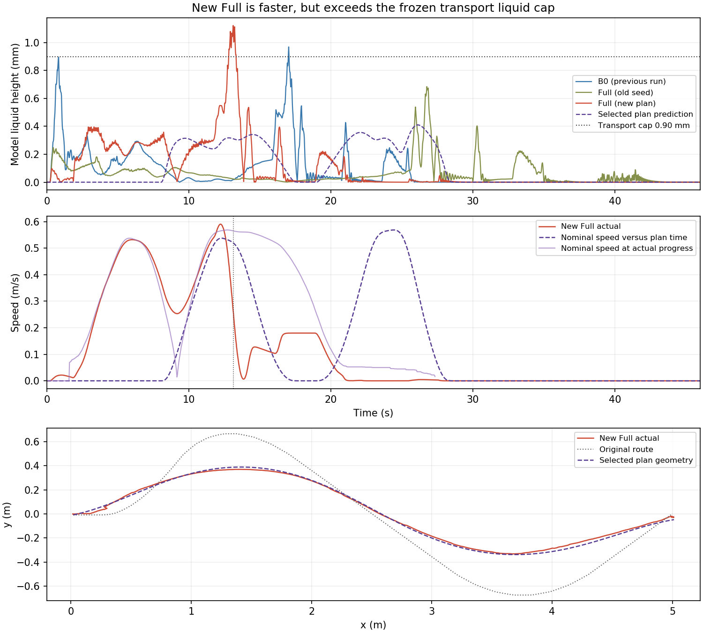

# 限晃时长搜索：实现与验证

日期：2026-09-18。延续[基础链路复核](./20260918_限晃时长搜索基础链路复核与停车评价.md)，按[方案](../思路与方案/20260918_限晃条件下缩短运输时间的上层改造思路.md)完成最小上层改造。下层控制仍为归档 `c82a09db`，30 Hz、N40、物理参数与共同 45 s 截止保持不变；全部属于开发验证。

原始证据：`/data/a/scout_sim_replacement/results/20260918_liquid_time_resume_161636/`。原始基线、搜索和闭环分别保存在 `manifest.json`、`time_search/manifest.json`、`full_manifest.json`；[汇总 JSON](./20260918_限晃时长搜索实现与验证.json)保留全部候选和结果。

2026-09-19 后续：[首拍数值初值准备与验证](./20260919_Full首拍数值初值准备与验证.md)。原首拍异常已通过精确回放与一次新 Full 验证修复；新运行在后续状态对齐拒绝时出现停车历史异常和模型液面超限，完整验收仍失败。下文保留 9 月 18 日的运行版本与结果。

## 实现边界

- `planning/optimizer.py`：移除被等式和动力学固定变量的重复活动边界；保留原物理可行域。分段液面采用无量纲 `h²/H²≤1`，新模式液体积分与 terminal 截止于 `T+W`；导出及物理验证仍覆盖至 `D+W=50 s`。
- `planning/guide.py`：用穿过原路线点的平滑参考替代分段常值切向量。原折线切向跳变与不等 contour/lag 权重会使离线目标不连续；插值网格向两端延拓，避免端点浮点越界落到 CasADi 的零值分支。它是弱几何参考，不改变原区域约束或下层参考执行。
- `planning/liquid_policy.py`：只负责显式限值合同、阶段限值与代价窗口。`validation.py` 复用完整重传播和每拍四子步，按首次持续物理停车评价；提前停车时立即按停车限值补查。缺省任务保留旧液面语义，旧计划不能冒充新模式。
- `search_transport_duration.py`：一个独立入口，复用单次生成与进程预算；每个候选重新求解，使用上一有效计划作完整初值，不压缩时间轴。保留失败和未尝试记录，选最短有效候选并经过实际 C++ 计划加载后才导出 `selected_plan.json`。
- `planning/task.py`：JSON 先按 JSON 解析，保留 `1e-06` 等数值；继续兼容 YAML。发现的输入类型问题发生在搜索目录创建与求解前，归档于 `search_protocol.json`，不计作数值求解重试。

C++ 加载器沿用现有可执行合同，识别可选元数据不需要修改下层；新液面合同由 Python 门禁核验，C++ 校验完整状态、FIFO、尾段边界和生产动力学。

## 冻结实验条件

| 项目 | 值 |
| --- | --- |
| 运输/停车液面上限 | 0.90 / 0.08 mm |
| 密集液面验收容差 | 0.001 mm，独立于 NLP 残差容差 |
| 候选名义 T | 40、36、33、31.5 s |
| 网格 / 截止 / 停车窗 | 1/30 s / 45 s / 5 s |
| 单候选 / 搜索总预算 | 600 / 2400 墙钟秒，含建模和后验验证 |
| 重试 / 局部细化 | 0 / 0；限晃 40 s 基线失败则停止短时长候选 |
| 闭环 | 选中后一次新 Full；沿用最近 B0 作开发参照，不自动补跑 |

限值在首次约束求解前记录：运输限值高于历史无异常 Full 最大值 0.831 mm，低于历史 B0 最小值 0.957 mm；停车限值高于最近旧 Full 的 0.054698 mm。失败样本继续保留，不据此放宽。它们是模型开发阈值，不是杯沿物理安全余量。

## 基线与检查

| 基线尝试 | 墙钟(s) | 结果 |
| --- | --- | --- |
| 仅去除重复活动边界 | 513.024 | 定位参考目标不连续后中止；全部日志保留，无新计划 |
| 平滑参考下原 40 s 任务重新优化 | 406.647 | `Solve_Succeeded`，目标 2.351706；完整 Python 验证通过 |

成功基线预测 `t_stop=40.000 s`，运输/停车窗峰值为 `0.393756 / 0.011334 mm`。它是真正重新求解的计划，与历史 `REPLAYED_FEASIBLE_SEED_NOT_REOPTIMIZED` 区分。端点延拓随后用于限晃搜索，版本记录在计划元数据与 protocol 中。

36 项相关 Python 检查通过，包含新限值、提前停车、子步超限、旧计划兼容、后缀、搜索失败/中断、JSON 文件输入及参考端点连续性。native 的 17 项参考轨迹测试通过。一次整个历史 scripts/tests 目录的收集因未加载 ROS 环境缺少 rosbag/genpy 而中止，不作为通过记录；本次按受影响规划范围执行上述检查。

## 有限搜索与闭环结果

| T(s) | 预测 t_stop(s) | 运输/停车窗峰值(mm) | 完整进程墙钟(s) | 状态 |
| --- | --- | --- | --- | --- |
| 40 | 40.000 | 0.431125 / 0.009730 | 475.691 | 收敛，Python 密集验证通过 |
| 36 | — | — | 600.066 | 600 s 上限，未收敛 |
| 33 | 33.000 | 0.459021 / 0.010817 | 561.983 | 收敛，Python 密集验证通过 |
| 31.5 | 31.500 | 0.411695 / 0.000116 | 289.244 | 收敛，Python 密集验证通过；C++ 通过，选中 |

固定清单全部执行，搜索总墙钟 **1929.517 s**，未超过 2400 s。选中 **31.5 s**，比原 40 s 名义运输时长缩短 **21.25%**，属于所测离散候选中的最短有效计划；不宣称全局时间最优。40 s 新计划也另做过 C++ 加载预检。36 s 超时、33 s 与 31.5 s 成功反映局部非线性优化与计算预算，不能从 36 s 的失败推断更短时长必然不可行。

选中计划：`time_search/selected_plan.json`；SHA256：`13ce76ed6bcebf11f96c58e14d696b0527e5f4da941e6d30afc40a3167ada28a`。每个候选的 task、完整初值来源、日志、收敛状态与 hash 均保留在 `time_search/manifest.json` 及候选子目录；失败候选没有生成可执行计划。

### 单次 Full 闭环：时间缩短，运输液面超限

| 运行 | 到点(s) | 停车候选(s) | 运输峰值(mm) | 停车窗峰值(mm) |
| --- | --- | --- | --- | --- |
| B0（最近单次） | 31.527 | 31.492 | 0.968864 | 0.000001 |
| Full（旧种子） | 41.530 | 41.564 | 0.684741 | 0.054698 |
| Full（新31.5秒计划） | 27.725 | 27.791 | 1.122152 | 0.022876 |

新 Full 实际到点 **27.725 s**，比旧 Full 快 **33.24%**，比最近 B0 快 **12.06%**；但运输模型峰值 **1.122152 mm** 超过 `0.90+0.001 mm` 验收线，比 B0 高 **15.82%**。停车窗 **0.022876 mm** 满足 `0.08+0.001 mm`。因此 **`closed_loop_passed=false`**：软件链路和有限搜索已完成，单次时间缩短已观察到，“限晃且缩时”的闭环目标未通过。

本次全程没有对齐拒绝、预算耗尽、acados 失败或故障零速；所有状态均在正常集合内。录包覆盖完整运输与停车窗，运行物 hash 不变，bag 正常闭合，ROS/Gazebo 端口均释放。runner 的 `passed=true` 只表示到点及运行记录完整，不能替代液面验收。在线 RTI 墙钟 P95 / max 为 **11.207 / 22.373 ms**，离线计算耗时单独见上表。

旧 B0 和旧 Full 引用最近同配置单次复核，不追加到历史筛选均值。候选 task 仅按约定改变名义 T、新模式及规范化字段；原路线、目标、区域、物理参数、30 Hz 和下层运行物保持一致。fresh-sim 的实际定位初态存在小偏差，不能将单次模型结果称为稳定性或独立实测液面结论。

### 超限定位与本轮停止点

`execution_deviation.json` 和逐拍 `execution_deviation_series.npz` 对齐本次 OCP 输入快照。液面峰值在 **13.126 s**，并非控制错误后的异常停车：

- 计划首次速度大于 `0.01 m/s` 在 **8.467 s**，实际为 **0.486 s**；进度参考没有保留原名义时间安排。
- 峰值最近的输入快照在 **13.133 s**，查询对应计划时刻 **24.702 s**。实际/计划同进度速度为 **0.246 / 0.565 m/s**，角速度为 **0.029 / 0.230 rad/s**。
- 当时 `TASK_GOAL_STOP_PROFILE`、`stop_active=1`，实际加速度估计 **−0.618 m/s²**，同进度的上层模型加速度 **−0.038 m/s²**。原下层末端停车剖面与上层安排的减速过程不同。

这些直接记录确认了时间过程和末端减速的执行偏差，与液面超限发生时段一致；单次观察不能把所有偏差归为某一个参数。上层硬约束只约束自己的预测，下层仍按进度查询并在线修改速度，未启用同一硬液面限制。

按原方案的闭环超限停止条件，**不追加运行，不放宽阈值，不改变冻结下层，不扩大候选清单**。下一步应聚焦让上层计划与现有下层的进度执行、末端停车约束一致，再冻结独立验证批次；本轮不能宣称保持防晃收益或已经闭环限晃成功。



图中紫色虚线使用名义计划时间，浅紫实线使用实际进度对应的名义速度，用于区分时间安排与几何跟踪；高度仍是模型响应。绘图脚本与图片位于[附件目录](./20260918_限晃时长搜索/)。


## 追加：同计划 fixed_time 单次对照

用户要求最小测试后，仅将本次案例的 `planning.reference.mode` 从 `progress` 改为 `fixed_time`；仍用同一份 31.5 s 计划和任务，未重新优化、未修改控制器/权重/末端停车逻辑。运行物恢复自归档并核对 hash。启动器新增可选 `--reference-mode fixed_time`，只写本次 overlay，默认配置仍为 `progress`。

| 模式 | 实际到点(s) | 停车候选(s) | 运输峰值(mm) | 停车窗峰值(mm) |
| --- | --- | --- | --- | --- |
| progress | 27.725 | 27.791 | 1.122152 | 0.022876 |
| fixed_time | 38.597 | 38.595 | 1.108339 | 0.000000 |

实际 live 参数差异严格只有上述一个字段；新录包的求解输入明确为 `fixed_time`，首阶段名义取样时间与 `task_elapsed_sec` 最大差为 **0 s**。因此切换已生效，但它只是按时间提供速度参考，不保证实际进度或停车时刻严格跟随名义时间。

本次运输/停车窗均完整，全程无对齐拒绝、预算耗尽或其他异常状态，端口释放、bag 闭合。运输峰值 **1.108339 mm** 仍超过 `0.90+0.001 mm`，液面验收失败；到点比 `progress` 慢 **10.872 s**，峰值仅下降约 **1.23%**。**单独切换 fixed_time 没有解决本例，暂不作为推荐配置。** 本轮只运行一次，不追加扫参，也未实施末端减速改造。

原始记录：`/data/a/scout_sim_replacement/results/20260918_fixed_time_single_220004/`；`manifest.json` 保存命令、计划/hash、参数差异、对比和验收结果，`full_fixed_time/case/run.bag` 保留完整记录。`run_one.py` 与 `compare.py` 为本次运行及分析入口。

## 追加：上层纳入末端减速包络，单次通过

按用户要求测试方案 1，只增加可选的 `terminal_speed_policy`；下层继续使用冻结的 `progress` 配置。新增 `planning/terminal_speed.py` 统一提供包络计算，任务规范化、优化器和验证器复用它；旧任务不带该字段时保持原行为。没有复制停车状态机或修改下层控制器。

从实际 live 参数读取末端区间 **1.2 m**、限速 **0.18 m/s**。将原减速斜率连续延伸到区间外，让上层提前减速；同时考虑剩余路径进度、距目标的距离、末端制动距离和执行器增益，限制预测实际速度及命令速度。采用保守包络，可能比下层瞬时限制更严格；不是对下层全部姿态、软代价和状态机的精确复现。当前冻结配置的 capture 上限同为 0.18 m/s，运行前已核对兼容性。

只对原 **31.5 s** 任务重新优化一次，使用之前计划作完整初值；液面限值、容差、30 Hz、45 s 截止和其余物理条件不变。600 s 上限内以 `Solve_Succeeded` 收敛，164 次迭代、完整进程 **135.338 s**。预测运输/停车窗峰值 **0.425506 / 0.031281 mm**，`t_stop=31.5 s`；完整 Python 验证和实际 C++ 加载均通过。4 项定向检查覆盖包络入口连续性、执行器增益、零速制动、旧计划兼容/新增约束拒绝和无效参数。

| 单次仿真 | 实际到点(s) | 停车候选(s) | 运输峰值(mm) | 停车窗峰值(mm) |
| --- | --- | --- | --- | --- |
| 原 31.5 s 计划，progress | 27.725 | 27.791 | 1.122152 | 0.022876 |
| 新末端包络计划，progress | **26.982** | **26.951** | **0.850160** | **0.000014** |

**本次 `closed_loop_passed=true`**。运输峰值低于 `0.90+0.001 mm`，停车峰值低于 `0.08+0.001 mm`，实际到点及停车均满足 45 s 截止。比前一个计划峰值下降 **24.24%**、耗时下降 **2.68%**；相对最近 B0（31.527 s / 0.968864 mm），耗时下降 **14.42%**、峰值下降 **12.25%**。

实际 live 参数仅 `planning.reference.plan_file` 不同；控制运行物和其余配置 hash 一致。全过程无异常状态，对齐拒绝、预算耗尽和故障零速均为 0；运输与停车窗口完整，bag 闭合，端口释放。本轮严格只有一次重新优化和一次 Full，未追加重跑，未启用 fixed_time。

这是**单次开发验证通过**，预测与实际响应仍有差异，不能据此宣称全量稳定或实物通过。新策略保持显式 opt-in，没有改默认下层参数。原始记录：`/data/a/scout_sim_replacement/results/20260918_terminal_envelope_single_221820/`，`manifest.json` 保存所有输入、hash、求解、Python/C++ 验证、参数差异和闭环结果。

## 追加：减速提前至 1.35 m，峰值优势扩大但启动异常未通过

用户要求继续拉大与 B0 的差距，同时保持最小操作。本轮复用现有 `terminal_speed_policy`，仅调整上层 `slowdown_distance_m`；没有新增生产代码、修改下层配置或降低验收要求，B0 使用最近单次归档。名义 T 仍为 31.5 s，液面上限、共同截止、评价窗口和运行物全部保持不变。

先检查上一版完整 bag：0.850160 mm 峰值出现在 12.304 s；最近快照的实际加速度约 −0.436 m/s²，同进度名义值约 −0.028 m/s²。进入末端前车速先从约 0.253 回升至 0.325 m/s，再急减速；此前 0～10.8 s 的峰值只有 0.477 mm。由此选择提前减速、给入口速度留余量，而非收紧当时并未触及的上层液面上限。

### 两次求解尝试，一次闭环

- **1.5 m 候选**：启动一次求解后发现时间约束冲突。按最大直线起步前缀及乐观离散速度包络计算，忽略曲线和停车成本仍需至少 **31.866667 s**，超过固定 31.5 s；在 **276.781 墙钟秒**停止该求解，没有生成计划或运行仿真。日志与下界推导保留在 `/data/a/scout_sim_replacement/results/20260918_early_envelope_single_224900/`。这次失败计入全部尝试。
- **1.35 m 候选**：将提前量收回至 0.15 m；相同必要条件筛查下界为 29.500 s，筛查本身不证明可行。随后真正求解一次，`Solve_Succeeded`，163 次迭代，完整进程 **121.202 s**；Python 全状态及密集液面验证、实际 C++ 加载通过。预测运输/停车窗峰值 **0.667168 / 0.028114 mm**，预测停车时刻仍为 31.5 s。

下层减速距离保持 **1.2 m**、限速保持 **0.18 m/s**。新上层在 1.2 m 处的包络上限约 **0.15923 m/s**，末端最低包络速度仍为 0.036 m/s；只改变同一条包络的斜率，不增加状态机或特例。没有改名义时间或压缩计划时间轴。

| 单次运行 | 到点(s) | 运输峰值(mm) | 停车窗峰值(mm) | 控制异常 |
| --- | --- | --- | --- | --- |
| B0（沿用最近归档） | 31.527 | 0.968864 | 约 0 | 0 |
| Full，上层包络 1.2 m | 26.982 | 0.850160 | 0.000014 | 0 |
| Full，上层包络 1.35 m | **28.154** | **0.722839** | **0.000056** | **启动预测动力学校验失败 1 次** |

本次模型峰值相对 B0 下降 **25.39%**，此前优势为 12.25%；到点耗时比 B0 低 **10.70%**。相对上一版峰值下降 **14.98%**，耗时增加 **1.172 s（4.34%）**：峰值优势扩大，时间优势有所缩小，并非两项都优于上一版。运输阶段 RMS 从 0.209816 降至 0.200457 mm，但 P95 从 0.424080 升至 0.507417 mm，不能把峰值改善说成全部晃动指标改善。

### 异常与验收结论

唯一异常为 cycle 25 的 `PREDICTION_DYNAMICS_VIOLATION`：循环开始于任务 0.019 s，状态发布于 0.036 s，当时车速/角速度均为 0，使用 `TRAJECTORY_PLAN` 初值并执行 1 次 RTI；发布零命令后，0.070 s 起恢复正常。它与 13.853 s 的运输峰值相隔很远，但仍按原规则计为 **1 次故障零速**，没有剔除启动段。已确认发生位置和输入身份，未证明更细的数值根因。

运输及停车液面、到点截止、完整观察窗口均满足要求；bag 正常闭合、端口释放，未出现对齐拒绝或预算耗尽。实际 live 参数相对上一版只改变 `planning.reference.plan_file`，冻结运行物 hash 一致。

因此 **`liquid_caps_passed=true`，`closed_loop_passed=false`**。本轮证明了单次模型峰值差距可以继续扩大，但不能把有启动异常的候选升级为已验收配置。最近无异常且通过的参照仍为上层 1.2 m 版本；1.35 m 作为后续启动问题定位候选保留。本轮只有一次新 Full，没有追加仿真、重跑 B0、筛掉失败或放宽容差；未做实物和重复性验收。

最新原始记录：`/data/a/scout_sim_replacement/results/20260918_early_envelope_135_single_225457/`。`manifest.json` 包含两次尝试的关联、唯一参数变化、Python/C++ 验证、输入与运行物 hash、比较及拒绝升级的原因；`closed_loop_diagnosis.json` 保留异常和峰值快照，`full_01/case/run.bag` 保留全部数据。复现此候选应使用该目录匹配的 task/plan；重新求解时使用上一版 1.2 m 计划作为完整初值，保持同一 600 s 预算。

## 复现入口

使用新输出目录；`constrained_task.json` 已包含本轮冻结限值。`baseline_smooth_plan.json` 为本轮原任务真实重新优化结果，不能换成旧诊断种子绕过门禁。

```bash
python3 src/scout_apps/control/spmpc_local_planner/scripts/search_transport_duration.py \
  /data/a/scout_sim_replacement/results/20260918_liquid_time_resume_161636/constrained_task.json \
  /data/a/scout_sim_replacement/results/NEW_TIME_SEARCH \
  --warm-plan /data/a/scout_sim_replacement/results/20260918_liquid_time_resume_161636/baseline_smooth_plan.json \
  --cpp-validator /tmp/scout_time_search_native_20260918/validate_plan \
  --times 40 36 33 31.5 --process-seconds 600 --total-seconds 2400
```

C++ 验证器按仓库 `test/native` 构建，临时路径失效时重建；Gazebo 使用[当前主线运行指南](../仿真运行/当前主线仿真启动指南.md)的归档下层运行物，并传入选中候选的 task 和 plan。没有更改下层权重或仿真环境文件。
