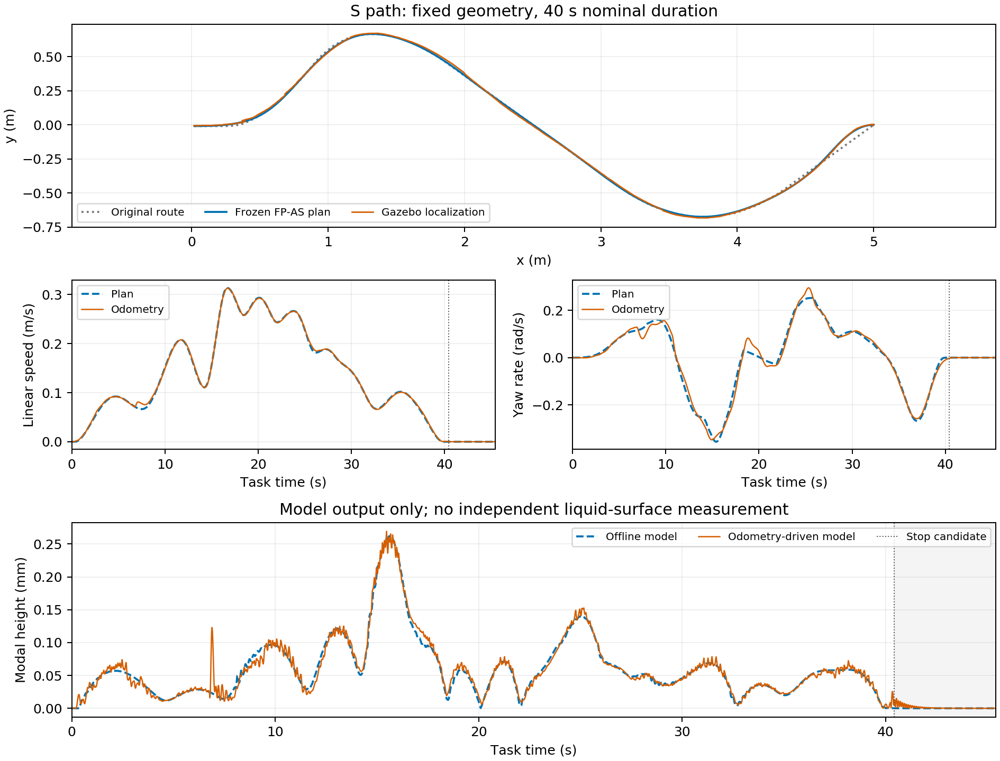

# FP-AS S 路径续验

2026-09-19。用户追加“做 S 路径试一下”后，沿用[前次报告](./20260919_外部基线最小仿真验证.md)的任务、冻结几何和 T=40 s。**离线规划与执行检查通过，S 路径 Gazebo 单次正常完成：40.399 s 到点，模型峰值 0.269344 mm。** 不扫参，不启动实车。

原始目录：`/data/a/scout_sim_replacement/results/20260919_fp_as_s_followup_181514`。原任务和几何文件与前次逐字节一致；冻结路长 5.812509 m、原路线坐标长度 5.809330 m、相对原折线最大调整 5.139 cm，仍未使用 Full 优化路径。

## S 路径单次闭环结果

以下高度均为 **odom 驱动液体模型输出**，不是独立液面测量。运输窗为 `[0,t_stop)`，停车窗为 `[t_stop,t_stop+5 s]`。

| 到点 / 停车候选 s | 峰值 mm | P95 mm | RMS mm | 停车 5 s 峰值 mm | 实际 odom 路长 m |
| ---: | ---: | ---: | ---: | ---: | ---: |
| 40.399 / 40.432 | 0.269344 | 0.148104 | 0.077576 | 0.015029 | 5.839257 |

终点位置误差 4.746 mm、航向误差 0.000599 rad。45 s 内完成，运输／停车 0.90／0.08 mm 限值及 0.001 mm 容差均通过；完整停车窗覆盖。停车候选由持续零命令 40.099 s 加最大执行器延迟 0.333333 s 得到，并结合持续到位／低速判断；这是共同保守推断，未直接测量仿真 FIFO。因此它比控制器到点事件稍晚。

1,201 个 odom 求解拍均正常，车辆／液体时间戳错配 0、命令合同违规 0，状态及控制审计无异常。实际运行是 24 维 B0 模型、N40、30 Hz、一次 RTI、QP 上限 20、`time_tracking`；在线液体代价／约束／恢复／风险调速均关闭。液体观察器只参与统一评价。在线 RTI 墙钟 P95 / max 为 8.318 / 16.596 ms，dispatch max 为 22.502 ms。完整仿真进程墙钟 127.899 s 包含启动、静置、录包和退出，不能当运输耗时。

[绘图脚本](./20260919_FP_AS_S路径续验/plot.py)从归档 plan 和 bag 提取数组复画。图中实际尾段仍有小峰；离线停车峰值 0.000597 mm、闭环为 0.015029 mm，未用离线结果替代执行效果。

## 参考执行与仿真传递

线速 RMSE 0.002343 m/s，角速 RMSE 0.017824 rad/s；按任务时钟对应的位置误差 P95 / max 为 1.802 / 2.448 cm，航向误差 P95 为 0.044840 rad。速度、位置和停车时差通过此前的时间跟踪筛查，首阶段参考时间与持续任务时间误差为 0，时钟回退 0。名义／实际跨过 0.01 m/s 的起步时刻为 1.133／1.073 s；预测／实际停车为 40.000／40.432 s。

S 路线没有单一巡航速度，不沿用直线的“95% 巡航速度制动起点”。按预定 10 s 分段检查，10～20 s 的角速 RMSE 最大，为 0.027716 rad/s；该段转向跟踪有可见偏差，不能称为参考完全复现。详表在[同名 JSON](./20260919_FP_AS_S路径续验.json)。

用发布命令和原 delay/tau/gain 重放仿真适配器，不拟合延迟：线／角输出对 `/cmd_vel_drive` 的 RMSE 为 8.79e-7 m/s / 2.34e-6 rad/s；适配器输出对 odom 为 0.000171 m/s / 0.000392 rad/s。时间基准是 bag 接收时间，近似回调接收时间。它支持本次仿真执行传递与名义模型相符，不能证明实物执行器匹配。

## 归档 S 对照的适用范围

只复用归档，不新增 B0／Full。原始任务的路线、初态、目标、区域、deadline、停车窗及物理限制一致；执行器、地图、状态时序、观察器和两个生成模型哈希一致。控制节点／库哈希不同：本次沿用直线外部基线新增 `time_tracking` 的运行物；默认 B0／Full 行为已有前次检查，但这不构成相同二进制的正式对照。逐项身份和全部 live 参数差异保留在 JSON。

| 方法 | 次数 | 到点 s | 运输峰值 mm | P95 mm | RMS mm | 停车 5 s 峰值 mm |
| --- | ---: | ---: | ---: | ---: | ---: | ---: |
| 归档 B0，均值 | 3 | 31.446 | 0.977478 | 0.480923 | 0.202898 | 1.283e-6 |
| 归档 Full，均值 | 3 | 28.282 | 0.505408 | 0.223075 | 0.111543 | 5.447e-6 |
| 本次 FP-AS | 1 | 40.399 | 0.269344 | 0.148104 | 0.077576 | 0.015029 |

归档逐次范围均保留在 JSON。FP-AS 本次运输三指标较低，但到点比归档 Full 均值晚 12.117 s（约 42.84%），停车残振更高。Full 名义优化路长 5.007696 m，本次固定曲线为 5.812509 m，B0 跟踪原始折线；不是等耗时、等几何或仅液体代价不同的比较。归档尾段极小数是匹配模型衰减的数值，不代表液面测量分辨率。只报告本次固定时长 Scout 适配的结果，不宣称 Ferrari 时间最优复现或统计优势。

## 数值表达与执行时序

原二维节点几何等式在零速处对转向不敏感；起点曲率 0.0871859 m⁻¹，静止点雅可比秩为 1。修复保留共同 28 维车辆／执行器／液体传播，几何继续是硬约束。没有增加贴线代价或放宽验收阈值。

- 新增独立 `baselines/path_transcription.py`：生产 RK4 平面位移对初始线速和延迟线命令呈线性，按路径速度提取共同因子；以冻结三次样条的精确弦差商约束每拍位移。正向运动时与原几何身份等价，零进度采用连续切向极限；节点和子步另行复核。
- 进度 jerk 以两级递推变量表达，与原零前缀二阶差分一致，避免直接形成 dt⁻⁴ Hessian。液体限制和原 jerk 目标不变。
- 曲线前 11 拍保持位置不动，线命令前 6 拍保持零；角通道在平移前获得一拍响应空间。初始姿态仍是任务声明值。清零分别安排在线命令第 1196 拍、角命令第 1191 拍，两条 FIFO 都在第 1200 拍（40 s）清空，保留到达前的转向能力。直线仍沿用原起步／清零安排。
- 初值用完整执行器传播的位移生成进度，保留清零命令后的制动尾段。已知为零的状态不再同时引入退化的乘积等式或重复边界。
- 每 25 次迭代记录最大约束乘子；有限求解失败候选走显式拒绝诊断出口，即使原始可行性通过也不导出为可执行计划。几何验收失败同样保留候选。

只改 Python 离线模块及相关检查；ROS/C++、生成模型、实物命令历史、状态对齐、IMU/odom 接口和故障停车未改。继续使用前次 `/tmp/scout_external_overlay_20260919`，运行物身份核对通过，无需重编。

## 离线与生产模型检查

最终 v8 进程 287.261 s，250 次迭代，`Solve_Succeeded`，目标 0.235544117。节点几何最大误差 8.12e-14 m、四子步误差 1.525e-5 m，保持原 2e-6 m / 1e-3 m 门槛；传播误差 8.22e-14。运输／停车模型峰值 0.262409 / 0.000597 mm，预测停稳 40.0 s，严格 0.90 / 0.08 mm 液体资格通过。

生产 C++ 加载通过；模型闭环使用与 ROS 相同的一次 RTI，40.333 s 完成，零故障，终点位置误差 1.831 mm、航向误差 0.001507 rad，路长 5.813087 m。该项是匹配模型检查，不能代替 Gazebo 或实物结果。

21 项相关 Python 检查通过，覆盖冻结几何、弦差商跨节点及零速极限、归一化与生产传播的一致性、起步／FIFO 清空时序、制动尾段初值、jerk 等价性和失败候选出口，以及原 ZVD、液体停车窗和完整计划验证。

## 全部规划尝试

前次原实现 v1 在 600.065 s 超时；本次没有更换任务、时长、物理参数或限值。每次进程上限均为 600 s，提前终止只作用于本次拥有的子进程组。

| 尝试 | 进程 s | 结果／下一步依据 |
| --- | ---: | --- |
| v2：同步起步、递推 jerk | 243.523 | 对偶仍大；定位低速几何的转向导数退化，提前停止 |
| v3：归一化位移 | 96.762 | 新初值把实际制动速度除以已置零的进度，提前停止修复 |
| v4：制动尾段初值 | 95.310 | 静止命令同时被固定为零及施加非负边界，提前停止去重 |
| v5：去除重复边界 | 336.215 | 秩检查定位归一化初始零速／末端零命令弱主元，提前停止消元 |
| v6：直接表达已知归一化零值 | 244.273 | 末端三拍约束乘子达 1.70e18，提前停止修正过早清空时序 |
| v7：按通道安排 FIFO 到达时清空 | 90.300 | 第 76 次 `Error_In_Step_Computation`；原始残差 2.04e-11，对偶 160.96，仍不合格；大乘子集中于起步曲线约束 |
| v8：平移前一拍转向空间及失败保存 | 287.261 | 收敛并通过严格验证，唯一导出的 S 可执行候选 |

这是一轮有日志依据的实现调试，包含失败和无效修复；没有按结果挑选时长或模型参数。不能把某一项改动单独宣称为全部问题的充分原因。v7 未保存完整候选的缺口已促成 v8 的失败诊断修复，原日志保留。

## 仿真与实物边界

全部液面指标仍由共同液体模型给出。既有实物记录中约 5 Hz 的 IMU / NOKOV 车体加速度为 0.082 / 0.165 m/s²，一阶命令响应只能解释约 0.0126 m/s²；本次匹配执行器仿真没有这些结构振动。旧 4.973 Hz 是半径误标，不能作为扫参范围。低速／制动响应变化、液体阻尼和初始残振、RGB 标定／静水噪声／同步仍待实测，不能把本次模型降晃当成真实液面收益。

## 收尾与剩余缺口

本次只新增 **1 次 S FP-AS Gazebo**；没有补跑 B0／Full、直线或曲线 ZVD，没有参数／时长搜索。七次离线调试尝试和全部提前停止原因均保存，只有 v8 成功计划进入一次生产模型闭环及一次 Gazebo。新参数化目前只有该 S 任务的收敛证据，不能推及任意曲线或保证求解时间；离线求解仍较重。

原始目录保留各版本源码、task／冻结几何／plan、process/events/log、雅可比及乘子诊断、C++／模型检查、bag、live 参数、运行物、统一窗口与执行分析、身份差异和 `final_report.json`。后续关键缺口是更多路径的数值稳定性、正式重复统计，以及真实命令—运动—独立液面的同步验证；本次不扩大实验数量。

`Testing/` 及隔离环境地图、world、launch、脚本均未修改，实车未启动。仿真生命周期正常关闭，端口 11892／11926 已释放；分阶段中文 commit，仅本地、不 push。前次直线比较及 S 超时报告保留历史事实，本报告作为后续结果。
