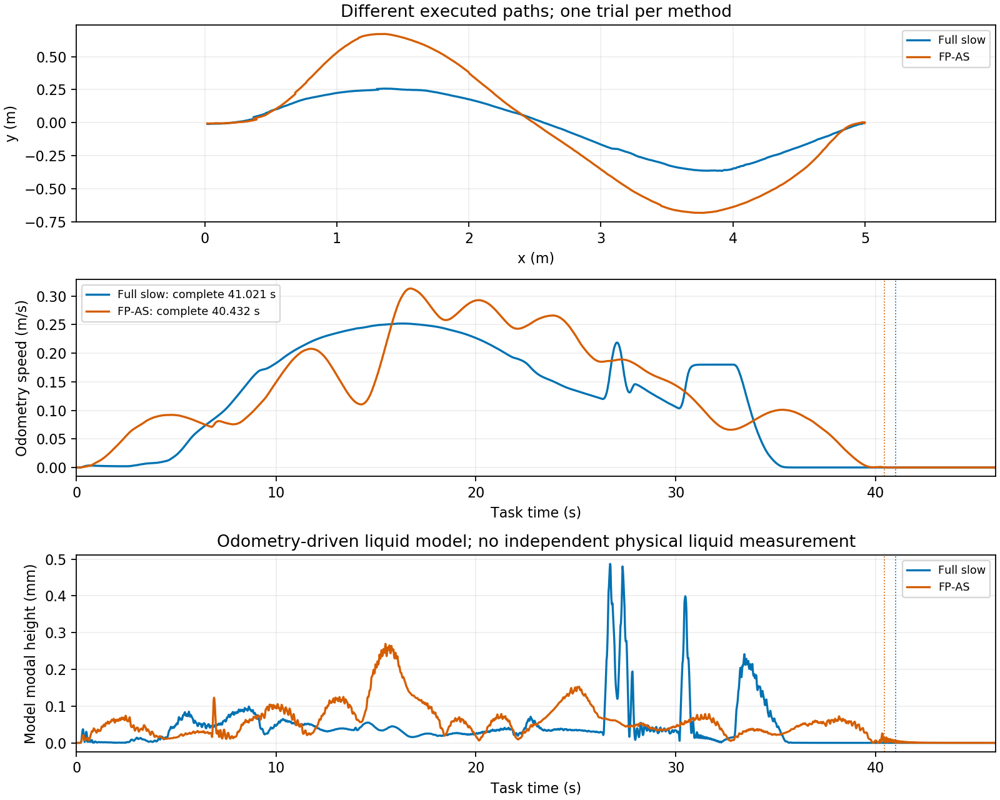

# S 路径约 40 秒共同档最小验证

2026-09-19。按[最小方案](../思路与方案/20260919_外部防晃基线与今日最小仿真验证方案.md)，只新增一个 Full 较慢候选、一次 Gazebo，复用归档 FP-AS。**统一完成时间为 Full 41.021 s、FP-AS 40.432 s，相差 1.44%，满足预设 5% 规则。FP-AS 的运输模型峰值／P95／RMS 更低，Full 的停车模型残振更低。** 两组均通过共同液体限值；这是一组单次预试，不是正式重复或实物收益证明。

原始目录：`/data/a/scout_sim_replacement/results/20260919_full_s_slow_202821`。结构化结果、原始与重算窗口、参数差异和身份核对见[同名 JSON](./20260919_S路径约40秒共同档最小验证.json)。

## 结果

以下高度全部是 **odom 驱动的液体模型输出**。运输窗按本轮方案从运动开始到车辆停稳，停车窗为其后 5 s；旧的任务起点窗口另行保留，没有直接混用旧 P95／RMS。

| 方法 | 次数 | 到点 s | 统一完成 s | 运输峰值 mm | P95 mm | RMS mm | 停车峰值 mm |
| --- | ---: | ---: | ---: | ---: | ---: | ---: | ---: |
| FP-AS，归档 40 s 计划 | 1 | 40.399 | 40.432 | 0.269344 | 0.149733 | 0.078542 | 0.015029 |
| Full，较慢候选 | 1 | 41.055 | 41.021 | 0.486963 | 0.193539 | 0.083174 | 0.000050 |

按 `abs(T_FP_AS−T_Full)/T_Full`，时间差为 0.589 s／1.44%。Full 运输峰值／P95／RMS 分别比 FP-AS 高 80.80%／29.26%／5.90%，因此本次未支持 Full 的运输晃动优势；Full 停车模型峰值更低。极小停车数值是模型衰减，不代表真实液面测量精度。

[绘图脚本](./20260919_S路径约40秒共同档最小验证/plot.py)使用两个归档案例的 bag 提取数组复画；没有新跑 FP-AS 或旧 Full。

## 时间口径与执行差异

完成时刻重算为：持续满足终点位置／朝向容差、线／角速度阈值，以及持续零命令加最大执行器延迟，且这些证据覆盖随后 5 s。现有统一分析恰好已包含这些条件，重新从 bag 核对后沿用；FIFO 清空仍按已知延迟推断，未直接测量。Full 的持续到位／低速／零命令时刻为 39.084／40.697／40.688 s，加 0.333333 s 最大延迟得到 41.021 s。到点状态消息按控制拍发布，故与该重算值略有差异。

运动开始定义为 odom 首次满足 `|v| > 0.01 m/s` 或 `|ω| > 0.02 rad/s`。Full 为 4.337 s，FP-AS 为 1.073 s；运动阶段分别 36.684／39.359 s。**任务完成时间接近，不等于运动阶段等时。** Full 离线预计跨过起步门槛为 0.467 s，实际启动明显更晚；未插入等待命令或终点等时操作，该差异作为执行缺口保留。

Full 保留进度执行，不要求复现离线任务时钟。实际轨迹到名义几何最近线段距离 P95／max 为 2.670／2.792 cm；按相同几何位置对应的速度 RMSE 为 0.043868 m/s，航向误差 P95 为 0.180985 rad，说明实际运动并未完全复现计划。该最近线段统计不证明沿程时序一致；同任务时刻的误差另保留在 JSON，不作为时间跟踪模式的通过证据。任务时钟回退 0，车辆／液体时间戳错配 0。

Full 持续进入线速／角速停稳阈值的时刻分别为 34.977／40.697 s，FP-AS 为 39.173／39.713 s。Full 在平移停下后还经历末端朝向和命令收尾，距离统一完成时刻有6.044 s，FP-AS只有1.259 s；Full停车窗开始前已有更长模型衰减时间。因此较低尾振不能全部归因于液体控制，也不构成相同停车过程的对照。

名义路径长度：Full 5.111943 m，FP-AS 5.812509 m；实际 odom 路长：Full 5.171690 m，FP-AS 5.839257 m。几何、速度安排和在线方法均不同，结论属于整体方案工作点比较。

## 唯一候选及通过情况

归档 Full 默认上层名义 40 s、实际完成约 28.259 s；正进度奖励会推动执行快于速度计划。本次预先固定 **名义 44 s＋下层 `w_progress: 0.2 → 0`**：保留共同 45 s 期限中的 1 s 执行余量，取消额外正进度奖励，保留 `progress` 模式。没有根据本次结果再调参数或时长。Full 的液体代价、其他下层权重、执行器、运动及液体限制均不变，默认 profile 和原合格计划不覆盖。

- 离线进程 51.823 s，52 次迭代，`Solve_Succeeded`。严格传播／区域／停车／液体资格通过；模型运输峰值 0.098782 mm，停车峰值 0.016222 mm，预测停稳 44.0 s。离线指标没有替代执行指标。
- 生产 C++ 加载通过；一次 RTI 的模型闭环 41.333 s 完成、零故障，峰值 0.683119 mm。该模型检查与 Gazebo 的峰值不同，两者均保留。
- Gazebo 进程 127.899 s，包含启动、静置、录包及退出；这不是运输时间。1,220 个 odom 求解拍，控制与审计异常 0、命令合同违规 0，运输及停车窗完整。终点位置／航向误差 2.517 cm／0.048616 rad，45 s 内完成。
- 实际配置为 28 维 Full、N40、30 Hz、一次 RTI、QP 上限 20，液体权重 5；RTI 墙钟 P95／max 为 11.950／16.704 ms，dispatch max 20.624 ms。

执行器重放使用原 delay／tau／gain，没有拟合。命令到适配器线／角输出 RMSE 为 2.94e-7 m/s／1.02e-6 rad/s；适配器到 odom 为 0.000216 m/s／0.000518 rad/s。这说明本次名义仿真传递相符，不证明实车模型准确。

## 版本、改动和保留缺口

Full 与归档 FP-AS 的控制节点、控制库、两个生成模型哈希一致；地图、执行器适配器、共同任务物理条件、状态时序和观察器参数核对一致，因此不需要补跑 FP-AS。旧默认 Full 的控制库仍属于较早版本，只作为历史背景；本次与其 live 参数差异仅为新 plan 路径和 `w_progress`。

仿真 runner 新增可选 `--progress-weight`，仅用于 `planned_slosh`，验证有限非负值并核对实际加载值；未指定时保持旧行为。native 检查入口增加同一可选权重，并在显式使用时对齐当前 Full 的 QP 上限及曲率变化权重；只重建检查程序，没有重编或更换 ROS 控制运行物。负数／NaN 参数拒绝检查通过，正确值经本次实际运行核实。实现提交：`a4177c96`。

共同档仅通过各一次预试，正式重复尚未完成；Full 的启动滞后和速度执行差异保留为后续需要解释的现象。已有同计划下层消融可独立保留，不能与本次新速度工作点混算。此前 FP-AS 28 s 超时记录仍有效，不重试，不代表理论不可行。

全部高度仍来自共源液体模型。实物约 5 Hz 车体振动、低速制动变化、阻尼／初始残振、独立液面的标定与同步尚未验证，不能把本次模型输赢写成真实收益。

本轮按停止条件收尾：一个 Full 候选、一次生产模型检查、一次 Gazebo；无 FP-AS／B0 重复、无扫参、无半圆扩展。全部自有仿真进程退出，端口 11892／11926 释放；`Testing/` 和隔离环境文件未动，实车未启动。下一阶段才是统一版本与口径的正式记录及第二场景。
