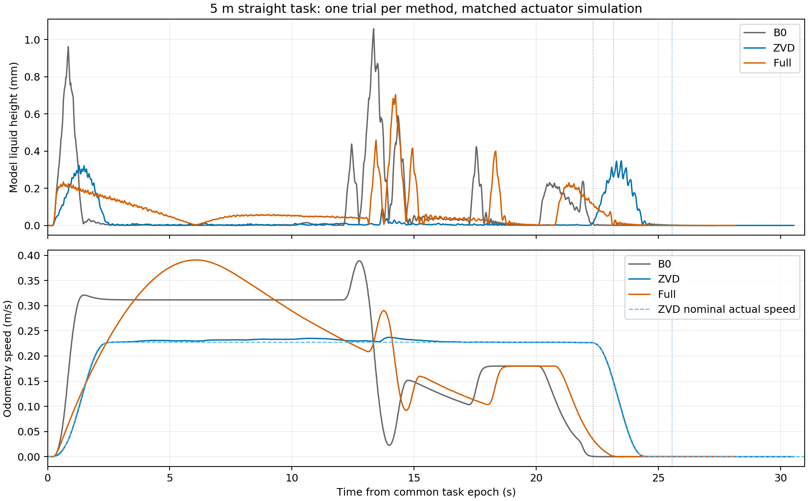

# 外部基线最小仿真验证

2026-09-19。**直线 B0／ZVD／Full 各一次已完成，三次均正常到点、无控制异常，ZVD 通过原理和执行检查。** 本次 ZVD 模型三指标低于 Full，但耗时较长；Full 的离线液面资格失败如实保留。FP-AS 直线简例通过，S 候选在 600 s 上限停止，未启动 S 仿真。依据[当日方案](../思路与方案/20260919_外部防晃基线与今日最小仿真验证方案.md)，不扫参、不启动实车。

**后续更新：** 用户追加“做 S 路径试一下”后，同一冻结曲线及 T=40 s 已通过规划和一次 Gazebo，详见 [FP-AS S 路径续验](./20260919_FP_AS_S路径续验.md)。本文的超时和收尾记录保留为前次事实。

原始目录：`/data/a/scout_sim_replacement/results/20260919_external_baselines_170619`。同一直线长 5 m，起点与航向沿用归档静止定位，公共截止 45 s、停车窗 5 s。ZVD 基础运动 24 s、两端各 2 s 余弦速度过渡，完整运输区间 25.2 s；Full 保持默认算法及 40 s 名义时长。新任务文件均在结果目录。

## 直线单次结果

所有高度均为 **odom 驱动的液体模型输出**，不是独立液面测量。运输统计 `[0,t_stop)`，停车残振统计 `[t_stop,t_stop+5 s]`；三次均覆盖完整窗口。停车候选由持续到位／低速和持续零命令加共同最大执行器延迟 0.333333 s 推断，未直接测量 FIFO 清空。

| 方法，n=1 | 到点 / 停车 s | 运输峰值 mm | P95 mm | RMS mm | 停车 5 s 峰值 mm | 实际路长¹ m |
| --- | ---: | ---: | ---: | ---: | ---: | ---: |
| B0 | 22.361 / 22.328 | 1.057884 | 0.556473 | 0.213337 | 0.012281 | 5.048179 |
| ZVD | 25.559 / 25.556 | 0.347541 | 0.257846 | 0.085187 | 0.001946 | 5.059155 |
| Full | 23.192 / 23.159 | 0.703717 | 0.284093 | 0.140726 | 0.028073 | 5.035483 |

¹ 按实际 odom 速度积分至停车。共同名义几何为 5 m 直线；定位漂移、执行误差及 5 cm 到点容差使实际路长略有差别。最终位置误差分别 1.012、0.434、2.159 cm，三者均通过到点／航向和停车要求。

- ZVD 相对 B0：峰值/P95/RMS 分别低 67.15%/53.66%/60.07%，到点慢 3.198 s（14.30%）。
- Full 相对 B0：三指标低 33.48%/48.95%/34.04%，到点慢 0.831 s（3.72%）。
- ZVD 相对 Full：三指标低 50.61%/9.24%/39.47%，到点慢 2.367 s（10.21%）。不能称为等耗时优势，也不要求 Full 获胜。

新直线采用运输／停车 0.90／0.08 mm、显式容差 0.001 mm 作为模型报告限值，未套用旧 S 三指标资格阈值。ZVD、Full 本次**闭环**满足这两个限值，B0 运输峰值超过报告限值；该越限是效果结果，未被筛掉。Full **离线**停车液面资格不通过，两种结论分别保留。

竖点线是各自停车候选；浅蓝虚线为 ZVD 名义实际速度。Full 仍为默认 `progress` 执行，名义 40 s 不等于实际运输耗时。图中 B0／Full 的末端速度变化和液面峰值说明公共控制的进度／末端策略仍会改变参考时间过程；ZVD 使用单独说明的时间跟踪适配，差异属于整套基线执行方式。

## 执行、身份与时序核验

三次共用 task 的路线、初态、目标、45 s 截止、停车窗、区域、车辆／执行器／液体参数及物理限制。控制二进制／库、两个生成模型、地图和适配器身份一致；各 profile 的参考和控制代价不同，不能称为单一液体开关消融。全部参数差异与 SHA256 见[同名 JSON](./20260919_外部基线最小仿真验证.json)。

三次合计 2,099 个 odom 求解拍，车辆／液体时间戳错配 0、命令合同违规 0；N40、30 Hz、QP 上限 20。状态和控制审计均无异常，bag 闭合，独立生命周期和端口释放通过。ZVD 为 24 维 B0 模型，在线液体代价／约束／恢复／风险调速全部关闭；液体观察器仍用于统一评价。

| 运行 | 在线 RTI 墙钟 P95 / max ms | 仿真进程墙钟 s |
| --- | ---: | ---: |
| B0 | 10.343 / 13.661 | 127.892 |
| ZVD | 7.111 / 11.595 | 127.791 |
| Full | 10.472 / 13.798 | 127.797 |

仿真进程耗时含环境启动、静置、完整录包和退出，不能当作运输耗时；在线计算与离线规划另列。ZVD 参考生成约 0.140 s（不含验证）；Full 两次相同输入过程分别见 `full_solve_process.json`、`full_diagnostic_process.json`，均约 39 s、没有 600 s 超时。

ZVD 在 Gazebo 的速度 RMSE 0.003679 m/s、位置误差 P95 0.021810 m；实际／名义起步为 0.571／0.600 s，制动至巡航速度 95% 的起点为 22.631／22.633 s。首阶段时间参考与持续任务时钟误差 0，时钟无回退。实际停车 25.556 s，比声明的完整运输区间 25.2 s 晚 0.356 s，比离线模型停车候选 24.333 s 晚 1.223 s；其中包含等待完整时间参考、反馈微小尾段及共同保守 FIFO 推断。24.2～25.2 s 的命令最大幅值为 0.0000234 m/s，未把它改写为名义零命令。

三组分别用实际发布命令、冻结 delay/tau/gain 重放适配器，线速输出 RMSE 为 0.00000115／0.00000219／0.00000271 m/s；适配器输出对 odom 线速 RMSE 为 0.000656／0.000248／0.000459 m/s。时间基础是 bag 接收时刻，近似订阅回调时刻；这核对了本次仿真传递时序，没有重新拟合延迟，也不证明真实执行器匹配。

## 已实现的独立模块

- `scripts/baselines/zvd.py`：由共同液体参数生成 ZVD 三脉冲；分数采样延迟按相邻网格分配权重，保留面积和平均时延，记录离散误差。CLI 为 `scripts/trajectory/generate_baseline_plan.py`。不依赖 ROS、不发布命令。
- 显式 `time_tracking` 模式：按持续任务时钟取速度及位姿，复用已有终端位姿代价和空间几何／区域检查，不改变生成模型。独立 `external_timed` profile 使用 B0 24 维车辆模型，无液体决策项；取消进度奖励，速度权重 10、位姿权重 2 是预先选定的普通跟踪设置，没有扫参。
- 时间轨迹运输段内推迟距离触发的正常减速／捕获，避免提前改写制动；持续预测故障停车、实测执行器历史、发布门禁、FIFO 清空和最终停车要求保留。默认 `cruise`／`progress`／`fixed_time` 行为不变。
- 仅重建受影响 C++ 包，运行物另放 `/tmp/scout_external_overlay_20260919`；生成模型、隔离仿真环境文件、默认 Full 配置和历史运行物不变。

## 当前检查及明确失败

ZVD 脉冲时刻为 0、0.0972094、0.1944188 s，权重为 0.290778、0.496921、0.212301。30 Hz 离散尾延迟 0.2 s。位移保持 5 m；匹配理想模型的停车模态包络由 0.0132941 mm 降至 0.0000242174 mm，比例 0.00182166。完整 Scout 传播通过 Python 密集检查和生产 C++ 加载。

一次模型闭环检查 25.3667 s 到点、无异常，路径 5.00042 m；时间参考速度 RMSE 0.0004313 m/s、位置误差 P95 0.0010286 m。这些仍是匹配模型检查，不代表 Gazebo 或实物结果。相关 3 项 Python 原理检查、17 项参考检查及 32 项生产求解器／停车／回放检查通过；初始系统 Python 无 pytest，另在本次 `/tmp` 目录安装测试依赖，未修改隔离环境。

Full 单一 40 s 候选求解收敛，但严格验证失败：预测 39.7667 s 提前停稳，此时 5 s 停车窗峰值 0.152902 mm，超过 0.08+0.001 mm。初次入口没有保存被拒候选，补齐拒绝候选及超限时刻诊断后，对完全相同输入只重跑一次，仍是同一失败，没有改时长或参数。

完整动力学、运动边界、区域和停车通过。因此按方案将公共可执行性与方法自身液面资格分开，原样保留 Full 候选作单次比较，显式记录 `qualification.passed=false`；默认严格验证仍拒绝该候选。不会将其称为合格 Full 计划或覆盖默认计划。两次离线尝试及失败产物全部归档。

## 仿真与实物边界

共同执行器仍为线向延迟 5 拍、角向 10 拍，tau=0.112/0.119 s、gain=1.018/1.096；液体主频约 5.15 Hz、阻尼比 0.05。命令历史、状态时间对齐及 odom/IMU 接口未绕过。

[既有实物分析](../../docs/实物实验注意事项/对比试验/实物对比试验分析/20260903_I0显式执行器OCP_B0_Bslosh_Block1分析.md)指出，约 5 Hz 车体加速度为 IMU 0.082、NOKOV 0.165 m/s²，而命令经一阶执行器只能解释约 0.0126 m/s²。该额外车体振动未进入本次仿真，且接近液体主频。旧 4.973 Hz 来自容器半径误标，不能当成新的实测频率范围。真实阻尼、低速制动变化、初始残振和独立液面测量仍需实测；不凭这些记录任意扫参。

## FP-AS 结果、停止条件与归档

依据原文 §III-A、式 (19)，本次固定 T=40 s，冻结原始路线平滑后的几何，用独立路径进度时间律及显式几何等式约束，目标为离散进度 jerk 平方积分；曲线附加 0.01 的角命令 jerk 正则。保留共同车辆／FIFO／液体传播、实际运动限制、命令 jerk、运输／停车液面约束与完整停车窗；停车前 2 s 开始保守收紧至尾段限值。没有用 Full 的贴线权重替代固定路径，也没有照搬原文机械臂可独立指定的线性 yaw(s)、时间最优和多容器模型。

直线简例仅离线检查，未加 Gazebo：21.861 s 进程内求解成功，32 次迭代；固定几何节点／四子步误差分别约 5.0e-12／2.51e-6 m，模型运输／停车峰值为 0.031511／0.001369 mm。Python、C++ 及一次模型闭环通过，40.1667 s 到点、无异常。此前一次构建阶段的 CasADi 矩阵不等式写法错误在进入求解器前失败，改为逐元素约束后只重跑该案例，原日志保留。

S 候选只使用归档原始 S 路线：按原路线弧长重采样 13 点，冻结三次样条，端点位置和切向适配 Scout 起终姿态。相对原折线最大调整 5.139 cm、平滑后路长 5.812509 m；未使用 Full 优化后路径。单一 T=40 s 进程在 **600.065 s 超时**（包括终止清理），未生成收敛且通过验证的候选，没有启动 S Gazebo、没有追加时长或重试。最后已刷入日志的是第 255 次迭代，原始约束残差约 4.50e-7、对偶残差约 5.57e4，仍未满足收敛要求；不能据此断言该路线不可行，也不能把该迭代当成可执行计划。FP-AS 阶段至收尾约 21.2 分钟，在 90 分钟上限内按单次求解停止条件结束。

具体缺口是曲线固定几何与延迟差速模型耦合的 NLP 收敛／驻点检查，以及随后才能进行的密集几何、停车和时间执行验证。下一次应先依据本次日志定位等式尺度、低速退化及初值问题；没有定位证据前不扩大预算、放宽约束或复制 S 对照。

| 本次全部新增尝试 | 结果及处理 |
| --- | --- |
| ZVD 参考与原理／完整传播 | 一次生成，通过；另有一次模型闭环，通过 |
| Full 40 s 离线第一次 | 收敛后严格液面资格失败；原入口未保存被拒候选 |
| Full 同输入诊断重跑一次 | 补齐失败保存后仍同一资格失败；公共可执行性通过，原样用于单次比较 |
| B0 / ZVD / Full Gazebo | 各一次，三次均无异常；没有 Gazebo 重跑 |
| FP-AS 直线初次构建 | CasADi 矩阵不等式写法错误，尚未进入 IPOPT |
| FP-AS 直线修复后 | 同任务／时长重新构建，求解、严格验证及一次模型闭环通过 |
| FP-AS 原始 S 路线 | 唯一 40 s 候选在 600 s 上限停止；0 次 S Gazebo |

最终 14 项相关 Python 检查、17 项参考和 32 项生产求解器／停车／回放检查通过；初始缺 pytest 的收集失败和一次测试夹具路径域不足的预期异常不匹配均已修复，未当成实验通过记录。没有新增实物运行、扫参或重复统计。

原始目录保留 `protocol.json`、各 task/plan、拒绝候选、每次 process/events/log、C++ 构建和测试、三份 bag/live_params/runtime、统一 assessment/series、`straight_comparison.json`。`analyze_one.py` 复用仓库两套既有分析入口；`summarize_straight.py` 核验身份并汇总，本报告[绘图脚本](./20260919_外部基线最小仿真验证/plot.py)可独立重画。

**本次按停止条件收尾：直线比较的最小目标已达成；FP-AS 的 S 实现仍未验收。** 总共 3 次新增 Gazebo，未额外跑曲线 ZVD、直线 FP-AS Gazebo、S B0／Full 或 cost0。`Testing/` 及隔离仿真环境源码未改动，实车未启动，ROS/Gazebo 端口均释放，分阶段中文 commit，仅本地、不 push。

下一步只保留三个实质缺口：曲线 FP-AS 的收敛与执行；Full 优化约束和提前停车液面验收的一致性；实物命令—运动—独立液面的同步及关键失配验证。归档实物的 5 Hz 证据来自转弯，尚无可迁移到本次直线的结构振动传递模型，因此本次没有凭空叠加振幅／相位做敏感性扫参；下一次应先用同激励实测记录建立依据。实物前优先核对低速／制动延迟、车体 5 Hz 振动、液体频率与阻尼、初始残振及 RGB 标定／静水噪声，再讨论实际防晃收益。三次重复、实物比较和复杂路径外部方法结论均未完成。
