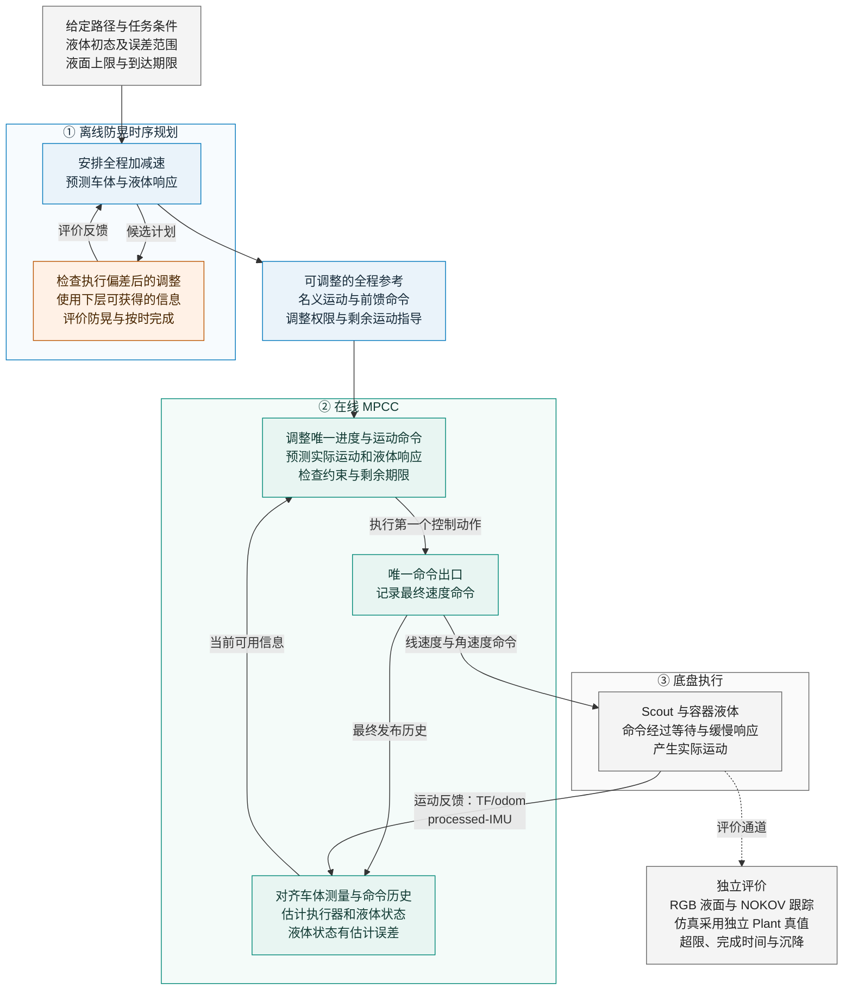

# 面向受扰恢复的防晃规划与在线 MPCC 协同思路

- 创建：2026-09-11；更新：2026-09-13。
- 状态：`IDEA / PLANNED`。本文是当前讨论主线，模型、优化变量和恢复评价尚未最终确定。
- 本次收敛：保留“离线防晃时序规划—在线 MPCC—底盘执行”三层；按没有可靠实时液面反馈的条件设计。
- 投稿定位：以 RA-L 为主目标，T-RO 为进阶目标；这是研究定位，当前证据不足以估计录用概率。
- 分支：`offline-slosh-plan-online-tracking`；控制代码基线仍为 `f63858204e09f47f6c269632ecbf0aa03dd088eb`。本次只整理文档，没有实现新算法或运行实验。

**先读第 1—3 节了解整体，第 4—6 节看研究与实验安排；工程线索和数学补充放在后面。**

## 1. 我们究竟要解决什么问题

> **看不见实时液面的情况下，让机器人沿固定路线按时运水；当实际运动偏离计划时，通过调整后续快慢，争取让途中液面仍保持在规定范围内。**

两个主要要求是：**途中液面不超限，运输不超时。** 到站后的残余晃动和沉降继续记录；是否作为额外硬条件、阈值取多少，需在实验前统一确定，不能临时多等一会儿来改善结果。

我们能获得车的位置、速度、转向、IMU 运动信息和已发布命令。液体状态主要靠这些信息驱动模型估计，无法保证识别所有真实液体扰动。因此，本篇的“恢复”先聚焦于**车体执行偏差发生后的运动纠偏与防晃保持**。

恢复的目标是重新找到满足剩余任务要求的运动安排；原有时间律和液体相位都允许改变。重点是继续满足液面限制和到达期限。

例如：车在弯道比计划慢了，后面需要追回进度，但加速又会激起晃动。在线层计算在哪里、以多大幅度调整；离线层提前考虑这种情况，给后半程留下可用的时间和动作空间。

研究范围先限定为固定几何路径、允许的小幅跟踪误差、约定的液体初态和执行误差范围。直接碰晃液体但车体信息无法反映的扰动，不承诺能够主动识别和补救。动态避障、在线改道和多杯扩展留待核心机制成立后讨论。

液面上限和到达期限是目标要求，当前尚无实物保证。已经发生的超限必须计为超限；后续液体平静不能消除这次失败。

## 2. 系统架构：两层方法，三层执行结构

**方法研究集中在离线规划与在线 MPCC 的协同；底盘执行是第三个物理层。** 几何路径是输入准备，可以来自已有地图、waypoints 或平滑工具。我们借鉴 R32 的全程时序优化，不把它描述为“全局路径规划器—局部规划器”的分层算法。

**图 1：目标架构（待实现）**

实线表示计划、控制与反馈，虚线表示独立评价。图中反馈回来的是**车体运动信息**，RGB 液面用于事后评价。仿真时由独立 Plant 替代执行对象，其液体真值同样不进入主要对照的控制器。

两层协同的关键是：**上层提前为下层的纠偏创造条件，下层根据实际执行情况利用这些条件。** 离线参考允许调整；在线改变快慢后，必须重新预测液体响应。

## 3. 三层分别决定什么

### 3.1 优化输入、运动参考和底盘命令要分清

| 层级 | 决定什么 | 输入或优化变量 | 输出 |
|---|---|---|---|
| 离线防晃时序规划 | 在给定路径上，全程怎样加速、减速和停车 | 路径进度 jerk 是重点候选；也可用少量速度节点或分段时长，尚未定案 | 全程名义运动、前馈命令、允许的调整及后续指导数据 |
| 在线 MPCC | 根据车体执行偏差，接下来怎样调整 | 运动命令与唯一进度变量；命令或命令变化率等具体形式待执行模型确定 | 本周期要执行的控制动作及后续预测 |
| Scout 执行 | 把收到的速度指令变成实际运动 | 最终发布的线、角速度命令 | 实际车速、转向与容器运动 |

优化目标是任务中的防晃、按时完成、跟踪与平滑表现。选择 jerk 或加速度作输入，是描述可选动作的方式，本身不构成研究创新。

### 3.2 离线层可以用 jerk，但还没有确定

如果沿用 R32 的固定路径形式，可以令 $u_s=\dddot s$。优化器选择进度 jerk 序列，通过积分得到时间律，再结合路径生成车体运动参考。

**路径进度 jerk → 时间律 → 车体运动参考 → 速度命令 → 预测实际运动与液体响应。** 参考怎样生成命令、命令怎样被执行，需要连起来求解或核验。

路径进度 jerk 和实际车体 jerk 需要分别定义。尤其在转弯和非弧长参数化下，两者不能直接套用相同限值。选这种形式后，仍要核验实际速度、加速度、侧向激励和 jerk 约束。

当前保留“少量速度节点／分段时长”的潜力实验路线。它与 jerk 参数化的动作范围和计算成本可能不同；两者都属于候选，不在本文中提前锁定。

### 3.3 在线用加速度时，也必须经过执行模型

Scout 接收的是 $v_{\rm cmd},\omega_{\rm cmd}$，实际速度记为 $v_{\rm actual},\omega_{\rm actual}$。底盘存在等待和缓慢响应，二者不能直接画等号。

- 若优化的是**命令速度变化率**，可以积分生成速度命令，再由执行模型预测实际运动。
- 若优化的是**实际车体加速度**，必须建立实现该加速度所需的命令关系。仅用“当前实际速度＋加速度×周期”发指令，不能保证底盘按预测加速度运动。

两层应共享同一条物理链：**最终命令与待执行历史 → 底盘等待和动态响应 → 实际运动 → 容器处激励 → 液体响应。** 液体激励包含转弯与安装偏置的影响；模型形式和参数还需选择、辨识与验证。两层共用模型，也可能共同预测错误，精度仍要独立检查。

### 3.4 两层接口与共同时间

| 接口 | 需要传递或维护什么 |
|---|---|
| 计划身份 | 路径、坐标系、模型与配置版本；明确归一化进度和全局／局部弧长的换算 |
| 全程参考 | 整个预测时域的运动预瞄；实际速度参考与前馈命令分开保存，参考允许调整 |
| 当前信息 | 车体测量、液体模型估计、执行器与命令历史对齐到同一物理时刻；记录来源与估计误差 |
| 剩余任务 | 剩余到达时间、调整范围、运动限制和停车要求；待执行命令不能被优化器撤销 |
| 后续指导 | 当前短预测窗口结束后，剩余运动是否还能按时完成、液体会怎样响应；随预测状态更新 |
| 复现记录 | 实际影响输出的控制器／估计器内部状态；必要时保存滤波、进度、模式和数值热启动 |

在线只维护一套与实际运动耦合的进度决策。虚拟进度到终点不能代替实车到达；奖励进度也不能替代到达期限和剩余可行性的检查。若短时域看不到终点，需要后续运动指导，其实时近似尚未确定。

改变时间律后，从当前模型估计及其误差假设重新传播液体。上层名义液体序列用于预测分析，不是实时测量，也不要求下层照着原有振荡走。完整快照用于一致续行，不意味着把所有软件内部量都当作连续优化状态。

## 4. 借鉴 R32 的什么，研究增量在哪里

[R32（Ferrari 等，IEEE RA-L 2026）](https://doi.org/10.1109/LRA.2025.3643281)的固定路径版本是：**给定路径，执行前联合优化整段时间律与液体响应，得到完整轨迹。** 其固定路径与路径／时间联合优化是两种方案，不是上下两层。

| R32 已有内容 | 在我们这里的用途 |
|---|---|
| 进度及其导数、液体状态联合优化 | 作为名义防晃时序规划的主要骨架 |
| 时间与进度 jerk 的加权目标 | 参考平滑与效率的组织方式；固定共同期限属于另一个修改问题 |
| 运输液面上限和停车残余限制 | 建立过程与停车评价；这两项本身不是我们的新增贡献 |
| 转动、容器偏置下的液体动力学 | 核对 Scout 的容器激励与模型近似 |

Scout 的航向要与所选路径及运动约束相容；原文线性航向安排、机械臂关节限制和输入权限需要适配。初始静止、终端液体位移回零与停车后残余限制的原文身份需保留，修改之处单独说明。

**候选增量是：规划时就考虑执行偏差发生后，下层利用实际可获得的信息还能怎样纠偏，并据此选择更合适的全程运动安排。** 要证明的是上层的这个选择确实有用，以及在线控制能兑现相应收益。

这需要具体算法支撑。[Funnel Libraries（R16，IJRR 2017）](https://arxiv.org/abs/1601.04037)已经把轨迹、对应反馈控制器与可承受扰动范围联系起来；[R08（Romero 等，T-RO 2022）](https://arxiv.org/abs/2108.13205)已有在线进度与控制联合优化。因此，“规划时考虑反馈纠偏”“增加 MPCC”或“两层都有液体模型”都不足以单独构成创新。

论文需要依次建立三项证据：

1. **修正有用：**仅用实际可获得的信息，在共同期限下稳定优于固定时序和简单修正。
2. **规划有增量：**共用同一下层时，C 优于 B 和选定的鲁棒规划；交叉对照能说明上层为修正创造了条件。
3. **评价能预测收益：**上层认为容易恢复的计划，在留出扰动、模型误差和实物中更容易完成任务，并能解释失效边界。

三项成立后，再将贡献组织为恢复评价方法、规划—控制协同算法及机制与实物验证；目前均为拟贡献。

## 5. 先做什么实验

### 5.1 主实验只使用实际可获得的信息

先固定一条可执行名义计划，在早、中、晚阶段施加可重复的车体执行扰动。三组从同一完整闭环快照继续，并共用跟踪器和非时序反馈，区别仅在后续时间安排：

| 组别 | 做什么 | 检查什么 |
|---|---|---|
| 固定时序 | 按原名义时序继续跟踪 | 执行偏差怎样破坏原计划 |
| 简单速度修正 | 按预先定义的减速／后段进度恢复规则调整 | 简单办法能取得多少收益 |
| 模型指导的时序调整 | 根据车体信息、命令历史和液体模型估计，充分计算剩余时序 | 在相同条件下能否获得额外收益 |

三组使用同一可用信息条件；控制器不得获取未来扰动或真实液体状态。独立 Plant 的液体真值只用于评分。起始液体状态及不确定范围需预先定义；相同模型条件用于开发，独立 Plant 与模型失配用于后续确认。

### 5.2 准确液体状态只作辅助诊断

旧稿优先用准确液体状态检查修正潜力。按本次“没有可靠实时液面反馈”的条件，该设置改为**单独标记的 oracle 辅助诊断**，不能代替主实验，或作为上层实际可兑现的恢复评价。

相位试验仍有价值：改变液体初态、检查模型失配和恢复边界。但在可用观测历史相同、内部估计相同的情况下，控制器不能因为试验人员知道真实相位不同，就收到不同的修正建议。若只在真实液体状态已知时有效，应报告状态信息是收益瓶颈。

### 5.3 先看是否完成任务，再比较晃动

各组共用到达期限、运动限制和停车评价窗口。共同到达时刻记为 $T_{\rm arr}$，固定停车窗口为 $T_{\rm settle}$，评价终点为 $T_F=T_{\rm arr}+T_{\rm settle}$。潜力实验直接预测到 $T_F$，同时评价剩余运输和停车段。

主比较优先匹配实际到达时间，并预先定义容许误差；另外选择几档共同期限，检查时间较紧或较宽松时的收益。停车窗口不能临时延长。

先报告实际到达、停车、液面超限及求解失败，再比较全过程液面峰值／RMS、固定窗口残余、跟踪和计算耗时。已发生超限的样本保留，不能以终端残余很小记为成功。

共同约束下稳定优于简单方法，才值得继续开发上层恢复规划。求解成功但收益很小，应重新评估任务中的收益空间；数值求解失败仅说明验证未完成，不能证明不存在有益修正。

### 5.4 进入比较前要固定的内容

- 路径、容器、模型、初态与误差范围；执行扰动的类型、幅值和阶段采样规则。
- 到达期限及容差、过程液面上限、实际动作限制、停车判据与固定评价窗口。
- 可修改的时序参数、参考到实际命令的映射、简单策略和调参／计算预算。
- 数据记录、完整快照续行核验、主指标、最小有意义改善、开发与留出确认场景。

所有数值和具体参数化尚待确定。首轮只选择必要的低维问题；同一确定性仿真配置重复运行，不算独立样本。

## 6. 潜力成立后，怎样比较已发表方法并验证协同机制

### 6.1 核心比较是 C 相对 B

A 为平滑运动安排，B 为名义防晃规划，C 为考虑执行偏差后纠偏能力的规划。三组使用同一模型、状态估计来源、执行约束和下层配置；阶段 2 先用同一个充分计算的时序修正器，阶段 3 再用同一个实时 MPCC。两阶段结果分别报告。

B 默认是 C 去掉恢复评价项或恢复限制的内部基线。B/C 使用同一终端指导构造规则，由各自计划得到的数值可以不同。只有 C 相对 B 有增量，才能支持规划中新增机制的作用；仅 C 优于 A 不够。

同时选择一个具体的常规鲁棒规划对手，检查增量是否超出已有的扰动处理方式：

| 规划方式 | 上层选择计划时考虑什么 |
|---|---|
| B：名义规划 | 名义执行下的防晃与任务表现 |
| 常规鲁棒规划（算法待选） | 预先规定的不确定性下的表现，是否包含反馈修正由具体方法决定 |
| C：我们的规划 | 偏差发生后，实际下层依据可用信息修正的剩余任务表现 |

**鲁棒规划也可能包含反馈修正。** 需明确比较双方的不确定性、反馈策略、约束和目标，才能说明数学区别；“鲁棒”和“恢复”不是互斥类别。三组尽量共用下层、估计、动作限制和时间条件；必要差异单独报告。

### 6.2 分开检查规划、在线修正与状态信息的作用

在共同模型与信息条件下，做如下交叉对照：

| 规划方式 | 固定名义时序，保留车体反馈 | 允许依据可用信息修正时序 |
|---|---|---|
| 名义防晃规划 | P0C0 | P0C1，对应 B 的配置时可共用数据 |
| 考虑纠偏能力的规划 | P1C0 | P1C1，对应 C 的配置时可共用数据 |

比较四组的差异，检查上层是否为在线修正创造了额外价值。这里改变的是时序修正权限，不能同时更换估计器或运动约束，再把差异全部归因于时序。

另外分别消融液体模型估计信息、在线时序修正、剩余运动指导。模型估计与液体真值要分开，准确状态结果只作辅助诊断；清零控制器液体初态时，独立评价器不得一起清零。

### 6.3 正式对比包含保留原方法核心的外部对手

下表是复现与比较计划，尚未实现。表中的“模型防晃 MPCC”指使用液体模型估计和预测的在线 MPCC，不表示获得了实时液面测量。

| 组别                        | 方法                                      | 论文作用                 | 当前边界                                                     |
| --------------------------- | ----------------------------------------- | ------------------------ | ------------------------------------------------------------ |
| A                           | 平滑速度曲线＋模型防晃 MPCC               | 在线抑晃工程基线         | 与 B/C 共用低层实现和信息来源                                |
| B                           | 名义防晃规划＋同一个模型防晃 MPCC         | 核心机制基线             | 默认是内部对照，R32 身份见本节说明                          |
| C                           | 恢复能力规划＋同一个模型防晃 MPCC         | 完整候选方法             | 充分求解潜力与实时实现分别报告                               |
| D                           | 鲁棒输入整形＋普通跟踪器                  | 成熟、计算轻的外部方法   | 参考 R36 的整形方法，预先冻结具体 shaper、参数辨识与时长处理 |
| E                           | C06 的防晃规划＋LESO＋Lyapunov-based MPC  | 已发表两层方法的外部对手 | 全文关键公式已核验；先解决液体观测条件与 Scout 输入权限的差异 |
| `R32-adapt`（条件性增设） | 保留 R32 固定路径时间律优化核心的适配版本 | 规划层已发表方法对照     | B 不能承担该身份时独立实现、编号和报告                       |

**R32 的身份单独核验。** B 只有在核心变量、液体模型、目标、约束和求解流程均保留 R32 方法并完成适配核验时，才能兼作文献对照；否则另设 `R32-adapt`。R32 原目标包含时间和 jerk 正则，固定期限下改为液体代价应标为修改问题。时间—防晃曲线通过重新求解得到，不能事后拉伸轨迹后沿用原预测。

R32 的复杂固定路径实验也报告过实际液面超限。采用其模型或增加在线控制，都不能自动消除模型误差，需要独立液面证据。

**C06 先复现原问题，再判断 Scout 适配。** 2026-09-13 已从本机 Zotero 全文核验：式（17）的状态包含液体位移，输入是平面两向加速度；§5.1 式（49）和图 2 的 LESO 校正依赖包含液体位移的反馈。它估计液体速度与总扰动，不能直接等同于仅由车体运动驱动液体模型。原文采用仿真验证；几何、观测与理论适配细节见[核验记录](../防晃领域论文梳理/arxiv/待补齐与合并清单.md#2-c06-全文核验与基线适配边界)。

在原问题复现中保留这些观测条件；共同信息比较中不能只给 C06 真实液体位移。若替换其反馈来源，须标为改编并重新验证；若无法公平保留核心，则把原方法放在共同适用的独立任务中报告。Scout 输入适配和事后限幅也不能自动继承原理论保证。

**R36 的范围需要核验。** 原文主要研究规定时长的直线静止到静止运输。曲线路径适配须检查几何和非完整约束；整形增加的时长、后续限幅造成的波形变化均计入任务。不能独立过滤线／角速度后默认路径不变。

外部方法保留各自核心算法与估计器，在共同可用传感信息、物理限制和合理调参预算下比较。适配／排除规则在看结果前登记。常规鲁棒规划的选择与比较边界按第 6.1 节确定，不能预设它没有后续修正能力。

### 6.4 公平比较、恢复边界与统计报告

| 实验问题           | 关键比较                                                           | 证据要求                                                       |
| ------------------ | ------------------------------------------------------------------ | -------------------------------------------------------------- |
| 完整方法是否有优势 | 经适配核验的 A—E；必要时加入 `R32-adapt`                           | 共同任务条件下的完成率、超限、匹配时间表现与时间—防晃曲线     |
| 收益来自哪里       | B/A、C/B，交叉对照及单因素消融                                    | 分清名义规划、纠偏能力规划、在线修正和模型估计信息的作用       |
| 何时有效与失效     | 改变执行偏差阶段、幅值、剩余时间／曲率和模型相位误差               | 预测的修正空间与独立评价相符，并保留边界和反例                 |

低修正后残余也可能意味着原本没有明显晃动。需要同时报告不修正的表现、修正后的表现及改善量，不能仅凭一个很小的恢复分数声称机制有效。剩余直线路段仍可能通过纵向加减速修正纵向模态，不能直接判为不可恢复。

实物以校准后的 RGB 液面为主评价、NOKOV 为车体跟踪评价；仿真采用独立 Plant。保留全部失败，采用配对扰动、独立试验和留出场景，报告绝对差异及不确定性。统计单位是 trial／独立扰动实例；只比较双方成功样本时须报告分母，不能把失败轨迹较短造成的低 RMS 当作优势。

### 6.5 文献基础与阅读边界

R32 原文第 III-A 节及实验部分已用于本次讨论，原文入口见第 4 节。本次另核验了 C06 的输入、观测公式及仿真边界，以及 Funnel Libraries 的摘要与方法定位，其余文献没有全部重读。文献获取与阅读状态见[本机索引](../防晃领域论文梳理/arxiv/README.md)及[补充核验记录](../防晃领域论文梳理/arxiv/待补齐与合并清单.md)。

| 文献                                                                                                                                         | 已有内容                                                           | 对本候选方法的约束或启发                                                                 |
| -------------------------------------------------------------------------------------------------------------------------------------------- | ------------------------------------------------------------------ | ---------------------------------------------------------------------------------------- |
| [B01：Lim 等，2024](https://doi.org/10.23919/ICCAS63016.2024.10773274)                                                                        | 机器人与球摆联合动力学下的离线二维防晃轨迹优化，仿真验证           | 移动底盘、液体模型和轨迹优化的结合已有先例                                               |
| [C06：Viet 等，2024](https://doi.org/10.1049/csy2.12121)                                                                                      | 离线时间最优防晃参考，在线 LESO 与 Lyapunov-based MPC 跟踪，仅仿真 | “两层都考虑液体模型”已有直接结构近邻                                                   |
| [B11：Nguyen Viet 等，2025](https://doi.org/10.1109/ACCESS.2025.3533541)                                                                      | 离线规划、LESO、鲁棒跟踪和液高约束过滤，数值验证                   | 规划与抗扰控制的组合不能单独作为核心创新                                                 |
| [B12：Prabakaran 等，2026](https://doi.org/10.1007/978-981-95-2382-5_19)                                                                      | 专用楼梯机器人上的液体状态估计与 MPC 跟踪，包含实物实验            | 液体 MPC 的机器人实物应用也已有先例                                                      |
| [D19：Liniger 等，2015](https://doi.org/10.1002/oca.2123)                                                                                     | MPCC 联合优化路径进度和运动控制                                    | 在线调整路径进度本身是已有能力                                                           |
| [D12：Pham 与 Pham，2018，TOPPRA](https://doi.org/10.1109/TRO.2018.2819195)                                                                   | 固定路径的可达性／可控性递推，并讨论参数不确定性                   | 不能泛称首次考虑可恢复性、可达性或参数不确定性；需说明液体动态记忆与执行状态带来的新困难 |
| [A07：Singer 与 Seering，1990](https://doi.org/10.1115/1.2894142)                                                                             | 输入整形与对模态参数误差的鲁棒设计                                 | 需要和合适的鲁棒整形方法比较，避免把经典相位抵消重新命名                                 |
| [C11：Hynninen 与 Kyrki，2026 预印本](https://doi.org/10.48550/arXiv.2604.16667)                                                              | 液体 MPC 急停及相同 jerk 代价下的去液体模型对照                    | 要分离液体动态处理和普通平滑的作用；不能宣称首次在线液体 MPC                             |
| [A02：Guagliumi 等，2021](https://doi.org/10.1109/ACCESS.2021.3113956)、[A13：Bäuerlein 与 Avila，2021](https://doi.org/10.1017/jfm.2021.576) | 低阶模型、液面映射及实验中的模型／相位误差                         | 内部模态指标需要独立液面测量验证；A13 的谐波稳态规律不能直接作为机器人瞬态安全条件       |

这些材料说明，全程防晃规划、在线 MPCC、输入整形、鲁棒性与恢复思想均有已有基础。当前需验证的是本任务中的具体协同增量，不能仅凭组合结构宣称首次。

## 7. 如何使用现有 offline 分支

现有代码可作为工程底座，新候选方法仍未实现。可复用的资产包括离线轨迹生成、BT、独立 Plant、命令历史、执行器模型、唯一命令出口和评价工具，具体调用链与可复用性尚待梳理。

历史负结果继续保留：

- [PR-RMPC／Tail-Commit 阶段报告](../方法结论/20260825_PR-RMPC与Tail-Commit路线阶段性失败结论.md)：正式 v1 为 FAIL，development 未证明复杂在线层相对 BT 的实质增益。
- [最新结构验证记录](../方案/20260824_BT参考全命令SMPCC与尾段重接方案.md#1014-2026-08-25-一次性-cr0--cr2-执行结果)：`INVALID_EVIDENCE_CR0_CR2`，构造失败，没有有效收益证据，也没有证明不存在有益修正。

因此先验证修正潜力，再开发上层增量。原离散 HOLD/ADVANCE、PR-RMPC 或 Tail-Commit 不因重命名成为新方法；高维终端集合、额外监督器与学习模块不是首轮要求。

本机当前使用 **ROS2 Jazzy**，仓库目标是 **ROS1/catkin**。本轮只整理方案；后续构建须确认 ROS1 环境或数值组件不依赖 ROS，不按普通 ROS2 包构建，也不自动开展 ROS 迁移。

## 8. diag 分支需要带来的内容与优先级

以下保留此前梳理的迁移线索，本次未重新审计代码。来源固定为 [diag 分支快照 `2236930`](https://github.com/renjunzhang/scout_ws_real/tree/2236930fb8e6e232fc53ea2890855417f3e1d275)。两个分支代码结构和 solver 状态布局已经分化，按能力适配，不整体覆盖或机械复制不同维度的求解器。

| 优先级         | 内容                 | 当前事实与迁移要求                                                                                                                                                  |
| -------------- | -------------------- | ------------------------------------------------------------------------------------------------------------------------------------------------------------------- |
| 潜力实验前     | 容器与液体参数       | offline 默认内半径／液深为`18.5/58 mm`，diag 当前实物配置为 `17.25/53 mm`。以所选实验对象冻结一致参数；重新生成受影响的名义轨迹和模型资产，历史资产不覆盖       |
| 潜力实验前     | 执行模型及运动约束   | offline 已有 delay＋inertia 和 command/actual 区分；纳入 diag 后续辨识依据及完整时域连续性／jerk 的约束语义。仿真与实物参数分别定义，不能把一套参数自动视为通用真值 |
| 潜力对照与实物前 | 液体估计和共同时间点 | offline 已有 processed-IMU、common-epoch 基础，核验后续时间链修复、来源切换、缺失状态处理和双监视器；主要对照使用可获得信息；准确液体真值只用于单列的辅助诊断                                 |
| 实时与实物前   | 命令与运行修复       | 核对最终发布历史、限幅一致性、终端停车、独立 odom 回调和全部失败统计；适配 offline 自己的发布与运行结构                                                             |
| 实物前         | 评价、录制和 RGB     | 复用 Full/Smooth/NoState 的分离原则、固定评价窗口、参数冻结、失败保留及 RGB 录制修复，重新绑定新方法，不复用旧批次身份                                              |
| 统一物理语义时 | 容器点加速度         | diag 的容器安装偏移与作用点统一方案仍是讨论稿，不是已实现功能。未来需同步 IMU、odom、执行器前推、OCP 和热启动；容器与 IMU 安装向量分开定义，避免重复补偿            |

diag 当前 Full/Smooth 筛选采用共同 `jerk_max=0.6 m/s³`、`v_ref=0.2 m/s`；这些是开发实验条件，尚不是最优参数或硬件物理上限。相关代码入口已有软件验证，不等于新的配对实物收益已成立。offline 的潜力实验先确定自身合理、共同的约束，不为了复现全部旧试验推迟核心问题验证。

迁移参考提交：`5993ffa`（显式执行器 OCP）、`064e5e6`（完整时域加速度变化软惩罚）、`a346a0e`（硬 jerk／NoState）、`d0c98a0`（容器修正）、`b0b322e`（来源对照）、`9d31ff6`（Full/Smooth 评价入口），以及 [容器作用点讨论稿 `9efacea`](https://github.com/renjunzhang/scout_ws_real/commit/9efacea6400ba8255e7c0f58bd99af6b4bdbfe03)。这些是定位依据，不是已经完成 cherry-pick 的清单。

NOKOV 外参及自转中心拟合没有获得有效冻结依据，不能作为液面真值来源；旧 NOKOV 驱动液体模型的效果比较已撤回。当前不把恢复该标定支线或旧 5 Hz 深度诊断作为潜力实验前置。

## 9. 接下来按什么顺序做

| 阶段 | 工作 | 继续推进的依据 |
|---|---|---|
| 0a：比较模型 | 比较候选液体模型的峰值与相位预测、初始化要求及计算成本 | 使用独立液面证据与留出数据，确定适用范围和估计误差 |
| 0b：确定动作 | 再选择离线参数化、在线变量及命令—实际运动映射 | 两层的信息、执行器模型和动作权限一致，名义计划可执行 |
| 0c：选择评价 | 最后选择恢复评价形式，并固定第 5.4 节条件 | 说明实际下层怎样实现所评价的修正，各组输入和评价一致 |
| 1：修正潜力 | 主实验比较固定时序、简单修正、模型指导修正；准确液体状态只作辅助 | 可获得信息条件下，在共同约束与期限内有可重复收益 |
| 2：规划增量 | 同一下层做 A/B/C 和选定的鲁棒规划比较 | C 有可重复增量，且不是额外时间、不同模型或接口修复造成 |
| 3：实时协同 | 接入唯一 MPCC 进度、执行器模型、完整预瞄与剩余运动指导 | 实时预算与模型／估计误差下仍有收益，完成交叉对照及消融 |
| 4：实物验证 | 按第 8 节适配、冻结参数，进行重复和留出试验 | 检验恢复评价能否预测任务成功与实际收益，同时报告失效边界 |

D/E 与必要的 `R32-adapt` 提前登记复现和适配规则，在后续共同适用条件下完成对比。尚未完成的模型、算法或文献适配，不记为已有能力。

本次采用的是上述研究主线。液体模型、离线 jerk／时间律参数化、在线输入、误差范围、恢复评分与终端指导仍需逐项讨论；目前不启动代码修改或实验。

## 附录 A：恢复评价的数学含义（候选，尚未定案）

通俗地说，恢复评价要回答：**给定现在能够知道的信息，用剩余允许动作继续走，预计还能取得怎样的防晃表现？** “最后晃动小”“比不修正改善多”和“满足任务要求”分别记录。

令 $\mathcal I_j$ 为当前可用的车体观测、命令历史、模型估计及必要内部状态，$\pi$ 为名义计划，$\delta\vartheta$ 为允许修改的剩余时序参数。$\mathcal X_j(\mathcal I_j)$ 表示与这些信息相容的可能状态。说明信息边界的一种候选写法是：

$$
R_j(\pi,\mathcal I_j)=
\min_{\delta\vartheta\in\mathcal U_j(\pi,\mathcal I_j)}
\operatorname{Agg}_{\chi\in\mathcal X_j(\mathcal I_j)}
J_{\rm rem}(\pi,\chi,\delta\vartheta).
$$

这里对无法区分的状态使用同一个当前时序决定，不能给每个不可测的真实液体相位分别求最优动作，再把这些成绩当作在线可实现的表现。后续重新决策也只能依赖届时实际获得的信息。

**相同动作权限仍不等于相同修正效果。** 上式若允许充分优化整段剩余时序，得到的是该优化问题下的潜力评价。正式上层评价需使用冻结的实际下层闭环续行，或验证能预测其表现的近似，并计入有限时域、求解时限和失败处理；不能把理想求解结果直接当作实时 MPCC 的能力。

$J_{\rm rem}$ 可以综合剩余运输与固定停车窗口内的液体表现；过程液面、剩余期限、正时长、运动连续性、实际命令限制、不可撤销命令和停车要求仍需检查。均值或最坏值、状态误差如何表示、哪些约束对全部状态成立，均需先定义；这不是已选定的鲁棒优化算法。

上层增加恢复评价的一种候选形式为：

$$
\pi_C^\star=\arg\min_{\pi\in\Pi}
\left[J_{\rm nom}(\pi)+\lambda_{\rm rec}\mathcal R(\pi)\right].
$$

$\mathcal R$ 由预先登记的执行扰动和阶段评价得到；B 使用同一名义问题并去掉该项。若改用恢复性能约束，也须明确声明。不可行场景不能丢弃；硬可恢复要求与固定失败惩罚是不同选择，数值求解失败另列。

旧稿的局部响应工具仍可用于分析：

$$
z_F\approx z_F^{\rm nom}+F_j\delta\chi_j+G_j\delta\vartheta.
$$

其中 $z_F$ 包含两向液体位移及速度，物理单位与高度映射须一致。包含不可测液体分量的 $\delta\chi_j$ 真值只能用于辅助诊断；实际恢复评分要回到上述信息条件。灵敏度随计划与执行状态变化，离散模式不能当作普通连续量求导。

局部分析不证明全程不超限、递归可行或全局最优。候选计划与修正都要做非线性传播复核；上层多场景求解成本、局部近似范围和实际下层能实现的动作范围均需报告。

## 附录 B：来源与历史语境

- [原路线](防晃论文的仿真到实物验证思路.md)保留历史判断；本篇承接 9 月 11 日的协同方向，并按 9 月 13 日讨论收紧为无可靠液面反馈条件下的执行偏差处理。
- 9 月 10 日讨论稿的完整未来参考与闭环评价是接口线索，原稿基于 `diag@ac810e90` 的代码描述不代表当前 offline 已实现。
- R32 阅读笔记和 `r32_fixed_path_scout_recovery_blueprint(1).md` 是讨论参考，未替代本篇，也未冻结最终算法。第 8 节的提交与参数均是迁移定位依据，不是已完成迁移的清单。
- 当前文献主分类继续沿用[液体防晃方法分类与领域分析](../防晃领域论文梳理/液体防晃方法分类与领域分析.md)；论文 PDF 仅保存在本地，不提交到仓库。
