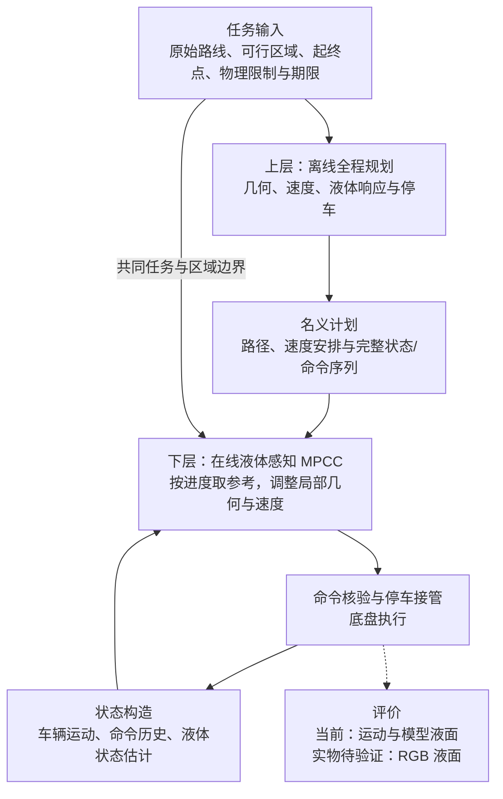

# 当前方法框架

更新：2026-09-19，核对至 `ab424cd8`。[返回总览](./README.md) · [论文主线与证据](./02_论文主线与现有证据.md)

## 1. 要解决的问题

Scout 搬运液体时，起步、转弯和制动都会激发晃动。液体会保留此前运动的影响，前一个弯道留下的振动可能与后一个弯道或停车过程叠加。因此，需要同时安排整趟运动，并根据执行中的实际状态修正动作。

当前研究任务是：在给定起终点、可行区域、运动限制和到达期限下，联合选择路径与速度，使运输及停车过程更平稳。原始路线提供行驶方向和进度坐标，允许机器人在给定区域内调整几何。评价同时关注晃动、运输耗时和任务完成情况。

当前开发目标为运输峰值、P95、RMS 均低于普通 MPCC 基线 B0，并在 45 秒内完成。这里的三指标是验收条件；优化器通过液体状态代价和相关约束寻找运动方案，并不直接同时最小化这三个统计量。

## 2. 整体结构

上层在执行前求解完整任务，下层在执行中逐拍更新。当前反馈进入下层，上层尚未根据执行反馈自动重新规划剩余任务。

## 3. 上层：提前安排整趟运输

**输入**包括原始路线、显式给定的可行区域、完整初态、目标位姿、车辆和液体参数、运动限制及名义运输时长。

**决策**包括整段可执行运动的几何和速度安排。通过车辆、执行器和液体模型，优化器同时考虑路线引导、转弯曲率、命令平滑、液体响应和末端残振，并检查区域、运动和目标停车条件。液体位移及其变化率共同进入评价，避免仅凭某一时刻液面恰好过零判断已经消晃。

**输出**是一份完整名义计划，包含路径、速度、状态和命令序列。求解后还要重新传播并检查可行性，再交给下层使用。当前采用 CasADi/IPOPT 数值优化；可行区域及其通行顺序由任务给定。

当前计划的名义运输时长为 40 秒。可选的离线时间搜索会尝试更短候选，并要求候选通过防晃和可行性检查；该开关默认关闭，已有一次 36 秒候选超时后回退基准的验证，尚无该开关带来的闭环缩时结果。

## 4. 下层：根据当前状态调整运动

下层使用模型预测轮廓控制（MPCC），当前以 30 Hz 运行，每次规划 40 步，预测窗口约 1.33 秒。每拍从当前状态出发，优化短时运动，只执行首步命令，再用新反馈继续求解。

它主要协调三类要求：

| 要求 | 在控制中的作用 |
| --- | --- |
| 路线与任务推进 | 用横向偏差、沿线进度关联、速度参考和终点条件引导运输 |
| 运动可执行性 | 考虑区域、速度、加速度、命令变化、执行器延迟及停车余量 |
| 防晃 | 根据当前液体状态估计，惩罚未来液体位移、变化率与残余响应 |

下层可以调整局部路径、速度和进度。其内部控制量是线速度命令的变化率、角速度命令的变化率及进度速度，最终向底盘发布线速度和角速度命令。

当前 Full 使用 `progress` 参考：根据行驶进度查询上层路径及速度安排。因此，40 秒的名义计划可以在实际约 28 秒到点；实际完成时间需要由闭环运行记录判断。

## 5. 两层怎样协作

**共同模型连接“发什么命令”和“液体受到什么激励”。** 模型区分命令速度与实际速度，包含执行器响应、待执行命令队列和四维液体模态。液体预测由实际运动驱动。当前仿真用 odom 驱动液体状态估计，代码也支持处理后的 IMU 输入；RGB 用于独立评价，尚未进入控制反馈。

**名义计划提供全程安排，当前状态决定在线动作。** 上层输出的路径、速度及计划信息供下层构造参考和数值初值；下层从对齐后的车辆、液体和命令历史重新预测，优化当前动作。

**几何进度与液体振荡时序需要分别理解。** 到达相同路径位置时，机器人可能经历了不同的加减速历史，液体相位也可能不同。按进度读取计划不会自动保持上层原来的消晃时序。当前协作已实现参考传递和状态修正；在线改速或改路之后，怎样重新协调剩余全程，是后续接续研究的问题。

## 6. 停车、评价和当前边界

停车处理考虑目标位姿、实际速度、命令队列和后续制动运动。当前启用车辆停车接管，在线液面硬约束和“等待液体完全停稳”的功能仍关闭。上层液面限制、在线控制开关、运行后验收分别记录。

运输指标覆盖起步、行驶和制动，统一统计至停车时刻之前；另评价停车后 5 秒的残振。当前结果来自 odom 驱动的液体模型，实物效果需要 RGB 液面测量核验。

| 内容 | 当前状态 |
| --- | --- |
| 全程规划、在线 MPCC、执行与停车 | 已实现，已有固定仿真条件下的运行证据 |
| 从当前状态检查剩余计划 | 已有离线诊断工具，尚未反馈在线决策 |
| 在线剩余任务重规划与防晃接续 | 后续研究 |
| 地图生成可行区域、静态/动态障碍避让 | 尚未接入当前两层主线 |
| 本版实物运输与 RGB 防晃效果 | 待验证 |

实现入口：[上层优化器](../../src/scout_apps/control/spmpc_local_planner/scripts/planning/optimizer.py)、[两层适配器](../../src/scout_apps/control/spmpc_local_planner/src/planning/ocp_planning_adapter.cpp)、[在线求解器](../../src/scout_apps/control/spmpc_local_planner/src/solvers/continuous_mpcc_solver_acados.cpp)。运行细节见[仿真指南](../仿真运行/当前主线仿真启动指南.md)。
