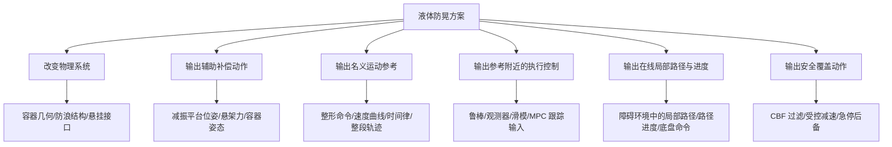
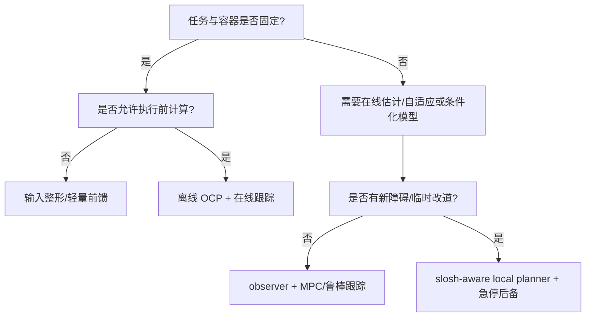

# 液体防晃方法分类与领域分析

> 资料快照：2026-08-19
>
> 主索引：`00_SPMPC参考论文总览.md`
>
> 新增索引：[arXiv/arXiv_新增论文索引.md](arXiv/arXiv_新增论文索引.md)
>
> 文献编号沿用原索引的 A01–A13、B01–B13、C01–C11、D01–D23；本次新增论文编号为 AR01–AR29。文中方括号编号指这两份索引中的论文，而不是重新编号的参考文献。

## 0. 核心结论

液体防晃不是一种算法，而是一组作用在不同系统层级上的方案。按“改什么”来分，当前文献中的路线可以概括为：

1. **改容器或载荷接口**：防浪板、隔舱、悬挂托盘等被动方法；
2. **增加主动补偿机构**：主动减振平台、并联机构、主动悬架或容器姿态补偿；
3. **改输入命令**：输入整形、滤波、速度/加速度/曲率剖面设计；
4. **执行前规划整段动作**：离线路径、时间律或全轨迹最优控制；
5. **执行中闭环抑晃**：鲁棒控制、观测器、滑模、LQR、MPC/GPC；
6. **执行中滚动决策或安全停车**：滚动预测控制、约束安全层和急停控制；
7. **面向障碍的防洒规划**：把碰撞、路径进度与液体风险放进同一规划管线；
8. **数据驱动增强**：数字孪生、降阶学习模型、整段轨迹防洒分类器。

综合这批论文，可以得到九个更重要的判断：

- **“在线防晃 MPC”早已存在。** 同一团队、同一 BEM–GPC 谱系的 A12（2011 日文期刊）与 C05（2012 英文会议呈现）已在专用单轴转运装置上使用滚动预测控制，它们不是两次独立复现；B09、B12 和 C11 又分别把预测控制用于液罐车主动悬架、特殊移动平台轨迹跟踪和机械臂急停。因此，“首次把液体状态放入 MPC”不是安全的创新表述。
- **在线控制不等于在线规划。** 大部分在线方法只在给定参考轨迹上控制或跟踪；它们不在线选择局部路径、不更新路径进度，也不处理新出现的障碍。
- **平滑不等于防晃。** 限制加速度或 jerk 能减少高频激励，但不能利用液体的频率、阻尼和相位。C11 在相同 jerk 代价下，去掉液体模型后最大晃角由 5.3°增至 22.3°，直接说明了两者的差别；但 5.3°仍比论文设置的 5°上界高 0.3°，且未提供重复试验统计，不能把该次结果写成严格约束保证。
- **模型保真度与实时性存在结构性矛盾。** CFD/VOF/SPH/FEM 适合离线分析和数据生成；在线优化通常只能使用摆、质量–弹簧–阻尼（MSD）、少量模态或几何代理。
- **多数所谓“液体闭环”仍依赖内部模型。** 真正把动态液面测量持续反馈给控制器的论文很少；不少相机、超声或 ToF 只用于实验评价。因此，内部模态状态不能直接当作真实液面证据。
- **被动防晃不是“统一增加阻尼”。** 径向隔板会破坏模态对称性并改变最低频率 [AR11]，泡沫主要增加界面耗散且很快出现厚度收益饱和 [AR13]，TMD/NES 又是在载荷接口上重新分配结构能量 [AR14]；不同方法改变的是不同物理量。
- **严格 spill-free 理论与机器人实证成熟度并不同步。** Saint-Venant PDE–ODE 路线已经给出控制 Lyapunov 泛函、spill-free 状态域、指数稳定和 output feedback [AR05, AR06]，但目前仍以理论和数值为主，不能替代真实机器人闭环证据。
- **低阶模型的主要风险不是一个固定参数误差，而是响应机制换挡。** 多稳态与反向旋流 [AR16]、子谐波和滞回 [AR22]、内共振与撞壁 [AR17–AR19]、破波主导耗散 [AR20, AR21] 都说明，接近溢出时系统可能从线性主模态跨入另一种动力学机制。
- **对标准轮式底盘而言，尚未在这批文献中看到一个同时具备当前液体状态传播、非完整底盘接口、滚动局部路径/进度决策和动态障碍处理的完整系统。** 但这只是对当前资料集的结论，不应在未进行更广泛系统检索前写成全球“首次”。

## 1. 分析范围、证据基础与限制

### 1.1 资料范围

上一版分析完整覆盖了主索引的 60 个编号；本次又从 arXiv 检索、去重并全文核验 29 篇。因此，当前分析追踪 **89 个编号条目**，但这不等于 89 次独立防晃实验，也不等于 89 篇都直接研究机器人防晃。

| 组别 | 数量 | 在本分析中的作用 |
|---|---:|---|
| A：建模、估计、测量与基础防晃控制 | 13 | 解释液体模型、观测、输入整形和预测控制基础 |
| B：移动底盘、车辆与专用运输平台 | 13 | 移动机器人方向的核心近邻证据 |
| C：机械臂、SCARA 与机器人操作 | 11 | 展示离线 OCP、几何补偿、学习规划和在线安全控制 |
| D：普通移动机器人规划与控制 | 23 | 提供在线规划、MPCC、避障和实时性骨架，不是液体防晃证据 |
| AR：新增控制、结构、非线性与液体管理论文 | 29 | 补足被动结构、PDE 控制、强非线性、模型失配、快速代理和实验物理 |

A/B/C 共 37 条，是原索引中的防晃、建模、测量或机器人操作主体；D01–D23 全部只是普通规划/控制骨架。A12 与 C05 是同一团队 BEM–GPC 谱系的不同发表呈现，不应写成两次独立复现。B08 全文没有液体内容，应视为 B07 所用平台的跟踪控制背景，而不是防晃论文。

原 A/B/C 中 34 篇在当前 Zotero 数据目录中有可读 PDF；A07、A12 通过官方全文核验；A10 当前只有 HTML/摘要级材料，只能支持静态弯月面体积测量的有限结论。新增 AR01–AR29 均有本地 PDF，其中 25 篇已有 DOI，AR08/AR09 有明确会议来源，只有 AR15、AR28 仍需按预印本降级使用。新增 29 篇没有与原主索引重复，但其中 AR01 是倒液规划，AR12、AR23–AR26 主要研究航天/低温热力学，属于方法或物理邻近证据，而不是标准 WMR 防晃实例。

本次实际核验的 Zotero 附件根目录是 `/data/a/zotero-data/storage/`。Obsidian 单篇笔记 frontmatter 中残留的 `/home/zrj/Zotero/storage/...` 是旧机器路径，不能据此判断附件缺失。

### 1.2 本文所说的“防晃”包含什么

不同论文优化的对象并不相同。至少要区分：

- 运输过程中最大液面高度或最大晃角；
- 到达后的残余振荡和稳定时间；
- 是否溢出以及距杯沿的安全裕量；
- 壁面压力、液体作用力、车辆侧倾或轮荷；
- 任务时间、路径误差、能耗和执行器负担。

因此，某方法“防晃效果更好”只有在任务、容器、液位、速度和指标相近时才可比较。仅凭一篇论文中的百分比不能建立跨论文排行榜。

### 1.3 资料偏置

这套参考资料仍是围绕机器人运动规划与控制建立的，不是 PRISMA 式系统综述。本次补检改善了航天、结构和流体物理覆盖，但没有消除数据库与关键词偏置。因此：

- 防浪板、隔舱、浮盖、泡沫、网格、容器形状优化等被动结构方法在领域全景中必须出现；
- 现在已有径向隔板、低重力隔板热效应、泡沫、TMD/NES 和主动弹性隔板的原始论文 [AR11–AR15]，足以区分机理，但仍不足以对所有防浪板构型作系统排名；
- 本文对“当前领域”的判断更准确地说，是**机器人和自动化液体运输中的防晃方法版图**；
- arXiv 更容易覆盖开放预印本和新工作，不能替代 IEEE Xplore、Scopus、Web of Science 等正式系统检索；
- 不应据此直接声明全球完整性或绝对首创性。

## 2. 为什么必须使用多维分类

仅按 PID、MPC、输入整形或机器学习分类会产生误导。相同的“MPC”标签可能分别表示：

- 控制主动悬架力 [B09]；
- 在固定楼梯轨迹上跟踪 [B12]；
- 控制单轴转运加速度 [A12/C05]；
- 在危险时快速停止机械臂 [C11]；
- 在线选择移动机器人的路径进度和避障动作 [D20，但无液体状态]。

它们的决策变量、任务接口和安全含义完全不同。更合理的分类需要至少同时回答四个问题：

1. 方法作用在系统哪一层？
2. 它在什么时候求解？
3. 它是否知道当前液体状态？
4. 它使用什么保真度的液体模型？

### 2.1 按主要输出或决策变量分类



这个轴只回答“方法最终输出或改变什么”，不回答它何时计算。比如名义轨迹既可以离线优化，也可以在线前馈生成；MPC 既可能输出给定参考附近的跟踪输入，也可能输出局部路径进度。执行时机由下一节单独分类。

### 2.2 按执行时机分类

| 层级 | 定义 | 典型文献 |
|---|---|---|
| 执行前固定设计 | 参数、整形器、路径和时间律事先确定 | A07，B02–B04 |
| 离线整段优化 | 已知任务上一次性求完整轨迹并回放 | B01、B11，C01、C04、C08、C10 |
| 在线前馈生成 | 根据当前参考闭式生成防晃姿态/命令，无预测时域 | C03、C09 |
| 在线给定参考跟踪 | 执行中反馈，但参考轨迹已固定 | B10、B12，C06、C07 |
| 在线滚动预测控制 | 每周期预测并只执行第一步 | A12/C05、B09、B12、C06、C11 |
| 在线局部规划 | 每周期还要决定局部路径、路径进度或绕障动作 | D17、D20 是无液体骨架；当前防晃文献中缺完整实例 |
| 安全后备 | 正常任务失效或急停时限制液体风险 | C11；B11 的 CBF-QP 可视为约束过滤层 |

这些行允许多标签，因为同一系统可以先离线生成参考、再用滚动 MPC 在线跟踪。B12/C06 同时属于“给定参考跟踪”和“滚动预测控制”：前者描述任务接口，后者描述控制器怎样求解。

“在线”本身还应说明在线做的动词：A08 是在线测量，A06 展示在线预测，A07 是在线执行一个离线设计的固定滤波器，A12/C05、B09、B12、C06 和 C11 才属于不同对象上的在线滚动优化。只写“online anti-slosh”会把这些不同能力混在一起。

### 2.3 按信息闭环程度分类

| 等级 | 控制器实际知道什么 | 典型情况 | 主要风险 |
|---|---|---|---|
| I0：无信息闭环 | 仅靠物理结构 | 防浪板、B13 运输阶段 | 不能主动适应任务变化 |
| I1：名义模型开环 | 已知标称频率，预先整形 | A07、B03、B04 | 参数误差、初始晃动和扰动会破坏抵消 |
| I2：仅机器人状态闭环 | 跟踪机器人/路径状态，但没有当前液体动态记忆 | B02、C03、C09 | 已有晃动和相位对控制器不可见 |
| I3：液体模型内部传播 | 显式预测液体状态，但没有动态液面测量更新 | A12/C05、C11 | 初始化或模型漂移不会被真实液面纠正 |
| I4：估计液体状态闭环 | observer/KF/ESO 根据可用运动/输出信号估计液体状态 | B11、B12、C06、C07 | 可观性和模型误差决定估计质量 |
| I5：外部液面反馈 | 动态液位传感直接参与反馈 | B05 是资料集中最明确的例子 | 传感器带宽、遮挡、延迟和标定复杂 |

这里最容易混淆的是 I3、I4 与 I5。一个控制器在预测模型中包含摆角，并不自动意味着它测到了或在线校正了当前摆角。C11 具有显式液体状态和滚动 QP，但实验仍依赖“开始时液体基本静止”和内部模型传播；而某篇论文装了相机或超声，也只有传感器真正进入状态更新或控制律时才属于 I5。

### 2.4 按模型保真度分类

| 模型层级 | 代表方法 | 代表文献 | 更适合的用途 |
|---|---|---|---|
| 高保真自由面 | CFD/VOF、SPH、FEM/FSI | A03–A05，C04 | 离线物理分析、数据生成、低阶模型校准 |
| 边界/多自由面点模型 | BEM | A12/C05 | 专用低维预测控制；仍受势流和小幅假设限制 |
| 低阶物理模型 | 单摆、球摆、MSD、modal state-space | A01、A02，B01、B11，C01、C11 | 在线预测、控制和轨迹优化 |
| 几何/合力代理 | apparent gravity、虚拟质点、倾角约束 | C02、C09 | 极快前馈或 QP，但没有液体动态记忆 |
| 学习式降阶/判别 | k-PCA/GENERIC ROM、Transformer 分类器 | A06、C10 | 复杂物理的近似或任务级风险筛选 |

### 2.5 按平台分类

平台决定可用控制量，不能忽略：

- 工业直线转运台通常只控制一维加速度；
- 机械臂可主动倾转容器，能利用 roll/pitch 抵消合加速度；
- 标准差速移动底盘通常只能控制纵向速度和角速度，不能侧移或主动倾杯；
- 全向/可重构机器人具有不同运动学权限；
- 液罐车的主动悬架控制的是车身与悬架力，不是导航路径；
- 专用并联机构用硬件自由度换取扰动补偿能力。

所以“机械臂已经实时防晃”不能直接推出“固定水平载台的轮式底盘也能采用同一方法”。

## 3. 防晃方案的共同基础

### 3.1 液体为什么不能只用当前加速度表示

液体具有动态记忆。一个常用低阶模态形式是：

$$
\ddot{\eta}_i + 2\zeta_i\omega_i\dot{\eta}_i + \omega_i^2\eta_i
= -\kappa_i a_i,
$$

其中 $\eta_i$ 是模态坐标，$\omega_i$ 是固有频率，$\zeta_i$ 是阻尼比，$a_i$ 是容器激励。液面高度还需要由模态状态映射为壁面爬升或自由面输出 [A01, A02]。

对平面移动底盘，主要激励至少包括：

$$
a_{\mathrm{long}} \approx \dot v,
\qquad
a_{\mathrm{lat}} \approx v\omega.
$$

因此，即使两个时刻的小车位姿、速度和当前加速度相同，只要过去的激励历史不同，$(\eta,\dot\eta)$ 也可能完全不同。这正是“只惩罚加速度/jerk”与“传播液体状态”的根本差别。

### 3.2 高保真模型与低阶模型不是竞争关系

它们应形成分层链路：

```text
高保真仿真或实验
    ↓ 识别频率、阻尼、增益和适用范围
低阶在线模型
    ↓ 进入 OCP/MPC/observer
独立液面测量
    ↓ 检验模型是否在真实任务中仍可信
修正参数、残差或安全裕量
```

A03–A05 说明了壁面处理、自由面离散和流固耦合会显著影响频率、阻尼、作用力和车辆载荷。A03 把实时降阶明确列为未来工作，A05 明确指出实时仿真应换简单模型；A04 没有报告 runtime，因此不能用它量化“CFD 慢多少”，只能说该文没有展示在线部署。它们都不足以支持把原高保真模型直接放进移动底盘高频控制循环。A01/A02 的价值在于把主导模态压缩为可传播状态，但低阶模型只在其标定范围内可靠。

低阶模型的原文误差也说明了“可实时”不等于“可无条件相信”：

- A01 的九组机器人实验中，线性模型峰值误差最高为 18.3%，弱非线性模型绝对峰值误差最高为 19.0%；线性模型在这九组中均高估，但这只是该实验域内的保守现象，不是任意工况下的保证；
- A02 的直线高速实验达到约 11.8 m/s² 和 2.7 m/s，MSD 运动期最大液高误差最坏约 30%，多数工况为 1%–17%；
- A02 给定整段轨迹后的 ODE 推演只需数百分之一秒，但这不能直接证明一个带底盘、约束和在线优化的完整控制器满足 deadline。

### 3.3 状态估计与真实测量必须分开

资料中的测量路线包括：

- A08：14 点 ToF 阵列以约 17.8 Hz 形成一个扫描帧，但帧内顺序采样约跨越 56–60 ms，再由离散点插值液面；适合动态观测参考，但不是严格同步、校准完备的三维真值；
- A09：标准量器的静态机器视觉计量；
- A10：透明玻璃瓶弯月面/体积补偿，当前证据仅为 HTML/摘要级；
- A11：柔性叉指电极的准静态液位检测；
- A13：受控谐波实验中的质心响应与相位诊断；
- B05：激光液位测量进入 Kalman/控制链；
- 多篇机器人论文中的 RGB、超声或深度相机只用于离线评价。

术语也要审慎：A01/A02 虽使用 estimation 一词，实质上是由已知容器加速度和初始状态积分 ODE，没有测量更新；A06 的在线相机主要提取容器运动，真实自由面用于视觉比较，从未知真实液体在线修正 ROM 仍是 future work。这些都不能写成完整的“动态液面观测→状态估计器→控制器”闭环。

必须保持下面的证据链：

$$
\text{内部模态状态}
\neq
\text{相机/传感器测得的真实自由面}
\neq
\text{是否溢出的最终事件指标}.
$$

控制器可以用内部模型工作，但论文效果结论应尽量由独立外部测量支持，避免“用自己的模型评价自己的模型”。

### 3.4 相位是诊断量，不是万能约束

A13 在特定受控谐波实验中发现，非线性响应最大值附近质心响应相对激励的相位滞后接近 90°。这说明相位可用于识别共振、非线性响应峰值和模型失配。但它不能被外推为所有容器、瞬态任务和机器人轨迹都必须满足的通用 90° 约束。

### 3.5 低阶模型的可信度应按“响应区间”管理

单摆/MSD 的误差不能总被一个固定的 ±10% 参数区间概括。新增实验与非线性研究显示至少存在四种机制变化：

1. **模态结构变化**：加入贯穿全深度的径向隔板后，轴对称性和特征值重数改变，最低固有频率也会下降 [AR11]；这不是简单给原摆模型增大阻尼。
2. **解分支变化**：同一轨道激励附近可同时存在顺向和逆向稳定旋流 [AR16]，还可出现子谐波、频率扫描滞回和多波峰形态 [AR22]。
3. **能量耗散机制变化**：小幅响应主要由黏性/边界层耗散描述，大幅响应出现破波、液跃和撞壁后，耗散规律与频响都会变化 [AR20, AR21]。
4. **接触/撞击变化**：内共振、多稳态、准周期和 vibro-impact 响应会在越过临界激励后出现 [AR17–AR19]；夹气撞击还需要多相可压缩模型才能可靠估计压力峰 [AR27]。

因此，在线控制中更合理的做法不是宣称低阶模型“全域准确”，而是同时维护：

- 低阶模型的标定工况包络；
- 当前状态距训练/标定分布的距离；
- 最大幅值、频率成分或创新残差等 regime indicator；
- 越界后的约束收缩、降速、重新初始化或后备停车。

这也解释了为什么短预测时域可能比盲目延长时域更可信，但**任何具体时域长度仍必须由本系统辨识和实验决定**，不能直接从这些论文抄取。

## 4. 主要方案族

以下方案族是**可组合、非互斥的模块标签**，不是要求每篇论文只能进入一个格子。例如 C03/C09 既使用主动容器姿态自由度，也采用几何前馈生成；B11 同时包含离线 OCP、状态估计、鲁棒跟踪和 CBF 约束层。重复出现表示方法跨层组合，不表示重复计数。

### 4.1 被动容器、结构与载荷接口

#### 原理

通过改变物理对象而不是实时计算控制命令，限制自由面运动、重排模态、增加耗散、吸收结构能量或隔离载荷。广义上包括防浪板、隔舱、浮盖、泡沫/网格、TMD/NES、容器几何和悬挂载荷。

“被动”只说明执行期不主动算补偿，不代表所有方法共享同一机理：

| 子类 | 主要改变 | 新增证据 |
|---|---|---|
| 隔板/隔舱 | 边界条件、模态形状与频率，也可能改变热分层 | AR11、AR12 |
| 表面覆盖/泡沫 | 界面与壁面黏性耗散 | AR13 |
| 附加吸振器 | 罐体–液体系统的能量转移与耗散通道 | AR14 |
| 悬挂/柔顺接口 | 隔离底盘激励，但引入新的摆动模态 | B13 |

#### 当前资料中的证据

- **径向隔板**：AR11 的线性解析结果表明，贯穿全深度的径向隔板会破坏轴对称性、拆分简并模态并降低最低特征值；所以“加隔板只会增加阻尼、频率不变”是错误简化。
- **低重力热效应**：AR12 的 VOF 研究显示，隔板间距、方向和壁面间隙可造成最高约 54% 的压力上升差异。它证明构型会改变热–流耦合，但指标不是地面开口杯溢出。
- **泡沫**：AR13 的真实液体实验中，约 5 层泡沫已使液面幅值降低约一个数量级，此后阻尼收益趋于饱和。
- **TMD/NES**：AR14 在特定数值模型和两个评价量上报告最高约 40%/90% 缓解；TMD 对调频敏感，NES 对刚度选择更鲁棒，但没有实物验证。
- **悬挂托盘**：B13 使用 Ridgeback、固定 UR10 和悬挂托盘。200 ml 真实开口水实验中，悬挂托盘未洒出，刚性托盘明显洒出；运输主要被动隔离，到站再用 integral-LQR 消摆。

#### 优点

- 在线计算负担小；
- 对通信延迟和求解器失效不敏感；
- 可与任何上层路径规划器叠加。

#### 局限

- 增加重量、空间、清洁和维护成本；
- 对容器、液位和激励方向具有专用性；
- 悬挂系统会引入新的摆动模态，某些反向加速可能持续注入能量；
- 隔板可能降低某些固有频率、改变高液位位置，并带来清洗、气泡、热管理或结构应力问题；
- 泡沫和浮盖会改变介质界面，不一定满足食品、实验室或洁净工艺要求；
- TMD 需要调频，NES/TMD 的结构评价量也不等于开口容器最大液面；
- B13 的液体结果主要是 spill/no-spill，缺少峰值液面和稳定时间统计；
- 现有新增论文足以说明机理差异，仍不足以形成跨几何、跨液位的被动构型排行榜。

#### 适用场景

容器和平台可以统一设计、对计算可靠性要求极高、任务变化相对有限的系统。

### 4.2 主动减振机构、悬架与姿态补偿

#### 原理

额外增加执行自由度，让容器、托盘、并联平台或车辆悬架主动产生补偿运动，而不只约束底盘本身。

#### 代表路线

- AR08：反作用力传感 + μ/H∞ 鲁棒控制驱动 Hexapod 主动加速水箱；600 L 与 1100 L 水实验约两周期内衰减，是强真实液体闭环证据。
- B05：小车上的 6-DoF 主动减振器，激光液位、Kalman filter 与频率相关最优伺服；真实水实验中名义工况指标相对无控制降低约 73.8%。
- B06：全向底盘加气动并联机构、notch filter 和 optimal regulator；物理实验对象是球摆代理，不是真实液体。
- B09：液罐车滚动预瞄 MPC，通过左右主动悬架力降低横向晃动和侧翻风险；只有仿真，且不控制导航路径。
- C03/C09：机械臂利用容器 roll/pitch 与 apparent gravity 对齐；这是利用平台姿态冗余的主动补偿。
- AR15：DRL 控制弹性隔板形变，2D SPH 训练后在 3D 数值中仍有明显抑晃；但它仍是投稿中、纯仿真的主动–结构混合方案。

#### 优点

- 能在底盘运动不能改变时直接补偿路面或任务扰动；
- 对未知外部激励比纯开环整形更有适应性；
- 可同时改善液体和平台稳定性。

#### 局限

- 需要额外机构、传感器、标定和维护；
- 控制自由度与标准 Scout/WMR 的 `/cmd_vel` 接口不同；
- 机构的饱和、带宽和耦合模态可能成为新瓶颈；
- AR08 的 ±0.04 m 平台行程、控制启用相位和 1 g 条件说明，强效果也依赖机构可用行程与任务环境；
- AR15 的高百分比不能在缺少弹性执行器和实液实验时外推；
- 机械臂的主动倾杯思想不能直接移植到固定水平载台。

#### 适用场景

车辆悬架、工业专用设备、机械臂末端或允许改造载荷接口的高价值任务。

### 4.3 输入整形、滤波与运动剖面

#### 原理

将液体视为有主导频率的振动系统，通过延迟脉冲、notch、指数滤波或特定速度/加速度曲线，使不同时间的响应相互抵消，或避免在共振频段持续注入能量。

#### 代表证据

- A07：经典 command preshaping，展示两/三/四脉冲整形及鲁棒性–延迟权衡，是后续移动机器人整形方法的重要上游。
- B04：固定工业转运台，联合整形纵向加速度和弯道曲率，具有真实水实验。
- B03：将该思路迁移到三轮 WMR，仍是液体开环。
- B02：增加路径几何误差 PD 修正，但液体本身仍不反馈。
- C03：指数轨迹滤波加机械臂姿态补偿，控制周期 2 ms，真实水实验报告总体晃动降低超过 70%。
- D13/Ruckig：只提供 jerk-limited 平滑轨迹，应作为 smooth baseline，而不是防晃算法。

#### 优点

- 计算极轻、解释性强；
- 重复固定任务中容易部署；
- B02–B04 已证明纵向加速和转弯向心激励都要处理。

#### 局限

- 依赖标称频率、阻尼和近似静止的初始液体；
- 鲁棒整形器通常以更长延迟换参数容差；
- 完整路径和运动段落往往必须预先知道；
- 遇到障碍绕行、临时停车或大幅时间缩放时，原相位抵消会失效；
- 不处理已有未知晃动和复杂多模态/非线性现象；
- AR16–AR22 显示，接近共振或大幅激励时可出现稳定分支切换、子谐波、滞回、破波和撞壁，此时单一 notch/脉冲整形器可能不仅“效果变差”，而是面对不同响应机制。

#### 适用场景

固定路线、高重复率、容器和液位相对稳定、允许增加任务时间的工业运输。

### 4.4 离线路径、时间律与整段轨迹优化

#### 原理

把整段任务的机器人状态、液体状态、路径/时间和约束放入同一个 OCP、QP、搜索或学习筛选流程，在执行前求解完整动作。

#### 内部子类

##### 1. 固定路径上的时间律优化

- C01 的 OCP-1、C08 和 D12/TOPPRA 都属于“路径已知，决定怎样沿路径走”；
- 只有前两者显式包含液体或载荷约束，D12 只是普通时间最优基线；
- C08 还考虑松置杯子的离地、滑动和倾覆。

##### 2. 路径与时间联合优化

- B01 将 2D WMR 与球摆状态放入 CasADi 优化，约 3–4 s 求完后整段执行；无障碍、无真实液体闭环。
- B11 在离线 time-optimal OCP 中加入最大晃高和已知静态矩形/圆形障碍，随后用 LESO/TSMC/CBF 跟踪；不是感知驱动 local planner。
- C01 的 OCP-2 联合优化多杯 SCARA 轨迹和时间，求解约 85–471 s。

##### 3. 高保真模型嵌入优化

- C04 使用 FLOW-3D/VOF 加遗传算法优化机械臂勺子速度曲线，约需 100 h；实机回放避免溢出。
- 这类方法可作为物理高保真离线 oracle，不能承担在线重规划。

##### 4. 几何代理或学习判别

- C02 通过虚拟杆/点质量把整段轨迹转为预计算 QP；论文称有实时潜力，但没有验证滚动求解。
- C10 采用 geometry-informed RRT*、Ruckig 和 Transformer 防洒分类器，在静态 clutter 中执行前筛选整段轨迹，30 次实机试验成功 29 次。
- C10 的分类器输出 spill/no-spill，不是可在 MPC 中逐步传播的液体状态转移模型。

##### 5. 模型不确定度下的液体动作规划

- AR01 用 GP 给倒液转移模型提供均值与 epistemic uncertainty，再用 uncertainty-aware MCTS 偏向低不确定度动作；
- 在 UR5e 真实染色水实验中，训练点从 40 降至 10/5 个时，这种策略比普通 MCTS 更能维持成功率；
- 它证明了“规划器应知道模型在哪些区域不可靠”，但任务是逐次倒液，不是运输中自由面传播。因此可借鉴不确定度处理，不能当作 WMR 防晃先例。

#### 优点

- 能利用整段相位关系安排加速、转弯、反向激励和终端收尾；
- 可以直接限制最大液面、残余晃动、任务时间、输入和接触安全；
- 对已知固定任务，通常比逐段贪心平滑更有全局性。

#### 局限

- 起点、终点、路径或环境通常必须预先给定；
- 执行期出现障碍、延迟、跟踪误差或模型漂移时，预计算轨迹不会自动重规划；
- 高维 OCP 和高保真仿真求解时间从数秒到数百秒、甚至约 100 h；
- 优化得到的是给定模型下的可行/局部最优结果，不等于物理全局最优；
- 在线时间缩放或安全层改写命令可能破坏整段相位安排。
- 学习模型若只给点预测而不给覆盖度或不确定度，优化器可能主动选择模型最不可信的动作；AR01 提供了避免这一问题的邻近证据。

#### 适用场景

路径和环境已知、允许执行前计算、希望同时优化任务时间和终端残余晃动的运输任务。

### 4.5 在线前馈与几何防晃生成

#### 原理

不滚动求未来液体状态，而是根据当前参考加速度闭式计算容器姿态或快速求单周期 QP，使容器轴线与合加速度方向对齐。

#### 代表证据

- C03：指数滤波后进行 acceleration-based tilt compensation；
- C09：virtual-quadrotor differential flatness、级联 PD 和每周期 RAC QP；该 QP 没有未来状态序列，因此不是 MPC；
- C02 的虚拟质点/横向反力代理与这一路线相近，但当前实现是整段预计算。

#### 优点

- 计算开销小，可达到高频控制；
- 不必求复杂自由面模型；
- 对具有姿态冗余的机械臂很有效。

#### 局限

- apparent-gravity 对齐是几何代理，不表示当前自由面相位；
- 无法处理已有未知晃动、共振积累和强非线性；
- 依赖容器主动倾转自由度以及高阶连续参考；
- 标准固定水平载台 WMR 没有同样的控制权限。

### 4.6 鲁棒、观测器与给定参考闭环跟踪

#### 原理

参考轨迹已经给定，控制器利用机器人状态和估计的液体状态修正执行误差与扰动。重点是“把既定动作执行好”，而不是“在线选下一条路”。

#### 代表证据

- B10：离线参考优化后用 $H_\infty$ 控制应对液位变化；真实直线转运装置实验。
- B07：离线 flatness rest-to-rest reference 加 HSMC；障碍仅靠人工 waypoint，只有仿真。
- B11：离线 OCP 后接 LESO、terminal SMC 和 CBF-QP；CBF 限制晃高但不改规划拓扑。
- B12：特殊可重构楼梯机器人上的 KF + constrained MPC，设计采样周期 0.01 s、时域 20；真实红色水实验，但无单步求解时间分布。
- C06：离线 time-optimal reference 加 LESO/LMPC；目前只有 MATLAB/Simulink。
- C07：可重构移动机器人上的鲁棒 output-feedback，给定直线/圆形路径，真实液体实验；超声液位只评价、不反馈。
- AR05：黏性 Saint-Venant PDE–ODE + 控制 Lyapunov 泛函，给出 spill-free 可行状态域、半全局指数稳定和简单状态反馈；理论所需量包括容器状态、两侧壁液位和液体总动量。
- AR06：在同一 PDE 谱系上用功能观测器把测量减少到容器位置和两侧壁液位，四类 output-feedback 均给出指数收敛；验证仍是有限差分数值例。
- AR07：学习式 reference governor 在罐车仿真中在线修改转向参考、限制轮荷转移率；它体现“保留原控制器、在参考层加安全过滤”的架构，但罐车晃液应用没有实车实验。

AR05/AR06 很重要，因为它们说明“有限容器高度 + spill-free + 反馈稳定”已经有严格无限维理论，而不仅是摆模型启发式控制。但理论成熟不等于系统成熟：浅水方程适用域、壁面液位测量、离散误差、执行器限制和机器人路径约束仍需另外闭合。

#### 优点

- 比开环整形更能应对执行误差和有界扰动；
- 可利用 observer/KF/ESO 估计不可直接测量的液体状态；
- 分层结构便于工程实现。

#### 局限

- 参考一旦因障碍或任务变化失效，跟踪器本身不会产生新路径；
- 强鲁棒跟踪不等于保持原防晃相位，尤其在时间进度改变时；
- 估计器的可观性、初始化和模型误差通常缺少充分实验证明；
- PDE 稳定定理只对其模型、状态域和控制假设成立，不能自动覆盖破波、液面分离、三维旋流或障碍限制；
- 很多论文没有报告求解时延尾部、deadline miss 和重复试验统计。

### 4.7 MPC/GPC 预测控制与急停安全层

#### 原理

显式预测未来机器人和液体状态，在滚动时域内优化当前控制动作。它的价值是能同时处理动态记忆、输入限制和液面风险，但必须看它控制的究竟是哪一层。

#### 代表证据与边界

| 文献 | 控制对象 | 是否滚动 | 液体信息 | 不能被误写成什么 |
|---|---|---:|---|---|
| A12/C05 | 单轴 AC-servo 容器转运，BEM–GPC | 是，0.01 s 采样 | 物理模型预测；液位传感主要用于模型/实验比较 | 通用 WMR local planner；0.01 s 也不是求解耗时证明 |
| B09 | 液罐车左右主动悬架力 | 是 | 等效摆状态与道路预瞄，仿真 | 导航或转向 MPC |
| B12 | 特殊楼梯机器人固定任务轨迹 | 是 | KF 估计两向摆状态 | 普通 WMR 障碍规划 |
| C06 | 固定离线参考的 LMPC 跟踪 | 控制阶段在线 | LESO + 低阶 MSD，仿真 | 已验证实时 local planner |
| C11 | 机械臂液体急停 | 是，20 Hz，2 s/40 步 | 球摆状态内部传播，初始近静止 | 自由终止时间的严格 time-optimal OCP；路径规划 |
| AR03 | VR 遥操作 UR5e 的 NMPC | 是，30 Hz | 内部摆模型；真实水定性观察 | 大样本用户研究或外部液面闭环 |
| AR04 | UR5e 共享控制、碰撞与液体多目标优化 | 是；摘要称平均约 13 ms，正文称平均 <9 ms、峰值约 11 ms | 内部液体目标；初步实机 | 动态环境 WMR、已验证的用户性能或完整实时性统计 |
| AR02 | 航天器 MPC 名义轨迹 + SAC/PPO 补偿 | 是 | 6-DoF CFD 晃液仿真 | 实液硬件验证；Zero-G 实验明确未加入燃料晃动 |

C11 的价值尤其在于证明：安全停车本身也是防晃任务，普通“尽快刹车”或“jerk 小”不保证不溢出。但机械臂可向多方向运动，非完整 WMR 的急停还必须考虑前方障碍、制动距离和不可侧移约束。

A12/C05 的 60 单元二维 BEM 中有 20 个自由面节点，GPC 参数为 $N_1=1,N_2=4,N_u=3$。0.3 m 转运实验把液面波动控制在约 5 mm 内，但控制律没有现代 constrained MPC 意义下的显式状态/输入约束，约 5 s 后还可观察到模型误差积累。它证明了滚动预测防晃的可行性，同时也说明长时间内部传播需要观测校正或稳健裕量。

新增结果没有改变“先问 MPC 控制哪一层”的判断。AR03/AR04 把液体目标与人类输入、机械臂逆运动学或碰撞约束放在同一个在线优化中，是比固定参考跟踪更丰富的机器人近邻；但它们依赖机械臂姿态自由度且实验规模较小。AR02 的 96% 成功率来自含 CFD 晃液的 Monte Carlo 仿真，硬件只验证无液体的平面稳定，不能写成真实燃料闭环。AR09 则从另一侧验证：低阶模型在特定闭环机动中可以复现 CFD 的主导力矩，但会更快衰减细尺度振荡，说明 ROM 可信度必须按机动类型审计。

#### 适用场景

- 需要显式状态/输入约束的固定参考控制；
- 环境扰动需要在线预测；
- 正常规划器失效后的 slosh-aware 急停；
- 计算平台、低阶模型和状态初始化足够可靠的系统。

### 4.8 障碍环境中的防洒规划

这是最容易被夸大、也最需要分层的方向。

#### 已有结果

- B11 已在**离线** OCP 中同时包含静态矩形/圆形障碍与液面约束；
- C10 已在机械臂静态 clutter 中使用 RRT*、Ruckig 和学习分类器做**执行前**规划；
- AR04 已在 UR5e 共享控制中把机器人球体近似的碰撞约束和液体稳定目标放入同一在线优化；
- C01 可表达 workspace/way-volume 限制，但未验证在线避障；
- B07 的矩形障碍通过人工 waypoint 绕行，不是自主避障算法；
- D14、D17、D20 等普通移动机器人方法已经能在线感知、预测或绕开障碍，但完全不传播液体状态。

#### 当前缺口

在当前资料集中，没有完整系统同时展示：

```text
标准轮式底盘
+ 当前液体状态或可信估计
+ 非完整运动学与可执行 /cmd_vel
+ 滚动局部路径/进度决策
+ 新障碍更新或动态障碍预测
+ 独立真实液面验证
```

这不意味着每个组件都没有先例，而是这些组件尚未在同一系统层级中被充分合并和验证。

AR04 缩小了“在线碰撞 + 液体目标”这一组件级空白，但没有消除上述系统缺口：它是机械臂遥操作、环境表示与实验规模有限，也不包含标准 WMR 的非完整路径进度和动态障碍预测。

#### 可复用的普通规划骨架

D 组 23 篇都不属于防晃方案，但其中几类骨架对未来系统很重要：

| 普通方法 | 已有能力 | 可怎样与防晃结合 | 不能直接继承的结论 |
|---|---|---|---|
| D20 Local MPCC | Jackal 上 50 ms 周期，联合路径进度、静/动态避障；3 s horizon 在测试分布内满足周期 | 增广液体模态、容器加速度映射、峰值/终端残余约束 | 原系统无液体；5 s horizon 的 p99 已超过 deadline，增广后实时性要重证 |
| D17 online NMPC | SE(2) 直接配点与在线局部规划 | 加入低阶液体状态和 spill constraint | 原实验证明的只是普通机器人实时性 |
| D14 D-CBF MPC | Scout 2.0 上 10 Hz 感知、动态障碍预测和安全约束 | 处理碰撞硬安全与液体风险的优先级 | CBF 的碰撞安全不能自动保证不溢出 |
| D16 topology-aware TEB | 同时保留多个同伦绕行候选，三候选平均约 45 ms | 先产生左右绕行拓扑，再由液体模型评价曲率和时序 | 原方法不预测液体，动态障碍主要靠闭环 costmap 反应 |
| D06/D07 MPPI | 大量 rollout 与不确定碰撞风险 | 每条 rollout 传播廉价液体模型 | spill 这类稀有硬事件不能只靠普通 soft penalty |
| D19 racing MPCC | 20 ms 周期下的 progress/contour/lag 结构 | 借鉴路径进度与结构化 QP | 4.4% deadline miss，属于 soft real-time；平台和任务不同 |
| D23 caster-aware MPC | 把传统模型遗漏的脚轮内部状态前移到 MPC | 提供“把液体内部状态显式增广”的方法类比 | 给定参考跟踪、无障碍；脚轮性能不能外推为液体效果 |
| D12/D13 | 快速 fixed-path timing 与 jerk-limited OTG | 作为 timing/smooth-only 对照 | 不含液体动态记忆，计算快也不等于防晃 |

### 4.9 学习、数字孪生与混合模型

#### 必须先区分学习对象

| 学习对象 | 代表文献 | 输出与用途 | 关键边界 |
|---|---|---|---|
| 物理一致的快速状态模型 | A06、AR29 | 从高保真全场压缩到可快速传播的 latent/ROM；AR29 再用普通相机自由面适配新液体 | 训练/适配仍离线；容器几何、液位和观测质量限制泛化 |
| 输入–输出 surrogate | AR10 | 从 JAX-SPH 数据辨识 LPV 状态空间模型，用于快速闭环仿真 | 二维零重力纯仿真；未给真实分布外安全边界 |
| 非线性系统辨识 | AR28 | 从 539 条真实水槽序列学习 bursting/switching 的稀疏动力学表示 | 单点壁面波高，预印本，尚未接入控制器 |
| 整段轨迹风险分类 | C10 | 输出 spill/no-spill，执行前筛选 RRT* + Ruckig 候选 | 不是下一时刻液体状态，无法自然初始化当前晃动 |
| 模型不确定度驱动搜索 | AR01 | GP 均值/方差 + MCTS，避开模型不可信倒液动作 | 倒液而非运输；不确定度方法可迁移，任务结论不可迁移 |
| 学习补偿控制 | AR02、AR15 | SAC/PPO 补偿航天晃液；DRL 控制弹性隔板 | AR02 的实物段无液体，AR15 是未发表纯仿真 |
| 热力学闭合项/参数 | AR23、AR26 | 从压力温度数据同化热传递系数，AR26 用 AEKF 在线估计 | 估计的是密闭罐热质传递，不是开口杯自由面状态 |

#### 合理发展方向

学习方法更适合作为物理模型的增强而不是无约束替代：

- 学习低阶模型的残差；
- 根据液位、容器几何和液体性质条件化参数；
- 输出带不确定度的短时风险；
- 用高保真仿真和真实实验共同校准；
- 在 MPC 中保留硬安全边界或独立后备层。

主要风险是分布外容器、液位或运动造成错误置信度，而一个分类错误就可能直接变成溢出事件。AR01 的价值正在于把 epistemic uncertainty 放进搜索，而不是只把 GP 均值当真；AR09/AR10 又说明 surrogate 应在闭环机动上验证，而不只报告离线一步拟合误差。对 RA-L 论文，至少应报告训练/标定包络、分布外检测、真实闭环误差和越界后的后备行为。

## 5. 方案横向比较

| 方法族 | 是否需特殊硬件 | 执行期计算 | 利用当前液体动态 | 能否处理新障碍 | 主要优势 | 主要短板 |
|---|---:|---:|---:|---:|---|---|
| 被动隔板/泡沫/吸振器/悬挂 | 是 | 极低 | 否 | 由上层决定 | 可靠、与软件解耦 | 重量、清洁、调频、模态/热效应和专用性 |
| 主动机构/悬架 | 是 | 中–高 | 可做到 | 通常不能 | 直接补偿外扰 | 成本高、接口不同、带宽/饱和 |
| 输入整形/固定剖面 | 否 | 极低 | 仅标称频率 | 否 | 简单、可解释、成熟 | 参数/初始状态敏感，增加延迟 |
| 离线 OCP/轨迹优化 | 否 | 执行期低，规划期高 | 在离线模型中利用 | 仅预知环境 | 全局安排相位与终端状态 | 跟踪偏差和环境变化会破坏计划 |
| 几何前馈/姿态对齐 | 常需姿态自由度 | 低 | 否 | 不负责 | 高频、实现轻 | 无动态记忆，WMR 难迁移 |
| 鲁棒/observer 跟踪 | 否 | 中 | 估计或内部传播 | 不负责 | 抗执行误差和扰动 | 参考失效时无选路能力 |
| MPC/GPC 控制 | 否/视对象 | 中–高 | 是或模型内显式 | 通常不负责 | 约束与预测统一 | 实时性、初始化、模型失配 |
| 显式液体状态/slosh-aware local planning | 不必然；I5 才需动态液面传感 | 高 | 是，至少内部传播 | 是 | 对变化环境最完整 | 当前集成证据不足、工程复杂 |
| 学习/数字孪生 | 需要数据 | 训练高、推理视模型 | 取决于模型 | 可与规划组合 | 覆盖复杂非线性潜力 | 泛化、可解释性和安全保证 |

### 5.1 “成熟”要按任务范围判断

- 固定一维/二维重复任务：输入整形、离线参考加鲁棒跟踪已有较成熟实水证据；
- 机械臂固定搬运：离线 OCP、姿态补偿和实时几何跟踪证据较丰富；
- 专用主动机构：已有良好实水结果，但迁移成本高；
- 特殊移动平台给定轨迹 MPC：已有初步实水证据；
- 标准 WMR 动态障碍下的显式液体状态局部规划：仍处于明显的系统集成空缺；
- 多容器、多液位、强非线性和统计可靠性：整体证据仍不足。

### 5.2 证据成熟度也不相同

这里不做形式化质量评分，只区分“方法被提出”和“系统已被充分验证”：

| 方法族 | 代表性实物证据 | 当前证据强项 | 仍缺什么 |
|---|---|---|---|
| 被动结构 | AR13 泡沫为真实液体定量实验；B13 为悬挂托盘 spill 对照；AR11/AR14 是理论/数值 | 机理多样、执行期无需计算、容易与控制叠加 | 同一容器/任务下的结构公平比较，清洁和质量代价 |
| 固定整形/剖面 | B02–B04 真实 WMR/转运台与真实水，C03 机械臂真实水 | 历史较长、实现简单、重复任务有效 | 跨液位、初始残余和复杂路径统计 |
| 主动机构 | AR08 有 600/1100 L 真实水闭环；B05 真实水定量结果，B06 球摆代理 | 从小平台到大水箱均证明可实现直接外扰补偿 | 标准化指标、长期可靠性、机构行程和成本比较 |
| 离线 OCP | C01 多杯实机，C04 勺子实机，C10 29/30；B01/B11 仅仿真 | 复杂约束和整段任务表达能力 | 移动底盘实水闭环、模型误差和执行偏差 |
| 鲁棒/observer/PDE 跟踪 | B10、C07 有真实水，B12 为特殊平台真实水；AR05/AR06 有严格理论 | 给定参考闭环与 spill-free 稳定理论均已存在 | PDE 理论的机器人实液实现、统一指标、一般 WMR |
| MPC/GPC | A12/C05、B12、C11 有不同平台实水；AR03/AR04 有 UR5e 在线优化 | 预测控制确有物理效果，且可与遥操作/碰撞目标组合 | solver 尾部、deadline miss、外部液面闭环和普通 WMR |
| 障碍防洒规划 | B11 离线静态障碍仿真；C10 执行前 clutter 实机；AR04 在线机械臂碰撞约束 | 已证明碰撞与防洒可在同一任务管线考虑 | 动态环境、在线路径进度、液体真值与 WMR 实物 |
| 学习/数字孪生 | AR01 真实倒液不确定度规划；AR29 普通相机适配；A06/AR10 高保真教师 | 已覆盖状态 ROM、surrogate、风险分类和模型不确定度 | 分布外置信度、概率安全、跨容器/液位和 WMR 闭环 |
| 强非线性/高保真 | AR16、AR21、AR22 有自由面实验；AR27 与实验基准比较 | 明确揭示分支、破波、撞壁和低阶模型失效机制 | 将 regime detection 与在线安全控制真正闭合 |

总体上，论文普遍更擅长证明“在若干代表任务中能工作”，较少证明统计可靠性、硬实时性、递归可行性和跨容器泛化。

### 5.3 面向 RA-L 的证据链，而不是期刊名排行榜

论文来源决定最低可信门槛，但不能替代任务相关性。对当前课题，证据强度应按下面顺序组合：

~~~text
物理机理/模型边界
    ↓
离线仿真与高保真交叉校验
    ↓
真实底盘执行动态与独立液面测量
    ↓
多任务、多液位、重复试验统计
    ↓
实时性尾部、失败恢复和安全后备
~~~

- TAC/Automatica 的 AR05/AR06 提供强理论，但不能单独证明 Scout 上可部署；
- Physics of Fluids/PR Fluids/JCP 的 AR11、AR13、AR16、AR20–AR22、AR27 提供强物理证据，但不直接给机器人控制性能；
- IROS/SMC/Telepresence 的 AR01–AR04 与机器人最接近，但每篇任务接口和实验边界不同；
- AR08 的大尺度实水闭环很有说服力，但专用 Hexapod 控制权限与固定载台 WMR 不同；
- AR15、AR28 即使结果新颖，也只能作为前沿补充，不能承担论文核心成熟度判断。

RA-L 稿件最有说服力的不是引用最多，而是每个关键论点同时有“上游物理依据 + 最近机器人先例 + 自己系统的独立实验证据”。

## 6. 领域演进脉络

```text
1990 前后  A07：按振动频率预整形输入
      ↓
1996      B10：离线参考优化 + 液位变化下的鲁棒控制
      ↓
2002–2005 B04 → B03 → B02：固定转运台整形迁移到真实 WMR，加入几何跟踪
      ↓
2008      C04：CFD-in-the-loop 离线防洒轨迹优化
      ↓
2011–2012 A12/C05：BEM + 滚动 GPC，预测式防晃控制已经出现
      ↓
2013–2015 AR20–AR22、AR13：能量耗散、破波/子谐波实验与泡沫被动阻尼
      ↓
2016–2018 AR17–AR19、AR14、AR08：强非线性/吸振器 ROM 与 600–1100 L 主动实水闭环
      ↓
2018–2021 C03、B05、B06、C07、AR05：姿态补偿、主动机构、移动输出反馈与 spill-free PDE 控制
      ↓
2022–2024 C02、B01、B07、C06、C08、C10、AR03、AR06、AR29：OCP、学习规划、遥操作 NMPC 和数字孪生
      ↓
2025–2026 B11、B09、B12、C01、C11、B13、AR01/02/04/09/10：约束规划、安全层、不确定度与快速代理
```

总体趋势是：

> 从“避免激励”走向“显式预测液体”，从固定转运设备走向机器人平台，从点估计走向不确定度与模型可信域；但规划、跟踪、液体观测、避障、强非线性监测和硬件补偿仍长期分散在不同系统层级。

## 7. 按应用场景选择方案

| 应用场景 | 首选组合 | 原因 | 必须补的验证 |
|---|---|---|---|
| 可统一设计容器/载荷接口 | 隔板、泡沫、悬挂或吸振器 + 轻量控制 | 先从物理层降低软件压力，可与规划叠加 | 模态变化、质量/清洁成本、液位和激励方向 |
| 固定工业路线、重复节拍 | 鲁棒 input shaping 或离线 OCP + 伺服跟踪 | 简单、可复用整段相位 | 液位变化、初始扰动、长期漂移 |
| 已知路径的标准移动底盘 | 离线防晃轨迹 + 受限在线跟踪 | 可利用完整相位安排并修正执行误差 | 真实底盘响应、时间错位、独立液面测量 |
| 路面扰动明显的液罐车辆 | 主动悬架/载荷机构 + 状态估计/MPC | 不必通过导航动作补偿全部外扰 | 侧翻、轮荷、执行器饱和和实车实时性 |
| 有姿态冗余的机械臂 | 离线 OCP或几何姿态补偿 + 在线跟踪 | 可主动倾杯抵消合加速度 | 参考连续性、障碍、液面定量真值 |
| 静态 clutter 中一次性搬运 | 碰撞规划 + 动力学/分类器筛选 | 环境可预知，允许执行前多次尝试 | 规划时延、分布外容器和失败概率 |
| 动态障碍下 WMR 搬运 | 液体状态 MPC/MPCC + local planner + 独立安全层 | 必须边走边选局部动作 | 当前最缺完整实物证据 |
| 紧急停车 | slosh-aware stopping MPC/CBF + 可行制动域 | 普通急刹可能放大晃动 | 非完整运动学、前方障碍、最坏制动距离 |
| 容器/液位频繁变化 | 条件化模型 + observer/外部液面反馈 + 鲁棒裕量 | 标称频率会变化 | 跨液位/容器标定与不确定度覆盖 |
| 航天器/大型密闭罐 | 结构件 + 反作用力/压力观测 + 鲁棒控制或快速 surrogate | 液体会反作用于姿态并伴随热质传递 | 微重力、相变、全尺度验证；不能照搬开口杯指标 |

一个实用选择顺序是：



## 8. 对当前“离线防晃规划 + 在线跟踪”方案的直接含义

根据当前 Methods **设计稿**，方案拟从“在线 MPC 每周期重做未来防晃动作”转向下面的结构；设计稿同时明确说明这些功能尚未全部完成，因此本节分析的是预期方法定位，不是实现状态声明：

```text
辨识 Scout 命令到真实运动的响应
        ↓
离线规划整条固定路径的完整防晃基准
        ↓
在线估计当前基准相位 τ
        ↓
u = ū(τ) + δu，只允许有界修正
        ↓
机器人约 2 s 预测；液体仅前 3 个控制区间、约 100 ms
        ↓
在第 3 个液体节点做经验可恢复性检查
        ↓
必要时进入后备减速/停车
```

### 8.1 它在现有方法谱系中的位置

该架构不是纯 input shaping，也不是自由在线 local planning。它更接近以下路线的组合：

- B01/C01/B11/C06：离线显式液体约束的整段规划；
- B10/B07/C06/C07：离线参考加在线鲁棒或观测器跟踪；
- C11：滚动液体预测与独立急停安全层思想；C11 自身使用固定 2 s/40 步时域，当前方案的约 100 ms 液体窗口是自己的模型可信度取舍，不能归因于 C11；
- AR05/AR06：严格 spill-free 反馈与 output-feedback 的理论上界；当前方案不用在线 PDE 控制，必须解释实时性、测量条件和模型层级的不同；
- AR01/AR09/AR10：分别提示优化器要感知模型不确定度、ROM 要在闭环机动中验证、快速 surrogate 要报告覆盖范围；
- AR16–AR22：支撑低阶模型存在响应机制边界，因此短时预测还需要 regime monitor，而不仅是固定 horizon；
- D23：把先前被忽略的内部执行动态显式加入 MPC 的方法类比；
- D12/D13：固定路径 timing 和 smooth-command baseline，而不是液体方法本身。

当前第一版输入是固定且已检查的几何路径，并且暂不处理障碍，所以不应继续把它表述为完整的“在线防晃 local planner”。更准确的定位是：

> **考虑真实底盘执行动态的离线全程防晃参考，配合保相位的有界在线修正与短时可恢复保护。**

### 8.2 这条路线的合理性

- 离线阶段能看到整段任务，可统一安排加速、转弯、反向激励和终端残余；
- 在线控制器不随意重写未来动作，有利于保留相位抵消；
- 显式区分命令速度与真实速度，比“命令立即实现”的理想假设更接近 Scout；
- 短时液体预测承认远期低阶模型会漂移；
- 把可恢复检查放在短时预测末端，为模型可信度、相位保持和计算预算提供了明确接口；
- 在线有界修正比纯开环回放更能处理路径误差和小扰动。

### 8.3 最关键的耦合风险

#### 1. 时间伸缩会破坏相位抵消

离线防晃动作依赖真实时间。在线相位 $\tau$ 如果快速前跳、后退或任意变速，原本用于抵消的两段激励将不再按设计相位相遇。因此必须限制 $\dot\tau$，并记录实际动作与基准动作的时间错位。

#### 2. 在线控制不能把所有非零晃动都压向零

离线轨迹中可能故意保留某一时刻的非零 $(\eta,\dot\eta)$，等待后续反向激励抵消。在线代价应主要惩罚“偏离基准液体状态”，而不是每一拍都追求瞬时零晃动。

#### 3. 实际底盘响应决定真实液体激励

液体应由实际 $\dot v$ 和 $v\omega$ 驱动，而不是求解器输出或限幅前命令驱动。驱动器延迟、限幅、安全层改写和最终 `/cmd_vel` 必须进入日志与模型链。

#### 4. 初始液体状态不匹配

许多整形和内部传播方法假设液体初始静止。如果上一任务尚有残余晃动，离线基准可能从第一步就处在错误相位。需要静置准入条件、状态估计或专门的重初始化策略。

#### 5. 局部绕行会使整条基准失效

当前版本既然不处理障碍，就应明确限定路径执行环境。未来若增加临时绕障，不能把普通 local planner 的输出直接接到离线基准后面；必须重建相位、重优化局部段或切换到可证明安全的后备模式。

#### 6. “短时可恢复范围”首先是经验对象

如果可恢复集合来自仿真和数据，它应称为经验可恢复范围，而不是已有严格不变性证明的 tube/funnel。评价时要重点统计假阳性：判断可恢复但最终未能接回。

#### 7. 后备停车也会激励液体

普通限幅或急停可能在液体最不利相位施加强制动。后备层不能只保证小车停下，还应参考 C11 的思路同时检查液面风险、剩余空间和非完整制动可行性。

#### 8. 低阶模型可能跨越响应机制边界

AR16–AR22 表明误差会在多稳态、子谐波、破波或撞壁出现时突然增大。在线层至少要监测液面幅值/创新残差、频谱异常或距标定包络的距离；越界后应收缩修正范围或进入后备，而不是继续相信同一恢复集合。

#### 9. 学习修正可能诱导优化器钻模型漏洞

如果未来加入学习残差或 surrogate，点预测误差小仍不够。AR01 显示不确定度可以直接影响搜索动作；当前方案相应需要置信度、分布外检查和“低置信度时不允许扩大动作”的规则。

### 8.4 可能形成贡献的位置及其条件

以下是文献比较后较有价值的组合点，但只有实现并用实物证据验证后才能写成贡献：

1. 将实测 Scout 命令–运动动态同时纳入离线防晃规划和在线预测；
2. 用显式基准相位和有界修正保留整段液体相位抵消，而不是每周期自由重规划；
3. 采用短液体时域加“能否接回后续基准”的终端检查；
4. 在标准固定载台 WMR 上用独立 RGB/液面指标验证，而非专用主动机构或机械臂姿态补偿；
5. 用实验标定的模型可信域/regime indicator 决定何时允许在线修正、何时收缩或后备；
6. 系统报告执行链改写、实时性尾部、恢复失败和安全后备，而不仅报告平均求解时间。

这些表述仍需最终实现审计；即使当前已扩展到 89 个编号条目，也不能只凭这一资料集直接使用全球“首次”。

## 9. 建议的评价体系

### 9.1 液体效果

| 指标 | 为什么需要 |
|---|---|
| 最大值、P95 和 RMS 液面/晃角 | 峰值反映安全，P95/RMS 反映整体表现，避免只看单点异常 |
| 距杯沿最小裕量、spill 次数/体积 | 直接对应任务安全 |
| 到站残余峰值和 settling time | 区分“运输中稳”与“到站后仍晃” |
| 模态能量或相位误差 | 解释为什么方法有效或失效 |
| 内部预测与外部测量误差 | 检验模型而非让模型自证 |
| 响应区间/regime 标签 | 标出何时仍是主模态、何时出现多峰、破波、撞壁或旋流 |
| 模型置信度或距标定分布距离 | 检查优化器是否在模型最不可靠的区域获得“虚假收益” |

### 9.2 机器人任务

- 完成时间与成功率；
- 横向/纵向路径误差；
- 速度、角速度、加速度、jerk 和饱和次数；
- 命令基准与最终发布命令的偏差；
- 对离线相位的最大/累计偏移；
- 能耗或控制总变差。

### 9.3 实时性与可靠性

平均时延不足以证明实时。至少报告：

- solver p50、p95、p99、最大值；
- deadline miss 次数与连续超时长度；
- infeasible、异常退出和 warm-start 失败；
- 控制发布频率和时间戳抖动；
- 安全层改写命令的次数与幅度；
- 状态过期、相位定位失败、超出可恢复范围的次数。

### 9.4 鲁棒性矩阵

至少扫描：

- 液位、容器尺寸、等效摆长/固有频率和阻尼；
- 初始残余晃动的幅值与相位；
- Scout 延迟、惯性和摩擦参数；
- 路径曲率、完成时间和转弯方向；
- 传感器噪声、丢帧和时间对齐误差；
- 模型外高阶模态、非线性和近溢出工况。
- 低黏度/高黏度液体、泡沫或污染导致的阻尼变化；
- 从主模态到子谐波、旋流、破波/撞壁的工况跨越。

C11 的 ±10% 到 ±50% 参数偏差实验可借鉴，但真实研究应预先定义物理合理范围，并报告重复试验分布。

### 9.5 最有解释力的消融

1. 同完成时间的普通 smooth/jerk-limited 方法 vs 显式液体模型；
2. 理想命令即实际运动 vs 已辨识 Scout 响应；
3. 只回放离线计划 vs 加有界在线修正；
4. 在线自由重规划 vs 保相位受限修正；
5. 无恢复检查 vs 有经验可恢复检查；
6. 正确液体参数 vs 参数偏差；
7. 固定参数误差 vs 超出标定 regime 的结构性失配；
8. 只用点预测 vs 加模型置信度/越界收缩；
9. 内部预测指标 vs 独立 RGB/ToF 物理指标。

### 9.6 实验报告的最低闭环

为避免 RA-L 审稿时出现“指标自证”和“只展示最好视频”的问题，建议每条主结论都能追溯到：

| 结论 | 最低证据 |
|---|---|
| 防晃优于平滑 | 同任务时间、同路径、同输入上限的 smooth-only 对照 |
| 模型确实有用 | 内部预测与独立液面测量的时序误差，而非只比较控制代价 |
| 在线修正确实必要 | 注入可重复的底盘延迟/摩擦/初始晃动，并与纯回放比较 |
| 可恢复判断可信 | true/false positive/negative 和接回基准成功率 |
| 实时可部署 | p50/p95/p99/max、deadline miss 和超时后的实际命令 |
| 对参数变化稳健 | 预先定义液位/容器/阻尼范围，并报告每个单元的重复试验分布 |

新增论文中，AR03 只有一段 10 s 输入、AR04 没有正式受控用户研究、AR02 的液体只在仿真、AR15/AR28 仍是预印本。这些边界正好说明自己的实验应在哪些地方做得更完整。

## 10. 主要研究缺口与前沿

### 10.1 从“模型在控制器里”走向“真实液体闭环”

许多方法只根据机器人运动内部积分液体状态。更强的系统需要处理低成本动态液面传感、带宽、时延、遮挡和可观性，并把外部测量用于在线校正而不只是画结果图。

### 10.2 标准 WMR 的显式液体状态在线局部规划

普通 local planner 已能做路径进度、碰撞和动态障碍预测；防晃控制已能传播液体状态。真正困难的是在有限算力和非完整约束下统一两者，并保持可执行 `/cmd_vel` 与可靠安全后备。

### 10.3 执行器动态与规划模型的闭合

大多数论文把容器加速度近似为命令的直接结果。真实底盘存在延迟、驱动器限幅、轮胎/地面作用和低层控制器改写。把“命令→真实运动→液体激励”链条闭合，是从仿真走向实物的关键。

### 10.4 多模态、强非线性与近溢出

单摆/MSD 适合小幅主模态，但近溢出时会出现反向旋流与多稳态 [AR16]、内共振和准周期 [AR17–AR19]、子谐波/滞回 [AR22]、破波主导耗散 [AR20, AR21] 以及夹气撞击压力 [AR27]。可行方向是短时低阶模型、regime detection、学习残差、不确定度收缩和高保真离线校准，而不是盲目延长预测时域。

### 10.5 变化容器与液位的条件化模型

固有频率和液面映射会随几何、液位和液体性质变化。未来系统需要快速参数辨识、条件化 ROM 或模型库切换，并给出模型选择错误时的安全裕量。

### 10.6 正常规划与急停安全的兼容

规划器可能为防晃积累可控非零相位，而安全层可能突然截断动作。需要联合设计正常轨迹、可恢复域和 slosh-aware stopping，而不是把普通急停当作无条件安全。

### 10.7 可复现实验与公共 benchmark

现有论文常缺少重复次数、统计量、完整求解时延、原始液面视频和统一容器参数。未来 benchmark 应同时包含：

- 路径/障碍任务；
- 机器人命令与真实运动；
- 容器几何和液位；
- 独立液面真值；
- spill、残余、任务时间和实时性；
- 统一 smooth-only、input-shaping、offline OCP 和 ordinary planner 基线。

### 10.8 从“参数鲁棒”走向“模型不确定度可见”

多数控制论文只扫描摆长、阻尼等固定百分比偏差，但真正危险的情况可能是模型结构错误或训练分布之外。AR01 已展示让 epistemic uncertainty 直接改变动作搜索，AR09/AR10 则展示 surrogate 的闭环验证。仍缺的是面向开口运输任务、能把不确定度与 spill constraint、恢复集合和后备动作统一起来的方法。

### 10.9 被动–主动–规划协同设计

AR11–AR15 与 B13 表明，容器结构、载荷接口和软件规划长期被分开研究。实际系统可能不需要在三者中只选一个：适度被动阻尼/悬挂可缩小在线模型需要覆盖的幅值，软件规划再处理任务时间和路径。但结构也会改变固有频率、模态和传感关系，因此协同设计必须重新辨识，不能把被动部件视为与控制模型无关的附件。

## 11. 论文写作的安全边界

### 11.1 不宜使用的表述

- “首次在移动机器人上防晃”：B02/B03/C07/B12/B13 已有不同形式的移动平台实物结果；
- “首次使用 slosh-aware MPC”：A12/C05、B09、B12、C11 已有；
- “首次在障碍环境中防洒规划”：B11 已有静态障碍离线 OCP，C10 已有机械臂静态 clutter 规划；
- “首次在线防晃”：C03、C05、C07、C09、C11 等已存在不同在线层级；
- “jerk 小所以液体安全”：C11 的消融直接反驳；
- “相机/超声验证就是液体状态反馈”：多篇论文的传感器仅用于评价；
- “0.01 s 采样就是 0.01 s 内稳定求解”：B12、A12/C05 均没有足够时延分布证据支持这一外推。
- “隔板只是增加阻尼、不会改变模型”：AR11 表明径向隔板会改变对称性、特征值和高液位位置，AR12 还显示其热效应依赖构型；
- “PDE 已证明 spill-free，所以实机必然安全”：AR05/AR06 的结论受浅水 PDE、状态域和测量/观测假设约束；
- “AR02 已完成真实燃料防晃实验”：其 Zero-G 硬件段明确没有液体晃动，含燃料结果来自 CFD 仿真；
- “AR15/AR28 已建立成熟方案”：两者仍应按预印本使用；
- “平均求解时间就证明硬实时”：AR03 报告平均约 21 ms；AR04 的摘要称平均约 13 ms，而正文称平均小于 9 ms、峰值约 11 ms。二者都没有给出足够的时延尾部和 deadline miss 分布；
- “低阶模型只有参数误差”：AR16–AR22 显示还存在分支切换、子谐波、破波和撞壁等结构性失配。

### 11.2 更稳健的表述模板

如果研究保持当前固定路径、离线规划加在线跟踪的范围，可采用：

> 现有研究已经覆盖固定输入整形、离线防晃轨迹优化、给定参考上的鲁棒/MPC 跟踪、专用主动机构和机械臂防洒规划。本文关注一个不同但互补的执行层问题：在标准轮式底盘存在命令–运动动态和跟踪误差时，如何保留离线整段防晃动作的相位结构，并通过受限在线修正和短时可恢复检查可靠执行该动作。

如果未来确实完成障碍感知在线规划，可采用更窄的表述：

> 在当前检索范围内，尚未发现一个面向标准非完整轮式底盘、同时滚动传播当前液体状态、优化局部路径进度、处理更新障碍并输出可执行底盘命令的统一系统。

这里仍应写“在当前检索范围内”，除非另行完成系统检索。

如果使用学习残差或快速 surrogate，可采用：

> 本文不假设学习模型在全工况有效，而是显式限定其标定包络，并在在线预测中监测模型置信度/创新残差；超出可信域时收缩修正并切换到独立后备动作。

如果比较被动方法，可采用：

> 被动部件不仅改变耗散，也可能改变模态和传感映射。因此所有控制模型均在最终载荷构型上重新辨识，软件收益在相同结构条件下进行比较。

## 12. 逐篇文献定位索引

本节的目的不是重复每篇摘要，而是确保每篇论文在方法版图中有明确位置，并避免把支撑材料误算成防晃方案。

### 12.1 A 组：模型、估计、测量与基础控制

| ID | 方法定位 | 对领域分析的作用 | 关键边界 |
|---|---|---|---|
| A01 | 低阶 MSD/modal 建模与估计 | 说明如何把二维激励压缩为可传播状态 | 是模型基础，不是规划器 |
| A02 | 模型驱动液高估计与状态–液面映射 | 支撑模态状态到可观测液高的关系 | 适用范围受几何、液位和动态幅值限制 |
| A03 | SPH 高保真机器人液体建模 | 展示壁面/密度处理对频率、阻尼和力噪声的影响 | 离线，不能直接当实时模型 |
| A04 | 2D VOF/刚体耦合 | 自由面与流固耦合高保真参考 | 二维且无在线 runtime 证据 |
| A05 | ANCF-FEM/MBS 车辆晃液 | 展示液体对轮荷和车辆动力学的反作用 | 1260-DOF、无物理实验，在线应降阶 |
| A06 | 物理一致学习 ROM/数字孪生 | 提供高保真到快速 ROM 的桥梁 | SPH 合成全状态训练，不是视频自学习规划器 |
| A07 | command preshaping/input shaping | 经典固定频率抵消与鲁棒性–延迟权衡 | 无当前液体反馈；依赖标称参数 |
| A08 | 14 点 ToF 动态液面测量 | 动态外部评价硬件参考 | 顺序约 17.8 Hz，不是同步三维真值 |
| A09 | 静态机器视觉液位计量 | 提醒弯月面、视差和折射标定 | 不是移动动态液面重建 |
| A10 | 图像特征/ML 静态体积补偿 | 静态透明瓶弯月面测量背景 | 当前只有部分文本，不能扩展成动态结论 |
| A11 | 非接触电容液位传感 | 低成本硬件背景 | 准静态逐级加液，无动态带宽/相位证据 |
| A12 | BEM + 在线 GPC 防晃 | 预测式防晃控制的早期直接证据 | 单轴装置；传感器主要用于模型/实验比较，无 observer |
| A13 | 非线性响应峰值的相位诊断 | 支撑 phase/fidelity 评价 | 约 90°结论只适用于其谐波实验条件；原 PDF 四档激励为 0.09%、0.17%、0.32%、0.64% |

### 12.2 B 组：移动平台、车辆与专用机构

| ID | 方法定位 | 在线/离线与验证 | 关键边界 |
|---|---|---|---|
| B01 | WMR + 球摆约束的整段 OCP | 离线约 3–4 s，Gazebo | 无障碍、无实水、无滚动 horizon |
| B02 | input-shaped path + 几何 trace control | 固定设计 + 在线底层跟踪，真实水 | PD 只闭合路径误差，液体仍开环 |
| B03 | WMR 速度/曲率整形 | 固定设计，真实水 | 无 trace correction、液体反馈和避障 |
| B04 | 固定转运台加速度/曲线路径设计 | 离线整形 + servo，真实水 | 非自主二维 WMR |
| B05 | 6-DoF 主动减振器 + 液位反馈 | 在线机构控制，真实水 | 专用高成本硬件，非纯软件 planner |
| B06 | 气动并联减振机构 | 在线机构控制，物理球摆 | 实验不是液体，平台自由度特殊 |
| B07 | flatness 离线参考 + HSMC | 仿真 | 障碍是人工 waypoint，一般避障仍未解决 |
| B08 | 麦轮平台 ESO-SMC tracking | 200 Hz 实机，无液体 | 应排除出防晃证据链 |
| B09 | 液罐车主动悬架 preview MPC | 在线形式，仿真 | 输入为悬架力，不是速度/转向/路径 |
| B10 | 离线参考优化 + 在线 $H_\infty$ | 工业直线台，真实水 | 无二维导航或在线 reference 重规划 |
| B11 | time-optimal 防晃 OCP + LESO/TSMC/CBF | 离线规划 + 在线跟踪，仿真 | 障碍预知且离线；无 WMR 接口和实机 |
| B12 | 特殊楼梯机器人 KF–MPC tracking | 在线固定任务跟踪，真实红水 | 无 local avoidance；未报告 solver latency 分布 |
| B13 | 悬挂托盘运输 + 到站 LQR | 运输被动/到站主动，真实水 | 需要悬挂接口，液体指标主要为 spill/no-spill |

### 12.3 C 组：机械臂与机器人操作

| ID | 方法定位 | 在线/离线与验证 | 关键边界 |
|---|---|---|---|
| C01 | 多杯 time-optimal slosh-constrained OCP | 离线 85–471 s，8 杯实机 | 固定竖直杯，无执行期重规划 |
| C02 | 虚拟质点/合力代理整段 QP | 预计算后实机回放 | real-time-capable 不等于已验证 MPC |
| C03 | 指数滤波 + apparent-gravity 姿态补偿 | 2 ms 在线前馈，真实水 | 无液体反馈，依赖 roll/pitch 自由度 |
| C04 | VOF/CFD-in-loop + GA | 离线约 100 h，机械臂实物 | 任务/容器特定，无反馈与重规划 |
| C05 | BEM–GPC | 0.01 s 滚动控制，真实水 | 单轴专用装置，无路径和障碍 |
| C06 | 离线 flatness OCP + LESO/LMPC | 在线跟踪形式，仅仿真 | 未报告完整 horizon/latency，无避障 |
| C07 | 可重构移动平台鲁棒输出反馈 | 在线给定轨迹，真实水 | 不选路、不避障；超声仅评价 |
| C08 | 松置杯接触约束 + time-optimal OCP | 离线数值 | 无实机和 runtime；Zotero 版本与正式章节需区分 |
| C09 | 几何 slosh-free tracking + 单周期 QP | 实时实机 | 单周期 QP 不是 MPC；无液面定量反馈 |
| C10 | RRT* + Ruckig + Transformer 防洒分类 | 执行前静态 clutter 规划，29/30 成功 | 分类器不是液体 transition model，无滚动重规划 |
| C11 | 球摆状态 + 20 Hz 急停 QP | 真正滚动、真实水 | 自由空间机械臂安全层，不是 WMR 路径规划 |

### 12.4 D 组：普通规划骨架，不是防晃方案

| ID | 方法定位 | 可借鉴内容 | 为什么不是防晃证据 |
|---|---|---|---|
| D01 | Regulated Pure Pursuit | 曲率/邻近度调速、TTC 检查 | 跟踪给定路径，无液体状态且不绕障 |
| D02 | LT-DWA + EB-MPC | 加速度空间、远期距离场、5 Hz 局部规划 | 只预测机器人/人群，不预测液体 |
| D03 | 统一差速类轨迹优化 + NMPC | 多运动学底盘与 10–12.5 Hz replanning | 无容器或液体状态 |
| D04 | 多层地形感知规划 | 物理可行性和粗糙地形评价 | 任务分布不同，无液体 |
| D05 | 移动机器人 path-planning review | 普通规划术语和方法版图 | 综述主题缺失不能证明防晃 novelty |
| D06 | MPPI 理论与并行计算 | sampling MPC、GPU 计算框架 | 原始验证非 WMR 液体运输 |
| D07 | 风险感知 MPPI | 动态人群风险与计算统计 | 风险对象是碰撞，不是液体 |
| D08 | 多非完整机器人优先轨迹优化 | 多机器人约束处理 | 秒级 batch，非液体、非持续重规划 |
| D09 | 分布式数据驱动预测控制 | 一般预测控制理论 | 非机器人 motion planning |
| D10 | DDPG 运动命令生成 | 学习式 command stream | 无障碍且无液体，仿真为主 |
| D11 | 势流类比的 3D RL 规划 | harmonic/potential-field 思想 | “fluid”指导航势场，不是载液动态 |
| D12 | TOPPRA | 固定路径时间最优参数化 | 不选路径、不含液体，可作 timing baseline |
| D13 | Ruckig jerk-limited OTG | 同时长平滑基线和在线命令生成 | smooth-only，不含液体动态记忆 |
| D14 | Dynamic-CBF MPC | Scout 上感知–预测–安全 MPC 架构 | 只约束碰撞，无液体状态 |
| D15 | 原始 DWA | velocity-space local planner baseline | 在线但不传播液体状态 |
| D16 | topology-aware TEB | 多同伦候选与在线优化 | 动态障碍处理仍反应式，无液体 |
| D17 | SE(2) online NMPC | 直接配点、在线局部规划和时延报告 | 无液体状态/容器任务 |
| D18 | 早期 MPCC 题录 | contouring-control 历史来源 | 本地无正式全文，不宜扩写公式细节 |
| D19 | 赛车 MPCC | progress、contour/lag error 的实时骨架 | 赛道跟踪，不是防晃 |
| D20 | 动态环境 local MPCC | 路径进度、静/动态避障、实时实现 | 是最强普通骨架之一，但无液体状态 |
| D21 | MRPB local-planner benchmark | 安全、效率、平滑评价框架 | 没有 slosh 指标 |
| D22 | DWPP constrained tracking | 速度/加速度约束的跟踪思想 | 附件证据部分、不是自主避障/防晃 planner |
| D23 | caster-aware MPC | 将被忽略内部动力学显式加入预测的类比 | 内部状态是脚轮，不是液体，也非 obstacle planner |

### 12.5 AR 组：本次新增 29 篇

完整题录、DOI、证据等级、引用优先级和本地 PDF 见 [arXiv 新增论文索引](arXiv/arXiv_新增论文索引.md)。这里保留逐篇方法定位，确保主分析中的每一篇新增论文都有明确用途。

| ID | 方法定位 | 证据层级 | 在本分析中的边界 |
|---|---|---|---|
| AR01 | GP 不确定度 + MCTS 的机器人倒液规划 | UR5e 真实染色水 | 倒液而非运输防晃，只迁移不确定度思想 |
| AR02 | MPC 名义轨迹 + SAC/PPO 航天晃液补偿 | 无液体硬件 + 6-DoF CFD 仿真 | 96% 成功率不是实液结果 |
| AR03 | VR 遥操作 UR5e 的防晃 NMPC | 真实水、单段输入 | 液体指标主要是内部摆角/定性观察 |
| AR04 | 碰撞与液体目标统一的机械臂共享控制 | 初步 UR5e 实验 | 无受控用户研究，不是 WMR 动态避障 |
| AR05 | Saint-Venant PDE–ODE 的 CLF spill-free 控制 | 理论/数值 | 无机器人实液，测量条件较强 |
| AR06 | Saint-Venant output feedback 与功能观测器 | 理论 + 有限差分数值 | 无硬件、强非线性未覆盖 |
| AR07 | 安全学习 reference governor | 燃油罐车模型仿真 | 应用无实车；定理依赖假设 |
| AR08 | 反作用力反馈主动衰减 | 600/1100 L 真实水 Hexapod | 专用平台、1 g、有限行程 |
| AR09 | 约束曲面 ROM 的闭环 CFD 校验 | 数值闭环 | 只支持所测 spin-up 机动，细尺度振荡偏差明显 |
| AR10 | JAX-SPH 到 LPV surrogate | 二维零重力闭环仿真 | 100× 加速不等于实机在线安全 |
| AR11 | 径向隔板的模态/特征值影响 | 线性解析 | 不直接证明阻尼增加或真实 spill 降低 |
| AR12 | 低重力隔板对自增压/热分层影响 | VOF 数值 | 不是开口杯防洒指标 |
| AR13 | 泡沫界面阻尼 | 真实液体实验 | 特定泡沫、容器与洁净条件 |
| AR14 | TMD/NES 被动吸振 | 低阶模型数值优化 | 40%/90% 是特定评价量，不可跨任务外推 |
| AR15 | DRL 控制弹性隔板 | 2D/3D SPH | 投稿中预印本、无物理实验 |
| AR16 | 稳定反向旋流与多稳态 | 受控自由面实验 | 物理边界证据，不是控制器 |
| AR17 | 中等非线性 ROM 响应区间 | 理论/数值 | 与实验现象为定性对应 |
| AR18 | 强非线性 vibro-impact ROM | 理论/数值 | 等效模型间验证，非真实自由面 |
| AR19 | 3:1 内共振、多稳态与撞壁 | 理论/数值 | 谐波圆柱罐模型，非任意瞬态杯形 |
| AR20 | 耦合 TLD 的能量耗散与 SPH | 理论/数值 | 应与 AR21 实验成对解释 |
| AR21 | 破波/黏度与能量耗散 | 三种真实液体实验 | 特定浅水槽与共振频率 |
| AR22 | 轨道激励下子谐波、破波与滞回 | 自由面/速度场实验 | 目标是混合物理，不是抑晃 |
| AR23 | 多环境实时热力学数据同化 | 合成数据 | 不估计运输自由面，暂无真实罐验证 |
| AR24 | 非等温晃液逆方法 | HFE-7200 摇台实验 | 密闭罐热质传递，不是开口 spill |
| AR25 | 微重力非等温晃液数据 | ESA 抛物线飞行实验 | 无主动控制，重复性受飞行剖面影响 |
| AR26 | AEKF 在线辨识热传递系数 | HFE-7000 真实实验 | 估计对象不是液面状态 |
| AR27 | 多相可压缩 δ+-SPH | 夹气晃动实验基准对比 | 高保真离线模型，不能直接在线 MPC |
| AR28 | 非线性晃液的稀疏机器学习表征 | 539 条真实水槽序列 | 预印本、单点波高、未接控制 |
| AR29 | GENERIC 数字孪生与相机适配 | SPH + RealSense 多液体 | 几何/液位固定，适配离线，无安全闭环 |

## 13. 最终判断

在当前 60 条原索引 + 29 篇新增论文的范围内，液体防晃已经形成从物理结构到学习模型、从开环整形到在线预测控制、从小杯运输到大型航天液箱的完整方法谱系。真正决定方法性质的不是算法名称，而是它作用的层级、执行时机、信息闭环、模型可信区间和平台控制权限。

对于机器人液体运输，可以把现状压缩为三句话：

1. **固定任务已有很多有效方案**：输入整形、离线 OCP、鲁棒跟踪、机械臂姿态补偿、泡沫/悬挂等被动方法和专用主动机构均有不同程度的真实液体验证。
2. **预测控制和障碍防洒都不是空白**：但它们分别出现在单轴控制、特殊平台跟踪、主动悬架、机械臂急停、离线静态障碍 OCP或执行前 clutter 规划中。
3. **真正稀缺的是系统级闭合**：标准轮式底盘上，把真实执行动态、可信液体状态、模型越界监测、路径/任务进度、在线环境变化、独立液面验证和安全后备统一起来，仍缺少充分证据。

对当前课题而言，最稳健的路线不是追求一个宽泛的“首次 MPC”标签，而是把问题收窄并做深：证明离线完整防晃动作在真实 Scout 动态下为什么容易被普通跟踪破坏，低阶模型在什么范围内可信，以及受限在线修正、短时可恢复检查、模型越界后备和独立物理测量能否可靠地保住这套动作。这种系统闭合如果用充分实物统计做扎实，比再组合一个宽泛算法名更符合 RA-L 的贡献逻辑。
