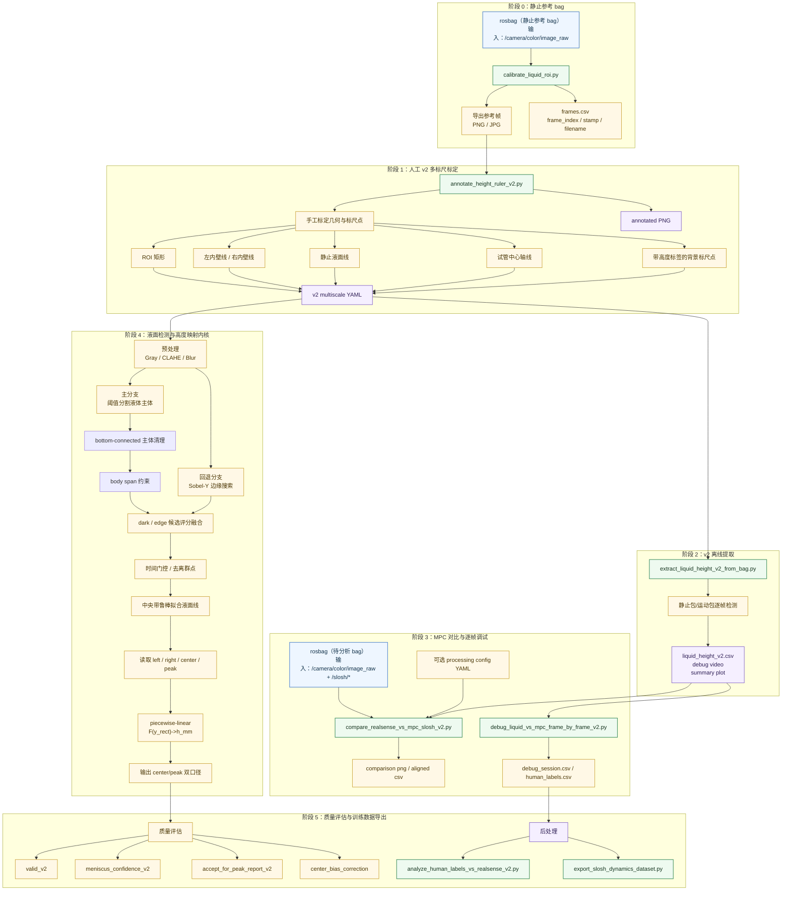

# realsense_liquid_measurement

`realsense_liquid_measurement` 用于承载 RealSense 液面测量链的离线脚本与后续实时节点。

## 当前核心目标

**最终业务目标：证明在同任务、同路径、可比激励下，`Q=5` 时液体晃动比 `Q=0` 更轻微。**

**当前主目标：验证 `/slosh/height` 能否估计“当前时刻的液面峰值高度（MSH）”。**

- 当前必须区分两个物理量：
  - `/slosh/height`：模型当前时刻的总最大液面抬升，语义更接近 `MSH`
  - `height_center_rel_mm_bias_corrected_v2`：图像中央主液面高度，不是峰值真值
- 当前主对比口径暂时仍保留：
  - `height_center_rel_mm_bias_corrected_v2`
- 但它现在只应视为：
  - 过渡性的工程代理
  - 不是 `/slosh/height` 的严格同量真值
- 当前所有 `0325` 主结论，优先基于：
  - `/data/a/realsense_validation_v2/verify/0325_rezero_bias/`

## 当前效果与判断

基于 `0325_rezero_bias` 这套最新主基线：

- 静止包 `Q5_static`
  - `raw_MAE = 0.007837 mm`
  - `raw_bias_median = 0.000000 mm`
  - 说明当前 `0 mm` 重标和 `1.233421 mm` bias 修正后，静态主液面已经基本贴零
- 运动包
  - `Q5_test1`: `raw_MAE = 0.093253 mm`, `raw_corr = 0.521`, `reportable = 435/2363`
  - `Q5_test2`: `raw_MAE = 0.092495 mm`, `raw_corr = 0.688`, `reportable = 24/1080`
  - `Q5_test3`: `raw_MAE = 0.063274 mm`, `raw_corr = 0.430`, `reportable = 297/1319`
  - `Q0_test1`: `raw_MAE = 0.189001 mm`, `raw_corr = 0.420`, `reportable = 181/1241`
- 当前判断
  - 从代码语义上，`/slosh/height` 更接近“当前时刻液面峰值高度（MSH）”
  - 因此此前所有 `center vs /slosh/height` 结论，都应理解为：
    - 工程近似验证
    - 不是严格的同量对比
  - 当前更合理的口径是：
    - 主判断指标：`/slosh/height`
    - 过渡性视觉代理：`height_center_rel_mm_bias_corrected_v2`
    - 后续严格真值：人工或更稳健的视觉峰值口径
- 当前剩余问题
  - `Q5_test1` 仍有少量局部时段更像模型侧低估
  - 视觉 `center` 也仍存在少量近静态异常帧，不能把所有误差都归到模型
- 当前限制
  - `Q0_test1` 与 `Q5_test1/2/3` 的路径和激励并不严格可比
  - 因此不能仅凭这批 bag 的幅值差，直接下结论说 `Q=5` 一定比 `Q=0` 更好
  - 对 `0330/Q0_test2 vs Q5_test2` 而言，当前最新证据是：
    - `/slosh/height` 的主活动段幅值 `Q5 < Q0`
    - 且 `/local_path` 平滑性没有出现“Q5 明显更平滑”的解释性差异
    - 因此这批数据对“Q=5 抑制液体晃动”给出了正向但仍非最终的证据
  - 当前还缺：
    - 少量 `human_peak_mm` 人工峰值标签
    - 用来对 `/slosh/height ~= 当前 MSH` 做严格验证

## 目录

- [realsense\_liquid\_measurement](#realsense_liquid_measurement)
  - [目录](#目录)
  - [当前结构](#当前结构)
  - [包内文件与目录说明](#包内文件与目录说明)
  - [scripts 逐个文件说明](#scripts-逐个文件说明)
  - [脚本用途总览](#脚本用途总览)
  - [当前整理步骤](#当前整理步骤)
  - [当前代码流程图](#当前代码流程图)
  - [RealSense ROS 编译脚本](#realsense-ros-编译脚本)
  - [当前推荐用法](#当前推荐用法)
  - [结果分析教程](#结果分析教程)
  - [第二步：手动标定 ROI 和参考几何](#第二步手动标定-roi-和参考几何)
    - [模式 A：没有背景标尺，先打通通路](#模式-a没有背景标尺先打通通路)
    - [模式 B：有背景标尺时再做毫米标定](#模式-b有背景标尺时再做毫米标定)
  - [第三步：批量提取液面像素时序](#第三步批量提取液面像素时序)
  - [从 Auto-Zero 到逐帧调试的完整流程](#从-auto-zero-到逐帧调试的完整流程)
  - [逐帧调试脚本](#逐帧调试脚本)
    - [原理](#原理)
    - [用法](#用法)
  - [曲线图怎么看](#曲线图怎么看)
  - [CSV 字段说明](#csv-字段说明)

## 当前结构

当前包内结构如下：

```text
realsense_liquid_measurement/
├── CMakeLists.txt
├── FSL测试方案总结.md
├── README.md
├── package.xml
├── 改进文档0322.md
├── 对比路径方案.md
├── 对比路径方案log.md
├── 新的高度分析方案.md
├── 新的高度分析方案log.md
├── 监督学习方案.md
├── 监督学习方案log.md
├── 监督学习方案总结v1.md
├── config/
├── fsl_artifacts/
├── fsl_runs/
├── sl_artifacts/
├── sl_runs/
├── slosh_replay_runs/
├── scripts/
└── v2_runs/
```

当前结构的理解方式是：

- `config/` 放配置与示例标定文件；
- `scripts/` 放离线标定、提取、对比、监督学习、重放和 debug 脚本；
- `fsl_*` 目录放伪标签预训练链的中间产物与实验结果；
- `sl_*` 目录放人工真值监督学习链的中间产物与实验结果；
- `slosh_replay_runs/` 放 `/slosh/height` 离线重放实验结果；
- `v2_runs/` 放旧 `v2` 几何链在新批次数据上的对比输出。

## 包内文件与目录说明

### 根目录文件

- `CMakeLists.txt`
  - ROS 包构建入口，定义本包的编译与安装规则。
- `package.xml`
  - ROS 包元信息与依赖声明。
- `README.md`
  - 当前包的总说明文档，记录主线流程、脚本分类和推荐用法。
- `改进文档0322.md`
  - 早期 `0322` 阶段的改进记录，主要保留历史背景，不再是当前主线。
- `新的高度分析方案.md`
  - 旧版液面高度分析主方案文档，承载 `v2` 几何链时期的设计思路。
- `新的高度分析方案log.md`
  - 与上面旧方案对应的日志与阶段性分析记录。
- `对比路径方案.md`
  - 面向 `Q0/Q5` 路径与激励可比性的分析方案文档。
- `对比路径方案log.md`
  - 上述路径对比方案的过程日志。
- `监督学习方案.md`
  - 当前 `MSH-first` 监督学习主方案文档，是现阶段主线技术文档。
- `监督学习方案log.md`
  - 当前监督学习主线的结构框架、阶段决策和实验日志。
- `监督学习方案总结v1.md`
  - 当前阶段的压缩版结论，适合快速汇报和回顾。
- `FSL测试方案总结.md`
  - `FSL` 视觉伪标签预训练链的阶段性总结。

### 目录一句话说明

- `config/`
  - 存放液面测量参数配置、旧示例标定和调试用示例图片。
- `scripts/`
  - 存放本包所有可执行脚本，是离线分析与监督学习主入口。
- `fsl_artifacts/`
  - 存放 `FSL` 伪标签预训练的数据 manifest、split 和中间组织产物。
- `fsl_runs/`
  - 存放 `FSL` 伪标签预训练的 checkpoint、summary、曲线图和对比输出。
- `sl_artifacts/`
  - 存放人工真值 `SL` 训练所需 manifest、split 和派生 ROI 数据集。
- `sl_runs/`
  - 存放人工真值 `SL` 模型训练结果、曲线图和图像级 debug 输出。
- `slosh_replay_runs/`
  - 存放不同 slosh 参数或输入源下的离线重放结果，用于验证 bag 内 `/slosh/height` 来源。
- `v2_runs/`
  - 存放旧 `v2` 几何链在新批次 bag 上的对齐评估结果。

### `config/` 目录文件

- `config/liquid_measurement_v2.yaml`
  - 当前推荐主配置，服务于 `v2` 多标尺标定与提取链。
- `config/liquid_measurement.yaml`
  - `v1` 兼容配置，主要供旧流程回放和对照使用。
- `config/frame_000000_calibration_line_auto_zero_peak.yaml`
  - 旧 `v1 auto-zero peak` 示例标定，仅用于兼容旧流程。
- `config/frame_000000_calibration_line_auto_zero_peak_provisional_29mm.yaml`
  - 旧 `v1` 毫米映射调试标定示例。
- `config/frame_000000_annotated.png`
  - 对应旧示例标定的示意图。

## scripts 逐个文件说明

下面按文件逐个说明 `scripts/` 下当前保留脚本的职责。若只想看主线，优先关注 `annotate_height_ruler_v2.py`、`extract_liquid_height_v2_from_bag.py`、`debug_liquid_vs_mpc_frame_by_frame_v2.py`、`SL_export_raw_rectified_roi.py`、`SL_train_visual_human.py`。

### FSL 伪标签预训练链

- `scripts/FSL_run_pseudolabel_pretrain.py`
  - 基于 bag 级 split 跑最小伪标签预训练闭环，主要验证 `0330/0401` 中 `SL/FSL` 的数据切分和基线结果。
- `scripts/FSL_train_visual_pseudolabel.py`
  - 用单帧 ROI 图像学习 `slosh_height_mm` 伪标签，形成 `FSL` 视觉预训练主入口。
- `scripts/FSL_eval_visual_vs_human.py`
  - 用人工 `human_peak_mm` 对 `FSL` 视觉模型和 `/slosh/height` 做外部 holdout 评估。
- `scripts/FSL_plot_visual_pseudolabel_curves.py`
  - 绘制 `FSL` 伪标签模型在 `val/test` 上的目标曲线、预测曲线和基线曲线。

### SL 人工真值监督学习链

- `scripts/SL_build_supervised_manifest.py`
  - 聚合多个 `debug_session` 目录，统一生成监督学习 manifest 和 metadata。
- `scripts/SL_make_splits.py`
  - 基于 manifest 按 `bag/date/session` 做 group-level `train/val/test` 切分。
- `scripts/SL_supervised_common.py`
  - `SL`/`FSL` 训练评估共享工具模块，包含 manifest 读取、指标计算、特征构造等公共逻辑。
- `scripts/SL_train_baseline.py`
  - 训练 `B2 dynamics-only` 基线，当前支持 `b2_mlp` 和 `b2_tcn`。
- `scripts/SL_eval_baseline.py`
  - 统一评估 `B0/B1/B2` 基线并输出 frame-wise、bag-wise 指标。
- `scripts/SL_infer_on_debug_session.py`
  - 使用训练好的 checkpoint 在单个 `debug_session` 上做逐帧推理和导出。
- `scripts/SL_export_raw_rectified_roi.py`
  - 从缓存全图和 calibration 中导出无叠加的 `raw rectified ROI`，为 `SL` 视觉训练准备正式输入。
- `scripts/SL_export_center_half_roi.py`
  - 从 `raw ROI` 派生“上下各裁 1/4”的 `center-half ROI`，用于固定 crop ablation。
- `scripts/SL_train_visual_human.py`
  - 当前主线训练脚本，做单帧 `ROI -> human_peak_mm` 真标签回归。
- `scripts/SL_train_visual_temporal_human.py`
  - 当前最小短时序视觉对照实验，做 `K` 帧 ROI 序列到 `human_peak_mm` 的回归。
- `scripts/SL_plot_visual_human_curves.py`
  - 绘制人工真值 `SL` 模型与 `human_peak`、`/slosh/height`、可选 replay 曲线的对比图。
- `scripts/SL_plot_slosh_vs_visual_only.py`
  - 只保留 `SL visual` 与 `/slosh/height` 两条曲线进行直接对比。
- `scripts/SL_render_visual_prediction_debug.py`
  - 生成逐帧图像级 debug 图，直接显示 `human / SL / slosh` 及其误差。
- `scripts/SL_select_candidate_frames.py`
  - 基于当前 best 模型、`/slosh/height` 和 `v2` 置信度筛选“下一轮最值得人工补标”的候选帧。

### v1 标定与提取链

- `scripts/calibrate_liquid_roi.py`
  - 从静止 bag 导出参考帧和 `frames.csv`，作为人工标定输入。
- `scripts/annotate_liquid_roi.py`
  - 在参考帧上手工标 `ROI`、内壁、静止液面、试管轴线和可选标尺点，输出 `v1` calibration。
- `scripts/extract_liquid_height_from_bag.py`
  - 使用 `v1` calibration 提取液面时序，输出 `liquid_height.csv`、debug video 和曲线图。
- `scripts/compare_realsense_vs_mpc_slosh.py`
  - 对齐 `v1` RealSense 结果与 `/slosh/height`、`/slosh/height_pred_max`。
- `scripts/debug_liquid_vs_mpc_frame_by_frame.py`
  - `v1` 逐帧复核器，把原图、ROI 图和 `/slosh/*` 数值放到同一查看器中。

### v2 多标尺标定与提取链

- `scripts/annotate_height_ruler_v2.py`
  - 当前 `v2` 主标定脚本，在静止图上标 `ROI`、壁线、still level、tube axis 和多标尺点。
- `scripts/extract_liquid_height_v2_from_bag.py`
  - 当前 `v2` 主提取脚本，输出 `center/peak` 双口径液面高度以及置信度字段。
- `scripts/compare_realsense_vs_mpc_slosh_v2.py`
  - 当前 `v2` 主对比脚本，对齐 `RealSense v2` 与 `/slosh/height`。
- `scripts/debug_liquid_vs_mpc_frame_by_frame_v2.py`
  - 当前主逐帧调试和人工标注器，支持录入 `human_peak_mm`、候选帧跳转和零线微调。

### 人工标签与误差分析

- `scripts/analyze_human_labels_vs_realsense_v2.py`
  - 对 `human labels / RealSense v2 / /slosh/height` 做误差、偏置和校正分析。

### 动力学数据导出与 replay

- `scripts/export_slosh_dynamics_dataset.py`
  - 从 `debug_session.csv` 导出固定历史窗口的动力学训练样本。
- `scripts/replay_slosh_model_from_bag.py`
  - 基于 bag 内 `/slosh/*` 状态和输入离线重放 slosh model，用于验证 `/slosh/height` 来源和参数敏感性。

### 路径可比性与专题分析

- `scripts/compare_bag_paths_and_excitation_0325.py`
  - 比较 `0325` 各 bag 的路径、速度和激励量级，用来判断 `Q0/Q5` 是否同任务可比。
- `scripts/analyze_realsense_center_vs_slosh_0325.py`
  - 面向 `0325` 的 `center vs /slosh/height` 单包误差、偏置和 outlier 分析。
- `scripts/analyze_q5_phase_and_outliers_0325.py`
  - 深挖 `Q5_test1/Q5_test2` 的相位差、局部坏点和 lag 敏感性。
- `scripts/render_center_overlay_review_0325.py`
  - 在干净 ROI 图上叠加 `0 mm / RealSense center / /slosh/height`，做视觉复核。
- `scripts/analyze_q5_test1_segment_inputs_0325.py`
  - 面向 `Q5_test1` 坏点段，导出 `slosh` 输入和状态，判断误差更像视觉侧还是模型侧。
- `scripts/analyze_paired_q0_q5_0330.py`
  - 对 `0330` 同路径 `Q0/Q5` 成对 bag 做路径、激励和响应比较。
- `scripts/analyze_q0_q5_test2_deep_0330.py`
  - 深挖 `0330/Q0_test2 vs Q5_test2` 的分段幅值和 `/local_path` 平滑性差异。

### 环境与构建

- `scripts/build_realsense_ros_local.sh`
  - 在工作区本地补 RealSense 依赖并编译 `realsense-ros`。
- `scripts/realsense_ros_env_local.sh`
  - 运行本地 `realsense-ros` 前，用于补齐环境变量。

## 脚本用途总览

按当前实际用途，`scripts/` 下脚本可以分成 14 类。

### 1. 环境与 RealSense ROS 构建

- `scripts/build_realsense_ros_local.sh`
  - 为工作区本地补齐 `realsense-ros` 所需依赖
  - 定向编译 `realsense2_description`、`realsense2_camera`
- `scripts/realsense_ros_env_local.sh`
  - `source` 后补充本地 `librealsense2`、`ddynamic_reconfigure` 相关环境变量
  - 用于运行本地编译出来的 `realsense-ros`

### 2. v1 标定与提取主线

- `scripts/calibrate_liquid_roi.py`
  - 从静止 bag 导出参考帧和 `frames.csv`
  - 给后续人工标定提供输入图
- `scripts/annotate_liquid_roi.py`
  - 在参考帧上人工标注 `ROI`、左右内壁、静止液面、试管轴线、可选标尺点
  - 输出 v1 calibration YAML 和 annotated PNG
- `scripts/extract_liquid_height_from_bag.py`
  - 用 v1 calibration 批量提取液面时序
  - 输出 `liquid_height.csv`、调试视频、峰值曲线图
- `scripts/compare_realsense_vs_mpc_slosh.py`
  - 对齐 v1 RealSense 输出和 `/slosh/height`、`/slosh/height_pred_max`
  - 主要用于旧口径回归和 mm 标定可用时的对比
- `scripts/debug_liquid_vs_mpc_frame_by_frame.py`
  - 构建 v1 逐帧调试会话
  - 把实物图、ROI 调试图、MPC 数值放到同一查看器里逐帧检查

### 3. v2 多标尺标定与提取主线

- `scripts/annotate_height_ruler_v2.py`
  - 在静止参考图上标注 v2 多标尺点
  - 固定输出 `旋正后 ROI` 坐标系下的 `height_mapping.reference_points`
  - 支持 `--still-level-mode front_back_midpoint`
    - 可同时标注前后两条可见静止液面线
    - 脚本自动取中线作为 `0 mm / still_level_line`
- `scripts/extract_liquid_height_v2_from_bag.py`
  - 用 v2 多标尺 calibration 做 `piecewise-linear` 高度映射
  - 输出双口径结果：
    - `height_center_rel_mm_v2`
    - `height_peak_rel_mm_v2`
  - 当前主液面口径是 `center`
- `scripts/compare_realsense_vs_mpc_slosh_v2.py`
  - 对齐 v2 RealSense 与 `/slosh/height`
  - 当前主看 `center vs /slosh/height`
  - `peak` 只保留为诊断量
- `scripts/debug_liquid_vs_mpc_frame_by_frame_v2.py`
  - 构建 v2 逐帧调试与人工标注会话
  - 支持查看 `RS visual peak`、`/slosh/height`
  - 支持录入：
    - `human_height_mm`
    - `human_peak_mm`

### 4. 人工标签质量分析

- `scripts/analyze_human_labels_vs_realsense_v2.py`
  - 读取 `debug_session.csv` / `human_labels.csv`
  - 分析人眼标签、RealSense v2、MPC 三者误差
  - 用于估计常数偏置、坏点类型和当前主口径有效性

### 5. 监督学习数据导出

- `scripts/export_slosh_dynamics_dataset.py`
  - 从 v2 `debug_session.csv` 导出固定时间窗的动力学训练样本
  - 当前支持的特征包括：
    - `v`
    - `omega`
    - `ax_cmd = dv/dt`
    - `ay_model = v * omega`
    - `imu_ax`
    - `imu_ay`
  - 输出 `.npz`、样本表和 metadata，给后续晃动高度回归使用

### 6. 监督学习最小闭环

- `scripts/SL_build_supervised_manifest.py`
  - 从一个或多个 `debug_session` 目录聚合统一监督学习 manifest
  - 合并：
    - `debug_session.csv`
    - `debug_session.json`
    - `human_labels.csv`
  - 输出：
    - `SL_supervised_manifest.csv`
    - `SL_supervised_manifest_metadata.json`
  - 当前支持：
    - `all / any / peak / center` 标签过滤
    - 自动补齐 `bag_id / date_id / session_id`
    - 统一携带 `peak_rel_mm_v2`、`center_rel_mm_v2`、`slosh_height_mm` 等现有字段
- `scripts/SL_make_splits.py`
  - 基于 `SL_supervised_manifest.csv` 生成监督学习切分
  - 当前支持按：
    - `bag_id`
    - `date_id`
    - `session_id`
    做 group-level `train / val / test` 切分
  - 输出：
    - `SL_supervised_splits.json`
    - `SL_supervised_split_groups.csv`
  - 会显式拒绝 group 数量不足的伪有效切分
- `scripts/SL_supervised_common.py`
  - `SL_` 监督学习链的共享工具模块
  - 包含：
    - manifest/split 读取
    - 动力学特征构造
    - 历史窗口样本构造
    - 标准化
    - 回归指标与 bag-wise 指标
- `scripts/SL_train_baseline.py`
  - 当前 `SL_` 训练入口
  - 已实现 `B2` dynamics-only baseline：
    - `b2_mlp`
    - `b2_tcn`
  - 输入：
    - `SL_supervised_manifest.csv`
    - `SL_supervised_splits.json`
  - 输出 checkpoint、history CSV、summary JSON
- `scripts/SL_eval_baseline.py`
  - 当前 `SL_` 评估入口
  - 对 `B0 / B1 / B2` 做统一 split 评估
  - 输出：
    - frame-wise predictions CSV
    - bag-wise metrics CSV
    - summary JSON
- `scripts/SL_infer_on_debug_session.py`
  - 当前 `SL_` 整包推理入口
  - 用训练好的 checkpoint 在单个 `debug_session` 上做逐帧推理
  - 输出：
    - `SL_infer_predictions_<task>.csv`
    - `SL_infer_summary_<task>.json`

### 7. slosh model 离线重放

- `scripts/replay_slosh_model_from_bag.py`
  - 使用 bag 中已记录的 `/slosh/ax_est`、`/slosh/ay_est`、`/slosh/omega_est_used`、`/slosh/alpha_est`、`/slosh/state`
  - 离线重放当前工程里的 slosh 动力学，并与 bag 原始 `/slosh/height`、`/slosh/height_pred_max`、RealSense 主液面曲线做对比
  - 支持 `--replay-mode`：
    - `linear_engineering`：当前工程 `Lp` 逻辑
    - `paper_nl`：论文 Eq.(11) 的 Paper NL 动力学重放
    - `both`：同图对比两条离线重放曲线
  - 支持改动 `liquid_height`、`damping_ratio`、`mode_index`、`L/NL 高度映射`、`parabola term`
  - `paper_nl` 模式使用 `RK4` 做单模态积分，输出：
    - `paper_nl_modal_height`
    - `paper_nl_total_height`
  - 默认输出到 `/data/a/realsense_validation_v2/debug/<bag批次>/slosh_replay/<bag_stem>/`
  - 用于回答“当前 bag 的 `/slosh/height` 是怎么来的”“把参数从 `0.055` 改到 `0.058` 会不会明显变化”

### 8. 路径与激励可比性分析

- `scripts/compare_bag_paths_and_excitation_0325.py`
  - 对比 `0325` 试验中各 bag 的 `odom` 路径、`cmd_vel`、平面激励和液体响应
  - 先判断 `Q0/Q5` bag 是否同任务可比，再讨论抑制是否有效
  - 输出单 bag 指标、pairwise 对比表、轨迹图、激励图和 README

### 9. RealSense vs /slosh/height 误差分析

- `scripts/analyze_realsense_center_vs_slosh_0325.py`
  - 面向 `0325` 批次，按 bag 分析 `height_center_rel_mm_bias_corrected_v2` 对 `/slosh/height` 的 raw/zero-align 误差与偏置
  - 输出每包 summary、top outlier 表、每包曲线图和 README
  - 用于回答：
    - 哪个 bag 最接近
    - 哪个 bag 偏置最明显
    - 坏点更像视觉检测问题还是模型/残余偏置问题

### 10. Q5 重点相位差与坏点深挖

- `scripts/analyze_q5_phase_and_outliers_0325.py`
  - 面向 `Q5_test1` 和 `Q5_test2`，单独分析 `RealSense center` 对 `/slosh/height` 的 lag sweep、近零最优 lag 和坏点分段
  - 输出：
    - `phase_summary.csv/json`
    - `Q5_test1_outlier_segments.csv`
    - `Q5_test1_segments/*.png`
    - `README.md`
  - 用于回答：
    - `Q5_test1` 相比 `Q5_test2` 是否存在更明显的相位差
    - `Q5_test1` 的大误差是否集中在少数时段
    - 这些时段更像纯时延问题，还是幅值/模型不一致问题

### 11. Center 位置可视复核

- `scripts/render_center_overlay_review_0325.py`
  - 从 `debug_session.csv` 和 `scene_0325_multiscale_raw.yaml` 生成干净的 ROI 复核图
  - 在同一张图上叠加：
    - `0 mm`
    - `RealSense center`
    - `/slosh/height` 映射高度
  - 用于回答：
    - `RealSense center` 在视觉上是否偏高
    - `/slosh/height` 是否更像偏低
    - 目标坏点段里到底是谁更偏离真实液面

### 12. Q5_test1 输入与状态分段分析

- `scripts/analyze_q5_test1_segment_inputs_0325.py`
  - 面向 `0325_rezero_bias/Q5_test1` 的高误差坏点段
  - 逐段导出：
    - `RealSense center` vs `/slosh/height`
    - `/slosh/ax_est`、`/slosh/ay_est`
    - `/slosh/omega_est_used`、`/slosh/alpha_est`
    - `/slosh/state = [eta_x, eta_x_dot, eta_y, eta_y_dot]`
  - 输出：
    - `segment_input_state_summary.csv/json`
    - `segments/*.png`
    - `README.md`
  - 用于回答：
    - `/slosh/height` 局部偏低时，对应的输入激励和状态量级是什么
    - `Q5_test1` 的残余误差更像模型侧低估，还是视觉 `center` 局部偏高

### 13. 0330 同路径 Q0/Q5 成对比较

- `scripts/analyze_paired_q0_q5_0330.py`
  - 面向 `0330` 批次的两对同路径 bag：
    - `Q0_test1 vs Q5_test1`
    - `Q0_test2 vs Q5_test2`
  - 统一沿用上一批的静止基准和 bias，不使用 `0330/Q0_static` 重新定零位
  - 输出：
    - `paired_q0_q5_summary.csv/json`
    - 每对的路径/激励/响应对比图
    - `README.md`
  - 用于回答：
    - 同一路径下 `Q0/Q5` 的运动激励是否真的接近
    - 在沿用旧静止基准的前提下，`Q0/Q5` 的 `/slosh/height` 与 `RealSense center` 相对幅值谁更大

### 14. 0330 test2 分段幅值与 /local_path 平滑性深挖

- `scripts/analyze_q0_q5_test2_deep_0330.py`
  - 面向 `0330_rezero_bias` 下最可比的一对：
    - `Q0_test2`
    - `Q5_test2`
  - 输出：
    - `segment_amplitude_summary.csv`
    - `local_path_smoothness_summary.csv`
    - `segment_local_path_smoothness.csv`
    - `test2_segment_amplitude.png`
    - `test2_local_path_smoothness.png`
    - `test2_local_path_topdown.png`
    - `test2_odom_topdown.png`
    - `test2_odom_kinematics.png`
    - `README.md`
  - 用于回答：
    - `Q5_test2` 的更小液面响应是不是只因为 `/local_path` 更平滑
    - 主活动段里，`Q5` 相比 `Q0` 到底小了多少
  - 当前结论：
    - 主活动段 `segment_01 [5.94, 15.64] s` 中：
      - `Q5/Q0 /slosh/height p90 ratio = 0.966`
      - `Q5/Q0 /slosh/height max ratio = 0.689`
      - `Q5/Q0 /slosh/height area ratio = 0.704`
    - 但 `local_path` 平滑性没有显示 `Q5` 明显更平滑：
      - `heading_tv ratio = 0.989`
      - `curvature_change ratio = 1.100`
      - `shape_delta ratio = 1.004`
    - 因此：
      - `Q5_test2` 的更小液面响应不太像只是路径更平滑导致
      - 这可以作为“Q=5 抑制有效”的正向证据
      - 但还需要少量 `human_peak_mm` 标签做严格峰值验证

其中 `build_realsense_ros_local.sh` 会把缺失的 RealSense 依赖包下载并解包到工作区根目录下的 `.ros_deps/` 和 `.ros_deps_cache/`。这两个目录属于本机环境缓存，不建议提交。

当前外部目录约定：

- 原始 bag：
  - `/data/a/bags/`
- 候选标定输出：
  - `/data/a/realsense_validation/candidates/`
- 静止验证输出：
  - `/data/a/realsense_validation/verify/static/`
- 运动验证输出：
  - `/data/a/realsense_validation/verify/motion/`

当前主线使用的核心文件：

- v2 主配置：
  - [liquid_measurement_v2.yaml](/home/a/scout_ws/src/scout_apps/sensors/realsense_liquid_measurement/config/liquid_measurement_v2.yaml)
- v1 兼容配置：
  - [liquid_measurement.yaml](/home/a/scout_ws/src/scout_apps/sensors/realsense_liquid_measurement/config/liquid_measurement.yaml)
- v2 主标定：
  - 由 `annotate_height_ruler_v2.py` 为每个实验场景单独生成
  - 文件名通常是 `frame_XXXXXX_multiscale_raw.yaml`
  - 当前主线不再依赖仓库内固定的单一标定文件
- 方案文档：
  - [新的高度分析方案.md](/home/a/scout_ws/src/scout_apps/sensors/realsense_liquid_measurement/新的高度分析方案.md)
  - [对比路径方案.md](/home/a/scout_ws/src/scout_apps/sensors/realsense_liquid_measurement/对比路径方案.md)
  - [监督学习方案.md](/home/a/scout_ws/src/scout_apps/sensors/realsense_liquid_measurement/监督学习方案.md)
  - [监督学习方案log.md](/home/a/scout_ws/src/scout_apps/sensors/realsense_liquid_measurement/监督学习方案log.md)

## 当前整理步骤

如果你现在按当前主线跑整套流程，直接按下面 5 步：

1. 从静止 bag 导出参考图：
   - 用 `calibrate_liquid_roi.py`
2. 在参考图上做 v2 多标尺标定：
   - 用 `annotate_height_ruler_v2.py`
   - 固定规则：
     - `0 mm = 静止液面`
     - 映射坐标系 = `旋正后 ROI`
     - `x_px` 只记录和一致性检查，不参与高度计算
3. 先用静止 bag 跑 v2 提取：
   - 用 `extract_liquid_height_v2_from_bag.py`
   - 主看：
     - `height_center_rel_mm_bias_corrected_v2`
     - `valid_v2 / accept_for_peak_report_v2`
4. 再用同一份标定跑运动 bag：
   - 主看：
     - `height_center_rel_mm_bias_corrected_v2`
     - `liquid_height_peak_curve_v2.png`
5. 用 `compare_realsense_vs_mpc_slosh_v2.py` 和 `debug_liquid_vs_mpc_frame_by_frame_v2.py` 做对比与逐帧调试

补充说明：

- 当前主液面口径是 `height_center_rel_mm_bias_corrected_v2`
- `height_peak_rel_mm_v2` 只保留为诊断量，不再作为主报告口径
- v1 的 `auto-zero peak` 流程保留是为了兼容旧数据，不是当前推荐主线

## 当前代码流程图



这张流程图只反映当前推荐的 `v2` 主线。`v1/auto-zero/peak` 相关脚本仍保留在仓库里，但主要用于兼容旧数据和回归对比。

## RealSense ROS 编译脚本

如果当前机器没有系统安装 `ddynamic_reconfigure` 或 `librealsense2`，可以直接使用包内脚本在工作区本地准备依赖并编译 `src/third_party/realsense-ros`。

脚本位置：

- [build_realsense_ros_local.sh](/home/a/scout_ws/src/scout_apps/sensors/realsense_liquid_measurement/scripts/build_realsense_ros_local.sh)
- [realsense_ros_env_local.sh](/home/a/scout_ws/src/scout_apps/sensors/realsense_liquid_measurement/scripts/realsense_ros_env_local.sh)

两个脚本的职责：

- `build_realsense_ros_local.sh`
  - 检查工作区根目录下的 `.ros_deps/opt/ros/noetic`
  - 如果缺依赖，就下载 `ros-noetic-ddynamic-reconfigure` 和 `ros-noetic-librealsense2`
  - 把包解到工作区本地 `.ros_deps/`
  - 最后执行 `catkin_make --pkg realsense2_description realsense2_camera`
- `realsense_ros_env_local.sh`
  - 用 `source` 方式加载
  - 补齐 `CMAKE_PREFIX_PATH`、`ROS_PACKAGE_PATH`、`LD_LIBRARY_PATH`、`PKG_CONFIG_PATH`
  - 让运行时能够找到本地 `.ros_deps/` 里的 RealSense 相关库

推荐用法：

1. 编译 `realsense-ros`：

```bash
/home/a/scout_ws/src/scout_apps/sensors/realsense_liquid_measurement/scripts/build_realsense_ros_local.sh
```

2. 运行依赖本地 RealSense 库的 ROS 节点前，先加载环境：

```bash
source /home/a/scout_ws/src/scout_apps/sensors/realsense_liquid_measurement/scripts/realsense_ros_env_local.sh
```

补充说明：

- 这两个脚本本身可以提交到仓库
- `.ros_deps/` 和 `.ros_deps_cache/` 是本地环境目录，不建议提交
- 如果机器上的 `apt` 配置了不可用代理，构建脚本会自动尝试去掉代理变量后重新下载

## 当前推荐用法

当前推荐全部走 `v2` 主线。最短闭环是：

1. 从静止 bag 导出参考帧
2. 用 `annotate_height_ruler_v2.py` 生成本场景的 `frame_XXXXXX_multiscale_raw.yaml`
3. 先跑静止 bag，确认 `center` 口径接近 `0`
4. 再跑运动 bag
5. 用 `compare_realsense_vs_mpc_slosh_v2.py` 和 `debug_liquid_vs_mpc_frame_by_frame_v2.py` 做对比与逐帧复核

先从静止 bag 导出首帧：

```bash
python3 /home/a/scout_ws/src/scout_apps/sensors/realsense_liquid_measurement/scripts/calibrate_liquid_roi.py \
  --bag <static_bag> \
  --image-topic /camera/color/image_raw \
  --frame-index 0 \
  --out-dir <frame_export_dir>
```

再做 v2 多标尺标定：

```bash
python3 /home/a/scout_ws/src/scout_apps/sensors/realsense_liquid_measurement/scripts/annotate_height_ruler_v2.py \
  --image <frame_export_dir>/frame_000000.png \
  --ruler-heights-mm 0,5,10,15,20,25 \
  --output-yaml <calibration_dir>/frame_000000_multiscale_raw.yaml \
  --output-image <calibration_dir>/frame_000000_multiscale_annotated.png
```

先跑静止 bag：

```bash
python3 /home/a/scout_ws/src/scout_apps/sensors/realsense_liquid_measurement/scripts/extract_liquid_height_v2_from_bag.py \
  --bag <static_bag> \
  --calibration <calibration_dir>/frame_000000_multiscale_raw.yaml \
  --out-dir <verify_static_dir> \
  --plot-confidence \
  --skip-debug-video
```

再跑运动 bag：

```bash
python3 /home/a/scout_ws/src/scout_apps/sensors/realsense_liquid_measurement/scripts/extract_liquid_height_v2_from_bag.py \
  --bag <motion_bag> \
  --calibration <calibration_dir>/frame_000000_multiscale_raw.yaml \
  --out-dir <verify_motion_dir> \
  --plot-confidence \
  --skip-debug-video
```

最后做对比：

```bash
python3 /home/a/scout_ws/src/scout_apps/sensors/realsense_liquid_measurement/scripts/compare_realsense_vs_mpc_slosh_v2.py \
  --bag <motion_bag> \
  --liquid-csv <verify_motion_dir>/liquid_height_v2.csv \
  --out-png <verify_motion_dir>/mpc_realsense_comparison_v2.png \
  --out-csv <verify_motion_dir>/mpc_realsense_aligned_v2.csv
```

## 结果分析教程

提取完成后，不建议直接盯一张曲线图下结论。当前更稳的后处理顺序是：

1. 先看单包 `RealSense vs /slosh/height`
2. 再看同路径 `Q0/Q5` 成对比较
3. 再看 `test2` 这种主样本的分段幅值和路径平滑性
4. 最后才做人工峰值标注，给 `/slosh/height ~= 当前 MSH` 做严格验证

下面按问题来选脚本。

### A. 想看单个 bag 里 `RealSense` 和 `/slosh/height` 是否同趋势

用：
- `scripts/analyze_realsense_center_vs_slosh_0325.py`

它做的事：
- 从 bag 里读 `/slosh/height`
- 从 `liquid_height_v2.csv` 里读 `RealSense` 代理口径
- 画单包对比图
- 输出每包误差、偏置、相关性

典型输出：
- `<verify_root>/center_vs_slosh_analysis/*.png`
- `<verify_root>/center_vs_slosh_analysis/center_vs_slosh_summary.csv`
- `<verify_root>/center_vs_slosh_analysis/README.md`

什么时候用：
- 先判断某个 bag 值不值得继续深挖
- 看当前零位/bias 是否明显不对

### B. 想比较同一路径下 `Q0` 和 `Q5` 谁晃得更大

用：
- `scripts/analyze_paired_q0_q5_0330.py`

它做的事：
- 按成对 bag 比较：
  - `Q0_test1 vs Q5_test1`
  - `Q0_test2 vs Q5_test2`
- 同时读：
  - `odom`
  - `cmd_vel`
  - `/slosh/height`
  - `RealSense` 代理
- 输出路径相似度、激励量级比值、液面幅值比值

典型输出：
- `<verify_root>/paired_q0_q5_analysis/paired_q0_q5_summary.csv`
- `<verify_root>/paired_q0_q5_analysis/*.png`
- `<verify_root>/paired_q0_q5_analysis/README.md`

什么时候用：
- 想先回答“Q=5 有没有比 Q=0 更轻微”的业务问题
- 但还不打算做人工真值标注

当前 `0330` 的用法：
- 旧静止基准版本：
  - `/data/a/realsense_validation_v2/verify/0330_prev_static_ref/paired_q0_q5_analysis/`
- 新 `0330` static 重定零位版本：
  - `/data/a/realsense_validation_v2/verify/0330_rezero_bias/paired_q0_q5_analysis/`

### C. 想证明 `Q5` 更小不是因为路径更平滑

用：
- `scripts/analyze_q0_q5_test2_deep_0330.py`

它做的事：
- 只盯当前最可比的一对：`Q0_test2 vs Q5_test2`
- 先切出主活动段
- 再分别输出：
  - `slosh/visual` 分段幅值图
  - `/local_path` 平滑性时序图
  - `/local_path` 俯视图
  - `odom` 实际轨迹俯视图
  - `odom` 速度/加速度时序图

典型输出：
- `/data/a/realsense_validation_v2/verify/0330_rezero_bias/test2_deep_analysis/test2_segment_amplitude.png`
- `/data/a/realsense_validation_v2/verify/0330_rezero_bias/test2_deep_analysis/test2_local_path_smoothness.png`
- `/data/a/realsense_validation_v2/verify/0330_rezero_bias/test2_deep_analysis/test2_local_path_topdown.png`
- `/data/a/realsense_validation_v2/verify/0330_rezero_bias/test2_deep_analysis/test2_odom_topdown.png`
- `/data/a/realsense_validation_v2/verify/0330_rezero_bias/test2_deep_analysis/test2_odom_kinematics.png`
- `/data/a/realsense_validation_v2/verify/0330_rezero_bias/test2_deep_analysis/segment_amplitude_summary.csv`
- `/data/a/realsense_validation_v2/verify/0330_rezero_bias/test2_deep_analysis/local_path_smoothness_summary.csv`
- `/data/a/realsense_validation_v2/verify/0330_rezero_bias/test2_deep_analysis/README.md`

怎么看：
- 先看 `test2_segment_amplitude.png`
  - 主看 `/slosh/height`
  - 当前视觉虚线只是代理，不是严格峰值真值
- 再看 `test2_local_path_smoothness.png`
  - 判断 `Q5` 是否只是路径更新更平滑
- 再看 `test2_local_path_topdown.png` 和 `test2_odom_topdown.png`
  - 区分规划路径和实际轨迹
- 最后看 `test2_odom_kinematics.png`
  - 判断 `Q0/Q5` 的实际速度、加速度是否也明显不同

### D. 想复现 bag 里的 `/slosh/height` 是怎么来的

用：
- `scripts/replay_slosh_model_from_bag.py`

它做的事：
- 从 bag 里读取 `/slosh/ax_est`、`/slosh/ay_est`、`/slosh/omega_est_used`、`/slosh/alpha_est`、`/slosh/state`
- 离线重放当前工程 slosh model
- 可切换：
  - `linear_engineering`
  - `paper_nl`
  - `both`

什么时候用：
- 判断当前 `/slosh/height` 是不是模型本身的结果
- 比较工程模型和论文 `paper_nl` 的差异

### E. 想逐帧看图，并给明天的严格验证打标签

用：
- `scripts/debug_liquid_vs_mpc_frame_by_frame_v2.py`

当前两类人工标签：
- `human_height_mm`
  - 中央主液面高度
- `human_peak_mm`
  - 当前峰值高度

当前建议：
- 如果只是做业务判断，先不大规模手标
- 如果要严格验证 `/slosh/height ~= 当前 MSH`，明天优先补 `human_peak_mm`

### 当前最推荐的明日继续顺序

1. 打开：
   - `/data/a/realsense_validation_v2/verify/0330_rezero_bias/test2_deep_analysis/test2_segment_amplitude.png`
   - `/data/a/realsense_validation_v2/verify/0330_rezero_bias/test2_deep_analysis/test2_local_path_smoothness.png`
   - `/data/a/realsense_validation_v2/verify/0330_rezero_bias/test2_deep_analysis/test2_odom_topdown.png`
   - `/data/a/realsense_validation_v2/verify/0330_rezero_bias/test2_deep_analysis/test2_odom_kinematics.png`
2. 先确认：
   - `Q5_test2` 的液面响应是否确实小于 `Q0_test2`
   - 这种差异是否不能被“路径更平滑”解释
3. 再打开：
   - `/data/a/realsense_validation_v2/debug/0330/Q0_test2/`
   - `/data/a/realsense_validation_v2/debug/0330/Q5_test2/`
4. 小批量补 `human_peak_mm`
5. 再做 `/slosh/height` 对人工峰值真值的严格比较

## 第二步：手动标定 ROI 和参考几何

当前主线的手工标定脚本是 `annotate_height_ruler_v2.py`，不是旧的 `annotate_liquid_roi.py`。

假设你已经导出了一张静止参考图：

```text
<frame_export_dir>/frame_000000.png
```

冻结规则：

- `0 mm = 静止液面`
- 高度映射 `F` 的坐标系固定为 `旋正后 ROI`
- `x_px` 只做记录和一致性检查，不进入高度计算
- 标尺点统一点击刻线中心
- 标尺高度通过 `--ruler-heights-mm` 一次性给定，按顺序点击，不逐点输入

### 模式 A：快速打通单场景

适合先打通一组新场景，标稀疏高度点：

```bash
python3 /home/a/scout_ws/src/scout_apps/sensors/realsense_liquid_measurement/scripts/annotate_height_ruler_v2.py \
  --image <frame_export_dir>/frame_000000.png \
  --ruler-heights-mm 0,5,10,15,20,25 \
  --output-yaml <calibration_dir>/frame_000000_multiscale_raw.yaml \
  --output-image <calibration_dir>/frame_000000_multiscale_annotated.png
```

交互顺序是：

1. 先拖框选择 `ROI`
2. 点击左内壁上点、下点
3. 点击右内壁上点、下点
4. 点击静止液面左点、右点
5. 点击试管中心轴线上点、下点
6. 按 `--ruler-heights-mm` 的顺序点击背景标尺点
7. 按 `Enter` 保存

界面提示规则：

- `tube axis`
  - 尽量跨越试管大部分高度
  - 这条线会决定 `旋正后 ROI` 坐标系
- `ruler points`
  - 点背景标尺的刻线中心
  - 不要点试管边缘或反光

### 模式 B：正式实验场景标定

适合一组要重复跑很多 bag 的固定场景。做法和模式 A 一样，只是建议：

- 只要背景、相机、ROI 关系变化，就重新标定，不复用旧 scene YAML
- 如果可见刻线更多，就把 `--ruler-heights-mm` 写得更密，不要只用最少 6 个点
- 同一实验批次的静止 bag 和运动 bag 必须共用同一份 `frame_XXXXXX_multiscale_raw.yaml`

默认会输出：

- `frame_000000_multiscale_raw.yaml`
- `frame_000000_multiscale_annotated.png`

## 第三步：批量提取液面像素时序

在 v2 标定完成后，可以直接批量提取：

- `height_center_rel_mm_v2`
- `height_center_rel_mm_bias_corrected_v2`
- `height_peak_rel_mm_v2`
- `valid_v2`
- `accept_for_peak_report_v2`
- `meniscus_confidence_v2`

运行示例：

```bash
python3 /home/a/scout_ws/src/scout_apps/sensors/realsense_liquid_measurement/scripts/extract_liquid_height_v2_from_bag.py \
  --bag <bag_path> \
  --calibration <calibration_yaml> \
  --out-dir <verify_out_dir>
```

如果你只想先小样本检查通路：

```bash
python3 /home/a/scout_ws/src/scout_apps/sensors/realsense_liquid_measurement/scripts/extract_liquid_height_v2_from_bag.py \
  --bag <bag_path> \
  --calibration <calibration_yaml> \
  --out-dir <quick_check_dir> \
  --max-frames 80 \
  --skip-debug-video
```

默认输出目录：

- 如果不显式指定 `--out-dir`，结果会写到 **bag 同目录**
- 也就是：
  - `/data/a/bags/<bag_stem>_liquid_measurement_v2/`

当前推荐读这几个输出：

- `liquid_height_v2.csv`
  - 每帧的 v2 检测结果
- `liquid_debug_v2.mp4`
  - ROI 调试视频
- `liquid_height_peak_curve_v2.png`
  - 当前摘要图，主看 `center`，`peak` 只是诊断

当前主口径说明：

- `height_center_rel_mm_bias_corrected_v2`
  - 当前主液面高度
- `height_center_rel_mm_v2`
  - 未做常数偏置修正的中心口径
- `height_peak_rel_mm_v2`
  - 诊断量，不作为主报告液面
- `--center-bias-correction-mm`
  - 可覆盖配置里的常数偏置修正

## 从 Auto-Zero 到逐帧调试的完整流程

这个标题为了兼容旧文档保留下来，但当前 `v2` 主线已经**不依赖 auto-zero**。推荐闭环是：

### 第 0 步：先拿到本场景自己的静止参考帧

```bash
python3 /home/a/scout_ws/src/scout_apps/sensors/realsense_liquid_measurement/scripts/calibrate_liquid_roi.py \
  --bag <static_bag> \
  --image-topic /camera/color/image_raw \
  --frame-index 0 \
  --out-dir <frame_export_dir>
```

### 第 1 步：生成本场景的 v2 multiscale 标定 YAML

```bash
python3 /home/a/scout_ws/src/scout_apps/sensors/realsense_liquid_measurement/scripts/annotate_height_ruler_v2.py \
  --image <frame_export_dir>/frame_000000.png \
  --ruler-heights-mm 0,5,10,15,20,25 \
  --output-yaml <calibration_dir>/frame_000000_multiscale_raw.yaml \
  --output-image <calibration_dir>/frame_000000_multiscale_annotated.png
```

### 第 2 步：先跑静止 bag

```bash
python3 /home/a/scout_ws/src/scout_apps/sensors/realsense_liquid_measurement/scripts/extract_liquid_height_v2_from_bag.py \
  --bag <static_bag> \
  --calibration <calibration_dir>/frame_000000_multiscale_raw.yaml \
  --out-dir <verify_static_dir> \
  --plot-confidence \
  --skip-debug-video
```

这里主要看：

- `height_center_rel_mm_bias_corrected_v2` 是否接近 `0`
- `valid_v2 / accept_for_peak_report_v2` 是否没有明显崩掉
- `peak` 是否只是轻微高于 `center`，而不是出现离谱坏点

### 第 3 步：再跑运动 bag

```bash
python3 /home/a/scout_ws/src/scout_apps/sensors/realsense_liquid_measurement/scripts/extract_liquid_height_v2_from_bag.py \
  --bag <motion_bag> \
  --calibration <calibration_dir>/frame_000000_multiscale_raw.yaml \
  --out-dir <verify_motion_dir> \
  --plot-confidence \
  --skip-debug-video
```

这里主要看：

- `height_center_rel_mm_bias_corrected_v2`
- `meniscus_confidence_v2`
- `liquid_height_peak_curve_v2.png`

### 第 4 步：和 `/slosh/height` 做同时间轴对比

```bash
python3 /home/a/scout_ws/src/scout_apps/sensors/realsense_liquid_measurement/scripts/compare_realsense_vs_mpc_slosh_v2.py \
  --bag <motion_bag> \
  --liquid-csv <verify_motion_dir>/liquid_height_v2.csv \
  --out-png <verify_motion_dir>/mpc_realsense_comparison_v2.png \
  --out-csv <verify_motion_dir>/mpc_realsense_aligned_v2.csv
```

如果你想看绝对高度，不想做每条曲线自己的起始零对齐，可以加：

```bash
--no-initial-zero-align
```

### 第 5 步：逐帧调试并录入人工标签

```bash
python3 /home/a/scout_ws/src/scout_apps/sensors/realsense_liquid_measurement/scripts/debug_liquid_vs_mpc_frame_by_frame_v2.py \
  --bag <motion_bag> \
  --calibration <calibration_dir>/frame_000000_multiscale_raw.yaml \
  --out-dir <debug_out_dir>
```

缓存建好后，重复打开时加：

```bash
--reuse-cache
```

### 第 6 步：需要时再做人工标签分析或训练集导出

人工标签分析：

```bash
python3 /home/a/scout_ws/src/scout_apps/sensors/realsense_liquid_measurement/scripts/analyze_human_labels_vs_realsense_v2.py \
  --debug-dir <debug_out_dir> \
  --out-dir <debug_out_dir>/human_label_analysis
```

动力学训练集导出：

```bash
python3 /home/a/scout_ws/src/scout_apps/sensors/realsense_liquid_measurement/scripts/export_slosh_dynamics_dataset.py \
  --debug-dir <debug_out_dir> \
  --target-column human_height_mm \
  --history-frames 30 \
  --stride 1 \
  --out-dir <dataset_out_dir>
```

## 逐帧调试脚本

### 原理

当前推荐的逐帧调试脚本是 `debug_liquid_vs_mpc_frame_by_frame_v2.py`。

它内部做的事分 3 步：

1. 读取 bag 里的 `/camera/color/image_raw`
2. 对每一帧复用当前主检测链：
   - `v2 ROI` 裁剪
   - 旋正
   - 中心液面与诊断峰值提取
   - 生成 `debug_session.csv / json`
3. 按同一个时间基准插值得到当前帧对应的：
   - `/slosh/height`
   - `/cmd_vel`
   - `/imu/data`
   - 人工标签入口：
     - `human_height_mm`
     - `human_peak_mm`

所以这条脚本本质上是在回答：

- 这一帧视觉到底看到了什么
- `center` 和 `peak` 谁更贴近真实液面
- 这一帧视觉高度和 `/slosh/height` 差多少
- 人眼判断的 `center` 和 `peak` 分别与当前算法差多少

它会缓存两类图：

- `photo/`
  - 原始实物照片预览
- `roi_debug/`
  - 当前检测器输出的 ROI 调试图或纯净标注图

以及三类索引文件：

- `debug_session.json`
- `debug_session.csv`
- `human_labels.csv`

其中：

- GUI 模式适合你拖动进度条、逐帧看图
- `--show-frame-index` 适合你已知某一帧，直接在终端查：
  - `height_center_rel_mm_v2`
  - `height_center_rel_mm_bias_corrected_v2`
  - `height_peak_rel_mm_v2`
  - `/slosh/height`

### 用法

先约定 4 个需要替换的位置：

- `<bag_path>`
  - 你要调试的 bag
- `<calibration_yaml>`
  - 当前使用的 `frame_XXXXXX_multiscale_raw.yaml`
- `<debug_out_dir>`
  - 这次调试 session 的输出目录
- `<frame_index>`
  - 你想直接查看的那一帧真实 `frame_index`

推荐按下面 3 步使用。

**第 1 步：首次构建并打开查看器**

```bash
python3 /home/a/scout_ws/src/scout_apps/sensors/realsense_liquid_measurement/scripts/debug_liquid_vs_mpc_frame_by_frame_v2.py \
  --bag <bag_path> \
  --calibration <calibration_yaml> \
  --out-dir <debug_out_dir>
```

这条命令会先：

1. 逐帧跑液面检测
2. 缓存：
   - 原始实物照片预览
   - ROI 调试图
   - `debug_session.json`
   - `debug_session.csv`
3. 然后自动打开交互式逐帧查看器

**第 2 步：缓存建好后，复用缓存再打开**

```bash
python3 /home/a/scout_ws/src/scout_apps/sensors/realsense_liquid_measurement/scripts/debug_liquid_vs_mpc_frame_by_frame_v2.py \
  --bag <bag_path> \
  --calibration <calibration_yaml> \
  --out-dir <debug_out_dir> \
  --reuse-cache
```

这条适合第二次及以后使用，不会重复重建整包缓存。

**第 3 步：不打开 GUI，直接查看某一帧**

```bash
python3 /home/a/scout_ws/src/scout_apps/sensors/realsense_liquid_measurement/scripts/debug_liquid_vs_mpc_frame_by_frame_v2.py \
  --bag <bag_path> \
  --calibration <calibration_yaml> \
  --out-dir <debug_out_dir> \
  --reuse-cache \
  --skip-viewer \
  --show-frame-index <frame_index>
```

这条命令会直接在终端打印这一帧的：

- `height_center_rel_mm_v2`
- `height_center_rel_mm_bias_corrected_v2`
- `height_peak_rel_mm_v2`
- `/slosh/height`
- `valid_v2`
- `accept_for_peak_report_v2`
- `meniscus_confidence_v2`
- `photo_path`
- `roi_debug_path`

查看器按键：

- 窗口顶部 `cache_idx` 进度条
  - 直接拖动到想看的缓存帧
- `a / d`
  - 前后跳 `5` 帧
- `w / s`
  - 前后跳 `10` 帧
- `z / e`
  - 前后跳 `50` 帧
- `g`
  - 在终端输入要跳到的缓存索引
- `i` 或鼠标点击 `Human Center Input`
  - 编辑 `human_height_mm`
- `p` 或鼠标点击 `Human Peak Input`
  - 编辑 `human_peak_mm`
- `Enter`
  - 保存当前正在编辑的人工标签
- `x`
  - 清空当前帧 `human_height_mm`
- `c`
  - 清空当前帧 `human_peak_mm`
- `q` 或 `Esc`
  - 退出或取消当前编辑

这套脚本最适合排查：

- `peak` 是否被背景或反光吸走
- `center` 为什么和 `/slosh/height` 差很多
- 哪些帧值得人工打标签
- 后续监督学习该用哪些帧做训练集

如果你只想构建缓存，不打开窗口，可以加：

```bash
--skip-viewer
```

## 曲线图怎么看

当前提取脚本的摘要图文件名通常还是：

- `liquid_height_peak_curve_v2.png`

但当前读图口径已经不是“只看 peak”，而是：

- 主看 `center`
  - 当前主液面口径
- 辅看 `peak`
  - 诊断量，主要用于找假峰和背景误检

读图顺序建议：

1. 先看 `center` 是否整体贴近预期趋势
2. 再看 `peak` 是否在局部被吸到异常高值
3. 最后结合 `meniscus_confidence_v2` 判断这些点值不值得信

如果加了：

```bash
--plot-confidence
```

图里会多一行 `meniscus_confidence_v2`，方便一起看“数值大”到底是实物变化还是低质量坏点。

如果你跑的是：

- `compare_realsense_vs_mpc_slosh_v2.py`

那张 `mpc_realsense_comparison_v2.png` 的主读法是：

- `center` 对 `/slosh/height`
- `peak` 只作为次级诊断
- 如果出现负值，要先确认是不是做了 `initial zero align`

## CSV 字段说明

下面这些是 `liquid_height_v2.csv` 里最重要的字段。

- `frame_index / stamp / relative_time_s`
  - 当前帧编号、时间戳和相对时间

- `valid_v2`
  - 这一帧是否通过 v2 主检测 gate

- `accept_for_peak_report_v2`
  - 这一帧是否允许 `peak` 进入正式诊断统计
  - 比 `valid_v2` 更严格

- `legacy_valid_gate_v2 / legacy_accept_for_peak_report_gate_v2`
  - 旧 gate 诊断列
  - 用来对比“如果还按旧规则，这一帧会不会被拒掉”

- `meniscus_confidence_v2`
  - 当前帧液面检测质量分数
  - 不是液面高度本身

- `y_peak_raw_v2 / y_peak_raw_rect_v2 / y_center_raw_rect_v2`
  - 原始图和旋正后 ROI 里的峰值/中心液面像素位置

- `peak_candidate_source_v2`
  - 当前诊断峰值来自哪类候选

- `height_mapping_mode_v2 / height_mapping_segment_id_v2 / height_mapping_extrapolated_v2`
  - 记录 `piecewise-linear` 高度映射是怎么落到当前点上的
  - `extrapolated=1` 表示已经超出标尺点区间

- `height_center_rel_px_v2 / height_peak_rel_px_v2`
  - 中心液面和诊断峰值相对 `0 mm` 的像素抬升量

- `height_center_rel_mm_v2`
  - 未做偏置修正的中心液面高度

- `center_bias_correction_mm_v2`
  - 当前应用到中心液面的常数偏置修正值

- `height_center_rel_mm_bias_corrected_v2`
  - 当前主液面输出
  - 一般应优先用这一列，而不是直接用 `height_center_rel_mm_v2`

- `height_peak_rel_mm_v2`
  - 当前诊断峰值高度
  - 不作为主液面口径

- `height_left_rel_mm_v2 / height_right_rel_mm_v2`
  - 左右局部口径
  - 主要用于诊断，不是主输出

- `threshold_value_v2`
  - 当前帧阈值分割实际用到的阈值

- `valid_columns_v2 / central_valid_columns_v2 / central_coverage_v2`
  - 候选列数量和中央带覆盖率
  - 常用于判断这一帧为什么被 gate 拒绝

- `fit_points_v2 / fit_rms_px_v2 / fit_slope_v2`
  - 中央拟合使用的点数、残差和斜率

- `temporal_jump_px_v2 / temporal_gate_passed_v2`
  - 相对时序先验的跳变量和是否通过时序门控

- `peak_distance_to_top_px_v2`
  - 峰值离 ROI 顶边的距离
  - 太小通常说明峰值贴边，容易是假峰

- `peak_body_span_ratio_v2 / peak_local_support_ratio_v2 / peak_local_rms_px_v2 / peak_edge_dominance_v2`
  - 诊断峰值附近的局部一致性指标
  - 这些列最适合用来解释为什么 `peak` 看起来不对
