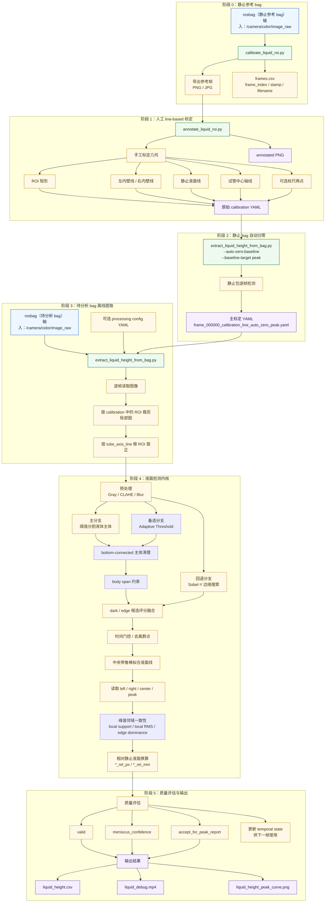

# realsense_liquid_measurement

`realsense_liquid_measurement` 用于承载 RealSense 液面测量链的离线脚本与后续实时节点。

## 目录

- [realsense\_liquid\_measurement](#realsense_liquid_measurement)
  - [目录](#目录)
  - [当前结构](#当前结构)
  - [当前整理步骤](#当前整理步骤)
  - [当前代码流程图](#当前代码流程图)
  - [RealSense ROS 编译脚本](#realsense-ros-编译脚本)
  - [当前推荐用法](#当前推荐用法)
  - [第二步：手动标定 ROI 和参考几何](#第二步手动标定-roi-和参考几何)
    - [模式 A：没有背景标尺，先打通通路](#模式-a没有背景标尺先打通通路)
    - [模式 B：有背景标尺时再做毫米标定](#模式-b有背景标尺时再做毫米标定)
  - [第三步：批量提取液面像素时序](#第三步批量提取液面像素时序)
  - [逐帧调试脚本](#逐帧调试脚本)
    - [原理](#原理)
    - [用法](#用法)
  - [曲线图怎么看](#曲线图怎么看)
  - [CSV 字段说明](#csv-字段说明)

## 当前结构

当前包内结构如下：

```text
realsense_liquid_measurement/
├── CMakeLists.txt
├── package.xml
├── README.md
├── 改进文档0322.md
├── config/
│   ├── liquid_measurement.yaml
│   ├── frame_000000_calibration_line_auto_zero_peak.yaml
│   └── frame_000000_annotated.png
└── scripts/
    ├── build_realsense_ros_local.sh
    ├── calibrate_liquid_roi.py
    ├── annotate_liquid_roi.py
    ├── extract_liquid_height_from_bag.py
    ├── debug_liquid_vs_mpc_frame_by_frame.py
    └── realsense_ros_env_local.sh
```

各部分职责：

- `scripts/build_realsense_ros_local.sh`
  - 为 `src/third_party/realsense-ros` 补齐本地依赖并定向编译 `realsense2_description`、`realsense2_camera`
- `scripts/realsense_ros_env_local.sh`
  - 给运行期补充工作区本地 `librealsense2` 和 `ddynamic_reconfigure` 环境变量
- `scripts/calibrate_liquid_roi.py`
  - 从静止 bag 导出参考帧和 `frames.csv`
- `scripts/annotate_liquid_roi.py`
  - 对参考帧做 line-based 标定
  - 输出原始 calibration YAML 和 annotated PNG
- `scripts/extract_liquid_height_from_bag.py`
  - 用 calibration + bag 批量提液面
  - 输出 `liquid_height.csv`、`liquid_debug.mp4`、`liquid_height_peak_curve.png`
- `scripts/debug_liquid_vs_mpc_frame_by_frame.py`
  - 构建逐帧调试 session
  - 把实物照片、ROI 调试图、`/slosh/height`、`/slosh/height_pred_max` 和当前帧误差放到同一个交互式查看器里
- `scripts/compare_realsense_vs_mpc_slosh.py`
  - 对齐视觉 `height_peak_rel_mm` 与 `/slosh/height`、`/slosh/height_pred_max`
  - 只在 calibration 的 `mm_per_pixel` 非空时有意义
- `config/liquid_measurement.yaml`
  - 当前主处理参数
- `config/frame_000000_calibration_line_auto_zero_peak.yaml`
  - 当前主标定文件
  - 当前主回归口径是 `px-only`，`mm_per_pixel: null`
- `改进文档0322.md`
  - 记录为什么这样改、当前结论、下一步改进方向

其中 `build_realsense_ros_local.sh` 会把缺失的 RealSense 依赖包下载并解包到工作区根目录下的 `.ros_deps/` 和 `.ros_deps_cache/`。这两个目录属于本机环境缓存，不建议提交。

当前外部目录约定：

- 原始 bag：
  - `/data/a/bags/`
- 候选标定输出：
  - `/data/a/realsense_validation/candidates/`
- 静止验证输出：
  - `/data/a/realsense_validation/verify/static/`
- 运动验证输出：
  - `/data/a/realsense_validation/verify/motion/`

当前主线使用的两个核心文件：

- 主配置：
  - [liquid_measurement.yaml](/home/a/scout_ws/src/scout_apps/sensors/realsense_liquid_measurement/config/liquid_measurement.yaml)
- 主标定（当前 `px-only` 主回归口径）：
  - [frame_000000_calibration_line_auto_zero_peak.yaml](/home/a/scout_ws/src/scout_apps/sensors/realsense_liquid_measurement/config/frame_000000_calibration_line_auto_zero_peak.yaml)
- `mm` 调试/对比标定（仅在需要 `height_*_rel_mm` 时使用）：
  - [frame_000000_calibration_line_auto_zero_peak_provisional_29mm.yaml](/home/a/scout_ws/src/scout_apps/sensors/realsense_liquid_measurement/config/frame_000000_calibration_line_auto_zero_peak_provisional_29mm.yaml)

## 当前整理步骤

如果你现在只是想按当前主线把“液面最高高度证据链”跑通，直接按下面 4 步：

1. 从静止 bag 导出参考图：
   - 用 `calibrate_liquid_roi.py`
2. 在参考图上做 line-based 标定：
   - 用 `annotate_liquid_roi.py`
   - 当前推荐标：
     - 左右内壁线
     - 静止液面线
     - `tube_axis_line`
3. 先用静止 bag 做 `auto-zero baseline`：
   - 当前默认 `--baseline-target peak`
   - 生成当前主标定：
     - `frame_000000_calibration_line_auto_zero_peak.yaml`
4. 再用这份主标定跑运动 bag：
   - 主看：
     - `height_peak_rel_px`
     - `accept_for_peak_report`
     - `liquid_height_peak_curve.png`

补充说明：

- 如果当前使用的是主标定 `frame_000000_calibration_line_auto_zero_peak.yaml`，主观察量应优先看 `px` 口径
- 只有当 calibration 的 `mm_per_pixel` 非空时，`height_*_rel_mm`、逐帧 `mm` 调试和 `compare_realsense_vs_mpc_slosh.py` 才有意义

## 当前代码流程图



当前已经实现三个离线脚本：

- `scripts/calibrate_liquid_roi.py`
- `scripts/annotate_liquid_roi.py`
- `scripts/extract_liquid_height_from_bag.py`

另外补充了两个 RealSense ROS 构建辅助脚本：

- `scripts/build_realsense_ros_local.sh`
- `scripts/realsense_ros_env_local.sh`

第一个脚本的作用是：

- 读取 rosbag 中的 RGB 图像话题
- 导出一帧或多帧 PNG
- 给后续手动标定 `ROI / tube_inner / still_level_px / mm_per_pixel` 提供参考图

第二个脚本的作用是：

- 打开导出的 PNG
- 手动框选 `ROI`
- 手动点击线标定几何：
  - 左内壁线两点
  - 右内壁线两点
  - 静止液面线两点
  - 试管中心轴线两点
  - 可选标尺两点
- 输出一份 YAML 标定文件
- 同时保存一张带标注的参考图

默认输出位置：

- 如果不显式指定 `--out-dir`，脚本会把导出的帧写到 **bag 同目录**
- 也就是说，你当前的 bag 在 `/data/a/bags` 下时，导出结果默认也会落在 `/data/a/bags/<bag_stem>_frames/`

## RealSense ROS 编译脚本

如果当前机器没有系统安装 `ddynamic_reconfigure` 或 `librealsense2`，可以直接使用包内脚本在工作区本地准备依赖并编译 `src/third_party/realsense-ros`。

脚本位置：

- [build_realsense_ros_local.sh](/home/geist/scout_ws/src/scout_apps/sensors/realsense_liquid_measurement/scripts/build_realsense_ros_local.sh)
- [realsense_ros_env_local.sh](/home/geist/scout_ws/src/scout_apps/sensors/realsense_liquid_measurement/scripts/realsense_ros_env_local.sh)

两个脚本的职责：

- `build_realsense_ros_local.sh`
  - 检查工作区根目录下的 `.ros_deps/opt/ros/noetic`
  - 如果缺依赖，就下载 `ros-noetic-ddynamic-reconfigure` 和 `ros-noetic-librealsense2`
  - 把包解到工作区本地 `.ros_deps/`
  - 最后执行 `catkin_make --pkg realsense2_description realsense2_camera`
- `realsense_ros_env_local.sh`
  - 用 `source` 方式加载
  - 补齐 `CMAKE_PREFIX_PATH`、`ROS_PACKAGE_PATH`、`LD_LIBRARY_PATH`、`PKG_CONFIG_PATH`
  - 让运行时能够找到本地 `.ros_deps/` 里的 RealSense 相关库

推荐用法：

1. 编译 `realsense-ros`：

```bash
/home/geist/scout_ws/src/scout_apps/sensors/realsense_liquid_measurement/scripts/build_realsense_ros_local.sh
```

2. 运行依赖本地 RealSense 库的 ROS 节点前，先加载环境：

```bash
source /home/geist/scout_ws/src/scout_apps/sensors/realsense_liquid_measurement/scripts/realsense_ros_env_local.sh
```

补充说明：

- 这两个脚本本身可以提交到仓库
- `.ros_deps/` 和 `.ros_deps_cache/` 是本地环境目录，不建议提交
- 如果机器上的 `apt` 配置了不可用代理，构建脚本会自动尝试去掉代理变量后重新下载

## 当前推荐用法

先用静止 bag 导出几张候选图：

```bash
python3 /home/a/scout_ws/src/scout_apps/sensors/realsense_liquid_measurement/scripts/calibrate_liquid_roi.py \
  --bag /data/a/bags/realsense_session_2026-03-21_17-48-52.bag \
  --image-topic /camera/color/image_raw \
  --every 120 \
  --max-frames 5
```

上面这条命令默认会把图片写到：

```text
/data/a/bags/realsense_session_2026-03-21_17-48-52_frames/
```

如果只想导出某一张：

```bash
python3 /home/a/scout_ws/src/scout_apps/sensors/realsense_liquid_measurement/scripts/calibrate_liquid_roi.py \
  --bag /data/a/bags/realsense_session_2026-03-21_17-48-52.bag \
  --frame-index 200
```

如果你想强制写到某个指定目录，也可以显式传：

```bash
python3 /home/a/scout_ws/src/scout_apps/sensors/realsense_liquid_measurement/scripts/calibrate_liquid_roi.py \
  --bag /data/a/bags/realsense_session_2026-03-21_17-48-52.bag \
  --frame-index 200 \
  --out-dir /data/a/bags/manual_calibration_frames
```

## 第二步：手动标定 ROI 和参考几何

假设你已经导出了一张静止参考图：

```text
/data/a/bags/realsense_session_2026-03-21_17-48-52_frames/frame_000000.png
```

### 模式 A：没有背景标尺，先打通通路

```bash
python3 /home/a/scout_ws/src/scout_apps/sensors/realsense_liquid_measurement/scripts/annotate_liquid_roi.py \
  --image /data/a/bags/realsense_session_2026-03-21_17-48-52_frames/frame_000000.png \
  --mode px_only
```

这个模式下：

- 只需要点击 `ROI / 左右内壁线 / 静止液面线 / tube axis line`
- 不需要点击标尺
- 输出 YAML 中 `mm_per_pixel` 会写成 `null`
- 点完后脚本会自动做一次几何自检
  - 如果检测到潜在问题，会在窗口和终端给出警告
  - 这时可以：
    - 按 `r` 重标
    - 或再按一次 `Enter` 带警告保存
  - 当前会特别检查：
    - 左右壁线是否交叉或重叠
    - 轴线是否跑到两壁外面
    - 轴线是否明显偏心
    - 左右壁线是否只覆盖了中间一小段高度
    - 轴线是否只覆盖了中间一小段高度

### 模式 B：有背景标尺时再做毫米标定

运行：

```bash
python3 /home/a/scout_ws/src/scout_apps/sensors/realsense_liquid_measurement/scripts/annotate_liquid_roi.py \
  --image /data/a/bags/realsense_session_2026-03-21_17-48-52_frames/frame_000000.png \
  --mode ruler \
  --calibration-distance-mm 10
```

交互顺序是：

1. 先拖框选择 `ROI`
2. 点击左内壁上点
3. 点击左内壁下点
4. 点击右内壁上点
5. 点击右内壁下点
6. 点击静止液面左点
7. 点击静止液面右点
8. 点击试管中心轴线上点
9. 点击试管中心轴线下点
10. 如果是 `ruler` 模式，再点击标尺点 1
11. 如果是 `ruler` 模式，再点击标尺点 2
12. 全部完成后按 `Enter` 保存

界面提示规则：

- `still level`
  - 选**上方那条更清晰、后续算法更可能抓到**的液面边界
- `tube axis`
  - 尽量沿试管中心点两次
  - 这条线会被后续脚本用于 ROI 旋正
- `ruler points`
  - 点**背景标尺**
  - 不要点试管表面

默认会输出：

- `frame_000000_calibration.yaml`
- `frame_000000_annotated.png`

当前推荐做法：

- 标完后把这份 line-based 标定先保存在参考图目录
- 然后再通过 `auto-zero baseline` 生成当前主标定：
  - `frame_000000_calibration_line_auto_zero_peak.yaml`

## 第三步：批量提取液面像素时序

在 `px_only` 标定已经完成后，可以直接从 bag 里批量提取：

- `height_left_px`
- `height_right_px`
- `height_peak_px`
- `height_left_rel_px`
- `height_right_rel_px`
- `height_peak_rel_px`
- `valid`
- `meniscus_confidence`

运行示例：

```bash
python3 /home/a/scout_ws/src/scout_apps/sensors/realsense_liquid_measurement/scripts/extract_liquid_height_from_bag.py \
  --bag /data/a/bags/realsense_session_2026-03-21_17-48-52.bag \
  --calibration /data/a/bags/realsense_session_2026-03-21_17-48-52_frames/frame_000000_calibration.yaml
```

如果你只想先小样本检查通路，可以限制帧数并写到临时目录：

```bash
python3 /home/a/scout_ws/src/scout_apps/sensors/realsense_liquid_measurement/scripts/extract_liquid_height_from_bag.py \
  --bag /data/a/bags/realsense_session_2026-03-21_17-48-52.bag \
  --calibration /data/a/bags/realsense_session_2026-03-21_17-48-52_frames/frame_000000_calibration.yaml \
  --out-dir /data/a/realsense_validation/quick_check/static_extract_test \
  --max-frames 60
```

默认输出目录：

- 如果不显式指定 `--out-dir`，结果会写到 **bag 同目录**
- 也就是：
  - `/data/a/bags/<bag_stem>_liquid_measurement/`

如果你想对**静止 bag 自动归零基线**，并直接生成当前主标定：

```bash
python3 /home/a/scout_ws/src/scout_apps/sensors/realsense_liquid_measurement/scripts/extract_liquid_height_from_bag.py \
  --bag /data/a/bags/realsense_session_2026-03-21_17-48-52.bag \
  --calibration /data/a/bags/realsense_session_2026-03-21_17-48-52_frames/frame_000000_calibration.yaml \
  --auto-zero-baseline \
  --write-adjusted-calibration /home/a/scout_ws/src/scout_apps/sensors/realsense_liquid_measurement/config/frame_000000_calibration_line_auto_zero_peak.yaml
```

这条命令会：

- 默认用前 `80` 个有效帧估计 **peak target** 静止基线
- 输出建议的 `calibration.still_level_px`
- 生成当前推荐主标定：
  - `frame_000000_calibration_line_auto_zero_peak.yaml`

当前默认行为：

- `--baseline-target peak`
  - 按 `height_peak_rel_px` 归零
  - 这比旧版按 `center_rel_px` 归零更适合当前“只关心最高液面高度”的主口径

如果你确实想按别的量归零，也可以显式传：

```bash
--baseline-target center
--baseline-target left
--baseline-target right
```

如果你想显式指定输出路径，可以加：

```bash
--write-adjusted-calibration /some/path/frame_000000_calibration_line_auto_zero_peak.yaml
```

生成修正后的 calibration 后，再用它重新跑提取脚本：

```bash
python3 /home/a/scout_ws/src/scout_apps/sensors/realsense_liquid_measurement/scripts/extract_liquid_height_from_bag.py \
  --bag /data/a/bags/realsense_session_2026-03-21_17-48-52.bag \
  --calibration /home/a/scout_ws/src/scout_apps/sensors/realsense_liquid_measurement/config/frame_000000_calibration_line_auto_zero_peak.yaml
```

接下来就可以用这份修正后的 calibration 去跑运动 bag：

```bash
python3 /home/a/scout_ws/src/scout_apps/sensors/realsense_liquid_measurement/scripts/extract_liquid_height_from_bag.py \
  --bag /data/a/bags/realsense_session_2026-03-21_17-47-55.bag \
  --calibration /home/a/scout_ws/src/scout_apps/sensors/realsense_liquid_measurement/config/frame_000000_calibration_line_auto_zero_peak.yaml
```

## 逐帧调试脚本

### 原理

这个脚本的目标不是重新实现一套新算法，而是把**当前液面检测结果**和 **MPC 的 `/slosh/height`、`/slosh/height_pred_max`** 放到同一个逐帧调试入口里。

它内部做的事分 3 步：

1. 读取 bag 里的 `/camera/color/image_raw`
2. 对每一帧复用当前主检测链：
   - `ROI` 裁剪
   - `tube_axis_line` 旋正
   - 液面检测
   - 计算：
     - `height_peak_rel_px`
     - `height_peak_rel_mm`
     - `valid`
     - `accept_for_peak_report`
     - `meniscus_confidence`
3. 按同一个时间基准插值得到当前帧对应的：
   - `/slosh/height`
   - `/slosh/height_pred_max`
   - `/cmd_vel`
   - `/imu/data`

所以这条脚本本质上是在回答：

- 这一帧视觉到底看到了什么
- 这一帧算法为什么接受或拒绝
- 这一帧视觉高度和 `/slosh/height` 差多少
- 差异更像来自：
  - 实物液面
  - 几何标定
  - 候选列融合
  - 报告门槛

它会缓存两类图：

- `photo/`
  - 原始实物照片预览，带 ROI 框
- `roi_debug/`
  - 当前检测器输出的 ROI 调试图

以及两类索引文件：

- `debug_session.json`
- `debug_session.csv`

其中：

- GUI 模式适合你拖动进度条、逐帧看图
- `--show-frame-index` 适合你已知某一帧，直接在终端查：
  - `height_peak_rel_mm`
  - `/slosh/height`
  - `/slosh/height_pred_max`

### 用法

如果你现在想逐帧看：

- 实物照片
- 当前 ROI 检测图
- `height_peak_rel_px / mm`
- `*_signed` 调试量
- `/slosh/height`
- `/slosh/height_pred_max`
- 当前帧误差

可以直接用：

```bash
python3 /home/a/scout_ws/src/scout_apps/sensors/realsense_liquid_measurement/scripts/debug_liquid_vs_mpc_frame_by_frame.py \
  --bag /data/a/slosh_bags/TestOnRealCar/slosh_QQ0_1_20260323_164428.bag \
  --calibration /home/a/scout_ws/src/scout_apps/sensors/realsense_liquid_measurement/config/frame_000000_calibration_line_auto_zero_peak_provisional_29mm.yaml \
  --out-dir /data/a/realsense_validation/debug/Q0_1_frame_debug
```

这条脚本会先：

1. 逐帧跑液面检测
2. 缓存：
   - 原始实物照片预览
   - ROI 调试图
   - `debug_session.json`
   - `debug_session.csv`
3. 然后自动打开交互式逐帧查看器

如果你只想先建缓存，不立刻打开窗口：

```bash
python3 /home/a/scout_ws/src/scout_apps/sensors/realsense_liquid_measurement/scripts/debug_liquid_vs_mpc_frame_by_frame.py \
  --bag /data/a/slosh_bags/TestOnRealCar/slosh_QQ0_1_20260323_164428.bag \
  --calibration /home/a/scout_ws/src/scout_apps/sensors/realsense_liquid_measurement/config/frame_000000_calibration_line_auto_zero_peak_provisional_29mm.yaml \
  --out-dir /data/a/realsense_validation/debug/Q0_1_frame_debug \
  --skip-viewer
```

如果缓存已经建好，只想复用缓存再打开：

```bash
python3 /home/a/scout_ws/src/scout_apps/sensors/realsense_liquid_measurement/scripts/debug_liquid_vs_mpc_frame_by_frame.py \
  --bag /data/a/slosh_bags/TestOnRealCar/slosh_QQ0_1_20260323_164428.bag \
  --calibration /home/a/scout_ws/src/scout_apps/sensors/realsense_liquid_measurement/config/frame_000000_calibration_line_auto_zero_peak_provisional_29mm.yaml \
  --out-dir /data/a/realsense_validation/debug/Q0_1_frame_debug \
  --reuse-cache
```

如果你不想打开查看器，只想指定某一帧并在终端直接查看这帧的：

- `height_peak_rel_mm`
- `/slosh/height`
- `/slosh/height_pred_max`

可以直接用：

```bash
python3 /home/a/scout_ws/src/scout_apps/sensors/realsense_liquid_measurement/scripts/debug_liquid_vs_mpc_frame_by_frame.py \
  --bag /data/a/slosh_bags/TestOnRealCar/slosh_QQ0_1_20260323_164428.bag \
  --calibration /home/a/scout_ws/src/scout_apps/sensors/realsense_liquid_measurement/config/frame_000000_calibration_line_auto_zero_peak_provisional_29mm.yaml \
  --out-dir /data/a/realsense_validation/debug/Q0_1_frame_debug \
  --reuse-cache \
  --skip-viewer \
  --show-frame-index 527
```

查看器按键：

- 窗口顶部 `cache_idx` 进度条
  - 直接拖动到想看的缓存帧
- `a / d`
  - 上一帧 / 下一帧
- `w / s`
  - 前后跳 `10` 帧
- `z / e`
  - 前后跳 `50` 帧
- `g`
  - 在终端输入要跳到的缓存索引
- `h`
  - 显示/隐藏帮助
- `q` 或 `Esc`
  - 退出

这套脚本适合排查：

- 为什么这一帧被 `report gate` 拒绝
- 为什么当前帧视觉和 `/slosh/height` 差很多
- 当前高峰到底是实物上真的液面抬高，还是视觉误检

`--show-frame-index` 模式适合这种场景：

- 你已经知道想看哪一帧
- 当前终端不方便打开 GUI 窗口
- 你只想核对这一帧的：
  - `height_peak_rel_mm`
  - `/slosh/height`
  - `/slosh/height_pred_max`
  - `valid / accept_for_peak_report / confidence`


更稳的当前推荐做法是：**先生成候选标定，再决定是否升级成主标定**。

推荐流程：

1. 先把 auto-zero 输出写到临时文件，不直接覆盖主标定：

```bash
python3 /home/a/scout_ws/src/scout_apps/sensors/realsense_liquid_measurement/scripts/extract_liquid_height_from_bag.py \
  --bag /data/a/bags/realsense_session_2026-03-21_17-48-52.bag \
  --calibration /data/a/bags/realsense_session_2026-03-21_17-48-52_frames/frame_000000_calibration.yaml \
  --auto-zero-baseline \
  --baseline-target peak \
  --write-adjusted-calibration /data/a/realsense_validation/candidates/frame_candidate.yaml
```

2. 用这份候选标定重新跑静止 bag：

```bash
python3 /home/a/scout_ws/src/scout_apps/sensors/realsense_liquid_measurement/scripts/extract_liquid_height_from_bag.py \
  --bag /data/a/bags/realsense_session_2026-03-21_17-48-52.bag \
  --calibration /data/a/realsense_validation/candidates/frame_candidate.yaml \
  --out-dir /data/a/realsense_validation/verify/static \
  --skip-debug-video
```

3. 再用同一份候选标定跑运动 bag：

```bash
python3 /home/a/scout_ws/src/scout_apps/sensors/realsense_liquid_measurement/scripts/extract_liquid_height_from_bag.py \
  --bag /data/a/bags/realsense_session_2026-03-21_17-47-55.bag \
  --calibration /data/a/realsense_validation/candidates/frame_candidate.yaml \
  --out-dir /data/a/realsense_validation/verify/motion \
  --skip-debug-video
```

4. 只有静止 bag 和运动 bag 都不明显退化时，才把候选标定升级成主标定。

当前验收规则：

- 静止 bag 需要满足：
  - `height_peak_rel_px` 回到接近 `0`
  - `reportable` 比例不能明显崩掉
- 运动 bag 需要满足：
  - `valid / reportable` 比例不能明显低于当前主标定
  - `max reported height_peak_rel_px` 不能明显变差

补充说明：

- **静止 bag 过关不等于候选标定可升主。**
- 已经出现过一种情况：
  - 候选标定在静止 bag 上很好
  - 但在运动 bag 上 `valid / reportable` 明显下降
  - 因此最终不能替换主标定
- 所以当前主流程必须是：
  - `原始标定 -> 候选 auto-zero -> 静止验证 -> 运动验证 -> 再决定是否升主`

当前推荐的候选/验证目录约定：

- 候选 calibration YAML：
  - `/data/a/realsense_validation/candidates/`
- 静止 bag 验证输出：
  - `/data/a/realsense_validation/verify/static/`
- 运动 bag 验证输出：
  - `/data/a/realsense_validation/verify/motion/`

当前脚本会输出：

- `liquid_height.csv`
  - 每帧的时间戳、有效性、置信度、中央覆盖率、拟合残差、主体宽度约束结果、dark/edge 融合统计、峰值离 ROI 顶部的距离、峰值邻域一致性指标、峰值是否允许进入正式统计、左右液面位置、相对静止液面的抬升量
- `liquid_debug.mp4`
  - 只显示 ROI 区域，并叠加：
    - 左右内壁线
    - 静止液面线
    - 试管中心轴线
    - 中央视为可信的拟合带
    - 左右固定内部评估点
    - 上一帧先验线
    - 每列候选液面点
    - 拟合内点和拟合线
    - 当前帧数值、置信度和 `report` 状态
- `liquid_height_peak_curve.png`
  - 主图会同时显示：
    - 浅灰色 `valid peak_rel_px`
    - 彩色 `reported peak_rel_px`
  - `accept_for_peak_report = 1` 的点会按 `meniscus_confidence` 着色，并带颜色条
  - 图中会自动标出当前包里最高报告峰值对应的 `peak_rel_px` 和 `confidence`
  - `valid=1` 但 `accept_for_peak_report=0` 的帧会用灰色 `x` 标出来
  - 如果后续补齐 `mm_per_pixel`，图中还会额外显示 `peak_rel_mm`

如果你只想跑数值和曲线，不想生成 debug 视频，可以加：

```bash
--skip-debug-video
```

如果你只想保留 `csv + debug video`，不生成曲线图，可以加：

```bash
--skip-plot
```

如果你还想在曲线图下面再加一行 `meniscus_confidence`，可以显式加：

```bash
--plot-confidence
```

当前口径说明：

- `height_*_px`
  - 是 **ROI 坐标系内的液面位置**
- `height_*_rel_px`
  - 是相对 `still_level_px` 的抬升量
  - 在图像里液面越高，`y` 越小，所以抬升量按 `still_level_px - current_y` 计算
- `height_*_rel_mm`
  - 只有在背景标尺补齐并得到 `mm_per_pixel` 后才有意义
  - 当前主标定 `frame_000000_calibration_line_auto_zero_peak.yaml` 仍是 `mm_per_pixel: null`
  - README 里涉及 `mm` 的逐帧示例默认配合 `frame_000000_calibration_line_auto_zero_peak_provisional_29mm.yaml` 这类带标尺标定使用
- `meniscus_confidence`
  - 是当前帧的综合质量分数，综合了覆盖率、拟合残差、斜率、时间门控、液体主体宽度以及峰值邻域一致性
- `temporal_jump_px`
  - 是相对上一帧有效结果的最大液面跳变量
- `accept_for_peak_report`
  - 是比 `valid` 更严格的正式峰值接受标记
  - 只有同时满足 `valid`、`confidence`、`central_coverage`、`fit_rms_px`、`peak_body_span_ratio`、`peak_local_rms_px`、时间跳变和顶部边界安全距离时才会置 `1`
  - `peak_edge_dominance` 当前主要用于 `confidence` 和诊断，不直接作为硬拒绝条件
- 标定 YAML 中的 `geometry_checks`
  - 记录 `annotate_liquid_roi.py` 自动做的几何自检结果
  - 如果 `warning_count > 0`，说明这份标定虽然可保存，但仍建议人工复核
- 当前不再把 `height_left_mm / height_right_mm / height_peak_mm` 当成正式输出口径
- 如果 `mm_per_pixel = null`，脚本仍然正常运行，但 `*_rel_mm` 列会留空

## 曲线图怎么看

- 横轴：`frame_index`
  - 表示第几帧
- 主纵轴：`height_peak_rel_px`
  - 表示当前帧最高液面相对静止基线抬升了多少像素
  - 值越大，说明液面抬得越高
  - `0` 表示接近静止液面
- 浅灰色曲线：`valid peak_rel_px`
  - 表示所有通过基础检测的帧
  - 这是“原始有效峰值曲线”
- 彩色曲线和点：`reported peak_rel_px`
  - 表示真正进入正式统计的峰值曲线
  - 也就是当前最该看的主报告曲线
- 颜色条：`meniscus_confidence`
  - 每个**可报告点**的颜色表示该帧液面检测置信度
  - 越接近颜色条高端，说明该点越可信
- 灰色虚线：`0`
  - 静止液面基线
- 灰色 `x`
  - `valid=1` 但 `accept_for_peak_report=0` 的帧
  - 表示这一帧测到了峰值，但被正式报告规则拒绝
- 峰值标注框
  - 自动标出当前包里最高报告峰值对应的 `peak_rel_px`
  - 同时显示该峰值点的 `meniscus_confidence`
- 上方时间轴：`relative time`
  - 相对第一帧的时间
- 右侧纵轴：`peak_rel_mm`
  - 只有 `mm_per_pixel` 存在时才显示

## CSV 字段说明

- `frame_index`
  - bag 中当前被处理的帧编号
- `stamp`
  - 当前帧时间戳，单位秒
- `valid`
  - 这一帧是否被判定为可信测量
  - `1` 表示可用，`0` 表示不建议直接拿来做峰值分析
- `meniscus_confidence`
  - 当前帧液面检测质量分数，范围大致 `0~1`
  - 它是辅助质量指标，不是液面高度本身
- `threshold_value`
  - 当前帧阈值分割实际使用的灰度阈值
- `valid_columns`
  - 当前帧找到液面候选点的总列数
- `central_valid_columns`
  - 中央可信带内可用于拟合的列数
- `central_coverage`
  - 中央可信带中有效候选列所占比例
- `fit_points`
  - 最终参与液面线拟合的点数
- `fit_rms_px`
  - 拟合残差 RMS，越小通常越稳
- `fit_slope`
  - 液面线斜率
  - 转弯或晃动时，这个值可能明显偏离 0
- `temporal_jump_px`
  - 相对上一帧有效结果的最大液面跳变量
  - 过大通常意味着误检或突变
- `temporal_gate_passed`
  - 这一帧是否通过时序门控
  - `1` 表示通过，`0` 表示存在明显时序异常
- `temporal_rejected_columns`
  - 因时序门控被拒掉的候选列数
- `temporal_recovered_columns`
  - 在 fallback/门控后恢复可用的候选列数
- `body_span_rejected_columns`
  - 因液体主体宽度不足而被拒掉的候选列数
- `primary_selected_columns`
  - dark 主分支最终被选中的候选列数
- `edge_selected_columns`
  - edge fallback 最终被选中的候选列数
- `blended_columns`
  - dark / edge 候选接近时，被融合成最终候选的列数
- `peak_distance_to_top_px`
  - 当前峰值离 ROI 顶边的距离
  - 太小通常意味着峰值贴边，不适合进入正式统计
- `peak_body_span_ratio`
  - 当前峰值所在液面下方一小段液体主体的横向宽度占 tube 宽度的比例
  - 值越小，越可能是反光窄条或局部误检，不适合进入正式统计
- `peak_local_support_ratio`
  - 峰值评估点附近一小段列窗口内，有效候选列的覆盖比例
  - 值越低，说明峰值附近支持证据越弱
- `peak_local_rms_px`
  - 峰值附近局部候选点相对拟合液面线的 RMS
  - 值越大，说明峰值附近局部一致性越差
  - 当前它是 `accept_for_peak_report` 的硬门槛之一
- `peak_edge_dominance`
  - 峰值附近局部窗口内，edge 候选主导的程度
  - 值越大，说明当前峰值更依赖 edge 分支而不是 dark 主体证据
  - 当前它主要用于 `meniscus_confidence` 和诊断，不直接作为硬拒绝条件
- `accept_for_peak_report`
  - 是否允许该帧进入正式峰值统计
  - 这是比 `valid` 更严格的一层硬门槛
- `left_peak_source / right_peak_source / peak_source`
  - 当前左侧 / 右侧 / 最高液面值来自哪种测量
  - `band` 表示来自两侧候选列的稳健侧峰值
  - `fit` 表示该侧退回到了拟合线代理值
- `left_band_support_ratio / right_band_support_ratio`
  - 左右侧峰值搜索带内，有效候选列覆盖比例
  - 值越低，说明该侧“最高液面”证据更弱
- `height_left_px`
  - 左侧液面稳健侧峰值对应的像素高度
- `height_right_px`
  - 右侧液面稳健侧峰值对应的像素高度
- `height_peak_px`
  - 当前帧左右稳健侧峰值中更高那一侧对应的位置
- `height_left_rel_px_signed / height_right_rel_px_signed / height_peak_rel_px_signed`
  - 相对静止基线的有符号抬升量
  - 这些字段主要用于 `auto-zero` 和调试
  - 它们可能出现负值，表示当前拟合/侧峰值比静止基线略低
- `height_left_rel_px`
  - 左侧液面相对静止基线的非负抬升量
- `height_right_rel_px`
  - 右侧液面相对静止基线的非负抬升量
- `height_peak_rel_px`
  - 当前帧最高液面相对静止基线的非负抬升量
  - 这是当前最关键的主指标
- `height_left_rel_mm_signed / height_right_rel_mm_signed / height_peak_rel_mm_signed`
  - 上述有符号像素抬升量换算到毫米后的调试字段
- `height_left_rel_mm`
  - 左侧非负相对抬升量的毫米值，仅在有标尺时有效
- `height_right_rel_mm`
  - 右侧非负相对抬升量的毫米值，仅在有标尺时有效
- `height_peak_rel_mm`
  - 最高液面非负相对抬升量的毫米值，仅在有标尺时有效
